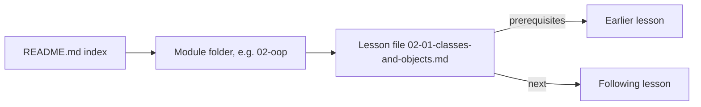
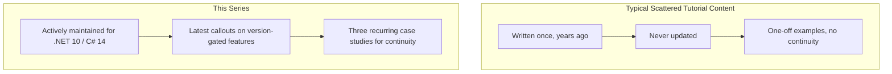

# How to Use This Tutorial Series

## Introduction

This is the first lesson in a complete, from-scratch C# and .NET tutorial series, built for .NET 10 and C# 14 — the current, actively-supported versions as of 2026. There is no prerequisite for this lesson; it's the front door to everything else.

By the end of this lesson, you will be able to:

- Explain how the curriculum is organized into modules and lessons
- Understand the structure every lesson follows, and why
- Recognize the three recurring "real-world" case studies used throughout the series
- Know how to navigate between lessons and find what you need
- Set expectations for how deep and how current this content is meant to be

## How to Use This Tutorial Series — A Layman's Perspective

Imagine you just enrolled in a hands-on trade apprenticeship — say, becoming a carpenter. Nobody hands you a single 2,000-page manual and says "read this cover to cover, then go build a house." Instead, a good apprenticeship is broken into modules: first you learn to identify and handle tools safely, then basic joinery, then framing, then finishing work, and only much later do you get to advanced cabinetry or architectural work. Each module builds directly on skills from the one before it. You practice on small, real projects along the way — not just sanding scrap wood, but building an actual shelf, then an actual cabinet — so the skills stick because you've used them for something real.

This tutorial series works the same way. Instead of one giant, undifferentiated wall of text about "C#," the material is broken into eighteen modules — starting with language fundamentals, moving through object-oriented programming, collections, LINQ, asynchronous programming, and eventually into full applications with ASP.NET Core, cloud deployment on Azure, containers, and more. Each module assumes you've completed the ones before it, the same way you wouldn't be handed a router before you've learned to hold a chisel safely.

And just like a good apprenticeship uses real projects instead of throwaway scrap, this series builds three running "real-world" projects throughout: an e-commerce order-processing system, a banking/ATM system, and a library and inventory management system. When a lesson introduces a new C# feature, you'll usually see it demonstrated twice — once in a small, isolated example that shows just the syntax, and once extending one of these three ongoing projects, so you can see how the feature is actually used in something resembling real software, not just a five-line toy.

The bridge back to programming: a curriculum that's well-sequenced and grounded in real, recurring examples is what turns "I've read about C#" into "I can build things with C#."

## How to Use This Tutorial Series — A Programming Language Perspective

Formally, this series is a fundamentals-through-advanced C#/.NET curriculum targeting **.NET 10 (the current Long-Term Support release)** and **C# 14**. It is organized as eighteen numbered modules (`00` through `17`), each containing a sequence of individually-numbered lessons stored as markdown files. Every lesson follows one shared template (see `_template/lesson-template.md`) so the structure — introduction, analogy, formal definition, code example, real-time example, comparison, variants, and a pointer to the next lesson — is consistent regardless of topic. Front matter metadata (`module`, `lesson_number`, `slug`, `prerequisites`, `next`) makes each lesson's place in the sequence explicit and machine-readable, independent of its file path.

## How This Series Is Structured

Each module lives in its own folder (e.g. `02-oop/`, `16-azure-for-dotnet-developers/`), and each lesson is a single markdown file named `NN-NN-kebab-case-slug.md`. The `dotnet-csharp/README.md` file at the root of this stack is the master index — it lists every module, every lesson title, its slug, and its current status (`planned`, `drafted`, or `reviewed`), so you always know what exists and what's still coming.



*Figure 1: How the index, module folders, and individual lessons connect via front-matter links.*

Every lesson is a self-contained markdown file, so no code execution is needed to "view" one — but every code example inside a lesson is a complete, runnable `.cs` file that you can copy into a scratch project and execute with the .NET 10 SDK:

```text
dotnet run app.cs
```

**Console Output** (illustrative — this lesson has no C# code of its own):

```text
(This orientation lesson has no runnable example — the first code example
appears in Lesson 01-01, "Introduction to .NET and C#".)
```

There's nothing to run yet in this lesson — its job is purely to orient you before the technical content starts in Module 01.

## Real-Time Example: Meeting the Three Case Studies

Since this orientation lesson has no code of its own, this section instead introduces the three case studies you'll see recur, deepen, and interconnect across the whole series:

- **E-Commerce Order Processing** — a simplified online store: `Customer`, `Product`, `Order`, and `OrderItem` types, an order pipeline, payment/checkout handling, and — much later — a full Azure-hosted deployment with a database, a message queue, and a serverless function that processes orders.
- **Banking / ATM** — `Account`, `Customer`, `Transaction`, and `Card` types modeling deposits, withdrawals, transfers, and balance rules, later extended with concurrency-safe transaction processing and a CI/CD pipeline for deploying the sample app.
- **Library / Inventory Management** — `Book`, `Member`, `Loan`, and `Catalog` types modeling checkouts, holds, and inventory counts, used especially in the Collections, Generics, and LINQ modules where searching and organizing data is the point.

Each lesson's "Real-Time Example" section picks whichever of these three domains best fits that lesson's concept and extends it — so by the time you reach Module 16 (Azure), the `Order` class you first wrote in Module 02 is the same `Order` class getting persisted to Cosmos DB and processed through a Service Bus queue. Nothing is thrown away; everything accumulates.

## This Series vs. a Typical Reference Manual

A big difference between this series and typical scattered "C# reference" content online is *currency* and *continuity*. Most tutorial content online was written years ago and never updated — it teaches C# as it existed in, say, 2018, missing everything from primary constructors to the `field` keyword to Native AOT. This series is explicitly maintained against **.NET 10 / C# 14**, and any lesson introducing a feature that's genuinely new calls that out directly rather than presenting it as if it always existed.



*Figure 2: Structural differences between typical one-off tutorial content and this series.*

| Aspect | Typical Scattered Tutorials | This Series |
| --- | --- | --- |
| Currency | Often years out of date | Actively targets .NET 10 / C# 14 |
| Examples | One-off, disconnected | Three recurring case studies that deepen over time |
| Structure | Inconsistent across sources | One shared template for every lesson |
| Navigation | Ad hoc search | A single indexed curriculum (`README.md`) |

## Types of Modules in This Series

The eighteen modules fall into a few broad categories, each covered by its own set of lessons:

1. **[Language Fundamentals](../01-fundamentals/01-01-introduction-to-dotnet-and-csharp.md)** — core C# syntax, types, and control flow (Modules 01-06).
2. **[Object-Oriented Programming](../02-oop/02-01-classes-and-objects.md)** — classes, the four pillars of OOP, and everything built on top of them (Module 02).
3. **Runtime & Performance** — concurrency, memory, and low-level C# (Modules 07-08, 13).
4. **Application Development** — web APIs, data access, real-time communication, security, and UI frameworks (Modules 09-11, 14-15).
5. **Architecture & the Cloud** — design patterns, clean architecture, and a full Azure curriculum (Modules 12, 16).

## What You've Learned & What's Next

You now know how this series is organized, what template every lesson follows, and which three running case studies you'll see grow throughout. There's no code to run yet — that starts next.

Continue your learning journey with **[Setting Up Your .NET 10 Development Environment](../00-orientation/00-02-setting-up-dotnet-environment.md)**, where we install the .NET 10 SDK and get your machine ready to write and run C# code.

---
*Applies to: .NET 10 / C# 14. Last reviewed 2026-08-16.*
