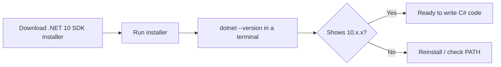
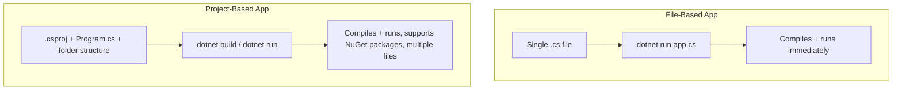

# Setting Up Your .NET 10 Development Environment

## Introduction

Before this lesson, you should have read **[How to Use This Tutorial Series](../00-orientation/00-01-how-to-use-this-series.md)**, which explains how this curriculum is organized. Here, we get your machine ready to actually write and run C# code.

By the end of this lesson, you will be able to:

- Install the .NET 10 SDK on your machine
- Verify the installation from the command line
- Understand what the SDK actually contains (compiler, runtime, CLI)
- Write and run a file-based C# 14 program with no project file at all
- Know where a traditional project-based app differs from a file-based one

## Setting Up .NET — A Layman's Perspective

Think about learning to cook. Before you can follow any recipe, you need a working kitchen: a stove that turns on, a knife that's sharp, pots that don't leak. You don't need to understand *how* a gas burner ignites internally — you just need to know it's installed correctly and lights when you turn the knob. Once that's done, you stop thinking about the kitchen itself and start thinking about the food.

Setting up .NET is that same one-time "get the kitchen working" step. The .NET SDK is the whole kitchen: it includes the compiler (the stove), the runtime (the thing that actually executes your food — er, program), and a command-line tool (`dotnet`) that lets you say "run this" or "build this" without fiddling with individual burners by hand. Once it's installed and verified, you largely stop thinking about it and start thinking about the code.

The bridge back to programming: everything else in this series assumes this one-time setup is done and working — so it's worth getting right before moving on.

## Setting Up .NET — A Programming Language Perspective

**.NET 10** is Microsoft's current Long-Term Support (LTS) release of the .NET platform, supported through November 2028. Installing "the .NET SDK" gives you three things: the **C# compiler** (Roslyn), the **.NET runtime** (the CLR — Common Language Runtime — that executes compiled code), and the **`dotnet` CLI**, a single command-line entry point for building, running, testing, and publishing .NET applications. As of C# 14 / .NET 10, the SDK also supports **file-based apps** — running a single `.cs` file directly with `dotnet run app.cs`, with no `.csproj` project file required, which is the fastest way to experiment with new language features.

## How to Install and Verify .NET 10

Download the .NET 10 SDK (not just the runtime — the SDK includes the compiler and tooling) from Microsoft's official .NET download page for your operating system, then confirm the install from a terminal.



*Figure 1: The install-and-verify flow for the .NET 10 SDK.*

```csharp
// hello.cs — .NET 10 / C# 14 — a file-based app, no .csproj needed
Console.WriteLine("Hello from .NET 10!");
Console.WriteLine($"Running on: {Environment.Version}");
```

Run it directly — no project file, no `dotnet new` scaffolding:

```text
dotnet run hello.cs
```

**Console Output:**

```text
Hello from .NET 10!
Running on: 10.0.0
```

This is the smallest possible C# program in C# 14: no `class Program`, no `static void Main`, just top-level statements in a single file that `dotnet run` compiles and executes on the spot. The `Environment.Version` line confirms exactly which runtime version is actually executing your code — useful for verifying your install matches what this series assumes.

## Real-Time Example: Bootstrapping the Banking Sample App

We'll use this same file-based style to bootstrap the very first piece of our recurring **Banking/ATM** case study — a starter file that later lessons in Module 02 will grow into full `Account` and `Transaction` classes.

```csharp
// bank-starter.cs — .NET 10 / C# 14
// The very first version of our Banking case study — later lessons replace
// this with real Account/Transaction classes. For now, we just confirm the
// environment can model a simple balance and print a formatted statement.

decimal openingBalance = 1500.00m;
decimal deposit = 250.50m;
decimal withdrawal = 75.25m;

decimal closingBalance = openingBalance + deposit - withdrawal;

Console.WriteLine("=== ATM Mini-Statement ===");
Console.WriteLine($"Opening Balance:  {openingBalance:C}");
Console.WriteLine($"Deposit:          {deposit:C}");
Console.WriteLine($"Withdrawal:       {withdrawal:C}");
Console.WriteLine($"Closing Balance:  {closingBalance:C}");
```

**Console Output:**

```text
=== ATM Mini-Statement ===
Opening Balance:  $1,500.00
Deposit:          $250.50
Withdrawal:       $75.25
Closing Balance:  $1,675.25
```

This is intentionally simple — no `Account` class yet, since that's introduced properly in Module 02. But it confirms your .NET 10 install can compile and run real, formatted, decimal-based financial arithmetic, which is exactly what the Banking case study will rely on throughout the series.

## File-Based Apps vs Traditional Project-Based Apps

A file-based app (`dotnet run hello.cs`) and a traditional project-based app (`dotnet new console` producing a folder with a `.csproj` file) both ultimately compile and run the same way — the difference is entirely in setup overhead and intended use.



*Figure 2: File-based apps trade project structure for zero-setup speed; project-based apps trade a small amount of setup for full package/multi-file support.*

| Aspect | File-Based App | Project-Based App |
| --- | --- | --- |
| Setup | None — just a `.cs` file | `.csproj` + folder via `dotnet new` |
| NuGet packages | Limited (inline directives only) | Full package reference support |
| Multiple files | No | Yes |
| Best for | Quick experiments, learning, scripts | Real applications, libraries, services |

Every lesson in this series through Module 01 and most of Module 02 uses file-based apps for their small syntax examples, and switches to project-based apps once Real-Time Examples grow large enough to need multiple files (typically starting around the OOP module).

## Types of .NET Distributions

.NET 10 ships in a few different forms depending on what you're installing:

1. **[.NET SDK](00-02-setting-up-dotnet-environment.md)** — the full toolset: compiler, runtime, and CLI (what you just installed).
2. **[.NET Runtime](00-02-setting-up-dotnet-environment.md)** — just enough to *run* already-built apps, no compiler; used on deployment/production servers.
3. **[ASP.NET Core Runtime](../10-aspnetcore/10-01-introduction-to-aspnetcore.md)** — the runtime plus ASP.NET Core-specific libraries, for hosting web apps.
4. **[Native AOT-published binaries](../13-reflection-sourcegen-lowlevel/13-07-introduction-to-native-aot.md)** — self-contained executables with no .NET runtime dependency at all, covered later in Module 13.

## What You've Learned & What's Next

You've installed the .NET 10 SDK, verified it from the command line, run your first file-based C# 14 program, and even previewed the Banking case study with real decimal arithmetic. Your machine is now ready for everything that follows.

Continue your learning journey with **[Choosing Your Tooling: Visual Studio 2026 vs VS Code vs Rider](../00-orientation/00-03-choosing-your-tooling.md)**, where we pick an editor to write the rest of this series' code in.

---
*Applies to: .NET 10 / C# 14. Last reviewed 2026-08-16.*
