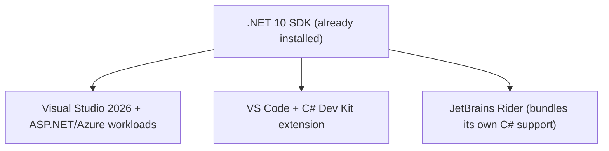
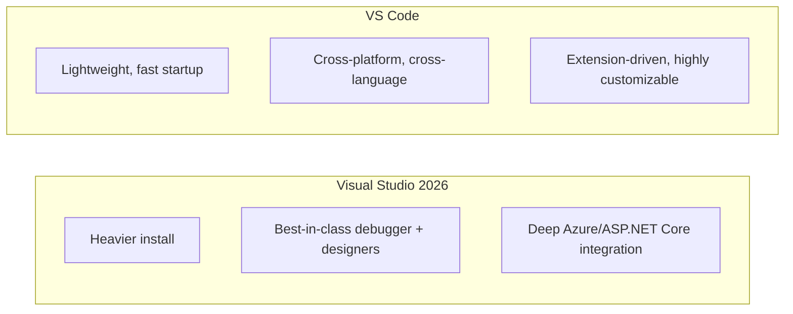

# Choosing Your Tooling: Visual Studio 2026 vs VS Code vs Rider

## Introduction

Before this lesson, you should have completed **[Setting Up Your .NET 10 Development Environment](../00-orientation/00-02-setting-up-dotnet-environment.md)**, so the .NET 10 SDK is already installed. Here we choose an editor to actually write code in for the rest of this series.

By the end of this lesson, you will be able to:

- Compare Visual Studio 2026, Visual Studio Code, and JetBrains Rider for C# development
- Understand which one this series' examples assume (spoiler: none exclusively — all commands are CLI-first)
- Set up C# support in whichever editor you choose
- Run and debug a file-based C# 14 app from your editor of choice

## Choosing Your Tooling — A Layman's Perspective

Think about choosing a vehicle for a road trip. A minivan, a sports car, and a pickup truck can all get you from point A to point B — the "right" choice depends on what you're carrying and how you like to drive, not on which one is objectively superior. A family hauling camping gear wants the minivan's space; someone who values handling on winding roads wants the sports car; someone hauling lumber wants the truck bed.

Choosing a C# code editor is the same kind of decision. Visual Studio 2026 is the minivan — big, full-featured, and especially good if you're going to be doing a lot of heavy-duty enterprise or full-stack work on Windows. VS Code is the sports car — lightweight, fast to start, and endlessly customizable, especially good for quick, focused sessions or if you work across multiple languages. Rider is the well-equipped truck — a full IDE experience like Visual Studio's, but cross-platform (Windows, macOS, Linux) and often praised for its refactoring tools. None of them will stop you from reaching your destination.

The bridge back to programming: every lesson in this series is written to run identically regardless of which of these three you pick, because every command shown is a `dotnet` CLI command that works the same everywhere.

## Choosing Your Tooling — A Programming Language Perspective

Formally, the three tools differ in what they are: **Visual Studio 2026** is a full Integrated Development Environment (IDE) for Windows (with a macOS variant) with deep designer support, advanced debugging, and first-class Azure/ASP.NET Core tooling. **Visual Studio Code** is a lightweight, extensible code editor — not a full IDE by default — that becomes a capable C# environment once the C# Dev Kit extension (built on the same Roslyn compiler services Visual Studio uses) is installed. **JetBrains Rider** is a full cross-platform IDE built on JetBrains' ReSharper technology, offering IDE-grade refactoring and navigation on any OS. All three ultimately invoke the same underlying .NET 10 SDK and Roslyn compiler — they are front ends, not different compilers.

## How to Set Up C# Support in Each

Regardless of which you choose, the setup pattern is the same: install the editor, then add C#-specific tooling on top of the SDK you already installed.



*Figure 1: All three editors sit on top of the same .NET 10 SDK installed in the previous lesson.*

```csharp
// tooling-check.cs — .NET 10 / C# 14
// Run this from whichever editor's integrated terminal you choose, to confirm
// your editor and the SDK agree on what's installed.
Console.WriteLine($".NET runtime: {Environment.Version}");
Console.WriteLine($"OS: {Environment.OSVersion}");
Console.WriteLine($"Editor-agnostic check passed.");
```

**Console Output:**

```text
.NET runtime: 10.0.0
OS: Microsoft Windows NT 10.0.26200.0
Editor-agnostic check passed.
```

If this runs identically whether you launch it from Visual Studio's terminal, VS Code's integrated terminal, or Rider's terminal, your setup is correctly editor-agnostic — exactly what the rest of this series assumes.

## Real-Time Example: Opening the Library Case Study in Any Editor

To make this concrete, here's a small piece of the **Library/Inventory Management** case study — the kind of file you'll open in whichever editor you picked, starting in Module 03 once collections are introduced.

```csharp
// library-preview.cs — .NET 10 / C# 14
// A preview of the Library case study's data — full Book/Catalog classes
// arrive in Module 02 and Module 03. For now, this just confirms your editor
// gives you working IntelliSense/code completion on collection types.

var titles = new List<string>
{
    "Clean Code",
    "The Pragmatic Programmer",
    "Effective C#"
};

foreach (var title in titles)
{
    Console.WriteLine($"- {title}");
}

Console.WriteLine($"Total titles in catalog preview: {titles.Count}");
```

**Console Output:**

```text
- Clean Code
- The Pragmatic Programmer
- Effective C#
Total titles in catalog preview: 3
```

Whichever editor you chose, typing `titles.` after the `List<string>` declaration should trigger code-completion suggestions like `.Count`, `.Add()`, and `.Where()` — that's your signal that C# language support (not just syntax highlighting) is properly wired up, which matters a great deal once we reach LINQ in Module 04.

## Visual Studio 2026 vs VS Code — When Each Wins

Since Rider is usually the deliberate choice of developers who already know they want a paid, cross-platform IDE, the more common day-to-day decision is between Visual Studio 2026 and VS Code.



*Figure 2: Visual Studio 2026 optimizes for depth on Windows-centric .NET work; VS Code optimizes for speed and flexibility.*

| Aspect | Visual Studio 2026 | VS Code |
| --- | --- | --- |
| Platform | Windows (macOS variant available) | Windows, macOS, Linux |
| Startup time | Slower, heavier | Fast, lightweight |
| Best for | Large solutions, Azure/ASP.NET Core-heavy work | Quick edits, scripting, multi-language projects |
| Cost | Free (Community) to paid (Enterprise) | Free |

## Types of Editors Covered in This Series

The examples in this series are written to work in any of these, but if you want a recommendation to just get moving:

1. **[Visual Studio 2026 Community](00-03-choosing-your-tooling.md)** — free, full-featured, the default recommendation if you're on Windows and plan to reach the ASP.NET Core/Azure modules.
2. **[VS Code + C# Dev Kit](00-03-choosing-your-tooling.md)** — free, lightweight, a strong choice if you want one editor across multiple languages/stacks.
3. **[JetBrains Rider](00-03-choosing-your-tooling.md)** — paid (free for non-commercial use), the pick if you're already invested in the JetBrains ecosystem or need macOS/Linux parity with Visual Studio-grade tooling.

## What You've Learned & What's Next

You've compared the three major C#/.NET editors, set up C# support in your choice, and confirmed it against both the SDK and a preview of the Library case study. Orientation is complete — the technical curriculum starts next.

Continue your learning journey with **[Introduction to .NET and C#](../01-fundamentals/01-01-introduction-to-dotnet-and-csharp.md)**, the first lesson of Module 01, where we start with the language itself.

---
*Applies to: .NET 10 / C# 14. Last reviewed 2026-08-16.*
