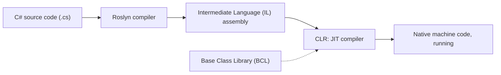
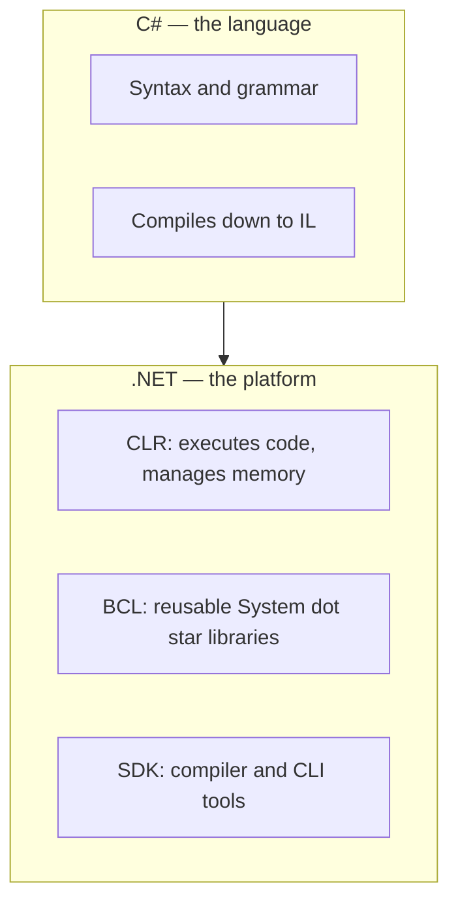

# Introduction to .NET and C#

## Introduction

Before this lesson, you should have completed **[Choosing Your Tooling: Visual Studio 2026 vs VS Code vs Rider](../00-orientation/00-03-choosing-your-tooling.md)**, so you have a working editor and the .NET 10 SDK installed. This lesson is the true starting point of the technical curriculum: before we write a single line of meaningful code, we need a shared, precise vocabulary for what ".NET" and "C#" actually mean — and, importantly, that they are not the same thing.

By the end of this lesson, you will be able to:

- Explain what .NET is, including the CLR, the BCL, and the SDK
- Explain what C# is, and how it relates to .NET
- Describe, at a high level, how C# source code becomes a running program
- Place .NET 10 and C# 14 in the timeline of the platform's versioning history
- Compile and run your first C# program using the .NET 10 SDK

## Introduction to .NET and C# — A Layman's Perspective

Picture a professional restaurant kitchen. A recipe card tells the cook exactly what to do — "dice the onions, sear the chicken for four minutes per side, reduce the sauce" — but the recipe card itself doesn't cook anything. It needs a kitchen: an oven that actually gets hot, a stove that actually sears, a walk-in fridge stocked with ingredients someone else already prepared, and a head chef who reads the recipe and coordinates the work. The recipe is instructions written in a language the kitchen staff understands; the kitchen is the whole environment that turns those instructions into an actual finished dish.

C# is the recipe card. It's a language — a precise, structured vocabulary and grammar for writing instructions like "add these two numbers," "repeat this ten times," or "if the account balance is too low, refuse the withdrawal." On its own, a recipe card sitting on a counter does nothing. It needs a kitchen.

.NET is that kitchen. It's the whole environment that actually executes those written instructions: an engine that runs the instructions step by step (this is the **CLR**, the Common Language Runtime — think of it as the oven and the stovetop, the parts that generate real heat and do real work), a fully stocked pantry of pre-made ingredients and sauces that any recipe can reach for instead of making everything from scratch (this is the **BCL**, the Base Class Library — reusable, tested code for things like reading files, formatting text, or talking to a network), and a set of professional-grade knives and tools the head chef uses to prep the recipe before it ever reaches the stove (this is the **SDK**, the Software Development Kit — the compiler and command-line tools that turn your written C# into something the kitchen can run).

Here's the detail that trips people up: this particular kitchen doesn't only read recipe cards written in one language. A skilled kitchen can just as easily follow a French recipe card or an Italian one, because underneath the language differences, the actual cooking steps translate down to the same basic kitchen actions — chop, heat, combine, plate. .NET works the same way: C# is the most popular recipe language for this kitchen, but F# and Visual Basic are other "recipe languages" the very same .NET kitchen can run, because they all translate down to the same intermediate set of instructions before the CLR ever "cooks" them.

The bridge back to programming: when you write C# code, you are writing a recipe. The .NET SDK's compiler translates that recipe into a lower-level, language-neutral form. The .NET CLR is the kitchen that actually executes it, leaning on the BCL's pantry of ready-made functionality the whole time. Understanding that split — language versus platform — is the single most useful mental model for everything else in this series.

## Introduction to .NET and C# — A Programming Language Perspective

Formally, **C#** is a modern, statically-typed, object-oriented (with strong functional-programming influences) high-level programming language designed by Microsoft, first released in 2002 and now in its 14th major version. **.NET** is a free, open-source, cross-platform developer platform with several distinct parts: the **CLR (Common Language Runtime)**, which executes compiled code, manages memory (via garbage collection), and enforces type safety at run time; the **BCL (Base Class Library)**, the `System.*` namespaces providing collections, I/O, networking, and more; and the **SDK**, the command-line tooling (`dotnet build`, `dotnet run`, `dotnet publish`) and compilers — Roslyn for C#, plus separate compilers for F# and Visual Basic — that all target a shared **Common Type System (CTS)** and compile to a shared **Common Intermediate Language (IL)**. This shared IL is what lets multiple languages interoperate on one runtime. .NET ships on an annual cadence each November, alternating between Long-Term Support (LTS, three years of support) and Standard-Term Support (STS, eighteen months) releases; **.NET 10**, released November 2025, is the current LTS release, and it ships together with **C# 14**.

## How to Turn C# Source Code into a Running Program

Getting from a `.cs` file to a running program involves a short pipeline, and it's worth seeing all of it once before we take it for granted for the rest of the series. First, the Roslyn compiler (part of the SDK) reads your C# source and translates it into IL — a portable, CPU-independent set of instructions, packaged into an assembly (a `.dll` or `.exe`). Second, when you run that assembly, the CLR's Just-In-Time (JIT) compiler translates the IL into native machine code for the specific CPU you're running on, and executes it — calling into the BCL wherever your code uses `System.*` types.


*Figure 1: How C# source code becomes running machine code on .NET 10.*

.NET 10 also brings **file-based apps** to full support: a single `.cs` file you can run directly with `dotnet run app.cs`, with no `.csproj` project file required. That's genuinely new — earlier SDK versions required a project file even for a one-line program — and it's the fastest way to try small examples like this one:

```csharp
// hello.cs — .NET 10 / C# 14 — a file-based single-file app (no .csproj needed)
Console.WriteLine("Hello from C# running on .NET!");
Console.WriteLine($"CLR / runtime version: {Environment.Version}");
Console.WriteLine($"Is 64-bit process: {Environment.Is64BitProcess}");
```

**Console Output:**

```text
Hello from C# running on .NET!
CLR / runtime version: 10.0.0
Is 64-bit process: True
```

Run this with `dotnet run hello.cs`. There's no `Main` method and no project file in sight — this combines C#'s long-standing **top-level statements** feature (available since C# 9) with .NET 10's file-based app support (genuinely new), which together let a single file be both your entire program and something the SDK can compile and run directly.

## Real-Time Example: Bootstrapping the E-Commerce Order Processing Console App

This is the first appearance of the **E-Commerce Order Processing** case study that recurs throughout this series. Right now, before Module 02 introduces proper `Product`, `Customer`, and `Order` classes, we can't model a real catalog — but we can prove the whole .NET + C# toolchain works end-to-end by printing a simple store banner, which is exactly the kind of smoke test a real project starts with before any business logic exists.

```csharp
// Program.cs — .NET 10 / C# 14 — Real-Time Example
using System.Globalization;

CultureInfo.CurrentCulture = new CultureInfo("en-US");

string storeName = "Contoso Online Store";
string firstProductName = "Wireless Mouse";
decimal firstProductPrice = 24.99m;

Console.WriteLine($"=== {storeName} ===");
Console.WriteLine($"Now stocking: {firstProductName} (${firstProductPrice})");
Console.WriteLine($"Powered by .NET {Environment.Version}");
```

**Console Output:**

```text
=== Contoso Online Store ===
Now stocking: Wireless Mouse ($24.99)
Powered by .NET 10.0.0
```

Nothing here is architecturally interesting yet — that's the point. Every large ASP.NET Core web API or Azure-hosted order-processing pipeline you'll build later in this series started life exactly this small: a runnable entry point that proves the environment is wired up correctly, before any domain modeling begins. By the time we reach Module 02, `firstProductName` and `firstProductPrice` will become properties on a real `Product` class, and this banner will become part of a larger startup routine — but the underlying compile-and-run pipeline from Figure 1 never changes.

## .NET vs C# — Platform vs Language

It's worth stating the contrast directly, because "I'm learning .NET" and "I'm learning C#" get used interchangeably in casual conversation even though they describe different things. C# is a language specification — a grammar and set of rules for writing source code. .NET is a platform — a runtime, a set of libraries, and a toolchain that executes compiled code, regardless of which supported language produced it. You could, in principle, write a large application in F# instead of C# and still be "a .NET developer," just as you could learn Italian without ever setting foot in a specific restaurant's kitchen. This series teaches C# specifically, but nearly everything you learn about the CLR, garbage collection, the BCL, and the SDK applies identically no matter which .NET language sits on top.


*Figure 2: C# is one of several languages that compile down to run on the shared .NET platform.*

| Aspect | .NET | C# |
| --- | --- | --- |
| What it is | A platform: runtime + libraries + tooling | A language: syntax and grammar |
| Executes code? | Yes — via the CLR's JIT compiler | No — compiles to IL, doesn't execute directly |
| Current version | .NET 10 (LTS, November 2025) | C# 14 |
| Other implementations | F#, Visual Basic also target it | N/A — C# is one specific language |
| Analogy | The kitchen | The recipe card |

## Types of .NET Applications You Can Build with C#

C# and .NET together support a wide range of application shapes, several of which get their own dedicated modules later in this series:

1. **[Variables in C#](../01-fundamentals/01-02-variables-in-csharp.md)** — every application type below starts with storing data in variables, which is where we go next.
2. **[Integer and Floating-Point Types](../01-fundamentals/01-03-integer-and-floating-point-types.md)** and **[The decimal Type](../01-fundamentals/01-04-the-decimal-type.md)** — the numeric building blocks every app relies on.
3. **[Classes and Objects in C#](../02-oop/02-01-classes-and-objects.md)** — object-oriented console and desktop applications, where the `Product`/`Order`/`Account` case studies really take shape.
4. **[Introduction to ASP.NET Core on .NET 10](../10-aspnetcore/10-01-introduction-to-aspnetcore.md)** — web APIs and web applications, covered in this series' Application Development modules.
5. **[Introduction to Azure for .NET Developers](../16-azure-for-dotnet-developers/16-01-introduction-to-azure-for-dotnet.md)** — cloud-hosted, containerized applications deployed to Azure.

## What You've Learned & What's Next

You now know that .NET is the platform — the CLR, the BCL, and the SDK — and C# is the language that compiles down to run on it, that they version independently but ship together (.NET 10 with C# 14), and you've compiled and run your first C# program using a file-based app.

Continue your learning journey with **[Variables in C#](../01-fundamentals/01-02-variables-in-csharp.md)**, where we start actually storing and naming data.

---
*Applies to: .NET 10 / C# 14. Last reviewed 2026-08-16.*
