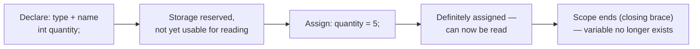
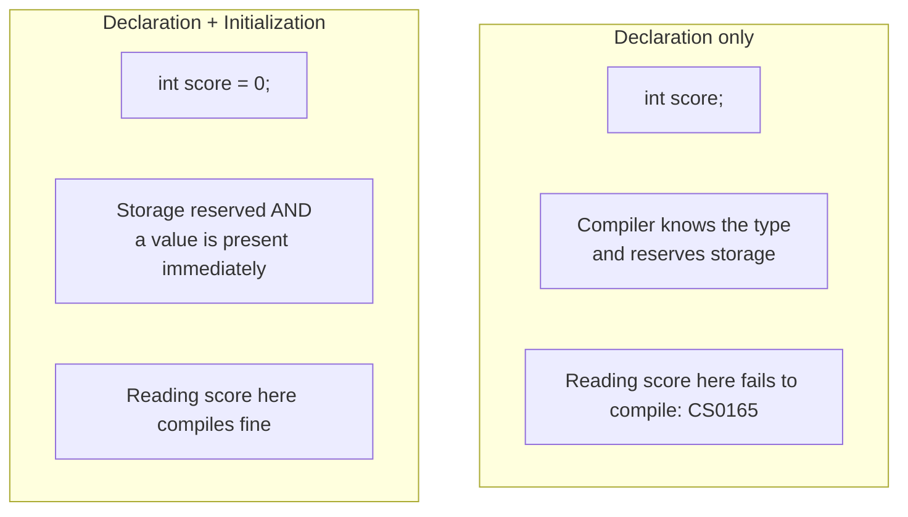

# Variables in C#

## Introduction

Before reading this lesson, you should already be comfortable with **[Introduction to .NET and C#](../01-fundamentals/01-01-introduction-to-dotnet-and-csharp.md)** — specifically, that C# is a statically-typed language whose source compiles to IL before the CLR ever runs it. In this lesson we introduce **variables**: the named storage locations every C# program uses to hold data while it runs.

By the end of this lesson, you will be able to:

- Declare a variable with an explicit type and assign it a value
- Explain C#'s naming rules and conventions for local variables
- Distinguish declaration from initialization, and explain why an unassigned local variable won't compile
- Describe variable scope: where a variable is visible and when it stops existing
- Preview what `var` does and why it isn't "untyped," ahead of its full treatment in Lesson 22

## Variables in C# — A Layman's Perspective

Think about a wall of labeled cubbyholes in a school mailroom. Each cubbyhole has a name card slotted into the front — "Ms. Patel," "Mr. Osei," "Front Office" — and each one is sized for a particular kind of mail. The small cubbies hold envelopes and memos. A wider one at the end holds rolled-up posters. The oversized bin at the bottom holds parcels. You wouldn't try to cram a rolled poster into an envelope-sized cubby, and the mail clerk sorting incoming mail already knows, just by looking at a package, which row of cubbies it's even allowed to go into.

A variable in a program is exactly one of those labeled cubbyholes. When you declare a variable, you're doing two things at once: nailing up a cubby of a specific size and shape (its **type** — a whole number, a decimal amount, a single character, a yes/no flag), and slotting in a name card so you and everyone else reading the mailroom later know which cubby is which (its **identifier**). Until mail actually gets placed in the cubby, it just sits there empty — that's a variable that's been *declared* but not yet *initialized*. The moment you slide an envelope in, that's *assignment*: the cubby now holds an actual value you can retrieve later just by reading its label.

Here's a rule every mailroom enforces without a second thought: you can't hang two different name cards reading "Front Office" in the same row of cubbies at the same time — the clerk delivering mail would have no way to know which one you meant. That's exactly why C# won't let you declare two variables with the same name in the same scope. And just like a mailroom often has a "General Office" row that every visiting substitute teacher can see, plus smaller private cubbies inside individual classrooms that only that classroom's students ever use, variables in a program are only visible within the "room" they were declared in — a concept called **scope**. A cubby nailed up inside Room 4B doesn't exist once you walk out of Room 4B; a local variable declared inside a method or a block stops existing once that block finishes running.

Finally, imagine a slightly lazy but perfectly competent new mailroom clerk who, instead of asking you what size cubby you need, just watches what you're about to hand over — a thin envelope, a large flat parcel — and automatically nails up a cubby of exactly the right size before you even finish speaking. That's the everyday feel of C#'s `var` keyword: it doesn't mean "any size, anything goes" — it means "the compiler looks at what you're assigning and picks the exact right, fixed size for you, once, at the moment the cubby is built." The bridge back to code: every value your program manipulates — a customer's name, an account balance, a loop counter — needs a labeled, correctly-sized storage location before you can use it, and that storage location is a variable.

## Variables in C# — A Programming Language Perspective

A **variable** in C# is a named, typed storage location whose value can change during program execution. Declaring a variable reserves storage of a size and layout determined by its type (`int`, `double`, `string`, and so on) and binds an **identifier** to that storage for the remainder of its scope. A declaration has the form `<type> <identifier>;` and may be combined with **initialization** — assigning an initial value in the same statement, `<type> <identifier> = <expression>;`. C# is definite-assignment-checked for local variables: the compiler produces error CS0165 ("use of unassigned local variable") if you attempt to read a local variable before it has been assigned along every possible code path, which eliminates an entire class of bugs common in languages without this check. A variable's **scope** — the region of source code where its identifier is visible — is determined by the block (`{ }`) in which it is declared; its **lifetime** for a local variable ends when execution leaves that block. The contextual keyword `var` (available since C# 3) instructs the compiler to infer the variable's static type from the initializer expression at compile time; the variable remains fully and permanently typed — `var` is sugar for the compiler writing the type for you, not a dynamic or untyped construct.

## How to Declare and Use Variables in C#

Declaring a variable in C# always names a type first, then an identifier, optionally followed by `= ` and an initial value. Identifiers must start with a letter or underscore, may contain letters, digits, and underscores, are case-sensitive (`total` and `Total` are different names), and by convention local variables use `camelCase`. C# reserves certain words (`int`, `class`, `return`, and so on) as keywords; if you truly need one as an identifier, prefixing it with `@` (like `@class`) escapes it, though this is rare in practice. A local variable must be **definitely assigned** before you read it — the compiler tracks this per code path and refuses to compile a read that might see an unassigned value.


*Figure 1: The life cycle of a local variable, from declaration through assignment to the end of its scope.*

```csharp
// Program.cs — .NET 10 / C# 14
string productName;      // declared, not yet assigned
int quantity = 3;        // declared and initialized in one step
double unitPrice = 12.5; // declared and initialized

productName = "Notebook"; // assignment happens here, before first use

double lineTotal = quantity * unitPrice;

Console.WriteLine($"Product: {productName}");
Console.WriteLine($"Quantity: {quantity}");
Console.WriteLine($"Unit price: {unitPrice}");
Console.WriteLine($"Line total: {lineTotal}");

{
    // This block introduces its own scope.
    int discountPercent = 10;
    Console.WriteLine($"Discount inside this block: {discountPercent}%");
}

// discountPercent is not visible here — its scope ended at the closing brace above.
```

**Console Output:**

```text
Product: Notebook
Quantity: 3
Unit price: 12.5
Line total: 37.5
```

The first three lines show declaration with and without an immediate initializer; `productName` is only assigned on the next line, and the compiler is satisfied because that assignment happens before `productName` is ever read. The nested `{ }` block demonstrates scope directly: `discountPercent` exists only between its opening and closing braces, which is why a reference to it after the block would fail to compile — the "cubby" was nailed up inside a smaller room that has already been vacated.

## Real-Time Example: Declaring the Library Loan Variables

We continue the **Library/Inventory Management** case study introduced across this series. Module 02 will formalize `Book` and `LibraryMember` as classes, but right now — before classes exist in the curriculum — we can model a single book checkout entirely with plain variables, which is exactly the kind of quick, procedural script a librarian's front-desk terminal might run before any larger system exists.

```csharp
// Program.cs — .NET 10 / C# 14 — Real-Time Example
string isbn = "978-0-13-468599-1";
string bookTitle = "Effective C#";
string memberName = "Priya Nair";
int loanDurationDays = 14;
bool isAvailable = false; // false because we're checking it out right now
double lateFeePerDay = 0.25;

// var lets the compiler infer the type from the initializer — still fully static.
// Full coverage of var vs explicit typing is in Lesson 22.
var checkoutDate = DateTime.Now;
var dueDate = checkoutDate.AddDays(loanDurationDays);

Console.WriteLine("=== Riverside Public Library — Checkout Receipt ===");
Console.WriteLine($"Title: {bookTitle}");
Console.WriteLine($"ISBN: {isbn}");
Console.WriteLine($"Checked out to: {memberName}");
Console.WriteLine($"Due back: {dueDate:yyyy-MM-dd}");
Console.WriteLine($"Currently available on shelf: {isAvailable}");
Console.WriteLine($"Late fee if overdue: ${lateFeePerDay:F2} per day");
```

**Console Output:**

```text
=== Riverside Public Library — Checkout Receipt ===
Title: Effective C#
ISBN: 978-0-13-468599-1
Checked out to: Priya Nair
Due back: 2026-08-30
Currently available on shelf: False
Late fee if overdue: $0.25 per day
```

*(The `Due back` line will show a different date on your machine, since it is computed from `DateTime.Now` at the moment you run the program — fourteen days after whatever "today" is.)*

Every field on that receipt — the title, the ISBN, the due date, the late fee rate — is a separate variable with its own type chosen to match the data it holds: `string` for text, `int` for a whole number of days, `bool` for a yes/no shelf status, `double` for a fractional currency rate (we'll see in Lesson 4 why real currency amounts should actually use `decimal` instead). This is the seed of the `Book` and `LibraryMember` classes you'll build in Module 02: those classes will simply be a way to bundle these same named, typed values together as properties on a real object instead of loose local variables.

## Declaration vs. Initialization

It's worth separating these two ideas cleanly, because they sound almost identical but mean different things to the compiler. **Declaration** is the act of introducing a name and a type — reserving the cubby — and by itself does not give the variable a usable value. **Initialization** is the act of supplying that first value, either in the same statement as the declaration or in a later statement, before the variable is ever read. C# permits declaring without initializing (as long as you assign before reading), but it does not permit reading before either has happened — the "use of unassigned local variable" error exists specifically to catch that mistake at compile time rather than let a program run with garbage or undefined data, which is a real risk in some other languages.


*Figure 2: Declaring a variable does not make it readable — only assignment (initialization or a later assignment) does.*

| Aspect | Declaration Only | Declaration + Initialization |
|---|---|---|
| Syntax | `int score;` | `int score = 0;` |
| Storage reserved? | Yes, immediately | Yes, immediately |
| Has a usable value? | Not yet — must assign before reading | Yes, immediately |
| Reading it right away | Compile error (CS0165) | Compiles and runs fine |
| Typical use | You'll assign conditionally later (e.g., inside an `if`/`else`) | You know the starting value up front |

## Types of Variable Declarations in C#

C# supports several variations on variable declaration, several of which get their own dedicated lessons later in this module:

1. **[Integer and Floating-Point Types](../01-fundamentals/01-03-integer-and-floating-point-types.md)** — choosing the right numeric type for whole numbers and fractional values.
2. **[The decimal Type](../01-fundamentals/01-04-the-decimal-type.md)** — a numeric type purpose-built for exact currency math.
3. **[bool and char Types](../01-fundamentals/01-05-bool-and-char-types.md)** — the two smallest, simplest building-block types.
4. **[var and dynamic](../01-fundamentals/01-22-var-and-dynamic.md)** — the full treatment of compiler-inferred typing, contrasted with runtime-resolved typing.
5. **[Constants and readonly Fields](../01-fundamentals/01-23-constants-and-readonly.md)** — variables whose value is locked after initialization, for values that must never change.

## What You've Learned & What's Next

You now know that a variable is a named, typed storage location that must be declared — and definitely assigned — before it can be read, that its visibility is bounded by the scope it was declared in, and that `var` gives the compiler, not you, the job of writing down the exact static type.

Continue your learning journey with **[Integer and Floating-Point Types](../01-fundamentals/01-03-integer-and-floating-point-types.md)**, where we look at the specific numeric types C# offers and how to pick the right one.

---
*Applies to: .NET 10 / C# 14. Last reviewed 2026-08-16.*
