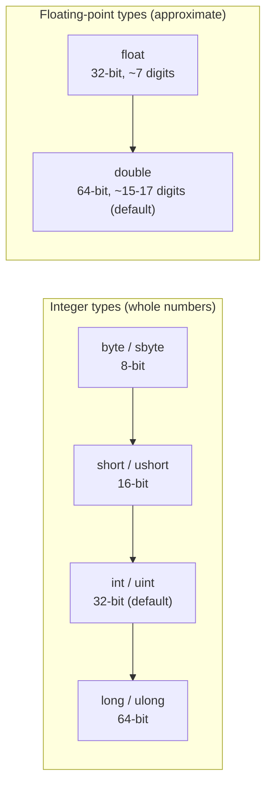
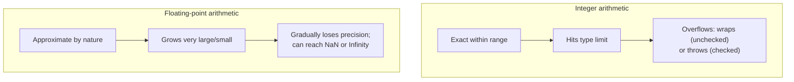

# Integer and Floating-Point Types

## Introduction

Before reading this lesson, you should already be comfortable with **[Variables in C#](../01-fundamentals/01-02-variables-in-csharp.md)** — declaring a typed, named storage location and assigning it a value. In this lesson we take a much closer look at the numeric types you've already been using informally: the whole-number (**integer**) types and the fractional (**floating-point**) types.

By the end of this lesson, you will be able to:

- List C#'s integer types (`sbyte`, `byte`, `short`, `ushort`, `int`, `uint`, `long`, `ulong`) and their signed/unsigned ranges
- List C#'s floating-point types (`float`, `double`) and explain their approximate, binary nature
- Choose an appropriately sized numeric type for a given quantity instead of defaulting to `int` or `double` out of habit
- Explain what happens when an integer calculation overflows its type's range, in both checked and unchecked contexts
- Recognize the precision tradeoff between `float` and `double`

## Integer and Floating-Point Types — A Layman's Perspective

Think about the different containers a hardware store uses to sell things by quantity. Nails are sold by the small paper bag — maybe up to a couple hundred fit in one bag before it splits. Screws come in a slightly bigger plastic tub. Bulk gravel is sold by the truckload, where the numbers involved are so large that a paper bag would be a joke — you need a container built for that scale from the start. Choosing the right container isn't about which one is "better"; it's about matching the container's capacity to how much you actually intend to put in it. Buy gravel in nail-bags and you'll need thousands of them and constant refilling. Buy nails in a truckload container and you're wasting enormous unused capacity for no benefit.

C#'s integer types are exactly this family of differently sized containers for whole numbers. A `byte` is the small paper bag — it holds whole numbers from 0 to 255 and nothing more, perfect for something like a single color channel's intensity. An `int` is the everyday, general-purpose tub — comfortably holds anything from about negative two billion to positive two billion, which covers the overwhelming majority of everyday counting: item quantities, loop counters, ages, scores. A `long` is the truckload container, built for numbers so large that even billions aren't enough — a global transaction counter, a file size in bytes, a timestamp measured in ticks. Just like the hardware store, picking `byte` when you actually need truckload-sized numbers doesn't just look odd — it actively breaks, the same way stuffing a truckload of gravel into a paper nail-bag tears right through it. In programming, that tear has a name: **overflow**, when a value goes beyond what its container can represent.

Floating-point numbers are a different kind of container altogether — think of a kitchen measuring jug marked with fluid-ounce lines instead of a container meant for counting discrete items. You can read "approximately 2.3 fluid ounces" off the jug, but if you look closely at the markings, you'll notice they're not perfectly precise — the line for "one-third of a cup" is drawn as best the manufacturer could manage, because a third of a cup doesn't fall on a clean marking at all. That's the everyday feel of `float` and `double`: they're excellent for scientific measurements, physics calculations, and anything inherently approximate, like a sensor reading or a graphics coordinate, but they are not built to represent something like "$19.99" with perfect exactness — a jug with coarser markings (`float`) is even less exact than one with finer markings (`double`), but neither is a precision instrument in the way a bank's ledger needs.

The bridge back to programming: every whole-number and fractional value in your program needs a container sized and shaped for the numbers it will actually hold, and C# gives you eight integer containers and two floating-point containers to choose from, each with a clear, documented capacity.

## Integer and Floating-Point Types — A Programming Language Perspective

C# provides eight built-in **integral types**, distinguished by size and signedness: `sbyte` (8-bit signed, −128 to 127), `byte` (8-bit unsigned, 0 to 255), `short`/`ushort` (16-bit signed/unsigned), `int`/`uint` (32-bit signed/unsigned), and `long`/`ulong` (64-bit signed/unsigned). `int` is the default type for integer literals and the type most arithmetic and loop-counting code should reach for unless a specific range or memory constraint demands otherwise. C# also provides two binary **floating-point types** conforming to IEEE 754: `float` (32-bit, ~6-9 significant digits of precision) and `double` (64-bit, ~15-17 significant digits of precision, and the default type for floating-point literals like `3.14`). Both floating-point types trade exactness for range and speed — they cannot represent most decimal fractions exactly in binary. Integer arithmetic that exceeds a type's range **overflows**; by default C# performs this silently (unchecked), wrapping the value, though the `checked` keyword or context makes overflow throw `System.OverflowException` instead.

## How to Choose and Use Numeric Types in C#

Pick the smallest integer type that comfortably fits the range of values you expect, favoring `int` when you're not memory-constrained and don't have a specific reason to size down or up. Use `long` when a value could plausibly exceed about 2.1 billion. Use `double` by default for floating-point math; reach for `float` only when memory or performance genuinely matters (e.g., large arrays of graphics data) and reduced precision is acceptable. Numeric literals need a suffix to pin their type unambiguously: `f` for `float`, `d` for `double` (rarely needed since it's the default), `L` for `long`, `u` for `uint`.


*Figure 1: Integer types scale by bit width and signedness; floating-point types scale by precision.*

```csharp
// Program.cs — .NET 10 / C# 14
byte channelValue = 255;       // fits comfortably: 0-255
int itemsInStock = 48_200;     // everyday whole-number count
long globalTransactionId = 9_123_456_789_012L; // exceeds int's ~2.1 billion range

float sensorReadingC = 21.6f;  // 32-bit approximate
double preciseMeasurement = 21.63219871; // 64-bit approximate, more digits retained

Console.WriteLine($"channelValue: {channelValue}");
Console.WriteLine($"itemsInStock: {itemsInStock}");
Console.WriteLine($"globalTransactionId: {globalTransactionId}");
Console.WriteLine($"sensorReadingC (float): {sensorReadingC}");
Console.WriteLine($"preciseMeasurement (double): {preciseMeasurement}");

// Unchecked overflow: wraps silently by default.
byte maxed = 255;
byte wrapped = unchecked((byte)(maxed + 1));
Console.WriteLine($"255 + 1 as byte, unchecked: {wrapped}");

// Checked overflow: throws instead of wrapping.
try
{
    byte overflowed = checked((byte)(maxed + 1));
    Console.WriteLine($"Never printed: {overflowed}");
}
catch (OverflowException ex)
{
    Console.WriteLine($"Checked overflow threw: {ex.GetType().Name}");
}
```

**Console Output:**

```text
channelValue: 255
itemsInStock: 48200
globalTransactionId: 9123456789012
sensorReadingC (float): 21.6
preciseMeasurement (double): 21.63219871
255 + 1 as byte, unchecked: 0
Checked overflow threw: OverflowException
```

The `unchecked` block shows the default C# behavior: `255 + 1` doesn't fit in a `byte`, so it silently wraps back around to `0` — exactly like an odometer rolling over from its highest digit back to zero. The `checked` block shows the opposite: the identical overflow is caught and turned into a thrown exception, which is why production code dealing with untrusted or safety-critical arithmetic often explicitly requests `checked` behavior rather than trusting the silent default.

## Real-Time Example: Sizing Account Numbers and Balances at Northwind Bank

We continue the **Banking/ATM** case study that recurs throughout this series. Before Module 02 introduces a formal `Account` class, we can already reason about which numeric types a real banking system would use for account identifiers and transaction counts, since choosing the wrong type here is a genuine production bug, not just a style preference.

```csharp
// Program.cs — .NET 10 / C# 14 — Real-Time Example
long accountNumber = 400_582_931_004;   // bank account numbers routinely exceed int's range
int dailyWithdrawalLimitCount = 5;       // small, bounded count — int is plenty
short branchCode = 214;                  // small bounded code — short is fine, though int is also common
uint failedPinAttempts = 2;              // never negative — an unsigned type documents that intent
double interestRateEstimate = 0.045;     // an approximate rate for a quick projection, not a ledger posting

Console.WriteLine("=== Northwind Bank — Account Snapshot ===");
Console.WriteLine($"Account number: {accountNumber}");
Console.WriteLine($"Branch code: {branchCode}");
Console.WriteLine($"Daily withdrawals so far: {dailyWithdrawalLimitCount}");
Console.WriteLine($"Failed PIN attempts: {failedPinAttempts}");
Console.WriteLine($"Estimated annual interest rate: {interestRateEstimate:P1}");

// Demonstrating why int would have been the wrong choice for accountNumber:
bool wouldOverflowAsInt = accountNumber > int.MaxValue;
Console.WriteLine($"Would this account number overflow an int? {wouldOverflowAsInt}");
```

**Console Output:**

```text
=== Northwind Bank — Account Snapshot ===
Account number: 400582931004
Branch code: 214
Daily withdrawals so far: 5
Failed PIN attempts: 2
Estimated annual interest rate: 4.5%
Would this account number overflow an int? True
```

Notice `accountNumber` genuinely needs `long` — real institutional account numbers routinely exceed `int.MaxValue` (about 2.1 billion), and the final line proves it. `failedPinAttempts` is declared `uint` specifically because a negative failed-attempt count is meaningless, so the type itself documents that constraint. `interestRateEstimate` is deliberately `double`, not `decimal` — it's a rough projection for display, not money actually being posted to a ledger; Lesson 4 explains exactly why the real balance and transaction amounts on this account would use `decimal` instead.

## Integer Types vs. Floating-Point Types

The core contrast is exactness versus range. Integer types represent whole numbers exactly, with no rounding or approximation, up to the limit of their bit width — every value within range is stored precisely. Floating-point types trade that exactness for the ability to represent enormously large or small magnitudes and fractional values, using a binary representation that cannot exactly capture most decimal fractions (0.1, for instance, has no exact binary representation, which is why repeated `float`/`double` addition can accumulate tiny visible errors). Integers overflow at a hard boundary; floating-point types instead lose precision gradually as magnitude grows, and can represent special non-numeric results like `NaN` (not-a-number) and `Infinity` that integers have no equivalent for.


*Figure 2: Integers fail with a hard boundary; floating-point types degrade gradually and have non-numeric special values.*

| Aspect | Integer types (`int`, `long`, etc.) | Floating-point types (`float`, `double`) |
|---|---|---|
| Represents | Whole numbers, exactly | Fractional/approximate numbers, in binary |
| On exceeding range | Overflow: wraps (unchecked) or throws (checked) | Gradual precision loss; can reach `Infinity`/`NaN` |
| Precision | Exact, for every value in range | Approximate; most decimal fractions aren't exact in binary |
| Typical use | Counting, indexing, IDs, loop counters | Scientific/measurement data, graphics, statistics |
| Money-safe? | No (no fractional cents without extra work) | No (binary rounding errors) — use `decimal` instead |

## Types of Numeric Types in C#

C# groups its built-in numeric types into a few families, some of which get further dedicated coverage later in this module:

1. **[Variables in C#](../01-fundamentals/01-02-variables-in-csharp.md)** — the declaration and scoping rules every numeric type follows.
2. **[The decimal Type](../01-fundamentals/01-04-the-decimal-type.md)** — a third numeric family purpose-built for exact base-10 precision.
3. **[bool and char Types](../01-fundamentals/01-05-bool-and-char-types.md)** — the non-numeric building-block types that round out C#'s primitives.
4. **[Operators in C#](../01-fundamentals/01-06-operators-in-csharp.md)** — the arithmetic operators that act on all these numeric types.
5. **[Type Conversion and Casting](../01-fundamentals/01-08-type-conversion-and-casting.md)** — how values move safely (or unsafely) between numeric types.

## What You've Learned & What's Next

You now know C#'s eight integer types and their signed/unsigned ranges, the two floating-point types and why they're approximate rather than exact, and how overflow behaves differently in `unchecked` versus `checked` contexts.

Continue your learning journey with **[The decimal Type](../01-fundamentals/01-04-the-decimal-type.md)**, where we look at the numeric type built specifically so money math never suffers from binary rounding error.

---
*Applies to: .NET 10 / C# 14. Last reviewed 2026-08-16.*
