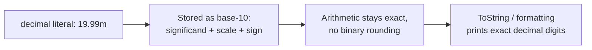
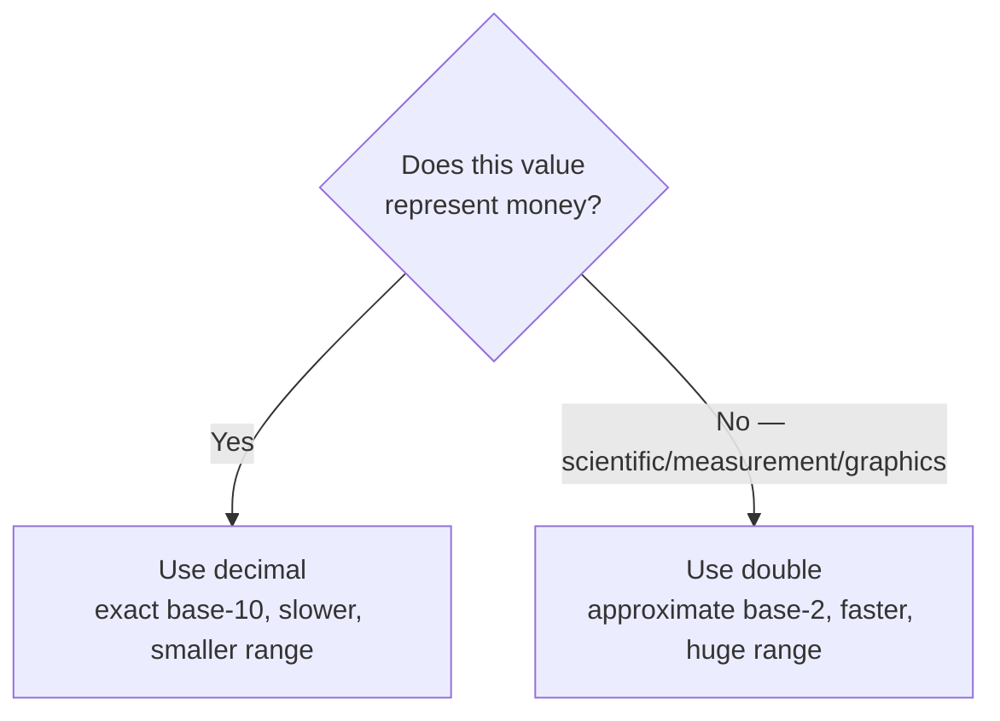

# The decimal Type

## Introduction

Before reading this lesson, you should already be comfortable with **[Integer and Floating-Point Types](../01-fundamentals/01-03-integer-and-floating-point-types.md)** — specifically, that `float` and `double` store values in binary and cannot exactly represent most decimal fractions. In this lesson we introduce **`decimal`**, the numeric type C# provides specifically so that money math doesn't inherit that binary rounding problem.

By the end of this lesson, you will be able to:

- Explain, concretely, why `double` arithmetic can produce visibly wrong results for currency values
- Declare and use `decimal` variables and literals with the `m` suffix
- Explain how `decimal` achieves exact base-10 precision, and what it costs in range and performance
- State the rule of thumb for when to use `decimal` versus `double`/`float`
- Apply `decimal` correctly in a real order-total or account-balance calculation

## The decimal Type — A Layman's Perspective

Picture two different cash registers. The first is an old-fashioned mechanical till with physical coin and bill slots — every amount that ever passes through it is counted out in actual cents, nickels, and dollar bills, and when the drawer is reconciled at closing time, the count either matches to the penny or it doesn't; there's no such thing as "off by a fraction of a cent" because a fraction of a cent isn't a physical coin that exists. The second is a digital scale in a chemistry lab, designed to measure things like fluid volume or weight to several decimal places of *approximate* precision — brilliant for science, but if you tried to use that same lab scale as a cash register, you'd occasionally find it reporting something like $19.989999999999998 instead of a clean $19.99, because the scale was never built to think in exact currency units in the first place; it was built to think in continuous, approximate measurements.

`double` and `float` are that lab scale. They're phenomenal at what they were designed for — scientific measurement, physics simulations, graphics — because binary floating-point representation can pack an enormous range of magnitudes into a small amount of memory very efficiently. But that same binary representation, just like the lab scale, was never built to think in clean base-10 currency units. Many ordinary decimal amounts — $0.10, $19.99, one-third of a dollar — simply don't have an exact binary equivalent, the same way one-third of a cup doesn't fall on a clean line on a measuring jug. Add enough of these tiny mismatches together across thousands of transactions, and a retailer's nightly reconciliation report can be off by fractions of a cent — individually invisible, but a real, auditable discrepancy at scale, and exactly the kind of bug that makes an accounting department deeply unhappy.

`decimal` is the mechanical till. It was purpose-built by the .NET team specifically to represent base-10 numbers — the kind humans actually use for money — exactly, with no binary-to-decimal translation loss at all. It costs you something in return: it takes up more memory per value (16 bytes versus 8 for a `double`), it's noticeably slower for the CPU to compute with, and it can't represent numbers anywhere near as astronomically large or small as `double` can. But none of that matters for a bank balance, an invoice total, or a shopping cart's grand total, because those numbers are never astronomically large — they're ordinary human amounts that absolutely must add up exactly.

The bridge back to programming: any time your program is doing math with actual money — prices, balances, totals, tax, change due — reach for `decimal`. Reach for `double` or `float` only when you're doing genuinely scientific or approximate measurement, where a tiny margin of error was never a problem to begin with.

## The decimal Type — A Programming Language Perspective

`System.Decimal`, aliased as `decimal` in C#, is a 128-bit value type that represents numbers in base 10 rather than base 2, storing a value as an integer significand (up to 96 bits) together with a scaling factor indicating the position of the decimal point and a sign bit. This design lets `decimal` represent common base-10 fractions — such as `0.1` or `19.99` — exactly, with no binary rounding error, at the cost of a smaller range (roughly ±7.9 × 10²⁸) and slower arithmetic than `double`, which has a far larger range (~±1.8 × 10³⁰⁸) but only approximate binary precision. `decimal` literals require the `m` (or `M`) suffix — `19.99m` — because an unsuffixed literal like `19.99` defaults to `double`, and assigning it directly to a `decimal` variable without the suffix causes a compile error (CS0664) rather than a silent conversion. `decimal` is the type Microsoft explicitly documents as appropriate for financial and monetary calculations throughout the BCL, including in types like `Money`-style domain models across the .NET ecosystem.

## How to Declare and Use decimal in C#

Declare a `decimal` exactly like any other variable, always suffixing literal values with `m` so the compiler treats them as `decimal` from the start rather than `double`. Arithmetic between two `decimal` values produces another `decimal`, with no binary rounding introduced at any step. Mixing a `decimal` with a `double` or `float` in the same expression is a compile error — C# forces you to explicitly convert one side, which is a deliberate guardrail against silently blending an exact type with an approximate one.


*Figure 1: A `decimal` value's base-10 storage keeps arithmetic and display exact end to end.*

```csharp
// Program.cs — .NET 10 / C# 14
double doubleTotal = 0.1 + 0.2;
decimal decimalTotal = 0.1m + 0.2m;

Console.WriteLine($"double:  0.1 + 0.2 = {doubleTotal}");
Console.WriteLine($"decimal: 0.1 + 0.2 = {decimalTotal}");

// Ten items at $0.10 each — should be exactly $1.00.
double doubleTenDimes = 0;
for (int i = 0; i < 10; i++)
{
    doubleTenDimes += 0.1;
}

decimal decimalTenDimes = 0m;
for (int i = 0; i < 10; i++)
{
    decimalTenDimes += 0.1m;
}

Console.WriteLine($"double:  10 x 0.1 = {doubleTenDimes}");
Console.WriteLine($"decimal: 10 x 0.1 = {decimalTenDimes}");
Console.WriteLine($"Is double result exactly 1.0? {doubleTenDimes == 1.0}");
Console.WriteLine($"Is decimal result exactly 1.0? {decimalTenDimes == 1.0m}");
```

**Console Output:**

```text
double:  0.1 + 0.2 = 0.30000000000000004
decimal: 0.1 + 0.2 = 0.3
double:  10 x 0.1 = 0.9999999999999999
decimal: 10 x 0.1 = 1.0
Is double result exactly 1.0? False
Is decimal result exactly 1.0? True
```

This is the exact bug the layman's analogy warned about, made concrete: `0.1 + 0.2` in `double` arithmetic prints `0.30000000000000004`, not `0.3`, because neither `0.1` nor `0.2` has an exact binary representation. The same math in `decimal` prints exactly `0.3`, because `decimal` stores base-10 digits directly. The ten-dimes loop makes the danger obvious — summing `double` `0.1` ten times doesn't even equal `1.0` by the language's own `==` comparison, while the `decimal` version does, exactly. This is precisely why `decimal` exists.

## Real-Time Example: Computing an Exact Order Total at Contoso Online Store

We continue the **E-Commerce Order Processing** case study first introduced in Lesson 1. Before Module 02 introduces a formal `Order` class with a collection of line items, we can already compute a realistic, multi-item order total the way a real checkout page must: with `decimal` from the very first multiplication, never `double`.

```csharp
// Program.cs — .NET 10 / C# 14 — Real-Time Example
decimal wirelessMousePrice = 24.99m;
int wirelessMouseQty = 3;

decimal usbCablePrice = 7.49m;
int usbCableQty = 5;

decimal laptopStandPrice = 39.95m;
int laptopStandQty = 1;

decimal subtotal =
    (wirelessMousePrice * wirelessMouseQty) +
    (usbCablePrice * usbCableQty) +
    (laptopStandPrice * laptopStandQty);

decimal taxRate = 0.0825m; // 8.25% sales tax
decimal taxAmount = Math.Round(subtotal * taxRate, 2);
decimal orderTotal = subtotal + taxAmount;

Console.WriteLine("=== Contoso Online Store — Order Summary ===");
Console.WriteLine($"Wireless Mouse   x{wirelessMouseQty} @ ${wirelessMousePrice:F2} = ${wirelessMousePrice * wirelessMouseQty:F2}");
Console.WriteLine($"USB Cable        x{usbCableQty} @ ${usbCablePrice:F2} = ${usbCablePrice * usbCableQty:F2}");
Console.WriteLine($"Laptop Stand     x{laptopStandQty} @ ${laptopStandPrice:F2} = ${laptopStandPrice * laptopStandQty:F2}");
Console.WriteLine($"Subtotal: ${subtotal:F2}");
Console.WriteLine($"Tax ({taxRate:P2}): ${taxAmount:F2}");
Console.WriteLine($"Order Total: ${orderTotal:F2}");
```

**Console Output:**

```text
=== Contoso Online Store — Order Summary ===
Wireless Mouse   x3 @ $24.99 = $74.97
USB Cable        x5 @ $7.49 = $37.45
Laptop Stand     x1 @ $39.95 = $39.95
Subtotal: $152.37
Tax (8.25%): $12.57
Order Total: $164.94
```

Every price, quantity subtotal, tax amount, and grand total here is `decimal` end to end — there is no point in this calculation where a binary floating-point value silently enters the pipeline and risks an off-by-a-fraction-of-a-cent discrepancy. `Math.Round` is applied deliberately to the computed tax before adding it, matching how a real point-of-sale system rounds tax to the nearest cent before totaling — a small detail that matters when this same `orderTotal` eventually needs to reconcile exactly against a printed receipt and a payment processor's charge.

## decimal vs. double

The decision is almost always about domain, not performance. `double` is a binary floating-point type: fast, compact (8 bytes), and enormous in range, but only ever approximately accurate for base-10 fractions — acceptable for scientific measurement, statistics, and graphics, where a value is inherently a measurement rather than an exact count. `decimal` is a base-10 floating-point type: slower, larger (16 bytes), and far more limited in range, but exact for the base-10 fractions that make up virtually all currency amounts. The rule of thumb is simple: if a wrong answer would show up on an invoice, receipt, or bank statement, use `decimal`; if a wrong answer would show up in a scientific chart or a physics simulation, `double` is not just acceptable but the right, faster choice.


*Figure 2: The decision tree for choosing `decimal` versus `double` almost always starts with "is this money?"*

| Aspect | `decimal` | `double` |
|---|---|---|
| Base | Base-10 (exact for currency fractions) | Base-2 (approximate for most decimal fractions) |
| Size | 16 bytes | 8 bytes |
| Approximate range | ±7.9 × 10²⁸ | ±1.8 × 10³⁰⁸ |
| Precision | 28-29 significant digits, exact | ~15-17 significant digits, approximate |
| Literal suffix | `m` (e.g., `19.99m`) | `d` (optional; default for unsuffixed decimals) |
| Typical use | Money: prices, balances, invoices, tax | Science, measurement, graphics, statistics |

## Types of Precision-Related Numeric Choices in C#

`decimal` is one part of a broader set of precision decisions C# asks you to make, several of which are covered elsewhere in this series:

1. **[Integer and Floating-Point Types](../01-fundamentals/01-03-integer-and-floating-point-types.md)** — the `int`/`long` and `float`/`double` families `decimal` sits alongside.
2. **[Type Conversion and Casting](../01-fundamentals/01-08-type-conversion-and-casting.md)** — how (and whether) values convert safely between `decimal`, `double`, and integer types.
3. **[Operators in C#](../01-fundamentals/01-06-operators-in-csharp.md)** — how arithmetic operators behave across `decimal` and other numeric types.
4. **[Constants and readonly Fields](../01-fundamentals/01-23-constants-and-readonly.md)** — locking a `decimal` tax rate or fee as a value that can never accidentally change.
5. **[Operator Overloading Basics](../01-fundamentals/01-07-operator-overloading-basics.md)** — how a future custom `Money` type could define its own exact arithmetic on top of `decimal`.

## What You've Learned & What's Next

You now know why `double` arithmetic can silently produce results like `0.30000000000000004`, why `decimal` avoids that entirely by storing values in base-10, and the practical rule: use `decimal` for money, `double` for scientific or approximate measurement.

Continue your learning journey with **[bool and char Types](../01-fundamentals/01-05-bool-and-char-types.md)**, where we cover C#'s two smallest built-in types: true/false logic and single Unicode characters.

---
*Applies to: .NET 10 / C# 14. Last reviewed 2026-08-16.*
