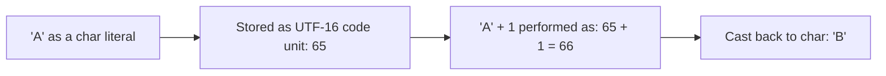
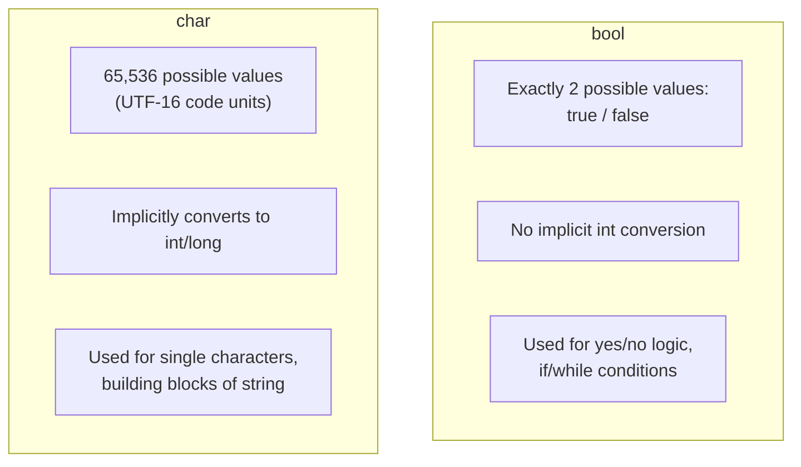

# bool and char Types

## Introduction

Before reading this lesson, you should already be comfortable with **[The decimal Type](../01-fundamentals/01-04-the-decimal-type.md)** — and, more broadly, with how C#'s numeric types each reserve a fixed-size, typed storage location. In this lesson we cover the two smallest and simplest built-in types left to introduce: **`bool`**, which represents a true/false logical value, and **`char`**, which represents a single Unicode character.

By the end of this lesson, you will be able to:

- Declare and use `bool` variables and understand what "logical value" means at the type level
- Declare and use `char` variables, including character literals and common escape sequences
- Explain that `char` is stored as a 16-bit numeric code unit, not a special "letter" type
- Perform arithmetic on `char` values and explain what the result means
- Recognize where deeper logical operators (`&&`, `||`, `!`) and comparisons are covered, ahead of Lesson 6

## bool and char Types — A Layman's Perspective

Think about a single light switch on a wall. It has exactly two positions — on or off — and nothing in between; there's no such thing as a switch that's "sort of on." Every decision a building's automation system makes ultimately traces back to reading one of these switches: is the switch for "alarm armed" on or off? Is "front door locked" on or off? A `bool` in a program is exactly that light switch: a value that is always, unambiguously, one of exactly two states — `true` or `false` — used to answer yes/no questions like "is this account overdrawn?" or "has this book been returned?"

Now think about a single key on a typewriter — not the whole keyboard, just one physical key, like the key for the letter "A" or the key for a comma. Each key on that typewriter corresponds to exactly one printed character, and, crucially, each key also corresponds to a specific *position* in the typewriter's internal mechanism — key number 1, key number 2, and so on — even though as a typist you never think about the numbers, only the letters. A `char` in C# works the same way: it looks to you like a single printed character — `'A'`, `'7'`, `'$'`, a single space — but underneath, the computer is really storing a number, a numeric code that a universal international standard (Unicode) has assigned to that character. `'A'` isn't magic; it's simply the character that happens to sit at code point 65, the same way the "A" key on the typewriter happens to sit in a specific slot in the mechanism, and the typewriter (and the computer) never actually "sees" a letter at all — only the position.

This numeric-underneath quality is why you can do slightly strange-looking arithmetic with characters: because a `char` is secretly a number, asking "what's one key-position after 'A'?" is a perfectly sensible question, and the answer is `'B'`, the same way asking "what key is one slot to the right of key 65?" has a definite mechanical answer. This isn't a party trick — it's genuinely how alphabetic ordering, cipher shifting, and case conversion work under the hood in real software.

Finally, some characters can't simply be typed directly into your source code because they'd be ambiguous or invisible — a literal tab character, a literal newline, or the quote mark that would otherwise end your character literal early. For these, C# uses an **escape sequence**: a backslash followed by a letter that stands in for the character you actually mean, the same way a typewriter with a "shift" key lets one physical key produce two different results depending on context. `\n` means "newline," `\t` means "tab," and `\\` means "an actual backslash, not an escape sequence." The bridge back to programming: `bool` answers yes/no questions with a fixed pair of values, and `char` represents exactly one character by way of a numeric Unicode code sitting quietly underneath the letter you see.

## bool and char Types — A Programming Language Perspective

`bool` (`System.Boolean`) is a value type with exactly two possible values, the literals `true` and `false`; it is the sole type permitted as the condition in an `if` statement, `while` loop, and ternary conditional in C#, and unlike some C-family languages, C# does not implicitly convert integers to `bool` — `0` and `1` are not interchangeable with `false` and `true`. `char` (`System.Char`) is a value type representing a single UTF-16 code unit, occupying 16 bits, with a numeric range of `0` to `65535`; a character literal is written in single quotes, `'A'`, and because `char` is fundamentally a `System.UInt16`-sized numeric value, it participates directly in integer arithmetic and implicitly converts to wider integral types such as `int`. Note that because `char` represents a single 16-bit UTF-16 code unit rather than a full Unicode "character" in the broader grapheme sense, code points outside the Basic Multilingual Plane (such as many emoji) require a *surrogate pair* of two `char` values to represent — a nuance covered alongside string handling in Lesson 15. Escape sequences (`\n`, `\t`, `\\`, `\'`, `\"`, and Unicode escapes like `A`) let a `char` or `string` literal represent characters that cannot appear literally in source text.

## How to Declare and Use bool and char in C#

Declare a `bool` with the `bool` keyword and assign it one of the two literals `true` or `false`, usually as the result of a comparison. Declare a `char` with the `char` keyword and a single-quoted literal; because `char` is numeric underneath, you can add or subtract integers from it, and comparing two `char` values compares their underlying codes.


*Figure 1: A `char` is a Unicode code unit underneath — arithmetic on it operates on that number.*

```csharp
// Program.cs — .NET 10 / C# 14
bool isCheckedOut = true;
bool isOverdue = false;

char firstLetter = 'A';
char digitChar = '7';
char newlineEscape = '\n';
char tabEscape = '\t';

Console.WriteLine($"isCheckedOut: {isCheckedOut}");
Console.WriteLine($"isOverdue: {isOverdue}");
Console.WriteLine($"firstLetter: {firstLetter}, numeric code: {(int)firstLetter}");
Console.WriteLine($"digitChar as char: {digitChar}");
Console.WriteLine($"digitChar as its numeric code: {(int)digitChar}");
Console.WriteLine($"digitChar minus '0' gives the actual digit value: {digitChar - '0'}");

char nextLetter = (char)(firstLetter + 1);
Console.WriteLine($"firstLetter + 1, cast back to char: {nextLetter}");

Console.WriteLine($"Escapes in action:{tabEscape}tabbed text{newlineEscape}and a new line.");
```

**Console Output:**

```text
isCheckedOut: True
isOverdue: False
firstLetter: A, numeric code: 65
digitChar as char: 7
digitChar as its numeric code: 55
digitChar minus '0' gives the actual digit value: 7
firstLetter + 1, cast back to char: B
Escapes in action:	tabbed text
and a new line.
```

The `(int)firstLetter` cast reveals `'A'`'s underlying Unicode code, `65`. The line `digitChar - '0'` is a classic, genuinely useful idiom: subtracting the `char` `'0'` (code 48) from any digit character converts that digit's *display* character into its actual numeric *value* — `'7'` (code 55) minus `'0'` (code 48) equals `7`, the integer. `firstLetter + 1` demonstrates `char` arithmetic directly: adding `1` to `'A'`'s code (65) gives `66`, which is `'B'` once cast back to `char`. The escape sequences `\t` and `\n` produce a real tab character and a real line break in the output, exactly as a typed-out literal tab or newline would, without needing to embed an actual invisible character in the source file.

## Real-Time Example: Tracking PIN Entry and Account Status at an ATM

We continue the **Banking/ATM** case study from earlier lessons. Before a formal `Account` class exists (Module 02), a real ATM's low-level input handling already relies heavily on both `bool` flags and `char` values — reading a single keypad digit is a `char` operation, and every security check the machine makes collapses to a `bool`.

```csharp
// Program.cs — .NET 10 / C# 14 — Real-Time Example
bool isCardInserted = true;
bool isAccountLocked = false;
int failedPinAttempts = 0;

char[] enteredPin = { '4', '4', '1', '2' };
char[] correctPin = { '4', '4', '1', '2' };

bool pinMatches = true;
for (int i = 0; i < correctPin.Length; i++)
{
    if (enteredPin[i] != correctPin[i])
    {
        pinMatches = false;
        break;
    }
}

if (!isCardInserted)
{
    Console.WriteLine("Please insert your card.");
}
else if (isAccountLocked)
{
    Console.WriteLine("Account locked. Please contact your branch.");
}
else if (pinMatches)
{
    Console.WriteLine("PIN accepted. Welcome back!");
    failedPinAttempts = 0;
}
else
{
    failedPinAttempts++;
    Console.WriteLine($"Incorrect PIN. Attempt {failedPinAttempts} of 3.");
}

Console.WriteLine("=== ATM Session Summary ===");
Console.WriteLine($"Card inserted: {isCardInserted}");
Console.WriteLine($"Account locked: {isAccountLocked}");
Console.WriteLine($"PIN matched: {pinMatches}");
Console.WriteLine($"Failed attempts this session: {failedPinAttempts}");
```

**Console Output:**

```text
PIN accepted. Welcome back!
=== ATM Session Summary ===
Card inserted: True
Account locked: False
PIN matched: True
Failed attempts this session: 0
```

`enteredPin` and `correctPin` are `char[]` arrays rather than a single `string` comparison here deliberately — many real PIN-pad drivers read one keypress at a time as an individual `char` before ever assembling a full value, and comparing `char` by `char` is exactly how that low-level matching happens. Every branch of the `if`/`else if` chain is driven entirely by `bool` values — `isCardInserted`, `isAccountLocked`, and `pinMatches` — which is the everyday reality of security-sensitive code: the actual decision logic is nothing more than a chain of true/false checks, however consequential the outcome. Lesson 6 covers the `&&`, `||`, and `!` operators that let these `bool` checks combine into single, more compact conditions.

## bool vs. char

These two types sit at opposite ends of C#'s "simplest primitives" spectrum: `bool` has exactly two possible values and exists purely to answer yes/no questions, while `char` has 65,536 possible values (one per UTF-16 code unit) and exists to represent a single unit of text. `bool` is never treated as a number in C# — there is no implicit conversion between `bool` and any integer type, unlike some older C-family languages. `char`, by contrast, is *always* secretly a number and freely participates in arithmetic and implicit widening conversions to `int`, `long`, and other integral types. Both are value types occupying fixed, small storage (`bool` is 1 byte as stored in memory though it only ever has 2 meaningful values; `char` is 2 bytes), and both commonly appear as the building blocks of larger structures — `bool` flags on domain objects, `char` arrays inside `string`.


*Figure 2: `bool` is a strictly two-valued logical type; `char` is a numeric type wearing a character's clothing.*

| Aspect | `bool` | `char` |
|---|---|---|
| Possible values | Exactly 2: `true`, `false` | 65,536 (UTF-16 code units 0-65535) |
| Underlying representation | Not numeric — no implicit int conversion | Numeric — a 16-bit UTF-16 code unit |
| Literal syntax | `true` / `false` | Single quotes: `'A'`, `'7'`, `'\n'` |
| Arithmetic allowed? | No | Yes (adds/subtracts as its numeric code) |
| Typical use | Flags, conditions, comparison results | Single characters, escape sequences, building `string` |

## Types of Logical and Character Handling in C#

`bool` and `char` are foundational to several topics covered in their own dedicated lessons:

1. **[Operators in C#](../01-fundamentals/01-06-operators-in-csharp.md)** — the comparison operators (`==`, `<`, `>`) that produce `bool` results, and logical operators (`&&`, `||`, `!`) that combine them.
2. **[Decision-Making: if/else](../01-fundamentals/01-09-decision-making-if-else.md)** — using `bool` expressions to branch program flow.
3. **[Strings in C#](../01-fundamentals/01-15-strings-in-csharp.md)** — how a `string` is fundamentally a sequence of `char` values.
4. **[Type Conversion and Casting](../01-fundamentals/01-08-type-conversion-and-casting.md)** — converting between `char` and its numeric codes explicitly.
5. **[Nullable Reference Types](../01-fundamentals/01-21-nullable-reference-types.md)** — how `bool?` and `char?` represent an added "unknown" state beyond their normal values.

## What You've Learned & What's Next

You now know that `bool` is a strictly two-valued logical type used to drive decisions, and that `char` is really a 16-bit Unicode code unit that happens to display as a printed character, which is exactly why `char` arithmetic and escape sequences behave the way they do.

Continue your learning journey with **[Operators in C#](../01-fundamentals/01-06-operators-in-csharp.md)**, where we cover the full set of arithmetic, comparison, logical, and bitwise operators that act on the types from this module.

---
*Applies to: .NET 10 / C# 14. Last reviewed 2026-08-16.*
