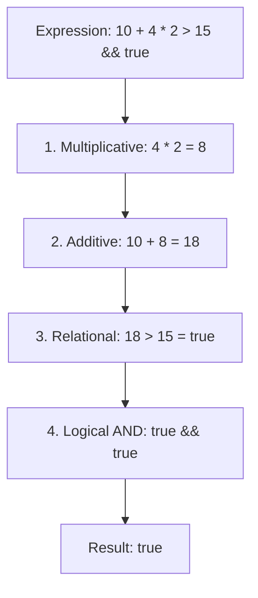
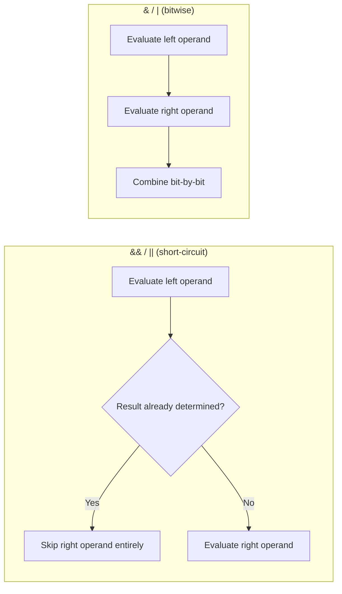

# Operators in C#

## Introduction

Before reading this lesson, you should already be comfortable with **[bool and char Types](../01-fundamentals/01-05-bool-and-char-types.md)** — in particular how `bool` represents `true`/`false` and how comparisons produce a `bool` result. In this lesson we build directly on that foundation to introduce **operators**: the symbols C# uses to combine, compare, and transform values.

By the end of this lesson, you will be able to:

- Use arithmetic operators (`+`, `-`, `*`, `/`, `%`) to compute values from numeric variables
- Use comparison/relational operators (`==`, `!=`, `<`, `>`, `<=`, `>=`) to produce `bool` results
- Combine boolean expressions with logical operators (`&&`, `||`, `!`) and understand short-circuit evaluation
- Manipulate individual bits with bitwise and shift operators (`&`, `|`, `^`, `~`, `<<`, `>>`)
- Use assignment operators (`=`, `+=`, `-=`, etc.) and the null-coalescing operators (`??`, `??=`) to write safer, shorter code
- Predict how C# evaluates a multi-operator expression by understanding operator precedence

## Operators in C# — A Layman's Perspective

Picture the ticket rail in a busy restaurant kitchen. A single order ticket might say: "sear the steak, reduce the sauce, plate the vegetables, and only fire the dessert if the table asks for it." The kitchen doesn't do these things in the order they happen to be written on the ticket — every kitchen has a fixed workflow. Proteins hit the grill first no matter where "sear the steak" appears on the ticket; sauces reduce while the grill is working; plating always happens last, right before the dish goes out. The ticket's *wording* is flexible, but the kitchen's *sequence of stations* is not. That fixed sequence is what keeps forty tickets a night from turning into chaos.

Each station in that kitchen also uses a different kind of tool for a different kind of job. The line cook has a knife for cutting and a scale for weighing portions — those are your **arithmetic operators**, the ones that combine quantities into new quantities: add two things, subtract one from another, split a batch into equal portions. The expediter at the pass has a completely different tool: a checklist with yes/no boxes — "is the steak done? is the plate warm? did the table order dessert?" That's your **comparison operators**: they don't produce food, they produce a verdict, true or false. The head chef, deciding whether to actually fire a dish, applies **logical** thinking on top of those verdicts: fire the dessert *only if* the table ordered it *and* the entrées are already out — that's an "and" rule, and if the entrées aren't out yet, the chef doesn't even bother checking whether dessert was ordered, because the answer is already "not yet" regardless. That's short-circuiting: stop checking the moment you already know the answer.

There's a maintenance closet in the back too, with a panel of small toggle switches controlling things like "walk-in fridge light," "exhaust fan," and "emergency vent." Nobody thinks of these as numbers — they think of them as independent on/off switches that can be flipped one at a time without touching the others. That's the everyday feel of **bitwise operators**: turning individual switches on or off inside a value without disturbing the rest.

And finally, a kitchen has default fallbacks: if the walk-in fridge's thermometer reading is missing, the safety log doesn't leave a blank — it writes "unknown, check manually" instead. That's the everyday feel of the **null-coalescing operator**: "use this value, but if it's missing, fall back to that one instead."

Bringing this back to code: a C# expression is a ticket full of operators, and just like the kitchen, C# has a fixed, predictable sequence — called *operator precedence* — for deciding which operation happens first, regardless of the order you typed them in.

## Operators in C# — A Programming Language Perspective

Formally, an **operator** is a symbol that instructs the compiler to perform a specific operation on one, two, or three **operands** (values or variables). Operators are classified as *unary* (one operand, e.g. `-x`, `!flag`), *binary* (two operands, e.g. `a + b`), or *ternary* (three operands — C#'s only ternary operator is the conditional `?:`). C# groups its operators into families: arithmetic, comparison/relational, boolean logical, bitwise/shift, assignment, and a small set of special-purpose operators including the null-coalescing operators `??` and `??=`.

When an expression contains more than one operator, the C# compiler resolves ambiguity using two rules: **precedence** (which operator category binds tighter — multiplication before addition, for example) and **associativity** (for operators of equal precedence, whether evaluation proceeds left-to-right or right-to-left; assignment, notably, is right-associative). Most operators shown here are also overloadable for user-defined types, a topic the next lesson introduces. As of C# 14, the family of null-related operators has grown to include the null-conditional assignment operator `?.=`, covered later in this lesson.

## How to Use Operators in C#

C# groups operators by what kind of result they produce. Arithmetic operators (`+ - * / %`) take numeric operands and return a number. Comparison operators (`== != < > <= >=`) take any comparable operands and return a `bool`. Logical operators (`&& || !`) take `bool` operands and return a `bool`, short-circuiting where possible. Bitwise and shift operators (`& | ^ ~ << >>`) operate on the binary representation of integer types. Assignment operators (`= += -= *= /= %= &= |= ^= <<= >>=`) store a computed value into a variable. And the null-coalescing family (`?? ??=`) supplies a fallback when a value is `null`.

When several of these appear in one expression, C# evaluates them according to a fixed precedence order — from tightest-binding to loosest: unary operators, then multiplicative (`* / %`), then additive (`+ -`), then relational (`< > <= >=`), then equality (`== !=`), then logical AND (`&&`), then logical OR (`||`), then the conditional operator (`?:`), and finally assignment (`= += ...`), which is evaluated last and right-to-left. Parentheses always override this order, and using them liberally is considered good style even when they aren't strictly required — a future reader (including you) shouldn't have to memorize the precedence table to understand your code.


*Figure 1: How C# resolves a mixed expression tier by tier, tightest-binding operator first, regardless of left-to-right reading order.*

```csharp
// Program.cs — .NET 10 / C# 14
int itemCount = 4;
decimal pricePerItem = 19.99m;
decimal shippingFee = 5.00m;
bool isMemberDiscount = true;

decimal subtotal = itemCount * pricePerItem;                          // arithmetic
decimal total = subtotal + shippingFee;                               // arithmetic
bool qualifiesForFreeShipping = subtotal > 50m;                       // comparison
bool appliesDiscount = isMemberDiscount && qualifiesForFreeShipping;  // logical

string? couponCode = null;
string effectiveCoupon = couponCode ?? "NONE";                        // null-coalescing

int flags = 0b_0110;
int mask = 0b_0010;
int combined = flags | mask;                                         // bitwise OR

Console.WriteLine($"Subtotal: {subtotal:C}");
Console.WriteLine($"Total (with shipping): {total:C}");
Console.WriteLine($"Free shipping? {qualifiesForFreeShipping}");
Console.WriteLine($"Discount applies? {appliesDiscount}");
Console.WriteLine($"Coupon: {effectiveCoupon}");
Console.WriteLine($"Combined flags: {combined} (binary {Convert.ToString(combined, 2)})");
```

**Console Output:**

```text
Subtotal: $79.96
Total (with shipping): $84.96
Free shipping? True
Discount applies? True
Coupon: NONE
Combined flags: 6 (binary 110)
```

Each line uses exactly one operator family: `*` and `+` compute `subtotal` and `total`; `>` compares `subtotal` against `50m`; `&&` combines two `bool`s; `??` substitutes `"NONE"` because `couponCode` was `null`; and `|` turns on both bits from `flags` (`0110`) and `mask` (`0010`), leaving `0110` — decimal `6` — unchanged in this case because bit 1 was already set in both operands.

> **Latest in C# 14:** the null-coalescing family now includes the **null-conditional assignment operator `?.=`**, which lets you write `customer?.LastLoginAt = DateTime.UtcNow;` — the assignment only happens if `customer` is not `null`, and nothing throws if it is. Before C# 14 this required an explicit `if (customer is not null)` check.

## Real-Time Example: Operators in E-Commerce Order Processing

We continue building the recurring **E-Commerce Order Processing** case study introduced in the orientation module. The formal `Order`, `Customer`, and `OrderItem` classes arrive in Module 02 once classes are covered — for now, we work with the same raw values (unit price, quantity, tax rate, membership status) that will eventually become their properties, and compute a checkout total using every operator family from this lesson.

```csharp
// Program.cs — .NET 10 / C# 14 — Real-Time Example: E-Commerce Checkout
decimal unitPrice = 249.50m;
int quantity = 3;
decimal taxRate = 0.085m;
bool isPrimeMember = true;
bool isRushShipping = false;
string? promoCode = "SAVE10";

decimal subtotal = unitPrice * quantity;
decimal tax = subtotal * taxRate;
decimal shippingFee = isPrimeMember ? 0.00m : 8.99m;
decimal rushSurcharge = isRushShipping ? 15.00m : 0.00m;

bool qualifiesForPromo = promoCode is not null && subtotal >= 500m;
decimal discount = qualifiesForPromo ? subtotal * 0.10m : 0.00m;

decimal grandTotal = subtotal + tax + shippingFee + rushSurcharge - discount;
string appliedPromo = qualifiesForPromo ? promoCode ?? "NONE" : "NONE";

// Notification preferences stored as a bitmask
const int EmailNotify = 0b_0001;
const int SmsNotify   = 0b_0010;
const int PushNotify  = 0b_0100;
int customerPrefs = EmailNotify | PushNotify;
bool willReceiveSms = (customerPrefs & SmsNotify) != 0;

Console.WriteLine($"Subtotal:       {subtotal:C}");
Console.WriteLine($"Tax (8.5%):     {tax:C}");
Console.WriteLine($"Shipping fee:   {shippingFee:C}");
Console.WriteLine($"Rush surcharge: {rushSurcharge:C}");
Console.WriteLine($"Promo applied:  {appliedPromo} (-{discount:C})");
Console.WriteLine($"Grand total:    {grandTotal:C}");
Console.WriteLine($"Will text SMS confirmation? {willReceiveSms}");
```

**Console Output:**

```text
Subtotal:       $748.50
Tax (8.5%):     $63.62
Shipping fee:   $0.00
Rush surcharge: $0.00
Promo applied:  SAVE10 (-$74.85)
Grand total:    $737.27
Will text SMS confirmation? False
```

Notice how each operator earns its keep in real checkout logic: the ternary `?:` picks between two shipping/rush prices without an `if` block, `&&` guards the promo discount so a `null` promo code can never slip through, `??` provides a safe fallback string for display, and the bitwise `&` tests a single notification flag out of a packed set — the same technique real order-processing systems use for compact preference storage. Getting this arithmetic and logic right, in the right order, is exactly what separates a checkout total customers trust from one that generates support tickets.

## Logical Operators vs Bitwise Operators

Both `&&`/`||` and `&`/`|` look similar and even work on `bool` operands identically in terms of the final result, but they behave very differently and solve different problems. The logical operators `&&` and `||` are **short-circuiting**: `&&` stops evaluating as soon as its left operand is `false` (the whole expression must be `false`), and `||` stops as soon as its left operand is `true`. This isn't just an optimization — it's a safety mechanism, letting you write `customer is not null && customer.IsActive` without a `NullReferenceException`, because the right side never runs if the left side is `false`.

The bitwise operators `&` and `|`, by contrast, always evaluate **both** operands, and they operate on the binary representation of integers bit-by-bit rather than short-circuiting on booleans. They're the right tool when you need to combine or test flags packed into a single integer (permission sets, notification preferences, hardware registers) — not when you're chaining conditional logic.


*Figure 2: Short-circuit logical evaluation versus always-evaluate bitwise evaluation.*

| Aspect | Logical (`&&`, `\|\|`) | Bitwise (`&`, `\|`) |
|---|---|---|
| Operand type | `bool` only | Integer types (also usable on `bool`, without short-circuiting) |
| Evaluation | Short-circuits — may skip the right operand | Always evaluates both operands |
| What it produces | A single `bool` verdict | A combined integer (or a non-short-circuited `bool`) |
| Typical use case | Guarding conditions, chained validation checks | Flag/permission bitmasks, low-level bit manipulation |
| Null-safety benefit | Yes — `a is not null && a.Prop` is safe | No — both sides always run |

## Types of Operators in C#

C# groups its operators into several families, some of which get their own dedicated lesson later in the curriculum:

1. **[Type Conversion and Casting](../01-fundamentals/01-08-type-conversion-and-casting.md)** — covers the cast operator `()` and how arithmetic overflow behaves in `checked`/`unchecked` contexts.
2. **[Decision Making: if/else](../01-fundamentals/01-09-decision-making-if-else.md)** — shows comparison and logical operators driving real branching logic.
3. **[switch Statements and switch Expressions](../01-fundamentals/01-10-switch-statements-and-expressions.md)** — introduces relational and type *patterns*, a more expressive cousin of the comparison operators.
4. **[Enums in C#](../01-fundamentals/01-24-enums-in-csharp.md)** — the most common home for bitwise operators, via `[Flags]` enum combinations.
5. **[Nullable Reference Types](../01-fundamentals/01-21-nullable-reference-types.md)** — goes deeper on `??`, `??=`, and null-conditional member access (`?.`).
6. **[Operator Overloading Basics](../01-fundamentals/01-07-operator-overloading-basics.md)** — how you make `+`, `==`, and other operators work on your own types, expanded fully in **[Operator Overloading in Depth](../02-oop/02-05-operator-overloading-in-depth.md)**.

## What You've Learned & What's Next

You now know every core operator family in C# — arithmetic, comparison, logical, bitwise, assignment, and null-coalescing — and, critically, how precedence and associativity decide evaluation order when they're mixed together in one expression. These operators are the vocabulary every later control-flow and business-logic lesson builds on.

Continue your learning journey with **[Operator Overloading Basics](../01-fundamentals/01-07-operator-overloading-basics.md)**, where we take a first look at teaching your own types to respond to operators like `+` and `==`.

---
*Applies to: .NET 10 / C# 14. Last reviewed 2026-08-16.*
