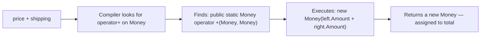
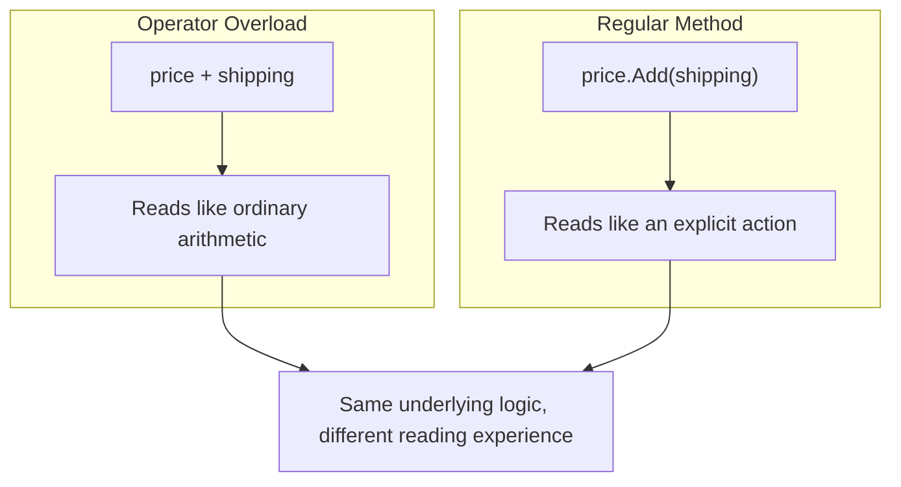

# Operator Overloading Basics

## Introduction

Before reading this lesson, you should already be comfortable with **[Operators in C#](../01-fundamentals/01-06-operators-in-csharp.md)** — in particular that operators like `+`, `==`, and `<` are just symbols instructing the compiler to run a specific operation. In this lesson we build directly on that foundation to introduce **operator overloading**: teaching those same familiar symbols to work on data types you define yourself.

By the end of this lesson, you will be able to:

- Explain what operator overloading means and why C# allows it
- Recognize the `public static operator` syntax used to overload an operator
- Overload `+` and `==` on a simple custom type
- Understand the rule that certain operators must be overloaded in matching pairs
- Know where to go for the full, in-depth treatment of operator overloading

## Operator Overloading — A Layman's Perspective

Think about the word "positive" for a moment. In everyday conversation, "positive" means upbeat or optimistic. Walk into a doctor's office and ask about a lab result, though, and "positive" suddenly means something completely different — and, depending on the test, potentially the opposite of good news. The *word* didn't change. What changed is the *context* it's being used in: a lab report versus a pep talk. Doctors didn't invent a brand-new word for "the test found what it was looking for" — they reused a word everyone already understood and let context redefine its meaning.

Operator overloading works exactly the same way, except the "word" is a symbol like `+`, and the "context" is the type of thing standing on either side of it. Everyone already understands what `3 + 4` means. But what should `cartA + cartB` mean, if `cartA` and `cartB` are two shopping carts? There's no built-in mathematical meaning for "adding" two carts together — but there's an obvious, sensible one a store owner would recognize instantly: merge their items into one combined cart. Rather than forcing every programmer who touches this code to call some awkwardly-named method like `cartA.MergeInto(cartB)`, C# lets you teach the `+` symbol itself what "addition" should mean for shopping carts, so the code can simply read `cartA + cartB` — instantly familiar, instantly readable, exactly like the doctor's reused word "positive."

This isn't limitless license to make symbols mean anything you want, though. A well-run hospital only lets "positive" mean "test found something" in the narrow, well-understood context of lab results — nobody redefines it to mean "please schedule a follow-up in March," because that would confuse everyone reading the chart. In the same way, good C# style only overloads an operator when its new meaning still *feels* like the operator's original meaning: `+` should still feel like "combining two things into one," `==` should still feel like "these two things are considered equal," and so on. Overload `+` to mean "subtract" just because you can, and you've broken the doctor's-office rule — you've reused a familiar word for something nobody would expect it to mean.

The bridge back to programming: operator overloading lets your own custom types speak the same familiar symbolic language — `+`, `-`, `==`, `<` — that every C# developer already reads fluently, as long as the new meaning stays true to what that symbol has always represented.

## Operator Overloading — A Programming Language Perspective

Formally, **operator overloading** is the ability to redefine the behavior of a built-in C# operator for a user-defined type (a `class` or `struct`) by declaring a `public static` method named `operator` followed by the operator symbol — for example, `public static Money operator +(Money left, Money right)`. The compiler resolves which overload to invoke based on the compile-time types of the operands, exactly as it resolves any other overloaded method. Not every operator can be overloaded (assignment operators like `=` cannot be overloaded directly, though compound forms like `+=` are automatically derived from `+`), and C# enforces that certain operators be overloaded in matching pairs — most notably `==` with `!=`, and `<` with `>` (and `<=` with `>=`) — a rule the compiler enforces at build time with error CS0216. This lesson only scratches the surface; the full rule set, including unary operators and the `true`/`false` operator pair, is covered in **[Operator Overloading in Depth](../02-oop/02-05-operator-overloading-in-depth.md)** once classes are formally introduced.

## How to Overload an Operator in C#

To overload an operator, you declare a `public static` method inside your type whose name is the `operator` keyword followed by the symbol you're teaching a new meaning to. The method's parameters are the operands (for a binary operator like `+`, you take two parameters), and its return value becomes the result of the expression. You haven't formally met classes yet — that's Module 02 — but for now it's enough to know that a `class` is a blueprint that bundles related data together, and a `static` method belongs to the type itself rather than to any one instance of it.


*Figure 1: How `price + shipping` resolves to the overloaded `operator +` method and produces a new value.*

```csharp
// Program.cs — .NET 10 / C# 14
public class Money
{
    public decimal Amount { get; }

    public Money(decimal amount) => Amount = amount;

    public static Money operator +(Money left, Money right) =>
        new Money(left.Amount + right.Amount);

    public static bool operator ==(Money left, Money right) =>
        left.Amount == right.Amount;

    public static bool operator !=(Money left, Money right) =>
        !(left == right);

    public override bool Equals(object? obj) => obj is Money other && this == other;
    public override int GetHashCode() => Amount.GetHashCode();

    public override string ToString() => Amount.ToString("C");
}

Money price = new Money(19.99m);
Money shipping = new Money(5.00m);
Money total = price + shipping;

Console.WriteLine($"Price:    {price}");
Console.WriteLine($"Shipping: {shipping}");
Console.WriteLine($"Total:    {total}");
Console.WriteLine($"Same as itself? {price == new Money(19.99m)}");
```

**Console Output:**

```text
Price:    $19.99
Shipping: $5.00
Total:    $24.99
Same as itself? True
```

`price + shipping` doesn't add two `decimal`s directly — it calls the `operator +` method we defined, which reads each `Money`'s `Amount`, adds those, and wraps the result in a brand-new `Money`. Because `==` and `!=` were overloaded as a matching pair (and `Equals`/`GetHashCode` were overridden to stay consistent with them), comparing `price` to a freshly-constructed `Money(19.99m)` correctly reports `True`, even though they're two distinct objects in memory.

## Real-Time Example: Operator Overloading in Banking/ATM

We continue the recurring **Banking/ATM** case study. Here we model a simplified `Balance` type and overload `+`, `-`, `<`, and `>` so that deposits, withdrawals, and balance checks can be written the way a bank statement would describe them, rather than as a series of method calls.

```csharp
// Program.cs — .NET 10 / C# 14 — Real-Time Example: Banking/ATM
public class Balance
{
    public decimal Amount { get; }

    public Balance(decimal amount) => Amount = amount;

    public static Balance operator +(Balance balance, decimal deposit) =>
        new Balance(balance.Amount + deposit);

    public static Balance operator -(Balance balance, decimal withdrawal) =>
        new Balance(balance.Amount - withdrawal);

    public static bool operator <(Balance balance, decimal amount) => balance.Amount < amount;
    public static bool operator >(Balance balance, decimal amount) => balance.Amount > amount;

    public override string ToString() => Amount.ToString("C");
}

Balance checking = new Balance(500.00m);
decimal withdrawalRequest = 750.00m;

if (checking < withdrawalRequest)
{
    Console.WriteLine($"Withdrawal of {withdrawalRequest:C} declined — balance is only {checking}.");
}
else
{
    checking -= withdrawalRequest;
    Console.WriteLine($"Withdrawal approved. New balance: {checking}");
}

checking += 200.00m;
Console.WriteLine($"After a {200.00m:C} deposit: {checking}");

if (checking > 1000.00m)
{
    Console.WriteLine("Balance qualifies for Premium tier.");
}
else
{
    Console.WriteLine("Balance does not yet qualify for Premium tier.");
}
```

**Console Output:**

```text
Withdrawal of $750.00 declined — balance is only $500.00.
After a $200.00 deposit: $700.00
Balance does not yet qualify for Premium tier.
```

Notice `checking -= withdrawalRequest` and `checking += 200.00m` — the compound assignment operators work automatically once `-` and `+` are overloaded, because `-=` and `+=` are always shorthand for "take the current value, apply the operator, assign the result back." Because `<` and `>` were both overloaded together (satisfying the compiler's matching-pair rule), the `Balance` type can be compared against a plain `decimal` threshold as naturally as two numbers — exactly the kind of readable, bank-statement-like code a real ATM or online banking system would want.

## Operator Overloading vs Regular Methods

Every operator overload could, in principle, be written as a plainly-named method instead: `Money.Add(price, shipping)` instead of `price + shipping`. Both approaches execute identical logic — the difference is entirely about how the calling code *reads*. Operator overloading is the right choice when your type represents something people already think of in terms of the operator's everyday meaning — money, coordinates, vectors, durations. A regular method is the right (and usually better) choice for anything that doesn't map cleanly onto a symbol's existing meaning: `customer.PlaceOrder(cart)` should not become `customer + cart`, because nothing about "placing an order" resembles addition.


*Figure 2: Operator overloading and a regular method can execute identical logic — the difference is purely how naturally the call site reads.*

| Aspect | Operator Overload (`+`) | Regular Method (`.Add()`) |
|---|---|---|
| Call-site readability | Reads like natural arithmetic: `a + b` | Reads like an explicit action: `a.Add(b)` |
| Best suited for | Types with an obvious operator-like meaning (money, vectors, durations) | Anything without a natural symbolic equivalent |
| Discoverability | Easy to miss in IntelliSense unless you know it exists | Shows up directly in autocomplete with a descriptive name |
| Overuse risk | Confusing if the operator's meaning is stretched too far | Low — a method name can always be as specific as needed |
| Compiler rules | Certain operators must be overloaded in matching pairs | No special pairing rules |

## Types of Operator-Related Topics in C#

Operator overloading connects to several other topics covered later in the curriculum:

1. **[Operator Overloading in Depth](../02-oop/02-05-operator-overloading-in-depth.md)** — the full rule set: unary operators, the `true`/`false` pair, and best practices, once classes are formally covered.
2. **[Type Conversion and Casting](../01-fundamentals/01-08-type-conversion-and-casting.md)** — user-defined `implicit`/`explicit` conversion operators, a close cousin of operator overloading.
3. **[Equality: Equals, ==, and IEquatable\<T\>](../02-oop/02-33-equality-equals-iequatable.md)** — the deeper contract behind overloading `==` correctly.
4. **[Records in C# (record class)](../02-oop/02-19-records-in-csharp.md)** — records generate value-based `==`/`!=` overloads for you automatically.
5. **[IComparable\<T\> and IComparer\<T\>](../03-collections-generics/03-20-icomparable-and-icomparer.md)** — the interface-based alternative to overloading `<` and `>` for sorting.
6. **[Strings in C#](../01-fundamentals/01-15-strings-in-csharp.md)** — `string` itself overloads `+` for concatenation, a built-in example you've likely used without realizing it.

## What You've Learned & What's Next

You've seen that operator overloading is just a `public static operator` method attached to your own type, that certain operators must be overloaded in matching pairs, and when reaching for an operator makes code clearer versus when a plain method name is the better choice. This is intentionally a first look — the full depth arrives once classes are formally covered.

Continue your learning journey with **[Type Conversion and Casting](../01-fundamentals/01-08-type-conversion-and-casting.md)**, where we look at how C# converts values between types — implicitly, explicitly, and via the `Convert` class.

---
*Applies to: .NET 10 / C# 14. Last reviewed 2026-08-16.*
