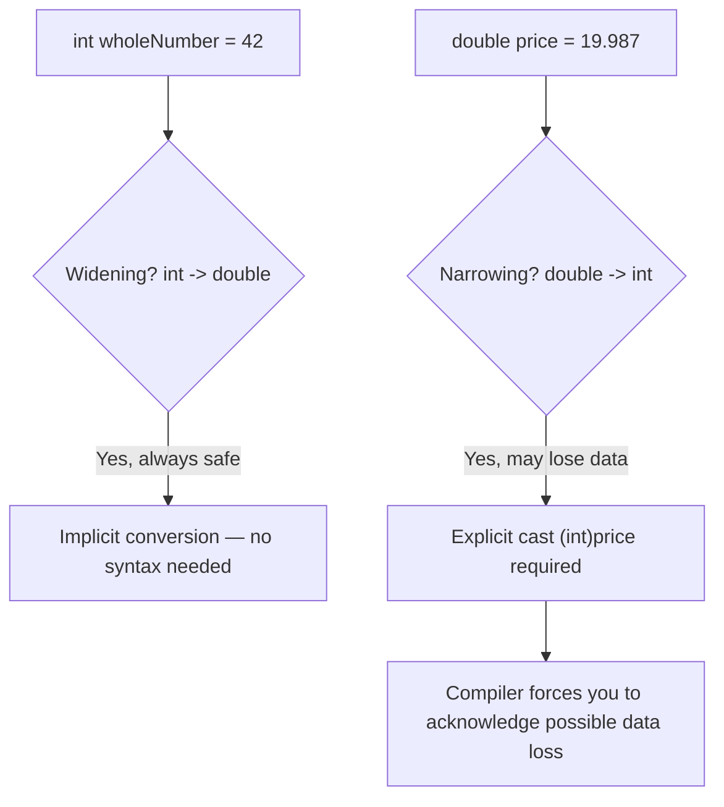
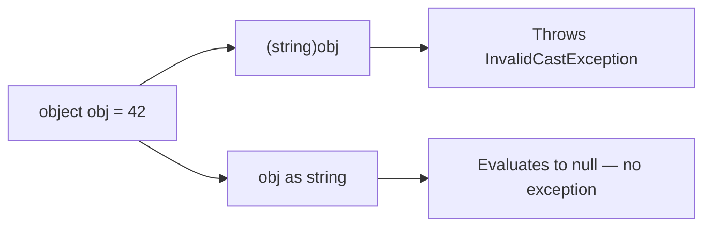

# Type Conversion and Casting

## Introduction

Before reading this lesson, you should already be comfortable with **[Operator Overloading Basics](../01-fundamentals/01-07-operator-overloading-basics.md)** — in particular that C# lets a type define exactly how it behaves under a given operation. In this lesson we build directly on that foundation to introduce **type conversion and casting**: how a value of one type becomes a value of another.

By the end of this lesson, you will be able to:

- Distinguish implicit (widening) conversions from explicit (narrowing) conversions
- Write cast expressions using the `(TargetType)value` syntax
- Use the `Convert` class to convert between types with rounding and culture-aware parsing
- Use the `is` operator to safely test and pattern-match a type
- Use the `as` operator to attempt a cast that returns `null` instead of throwing
- Explain how `checked` and `unchecked` contexts control arithmetic overflow behavior

## Type Conversion and Casting — A Layman's Perspective

Picture a shipping company that moves goods between containers of different sizes. Moving cargo from a small box into a much larger crate is always safe — nothing gets left behind, nothing gets damaged, and the warehouse worker doesn't even need to think twice before doing it. That's the everyday feel of an **implicit conversion**: going from a smaller, more limited type into a bigger, more capable one (an `int` into a `double`, for instance) is automatic and guaranteed safe, so C# just does it for you without asking.

Now picture the opposite: moving cargo from a large crate into a small box. Sometimes everything fits fine. But sometimes it doesn't — some of the cargo has to be left behind, or it simply won't fit in the smaller container at all. Because this move is *risky*, a responsible warehouse doesn't let a worker do it casually — they have to consciously sign a form acknowledging "yes, I understand some cargo might not make it, and I'm choosing to do this anyway." That deliberate, signed acknowledgment is exactly what an **explicit cast** — `(int)someDouble` — represents in code: you're telling the compiler "I know this might lose information, and I'm doing it on purpose."

Some warehouses also have a translation desk with rules for handling awkward cases: a shipment invoice that lists a quantity as `"48"` in plain text needs a clerk to *interpret* it as an actual number before it can be counted, not just physically resized like the crates. That's the role of the **`Convert` class** — deliberately interpreting one kind of thing (text) as another (a number), following clear, well-defined rules, including how to round when a number doesn't divide evenly.

Then there's the loading dock supervisor who, before accepting a delivery, first checks "is this actually a shipment of fresh produce, or is it electronics mislabeled as produce?" That check-before-you-commit habit is what the **`is` operator** gives you — testing whether something really is a particular type before you commit to treating it as one. And the more cautious cousin of that supervisor, who says "try to treat this as produce, but if it turns out not to be, just hand me back an empty pallet instead of stopping the whole loading dock" — that's the **`as` operator**: attempt the conversion, and quietly get `null` back if it doesn't work, rather than an alarm going off.

Finally, imagine a scale at the dock that's only rated to weigh up to a certain maximum. Push past that limit and a good scale is designed to sound an alarm rather than silently report a wrong number — that's what a **`checked`** context does for arithmetic: instead of silently wrapping around to a nonsensical value when a calculation overflows, it throws an exception you can catch and handle.

The bridge back to programming: converting between types is a routine, everyday operation in C#, but the language is careful to distinguish the moves that are always safe from the ones that need your explicit, informed consent.

## Type Conversion and Casting — A Programming Language Perspective

Formally, a **type conversion** transforms a value of one type into a value of another. C# recognizes two broad categories. An **implicit conversion** happens automatically whenever the compiler can guarantee no data will be lost — widening numeric conversions (`int` → `long` → `float` → `double`) and conversions to a base type or implemented interface are the most common examples. An **explicit conversion** (a *cast*) requires the syntax `(TargetType)value` and is required whenever data loss or a runtime failure is possible — narrowing numeric conversions, and reference-type conversions that aren't guaranteed to succeed. The static `Convert` class (`System.Convert`) supplements casting with methods like `Convert.ToInt32`, which apply rounding rules (`MidpointRounding.ToEven` by default) rather than truncation, and can convert between otherwise-unrelated types such as `string` and numeric types. The `is` operator tests (and, combined with pattern matching, extracts) a runtime type; the `as` operator performs a reference or nullable-value-type conversion that evaluates to `null` on failure instead of throwing `InvalidCastException`. Finally, integer arithmetic that overflows its type's range either wraps silently (the default, `unchecked`, context) or throws `System.OverflowException` inside an explicit `checked` context or block.

## How to Convert and Cast Types in C#

Reach for an implicit conversion whenever you're simply assigning a smaller numeric type to a larger one — no syntax is required, and the compiler proves it's always safe. Reach for an explicit cast, `(int)someDouble`, when narrowing might lose information, such as truncating a fractional part. Reach for the `Convert` class when you need rounding behavior instead of truncation, or when converting between types that aren't directly castable, such as `string` to `int`. Use `is` to test a type before acting on it, and `as` when you'd rather receive `null` on failure than handle an exception. Wrap arithmetic that could exceed a type's range in a `checked` block when you want overflow to be loud rather than silent.


*Figure 1: Implicit widening conversions happen automatically; explicit narrowing conversions require you to write the cast yourself.*

```csharp
// Program.cs — .NET 10 / C# 14
int wholeNumber = 42;
double asDouble = wholeNumber;                  // implicit widening: int -> double, always safe
Console.WriteLine($"Implicit: {wholeNumber} -> {asDouble}");

double price = 19.987;
int truncated = (int)price;                     // explicit cast: truncates toward zero
Console.WriteLine($"Explicit cast (truncates): {price} -> {truncated}");

int rounded = Convert.ToInt32(price);           // Convert rounds to nearest instead of truncating
Console.WriteLine($"Convert.ToInt32 (rounds): {price} -> {rounded}");

object payload = "Hello, C#!";
if (payload is string text)
{
    Console.WriteLine($"'is' pattern matched: {text}");
}

object number = 123;
string? asString = number as string;            // 'as' returns null instead of throwing
Console.WriteLine($"'as' result for a non-string object: {asString ?? "null"}");

try
{
    checked
    {
        int max = int.MaxValue;
        int overflowed = max + 1;
        Console.WriteLine($"This line never runs: {overflowed}");
    }
}
catch (OverflowException ex)
{
    Console.WriteLine($"Caught overflow: {ex.Message}");
}
```

**Console Output:**

```text
Implicit: 42 -> 42
Explicit cast (truncates): 19.987 -> 19
Convert.ToInt32 (rounds): 19.987 -> 20
'is' pattern matched: Hello, C#!
'as' result for a non-string object: null
Caught overflow: Arithmetic operation resulted in an overflow.
```

Every line demonstrates a different rule from this lesson: the `int`-to-`double` assignment needs no cast because it can never fail; `(int)price` throws away the `.987` because a cast always truncates; `Convert.ToInt32` rounds the same value up to `20` instead; the `is` pattern both tests and unpacks `payload` into `text`; `number as string` quietly returns `null` because a boxed `int` is not a `string`; and the `checked` block turns an otherwise-silent integer overflow into a catchable `OverflowException`.

## Real-Time Example: Type Conversion in Library/Inventory Management

We continue the recurring **Library/Inventory Management** case study. Here we model raw catalog data exactly as it would arrive from an external import feed — where every field comes across as text — and convert it into the numeric and typed values the library system actually needs.

```csharp
// Program.cs — .NET 10 / C# 14 — Real-Time Example: Library/Inventory Management
// Raw fields as they arrive from an external catalog import feed — everything comes in as text.
string rawCopiesInStock = "48";
string rawCopiesOnLoan = "13.0";     // some feeds send loan counts as decimal-looking text
string isbn = "978-0134685991";

int copiesInStock = Convert.ToInt32(rawCopiesInStock);
int copiesOnLoan = (int)Convert.ToDouble(rawCopiesOnLoan);   // parse as double first, then narrow

int copiesAvailable;
try
{
    checked
    {
        copiesAvailable = copiesInStock - copiesOnLoan;
    }
}
catch (OverflowException)
{
    copiesAvailable = 0;
}

Console.WriteLine($"ISBN: {isbn}");
Console.WriteLine($"Copies in stock: {copiesInStock}");
Console.WriteLine($"Copies on loan:  {copiesOnLoan}");
Console.WriteLine($"Copies available: {copiesAvailable}");

object catalogEntry = isbn;
if (catalogEntry is string parsedIsbn)
{
    Console.WriteLine($"Catalog entry recognized as an ISBN string: {parsedIsbn}");
}

object memberRecordId = 10492;
string? maybeTitle = memberRecordId as string;
Console.WriteLine($"Treating a member ID as a title via 'as': {maybeTitle ?? "not a string — null returned safely"}");
```

**Console Output:**

```text
ISBN: 978-0134685991
Copies in stock: 48
Copies on loan:  13
Copies available: 35
Catalog entry recognized as an ISBN string: 978-0134685991
Treating a member ID as a title via 'as': not a string — null returned safely
```

Real import feeds rarely hand you clean, already-typed data — quantities and counts frequently arrive as text, and occasionally in an unexpected shape (a whole-number loan count sent as `"13.0"`). Converting deliberately with `Convert`, guarding arithmetic with `checked`, and using `is`/`as` to safely handle records that don't match the expected shape is exactly how a real library or inventory system stays resilient against messy upstream data instead of crashing or silently corrupting its counts.

## Explicit Cast `()` vs the `as` Operator

Both `(T)value` and `value as T` attempt to convert a value to a target type, but they disagree sharply about what should happen on failure. A cast expression is an assertion: "I am certain this conversion is valid," and if it turns out to be wrong, C# throws an `InvalidCastException` immediately. The `as` operator is a *question*: "is this conversion possible?" — and if the answer is no, it hands back `null` instead of throwing anything, letting your code decide what to do next with an ordinary null-check. This safety comes at a real restriction, though: `as` only works with reference types and nullable value types, because only those can meaningfully hold `null`; there's no `as` form for casting a `double` to an `int`.


*Figure 2: An invalid cast throws immediately; `as` fails quietly by producing `null`.*

| Aspect | Explicit Cast `(T)value` | `as` Operator |
|---|---|---|
| On failure | Throws `InvalidCastException` (or `OverflowException` for numerics) | Evaluates to `null` |
| Works with | Any convertible type, including numeric narrowing | Reference types and nullable value types only |
| Typical use case | You're confident the conversion is valid, or want a failure to be loud | The type is uncertain, and `null` is an acceptable, expected outcome |
| Follow-up code | Often wrapped in `try`/`catch` | Usually followed by a plain `null` check |

## Types of Type-Conversion-Related Topics in C#

Type conversion connects to several other topics covered in dedicated lessons later in the curriculum:

1. **[Boxing and Unboxing](../08-memory-management/08-07-boxing-and-unboxing.md)** — the special case of converting value types to and from `object`.
2. **[switch Statements and switch Expressions](../01-fundamentals/01-10-switch-statements-and-expressions.md)** — type patterns extend the `is` operator's type-testing into full pattern matching.
3. **[Nullable Reference Types](../01-fundamentals/01-21-nullable-reference-types.md)** — how nullability annotations interact with `as` and cast expressions.
4. **[Tuples, Deconstruction, and Pattern Matching](../01-fundamentals/01-25-tuples-deconstruction-pattern-matching.md)** — richer pattern forms that build on the `is`-pattern shown in this lesson.
5. **[Structs vs Classes](../02-oop/02-21-structs-vs-classes.md)** — value vs. reference semantics that shape how conversions behave.

## What You've Learned & What's Next

You now know the difference between implicit and explicit conversions, how the `Convert` class rounds rather than truncates, how `is` and `as` let you test and safely attempt type conversions, and how `checked` turns silent arithmetic overflow into a catchable exception. These conversion rules underpin nearly every calculation and type check you'll write from here forward.

Continue your learning journey with **[Decision Making: if/else](../01-fundamentals/01-09-decision-making-if-else.md)**, where we use the comparison and logical operators from earlier lessons to control which code actually runs.

---
*Applies to: .NET 10 / C# 14. Last reviewed 2026-08-16.*
