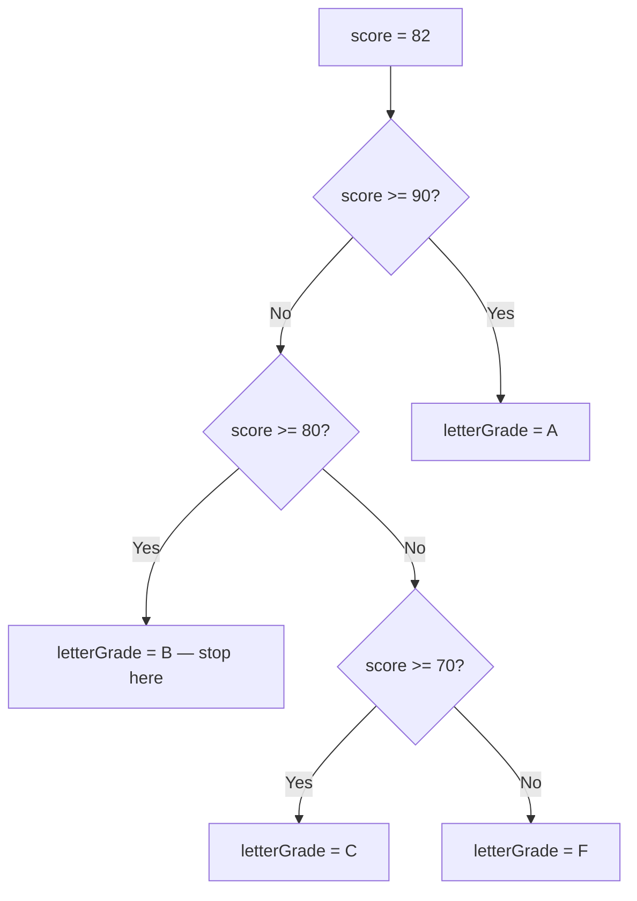
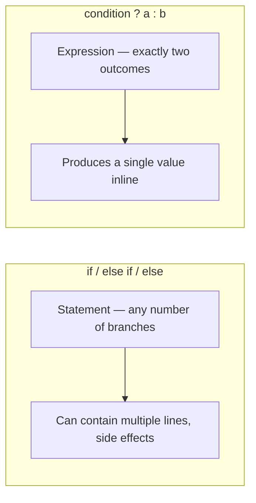

# Decision Making: if/else

## Introduction

Before reading this lesson, you should already be comfortable with **[Type Conversion and Casting](../01-fundamentals/01-08-type-conversion-and-casting.md)** — in particular how comparisons and type tests produce the `bool` values that drive program logic. In this lesson we build directly on that foundation to introduce **decision making**: how C# chooses which block of code actually runs.

By the end of this lesson, you will be able to:

- Write `if`, `else if`, and `else` chains to branch between multiple outcomes
- Use the ternary conditional operator `?:` as a compact expression-form alternative
- Nest conditionals correctly when a decision depends on more than one prior decision
- Recognize and avoid common boolean expression anti-patterns
- Know when a long `if`/`else if` chain is a signal to reach for a different construct

## Decision Making: if/else — A Layman's Perspective

Picture a triage nurse at a busy emergency room front desk. Patients don't get treated in the order they happen to walk in — the nurse runs through a fixed sequence of checks, in a specific priority order, and the very first check that matches decides what happens next. "Is this a cardiac emergency? If so, straight to the trauma bay — nothing else matters, skip every other check." If not, the nurse moves to the next check: "Is this severe bleeding? If so, immediate care." If not, the next: "Is this a broken bone with visible deformity? Urgent care line." And if none of those match, the patient goes to the general waiting room. Crucially, once one of these checks matches, the nurse stops checking — a patient with a broken arm doesn't also get evaluated against the "general waiting room" rule, because the ordering itself guarantees only one outcome applies.

That's exactly the shape of an `if` / `else if` / `else` chain: a sequence of conditions checked top to bottom, where the very first one that's true "wins," and everything below it is skipped entirely — even if a later condition would also have been true.

Sometimes the decision is much smaller and doesn't need a whole triage protocol — it's a single yes/no fork with two clearly known outcomes, like a coffee shop's "for here or to go?" question. There's no need for an elaborate flowchart; you just need a one-line answer to hand off immediately. That's the everyday feel of the **ternary operator**: a compact "if this, then that, otherwise this other thing" packed into a single expression, well suited to simple two-way choices rather than the ER's multi-branch protocol.

And sometimes one decision genuinely depends on another decision already having been made — the ER doctor might first check "is this patient stable?" and, only if the answer is yes, go on to check "does this patient have insurance information on file?" That second question would be meaningless to even ask if the first answer had been "no." That's a **nested conditional**: a decision that only makes sense, and only gets evaluated at all, once an earlier decision has already resolved a certain way.

The bridge back to programming: `if`/`else if`/`else` chains, the ternary operator, and nested conditionals are the tools C# gives you to make exactly this kind of "check things in order, stop at the first match, and only ask follow-up questions when they're relevant" decision-making explicit and precise.

## Decision Making: if/else — A Programming Language Perspective

Formally, the `if` statement evaluates a `bool` expression and executes its associated block only when that expression is `true`. An optional chain of `else if` clauses provides additional, mutually-exclusive conditions evaluated in order — the first one whose condition is `true` executes, and every subsequent `else if`/`else` in the chain is skipped, regardless of whether their conditions would also have evaluated to `true`. A trailing `else` clause, if present, executes when none of the preceding conditions matched. The **ternary conditional operator**, `condition ? whenTrue : whenFalse`, is C#'s only ternary (three-operand) operator and evaluates as a single *expression* rather than a *statement* — it produces a value directly and is best reserved for simple, single-value decisions rather than branching logic with side effects. **Nested conditionals** are simply `if` statements placed inside the block of another `if`, `else if`, or `else`, used when a later decision is only meaningful in the context of an earlier one having already been resolved.

## How to Use if/else in C#

Write a single `if` when you only care about one condition. Chain `else if` clauses when you have several mutually-exclusive possibilities to check in a specific priority order, and end with a plain `else` to catch whatever doesn't match any prior condition. Reach for the ternary operator only when you're assigning or returning one of exactly two simple values — the moment the logic needs more than a single expression per branch, an `if`/`else` block is clearer. Nest conditionals sparingly, and prefer flattening with combined boolean expressions (`&&`, `||`) or early returns when nesting starts going more than two levels deep, since deeply nested conditionals are one of the most common sources of hard-to-follow code.


*Figure 1: An `if`/`else if`/`else` chain checks conditions top to bottom and stops at the first match.*

```csharp
// Program.cs — .NET 10 / C# 14
int score = 82;

string letterGrade;
if (score >= 90)
{
    letterGrade = "A";
}
else if (score >= 80)
{
    letterGrade = "B";
}
else if (score >= 70)
{
    letterGrade = "C";
}
else
{
    letterGrade = "F";
}

string passFail = score >= 60 ? "Pass" : "Fail";

bool isHonorRoll = false;
if (letterGrade == "A")
{
    if (score >= 95)
    {
        isHonorRoll = true;
    }
}

Console.WriteLine($"Score: {score}");
Console.WriteLine($"Letter grade: {letterGrade}");
Console.WriteLine($"Result: {passFail}");
Console.WriteLine($"Honor roll? {isHonorRoll}");
```

**Console Output:**

```text
Score: 82
Letter grade: B
Result: Pass
Honor roll? False
```

Even though `score` (`82`) also satisfies `score >= 70`, that branch never runs — the chain stops the moment `score >= 80` matches. The ternary expression computes `passFail` in a single line because it's a plain two-outcome decision. The nested `if` demonstrates a decision (`isHonorRoll`) that only makes sense once an outer decision (`letterGrade == "A"`) has already been confirmed — here the outer condition is `false`, so the inner check never even runs, and `isHonorRoll` keeps its initial value of `false`.

## Real-Time Example: Decision Making in E-Commerce Order Processing

We continue the recurring **E-Commerce Order Processing** case study, extending the checkout calculation from earlier lessons with the shipping and fulfillment decisions a real order-processing system has to make.

```csharp
// Program.cs — .NET 10 / C# 14 — Real-Time Example: E-Commerce Order Processing
decimal orderTotal = 128.50m;
bool isPrimeMember = true;
int itemsInStock = 3;
int itemsRequested = 5;

string shippingTier;
if (isPrimeMember && orderTotal >= 100m)
{
    shippingTier = "Free 1-Day Shipping";
}
else if (isPrimeMember)
{
    shippingTier = "Free 2-Day Shipping";
}
else if (orderTotal >= 75m)
{
    shippingTier = "Free Standard Shipping";
}
else
{
    shippingTier = "Standard Shipping ($5.99)";
}

string stockStatus;
if (itemsRequested <= itemsInStock)
{
    stockStatus = "Ready to ship in full";
}
else
{
    if (itemsInStock > 0)
    {
        stockStatus = $"Partial shipment now ({itemsInStock} of {itemsRequested}); remainder on backorder";
    }
    else
    {
        stockStatus = "Entire order on backorder";
    }
}

string priorityFlag = orderTotal >= 100m ? "HIGH-VALUE" : "STANDARD";

Console.WriteLine($"Order total:     {orderTotal:C}");
Console.WriteLine($"Shipping tier:   {shippingTier}");
Console.WriteLine($"Stock status:    {stockStatus}");
Console.WriteLine($"Priority flag:   {priorityFlag}");
```

**Console Output:**

```text
Order total:     $128.50
Shipping tier:   Free 1-Day Shipping
Stock status:    Partial shipment now (3 of 5); remainder on backorder
Priority flag:   HIGH-VALUE
```

Notice the shipping-tier chain has four mutually-exclusive outcomes checked in a deliberate priority order — a Prime member spending over $100 should never fall through to the plain "Standard Shipping" branch, so the most valuable condition is checked first. The nested `if` inside the stock-status logic only asks "is there partial stock?" once the outer check has already established the order can't ship in full — exactly the "only ask this follow-up question when it's relevant" pattern from the layman's analogy. This is the everyday decision logic behind an order confirmation page: which shipping promise to show, and whether to warn the customer about a partial shipment, before the order is even placed.

## if/else Chain vs Ternary Operator

An `if`/`else if`/`else` chain and the ternary operator can sometimes produce the same result, but they serve different jobs. The `if` chain is a **statement** — it can contain any number of lines, any number of branches, and side effects like logging or throwing, and it scales cleanly to three, four, or more mutually-exclusive outcomes. The ternary operator is an **expression** — it always produces exactly one value, is restricted to exactly two outcomes, and reads best when each branch is a short, simple value. Stacking multiple ternary operators to simulate an `if`/`else if` chain (`a ? x : b ? y : z`) is legal C# but widely considered poor style, because it sacrifices the chain's clear top-to-bottom readability for a compact one-liner that's easy to misread.


*Figure 2: An `if` chain is a multi-branch statement; the ternary operator is a compact two-outcome expression.*

| Aspect | `if`/`else if`/`else` | Ternary `?:` |
|---|---|---|
| Form | Statement | Expression |
| Number of outcomes | Any number | Exactly two |
| Can contain multiple lines/side effects | Yes | No — must be a single value per branch |
| Best suited for | Multi-branch logic, complex conditions | A single, simple value decision |
| Readability at scale | Stays readable with many branches | Degrades quickly if chained/nested |

## Types of Decision-Making Constructs in C#

Decision making connects to several other topics covered later in the curriculum:

1. **[switch Statements and switch Expressions](../01-fundamentals/01-10-switch-statements-and-expressions.md)** — a more scalable alternative once an `if`/`else if` chain grows past three or four branches on the same variable.
2. **[Operators in C#](../01-fundamentals/01-06-operators-in-csharp.md)** — a refresher on the comparison and logical operators every condition is built from.
3. **[for and foreach Loops](../01-fundamentals/01-11-for-and-foreach-loops.md)** — conditionals frequently combine with loops to skip or stop iterations.
4. **[Tuples, Deconstruction, and Pattern Matching](../01-fundamentals/01-25-tuples-deconstruction-pattern-matching.md)** — pattern-based conditions (`is` patterns) as a richer evolution of simple boolean checks.
5. **[Introduction to Exception Handling](../05-exception-handling/05-01-introduction-to-exception-handling.md)** — the alternative decision-making model used specifically for error conditions.

## What You've Learned & What's Next

You now know how to branch between outcomes with `if`/`else if`/`else` chains, when the ternary operator is the cleaner choice, how nested conditionals model "decisions that depend on other decisions," and why deeply nested or overly clever boolean logic tends to hurt readability.

Continue your learning journey with **[switch Statements and switch Expressions](../01-fundamentals/01-10-switch-statements-and-expressions.md)**, where we look at a more scalable, modern alternative for branching on a single value across many possible cases.

---
*Applies to: .NET 10 / C# 14. Last reviewed 2026-08-16.*
