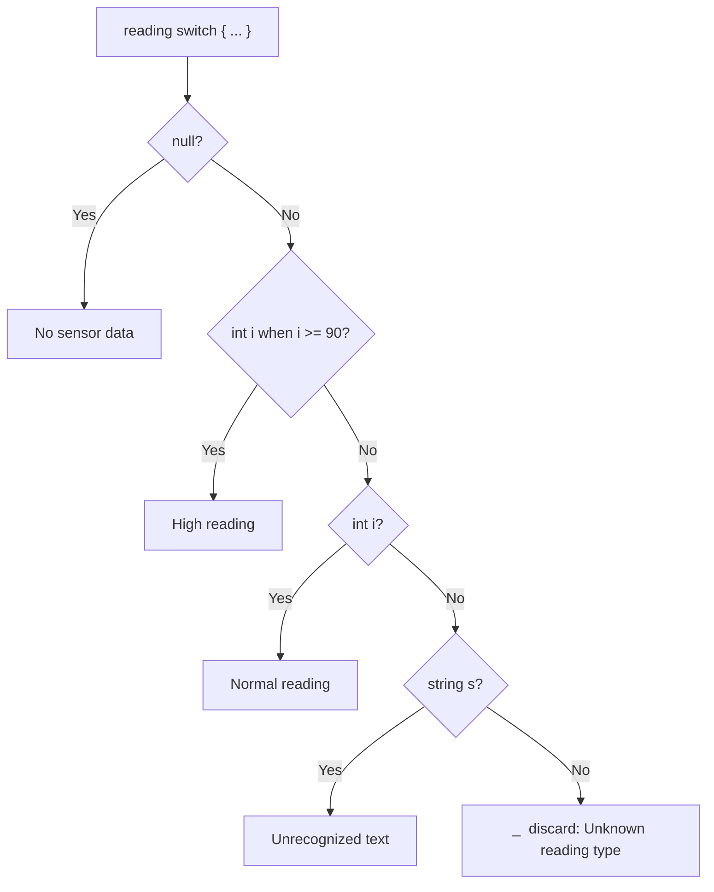
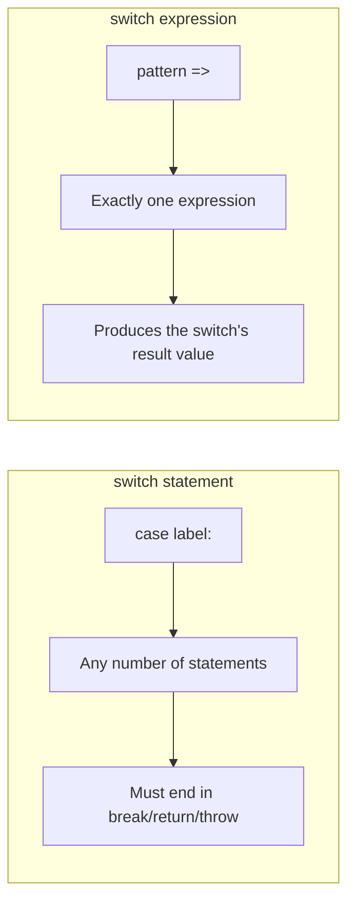

# switch Statements and switch Expressions

## Introduction

Before reading this lesson, you should already be comfortable with **[Decision Making: if/else](../01-fundamentals/01-09-decision-making-if-else.md)** — in particular how a chain of conditions is checked in order until one matches. In this lesson we build directly on that foundation to introduce `switch`: a construct purpose-built for choosing among several outcomes based on a single value.

By the end of this lesson, you will be able to:

- Write a classic `switch` statement with `case` labels, grouped labels, and a `default`
- Write a modern `switch` expression using the `=>` arm syntax
- Use type patterns, relational patterns, and `when` guards inside a `switch`
- Use the discard pattern `_` to handle every remaining case
- Decide when a `switch` expression is the better choice over a `switch` statement — or over an `if`/`else if` chain entirely

## switch Statements and switch Expressions — A Layman's Perspective

Think about the difference between an emergency-room triage nurse and an automated package-sorting facility. The nurse (from the previous lesson) runs through a sequence of independent yes/no questions — "is this a cardiac emergency? Is this severe bleeding?" — each one a fresh judgment call. A sorting facility works differently: a single package rolls down the belt, a scanner reads *one* piece of information off it — its destination ZIP code — and a mechanical arm instantly routes it to the one chute that matches that code. There's no sequence of independent questions; there's one value, compared against a list of known, exact destinations, and the package goes wherever it matches.

That's the classic `switch` **statement**: you hand it one value, it compares that value against a list of specific cases, and whichever case matches gets to run its block of code — while a `default` chute at the end catches anything that didn't match a specific destination. Some destinations even share a chute — mail room clerks often route several nearby ZIP codes to the very same delivery truck, the equivalent of *grouping* several `case` labels to share one block.

Now imagine a newer, smarter sorting robot — one that doesn't just route the package, it also stamps a result label onto it as it goes: "Priority," "Standard," or "Return to Sender," decided the instant it reads the barcode. Instead of the older process of "route it, and *then* separately figure out what label to apply," the newer robot produces the label as part of the very same read-and-route action. That's exactly the shift from a `switch` **statement** (which routes execution to a block of code) to a `switch` **expression** (which directly *produces a value* — the label — as its result). And a truly modern sorting robot doesn't just check exact ZIP codes; it can also recognize the *kind* of package itself — "this parcel is refrigerated" or "this envelope weighs under 20 grams" — routing based on the shape or property of the item, not just an exact matching code. That's what **pattern matching** brings to `switch`: matching on the *kind* or *range* of a value, not only its exact identity.

The bridge back to programming: a `switch` — whether written as the classic statement or the modern expression — is C#'s purpose-built tool for "read one value, and immediately route or compute based on which known case it matches," and it's exactly as central to everyday, current C# as `if`/`else` — not a legacy leftover, but the construct most professional C# codebases reach for the moment a decision has more than two or three outcomes.

## switch Statements and switch Expressions — A Programming Language Perspective

Formally, the classic **`switch` statement** evaluates a governing expression once and transfers control to the first matching `case` label; unlike C or Java, C# does not allow implicit fall-through between non-empty `case` blocks, so each reachable case must end in `break`, `return`, `continue`, or `throw` (though multiple `case` labels may be *stacked* to share one block, as in the analogy's shared delivery truck). Since C# 7, `case` labels support **pattern matching** — including type patterns (`case int i:`) and a `when` guard clause for an additional boolean condition. The **`switch` expression**, introduced in C# 8, is a distinct construct: it is itself an expression that evaluates to a value, using `pattern => result` arms separated by commas, no `break` keyword, and the discard pattern `_` as its catch-all arm. Its arms support the same type and **relational patterns** (`>= 90 => ...`) as the statement form, plus a `when` guard per arm. If no arm matches at runtime and there is no `_` arm, the switch expression throws `System.Runtime.CompilerServices.SwitchExpressionException`. Both forms remain fully current, idiomatic C# — the expression form is simply preferred whenever the goal is "compute a value," while the statement form remains appropriate when each branch needs to run multiple statements or produce side effects.

## How to Use switch in C#

Reach for a classic `switch` statement when each branch needs to execute one or more full statements — assignments, method calls, logging. Stack multiple `case` labels above one block when several values should share identical behavior. Reach for a `switch` expression instead whenever the goal is simply to compute and return a single value from one input — it eliminates the repetitive `case`/`break` boilerplate entirely. Inside either form, a type pattern (`int i`) narrows the matched value's type, a relational pattern (`>= 90`) tests numeric ranges directly, and a `when` guard adds an extra condition on top of a matched pattern. Order arms from most specific to least specific, and always end with `_` (or `default`) so an unexpected value has somewhere safe to land.


*Figure 1: A switch expression tests its arms top to bottom and stops at the first match — the discard `_` arm catches everything else.*

```csharp
// Program.cs — .NET 10 / C# 14
int dayNumber = 6;

string dayType;
switch (dayNumber)
{
    case 1:
    case 2:
    case 3:
    case 4:
    case 5:
        dayType = "Weekday";
        break;
    case 6:
    case 7:
        dayType = "Weekend";
        break;
    default:
        dayType = "Invalid day number";
        break;
}
Console.WriteLine($"Day {dayNumber} is a: {dayType}");

int temperature = 97;
string tempCategory = temperature switch
{
    >= 90 => "High",
    < 32 => "Freezing",
    _ => "Normal"
};
Console.WriteLine($"Temperature {temperature}°F is: {tempCategory}");

object reading = "N/A";
string readingSummary = reading switch
{
    null => "No sensor data",
    int i when i >= 90 => $"High reading: {i}",
    int i => $"Normal reading: {i}",
    string s => $"Unrecognized text: {s}",
    _ => "Unknown reading type"
};
Console.WriteLine($"Reading summary: {readingSummary}");
```

**Console Output:**

```text
Day 6 is a: Weekend
Temperature 97°F is: High
Reading summary: Unrecognized text: N/A
```

The classic `switch` statement groups `case 6` and `case 7` under the same `"Weekend"` block — a direct example of stacked labels sharing behavior. The first `switch` expression uses pure relational patterns to classify a temperature with no `if`s at all. The second demonstrates the discard `_` alongside type patterns and a `when` guard: `reading` holds a `string`, so it skips the `null` arm and both `int` arms (which fail the type test entirely) before matching `string s`.

## Real-Time Example: switch Expressions in Banking/ATM

We continue the recurring **Banking/ATM** case study, building on the `Balance` type from the operator overloading lesson. Here a `switch` expression drives two real ATM decisions: the transaction fee to charge, and a fraud/compliance risk flag based on the transaction amount.

```csharp
// Program.cs — .NET 10 / C# 14 — Real-Time Example: Banking/ATM
string transactionType = "Withdrawal";
decimal amount = 425.00m;
bool isPremiumAccount = false;

decimal fee = transactionType switch
{
    "Withdrawal" when isPremiumAccount => 0.00m,
    "Withdrawal" when amount > 500m => 3.50m,
    "Withdrawal" => 1.50m,
    "Transfer" when isPremiumAccount => 0.00m,
    "Transfer" => 0.75m,
    "Deposit" => 0.00m,
    "BillPay" => 0.99m,
    _ => throw new ArgumentException($"Unknown transaction type: {transactionType}")
};

string riskFlag = amount switch
{
    >= 10000m => "COMPLIANCE REVIEW",
    >= 1000m => "MANAGER APPROVAL",
    _ => "AUTO-APPROVED"
};

Console.WriteLine($"Transaction:  {transactionType}");
Console.WriteLine($"Amount:       {amount:C}");
Console.WriteLine($"Fee charged:  {fee:C}");
Console.WriteLine($"Risk flag:    {riskFlag}");
```

**Console Output:**

```text
Transaction:  Withdrawal
Amount:       $425.00
Fee charged:  $1.50
Risk flag:    AUTO-APPROVED
```

Notice the fee logic checks `"Withdrawal" when isPremiumAccount` first — even though `transactionType` matches `"Withdrawal"` on every arm below it too, the `when` guard means only the first arm whose *guard also* passes actually wins. Since `isPremiumAccount` is `false` and `amount` isn't over `500m`, execution falls through to the plain `"Withdrawal"` arm. The final `_ => throw ...` arm is a **throw expression** — a legal switch expression arm that guarantees every unrecognized transaction type fails loudly rather than silently charging the wrong fee, exactly the kind of defensive completeness a real banking system needs around money-moving logic.

## switch Statement vs switch Expression

A `switch` statement and a `switch` expression can often express the same decision, but they're built for different jobs. The statement form transfers control to a block of code — it can contain any number of lines, loops, or side effects per case, but requires explicit `break` (or another jump statement) on every reachable branch. The expression form instead evaluates directly to a value — every arm is a single expression, there's no `break` to remember, and the compiler actively warns you if the arms aren't exhaustive (a missing case surfaces as a build warning, and an unmatched value at runtime throws `SwitchExpressionException` rather than silently doing nothing). In modern C#, the expression form is generally preferred for "compute a value from one input" logic, with the statement form reserved for branches that genuinely need to run multiple actions.


*Figure 2: The statement form routes execution; the expression form produces a value directly.*

| Aspect | `switch` Statement | `switch` Expression |
|---|---|---|
| Produces a value directly | No — assigns/acts inside each case | Yes — the whole construct evaluates to a value |
| Syntax per branch | `case pattern:` ... `break;` | `pattern => expression` |
| Fall-through | Disallowed between non-empty blocks; labels can be stacked | Not applicable — each arm is one expression |
| Missing-case behavior | Silently does nothing without a `default` | Compiler warning; throws `SwitchExpressionException` at runtime if unmatched |
| Best suited for | Branches with multiple statements or side effects | Computing a single value from one input |

## Types of switch-Related Constructs in C#

`switch` connects to several other pattern-matching and control-flow topics covered later in the curriculum:

1. **[Tuples, Deconstruction, and Pattern Matching](../01-fundamentals/01-25-tuples-deconstruction-pattern-matching.md)** — tuple patterns, list patterns, and property patterns extend everything shown in this lesson.
2. **[Enums in C#](../01-fundamentals/01-24-enums-in-csharp.md)** — switching over enum values is one of the most common real-world uses of `switch`.
3. **[for and foreach Loops](../01-fundamentals/01-11-for-and-foreach-loops.md)** — `switch` statements frequently appear inside a loop body to handle each iterated item.
4. **[Exception Filters (when clause)](../05-exception-handling/05-05-exception-filters-when-clause.md)** — the same `when` guard keyword reappears filtering `catch` clauses.
5. **[Records in C# (record class)](../02-oop/02-19-records-in-csharp.md)** — records pair naturally with property patterns in switch expressions.
6. **[Decision Making: if/else](../01-fundamentals/01-09-decision-making-if-else.md)** — revisit this to compare when a short `if`/`else if` chain is still the simpler choice.

## What You've Learned & What's Next

You now know both forms of `switch` — the classic statement that routes execution to a block, and the modern expression that directly produces a value — along with type patterns, relational patterns, `when` guards, and the discard arm `_`. Far from a legacy construct, the `switch` expression is core, idiomatic modern C# style, reached for constantly in current production codebases.

Continue your learning journey with **[for and foreach Loops](../01-fundamentals/01-11-for-and-foreach-loops.md)**, where we start repeating actions instead of just choosing between them.

---
*Applies to: .NET 10 / C# 14. Last reviewed 2026-08-16.*
