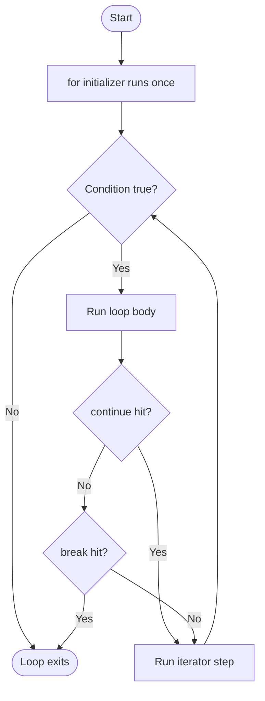
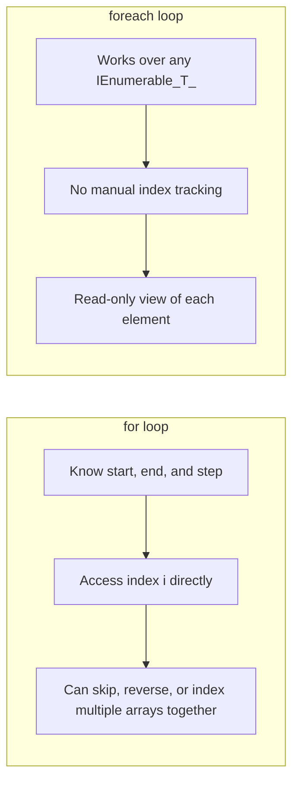

# for and foreach Loops

## Introduction

Before reading this lesson, you should already be comfortable with **[switch Statements and switch Expressions](../01-fundamentals/01-10-switch-statements-and-expressions.md)** — deciding *which* branch of code runs based on a value. This lesson introduces the other half of control flow: deciding how many times a block of code runs, and over what. That's the job of loops, and `for` and `foreach` are the two you'll reach for most often in C#.

By the end of this lesson, you will be able to:

- Write a `for` loop using its initializer, condition, and iterator sections correctly
- Iterate over any collection with `foreach` and explain what it's actually doing under the hood
- Use `break` to exit a loop early and `continue` to skip the rest of the current iteration
- Explain the scope of a loop variable declared inside a `for` or `foreach` header
- Decide whether `for` or `foreach` is the better fit for a given situation

## for and foreach Loops — A Layman's Perspective

Picture two different ways of delivering mail. In the first, you're a mail carrier who's been told: "Start at house number 1, keep going as long as the house number is 20 or less, and after every house, move to the next number." You know exactly how many houses there are, you know the exact order, and you could just as easily start at house 20 and count backward, or only visit every second house. You're in complete control of the counting.

In the second scenario, someone hands you a stack of envelopes that are already sorted and addressed. Your instructions are simply: "Deliver these, one at a time, in the order you were given them, until the stack is empty." You don't know or care how many envelopes there are in advance, and you're not tracking a house number — you just take the next envelope off the stack each time. If the stack were a shortened one tomorrow, or a completely different neighborhood's mail, your instructions wouldn't need to change at all.

Both mail carriers get every piece of mail delivered, but they work differently. The first carrier is doing the equivalent of a `for` loop — someone has defined a starting point, a stopping condition, and a rule for moving forward, and the carrier is in charge of that counting logic themselves. The second carrier is doing the equivalent of a `foreach` loop — handed a ready-made sequence, and simply asked to process "the next one" until there isn't a next one.

Now imagine two special instructions a supervisor might radio in mid-round. "If you get to 145 Elm Street and the gate's locked, don't bother with that one, just move on to the next house" — that's `continue`: skip the rest of what you'd normally do for this item, but keep going with the round. Or: "If you see a hazard sign at any house, stop your entire round right now and come back to base" — that's `break`: abandon the rest of the round altogether, not just the current house.

One more subtlety matters here. Once each mail carrier finishes a house or an envelope, that specific house number or envelope is gone — you can't reach back and re-examine "the third house" once you've moved past it using just the counter or the stack instruction alone; you'd need to write down its address separately if you wanted to remember it later. This maps directly onto a rule in C#: the loop variable (the house number, or "the current envelope") only exists and is meaningful while the loop is running that particular iteration.

The bridge back to programming: a `for` loop is what you write when *you* need to control the counting — the start, the stop, and the step. A `foreach` loop is what you write when you already have a sequence of things and simply want each one in turn, without managing an index yourself.

## for and foreach Loops — A Programming Language Perspective

The `for` statement has the form `for (initializer; condition; iterator) statement;`. The initializer runs once, before the first iteration (typically declaring a counter, e.g. `int i = 0`). Before *every* iteration, including the first, the condition is evaluated; if `false`, the loop ends without running the body. After every iteration, the iterator expression runs (typically `i++`), and then the condition is checked again. Any of the three sections may be empty, and multiple statements can appear in the initializer or iterator separated by commas.

The `foreach` statement, `foreach (T item in source) statement;`, is compiler-generated sugar over an enumerator pattern: the compiler calls `source.GetEnumerator()`, then repeatedly calls `MoveNext()` and reads `Current` until `MoveNext()` returns `false`, disposing the enumerator afterward. This works for anything implementing `IEnumerable<T>` (or even just exposing a compatible `GetEnumerator()` method by convention — a "duck-typed" pattern the compiler recognizes without requiring the interface). `break` immediately exits the nearest enclosing loop (or `switch`); `continue` skips to the iterator step (`for`) or the next `MoveNext()` call (`foreach`).

## How to Use for and foreach Loops in C#

A `for` loop is written as three semicolon-separated clauses inside the parentheses, followed by a body in braces. The counter variable you declare in the initializer is scoped to the loop itself — it doesn't exist before or after it. A `foreach` loop declares a read-only iteration variable that's automatically typed to match the element type of the source sequence (or you can state the type explicitly). Both loop kinds accept `break` and `continue` anywhere inside their body, including inside nested `if` statements.


*Figure 1: The lifecycle of a for loop, including where continue and break divert control flow.*

```csharp
// Program.cs — .NET 10 / C# 14
string[] fruits = ["apple", "banana", "cherry", "date", "elderberry"];

Console.WriteLine("-- for loop: squares 1 to 5 --");
for (int i = 1; i <= 5; i++)
{
    Console.WriteLine($"{i} squared is {i * i}");
}

Console.WriteLine("-- foreach with continue and break --");
foreach (string fruit in fruits)
{
    if (fruit == "banana")
    {
        continue; // skip banana entirely, move to the next fruit
    }

    if (fruit == "date")
    {
        Console.WriteLine("Reached 'date' — stopping early.");
        break; // abandon the rest of the sequence
    }

    Console.WriteLine($"Processing: {fruit}");
}
```

**Console Output:**

```text
-- for loop: squares 1 to 5 --
1 squared is 1
2 squared is 4
3 squared is 9
4 squared is 16
5 squared is 25
-- foreach with continue and break --
Processing: apple
Processing: cherry
Reached 'date' — stopping early.
```

Notice that `banana` never gets a "Processing" line at all — `continue` skipped straight past it without printing anything. `elderberry` never appears either, but for a different reason: `break` terminated the entire loop the moment `date` was reached, so nothing after it ever runs. This distinction — "skip this one item" versus "stop the whole loop" — is the core difference between the two keywords, and it applies identically inside a `for` loop.

## Real-Time Example: for and foreach Loops in E-Commerce Order Processing

We continue building on the E-Commerce Order Processing case study introduced in the orientation module. At this stage in the curriculum we haven't yet covered classes, so the order's line items are represented with parallel arrays — a product name, its unit price, the quantity requested, and the stock currently on hand — one array per attribute, aligned by index. (Once the OOP module introduces classes, this same scenario returns using a proper `Order` and `OrderItem` type, but the looping logic you're learning here doesn't change at all.)

The scenario: a checkout process needs to walk through every line item of an order, skip any item the customer removed before checkout (quantity of zero), stop the whole order immediately if an item is out of stock (since that needs manual review before the order can be charged), and otherwise total up the subtotal as it goes.

```csharp
// Program.cs — .NET 10 / C# 14 — Real-Time Example
string[] productNames = ["Wireless Mouse", "Webcam", "Mechanical Keyboard", "USB-C Hub", "Monitor Stand"];
decimal[] unitPrices = [24.99m, 59.99m, 89.50m, 34.00m, 42.75m];
int[] quantities = [2, 0, 1, 3, 1];
int[] stockOnHand = [15, 5, 0, 8, 20];

Console.WriteLine("=== Order #10482 — Line Item Processing ===");

decimal orderSubtotal = 0m;
for (int i = 0; i < productNames.Length; i++)
{
    if (quantities[i] == 0)
    {
        continue; // customer removed this item before checkout
    }

    if (stockOnHand[i] < quantities[i])
    {
        Console.WriteLine($"Out of stock: {productNames[i]} — order cannot proceed further.");
        break; // stop processing; this order needs manual review
    }

    decimal lineTotal = unitPrices[i] * quantities[i];
    orderSubtotal += lineTotal;
    Console.WriteLine($"{productNames[i]} x{quantities[i]} = ${lineTotal:F2}");
}

Console.WriteLine($"Subtotal so far: ${orderSubtotal:F2}");

Console.WriteLine();
Console.WriteLine("=== Full Product Listing (foreach) ===");
foreach (string name in productNames)
{
    Console.WriteLine($"- {name}");
}
```

**Console Output:**

```text
=== Order #10482 — Line Item Processing ===
Wireless Mouse x2 = $49.98
Out of stock: Mechanical Keyboard — order cannot proceed further.
Subtotal so far: $49.98

=== Full Product Listing (foreach) ===
- Wireless Mouse
- Webcam
- Mechanical Keyboard
- USB-C Hub
- Monitor Stand
```

The `for` loop's index-based access is what makes this possible: at each position `i`, the code cross-references four separate arrays at once, something a plain `foreach` over a single array couldn't do without an extra counter of its own. `continue` quietly dropped the Webcam (quantity zero) without printing anything, and `break` halted the whole order the moment it hit an insufficient-stock item, leaving USB-C Hub and Monitor Stand unprocessed — exactly the behavior a real checkout pipeline needs before it can safely charge a card. The second `foreach` loop, by contrast, has nothing to compute — it just needs "every product name," so it doesn't bother with an index at all.

## for vs foreach

The two loops solve overlapping but distinct problems. `for` gives you the index, which means you can skip forward by more than one, walk backward, touch two collections in lockstep by position, or modify elements in place through their index. `foreach` gives up that index entirely in exchange for readability and safety: it works on *anything* enumerable — arrays, `List<T>`, `Dictionary<TKey,TValue>`, database query results, file lines — without you needing to know how that source is internally structured, and it prevents a whole class of off-by-one bugs since there's no counter to get wrong.

The trade-off cuts both ways. Because `foreach` doesn't expose an index, you can't use it to modify an array's elements directly through the loop variable (the iteration variable is read-only), and you can't easily reverse direction or skip by a custom step. `for` can do both, at the cost of you having to get the bounds right yourself.


*Figure 2: for trades simplicity for index control; foreach trades index control for simplicity and generality.*

| Aspect | for | foreach |
|---|---|---|
| Index access | Yes — you control `i` directly | No — no index is exposed |
| Works on | Anything with `Length`/`Count` and an indexer | Anything implementing `IEnumerable<T>` |
| Direction | Forward, backward, or custom step | Forward only, one item at a time |
| Modifying elements | Yes, via `array[i] = ...` | No — the iteration variable is read-only |
| Typical use case | Numeric ranges, parallel arrays, in-place edits | "Do this for every item," collections of any kind |

## Types of Loop Constructs in C#

`for` and `foreach` are the two loop constructs this lesson covers, but they're part of a larger family you'll build on throughout this module and the next:

1. **[while and do-while Loops](../01-fundamentals/01-12-while-and-do-while-loops.md)** — for when you don't know the number of iterations up front and instead loop until a condition changes.
2. **[One-Dimensional Arrays](../01-fundamentals/01-13-one-dimensional-arrays.md)** — the most common collection type you'll iterate with both `for` and `foreach`.
3. **[Multidimensional and Jagged Arrays](../01-fundamentals/01-14-multidimensional-and-jagged-arrays.md)** — nested `for` loops, one per dimension, for grid-shaped data.
4. **Nested loops** — a `for` or `foreach` loop inside another, used constantly once you're working with grids, tables, or one-to-many relationships.
5. **`foreach` with an index** — via `list.Index()` from `System.Linq`, giving you `(index, value)` pairs without hand-rolling a counter, for the rare case where `foreach` needs positional awareness too.

## What You've Learned & What's Next

`for` puts you in charge of the counting — start, stop, and step — which makes it the right tool when you need an index or want to control iteration precisely. `foreach` hands that control to the compiler in exchange for simplicity, working over any `IEnumerable<T>` source without you tracking a counter at all. `break` exits a loop entirely; `continue` only skips the current iteration.

Continue your learning journey with **[while and do-while Loops](../01-fundamentals/01-12-while-and-do-while-loops.md)**, where we cover the two loop constructs built for situations where you don't know the iteration count ahead of time.

---
*Applies to: .NET 10 / C# 14. Last reviewed 2026-08-16.*
