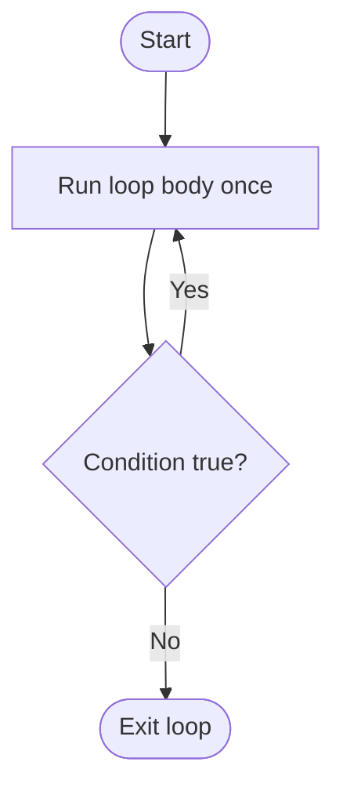
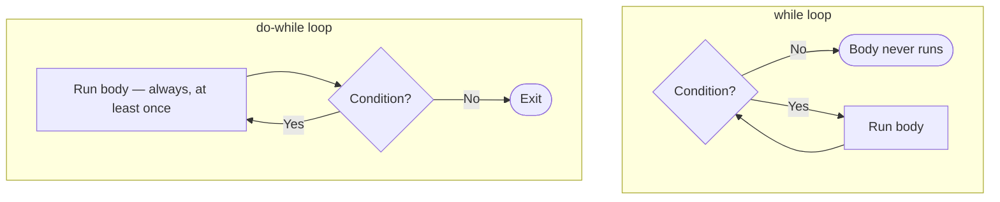

# while and do-while Loops

## Introduction

Before reading this lesson, you should already be comfortable with **[for and foreach Loops](../01-fundamentals/01-11-for-and-foreach-loops.md)** — looping a known number of times, or once per item in a sequence. This lesson covers the other major looping shape in C#: repeating a block of code based purely on a condition, with no built-in counter at all. That's `while` and its close relative, `do-while`.

By the end of this lesson, you will be able to:

- Explain the difference between `while`'s condition-checked-before-the-body and `do-while`'s condition-checked-after-the-body execution
- Write a `do-while` loop that is guaranteed to run its body at least once
- Build a safe `while (true)` infinite loop with an explicit `break` exit condition
- Recognize the most common cause of an accidental infinite loop
- Choose between `for`, `while`, and `do-while` for a given problem

## while and do-while Loops — A Layman's Perspective

Think about the difference between a bouncer at a club's entrance and a free-sample table at a grocery store. The bouncer checks your ID *before* letting you take a single step inside — if you're not on the list, you never get in at all, not even for a second. That's a `while` loop: the condition is checked first, and if it's already false, the body never runs, not even once.

The sample table works differently. You walk up, and you're handed a small cup of the new soup to try — that always happens, unconditionally, the very first time. *Only after* you've tasted it does anyone ask, "Would you like another sample?" If you say yes, you get another cup, and the question is asked again after that one too. If you say no, you stop. But notice: you always got at least one sample, even if you were going to say "no" from the very start. That's a `do-while` loop — the body runs once unconditionally, and only *after* that first run does the condition get checked to decide whether to repeat.

This distinction matters more than it sounds. Imagine a queue at a bank that's currently closed — a security guard checking "is the bank open?" before letting the first customer in behaves like `while`: if it's already closed, nobody gets in, ever, not even to peek. But a fire alarm test that says "evacuate the building once, then check if the alarm is still sounding before doing anything else" behaves like `do-while` — the evacuation happens unconditionally the first time, no matter what the alarm status was at the very start.

There's a third pattern worth knowing: a loop with no condition at all, just a standing instruction like "keep restocking the shelf until someone tells you to stop for the day." Nobody wrote down in advance exactly when to stop — the stopping decision gets made *during* the work itself, based on something the worker notices along the way (a supervisor's signal, a specific item running out). In code, this is `while (true)` paired with an explicit "stop" instruction buried somewhere inside the loop's body — an intentional, controlled infinite loop, not a bug.

The bridge back to programming: `while` is for "keep going as long as this is still true, but maybe it's already false" situations. `do-while` is for "always do this once, then decide whether to repeat" situations — anything that has a natural first attempt before a retry decision, like asking for a password, drawing a menu, or trying a PIN.

## while and do-while Loops — A Programming Language Perspective

`while (condition) statement;` evaluates `condition` before every iteration, including the first. If `condition` is `false` immediately, the body executes zero times. `do statement while (condition);` evaluates the body first and *then* checks `condition`, guaranteeing at least one execution regardless of the condition's initial value — note the required trailing semicolon after the `while (condition)` clause, which `for` and plain `while` do not have.

Both are general-purpose, condition-controlled loops without the built-in counter machinery a `for` loop provides; any `for` loop can be rewritten as a `while` loop by moving the initializer before the loop and the iterator to the end of the body, though `for` remains more idiomatic when a counter is central to the logic. `while (true)` combined with an internal `break` is the idiomatic way to express "loop until some condition discovered *during* the body is met" — common in retry logic, menu-driven console programs, and any scenario where the exit condition can't cleanly be expressed as a single upfront boolean check.

## How to Use while and do-while Loops in C#

A `while` loop's condition sits in parentheses immediately after the keyword and is checked before the body runs, every time. A `do-while` loop reverses the order textually: the body comes first in a `do { }` block, followed by `while (condition);` — and that trailing semicolon is easy to forget. Both accept `break` and `continue` exactly like `for` and `foreach` do.


*Figure 1: A do-while loop always executes its body at least once, only checking the condition afterward.*

```csharp
// Program.cs — .NET 10 / C# 14
int attempt = 0;
int[] pinAttempts = [4821, 1111, 7734]; // simulated user entries; correct PIN is 7734
const int correctPin = 7734;
bool authorized = false;

do
{
    int entered = pinAttempts[attempt];
    attempt++;
    Console.WriteLine($"Attempt {attempt}: entered {entered}");

    if (entered == correctPin)
    {
        authorized = true;
        Console.WriteLine("PIN accepted.");
        break;
    }

    Console.WriteLine("Incorrect PIN.");
} while (attempt < pinAttempts.Length && !authorized);

Console.WriteLine(authorized ? "Access granted." : "Access denied — too many attempts.");

Console.WriteLine();
Console.WriteLine("-- while loop: draining a queue of pending notifications --");
Queue<string> notifications = new Queue<string>(["Low balance warning", "New statement ready", "Card expiring soon"]);

while (notifications.Count > 0)
{
    string next = notifications.Dequeue();
    Console.WriteLine($"Notify: {next}");
}

Console.WriteLine("No notifications remain.");
```

**Console Output:**

```text
Attempt 1: entered 4821
Incorrect PIN.
Attempt 2: entered 1111
Incorrect PIN.
Attempt 3: entered 7734
PIN accepted.
Access granted.

-- while loop: draining a queue of pending notifications --
Notify: Low balance warning
Notify: New statement ready
Notify: Card expiring soon
No notifications remain.
```

The `do-while` loop above always makes at least one attempt, which is exactly right for PIN entry — there's no scenario where you'd check "has the PIN already been entered correctly?" before the user has entered anything at all. The `while` loop afterward is a better fit for draining the queue: if `notifications` had started out empty, the condition `notifications.Count > 0` would already be `false`, and the body would correctly never run — printing straight to "No notifications remain" with no notifications ever dequeued. That's the behavior a `do-while` loop could not give you here.

## Real-Time Example: while and do-while Loops in Banking/ATM

We continue building on the Banking/ATM case study. A real ATM session processes a sequence of requests against an account balance until the customer chooses to end the session — a natural fit for a `while` loop, since the very first "request" in the queue might already be an exit signal, in which case nothing should be processed at all.

The scenario below simulates a single ATM session: a starting balance, and a queue of transaction requests arriving one after another, each either a withdrawal, a deposit, or the sentinel value `"exit"` that ends the session. A `while` loop reads and processes requests only as long as the current one isn't the exit signal.

```csharp
// Program.cs — .NET 10 / C# 14 — Real-Time Example
decimal balance = 500.00m;
string[] requestedTransactions = ["withdraw:150", "withdraw:400", "deposit:200", "withdraw:100", "exit"];
int index = 0;

Console.WriteLine($"Starting balance: ${balance:F2}");
Console.WriteLine();

while (requestedTransactions[index] != "exit")
{
    string[] parts = requestedTransactions[index].Split(':');
    string action = parts[0];
    decimal amount = decimal.Parse(parts[1]);

    if (action == "withdraw")
    {
        if (amount > balance)
        {
            Console.WriteLine($"Withdraw ${amount:F2} declined — insufficient funds (balance ${balance:F2}).");
        }
        else
        {
            balance -= amount;
            Console.WriteLine($"Withdrew ${amount:F2}. New balance: ${balance:F2}");
        }
    }
    else if (action == "deposit")
    {
        balance += amount;
        Console.WriteLine($"Deposited ${amount:F2}. New balance: ${balance:F2}");
    }

    index++;
}

Console.WriteLine();
Console.WriteLine($"Session ended. Final balance: ${balance:F2}");
```

**Console Output:**

```text
Starting balance: $500.00

Withdrew $150.00. New balance: $350.00
Withdraw $400.00 declined — insufficient funds (balance $350.00).
Deposited $200.00. New balance: $550.00
Withdrew $100.00. New balance: $450.00

Session ended. Final balance: $450.00
```

The insufficient-funds check protects the account from ever going negative, and the loop's condition — checked *before* every single request, including the very first one — means a session whose first request was already `"exit"` would correctly process zero transactions and report the starting balance unchanged. That upfront check is precisely why `while`, not `do-while`, is the right shape for a session loop: an ATM must never assume there's at least one transaction to process just because a session began.

## while vs do-while

Both loops repeat a body based on a condition, and both accept `break` and `continue`, but they disagree about *when* that condition gets checked relative to the first run of the body. `while` checks first, so it can execute the body zero times — appropriate whenever "maybe there's nothing to do at all" is a real possibility, like an empty queue or a session that starts with an exit request. `do-while` checks after, guaranteeing at least one execution — appropriate whenever the very act of running the body once is unconditionally required before any decision can be made, like a PIN prompt, a menu display, or a single retry attempt.

Choosing the wrong one is a subtle bug generator: using `do-while` where `while` was needed causes a body to run once even when it logically shouldn't; using `while` where `do-while` was needed can force you to duplicate the first call to the body outside the loop just to guarantee it happens.


*Figure 2: while checks the condition before the first iteration; do-while checks it only after.*

| Aspect | while | do-while |
|---|---|---|
| Condition checked | Before every iteration, including the first | After every iteration |
| Minimum executions | Zero | One |
| Trailing semicolon | Not required | Required, after `while (condition);` |
| Typical use case | Draining a queue, processing input that might already be empty | PIN/password prompts, "at least once" retries, menu loops |

## Types of Condition-Controlled Loops in C#

`while` and `do-while` are the two condition-checked loop forms; here's how they relate to the rest of the loop family:

1. **[for and foreach Loops](../01-fundamentals/01-11-for-and-foreach-loops.md)** — the counter-driven and sequence-driven alternatives covered in the previous lesson.
2. **`while (true)` with an internal `break`** — the idiomatic "loop until something discovered inside the body says stop" pattern, common in retry and menu logic.
3. **Nested while loops** — a `while` or `do-while` inside another, for repeated sub-processes within a larger repeating process.
4. **[One-Dimensional Arrays](../01-fundamentals/01-13-one-dimensional-arrays.md)** — a common data source that `while` loops drain or walk through via a manually tracked index.
5. **Sentinel-controlled loops** — looping until a specific "stop" value appears in the data itself (as with `"exit"` in this lesson's real-time example), rather than a simple numeric condition.

## What You've Learned & What's Next

`while` checks its condition before every iteration and may run zero times; `do-while` checks after every iteration and always runs at least once. Reach for `while` whenever "there might be nothing to process" is a genuine possibility, and `do-while` whenever the first attempt is unconditional and only the *repeat* is up for debate.

Continue your learning journey with **[One-Dimensional Arrays](../01-fundamentals/01-13-one-dimensional-arrays.md)**, where we cover the fixed-size collections that loops most often iterate over.

---
*Applies to: .NET 10 / C# 14. Last reviewed 2026-08-16.*
