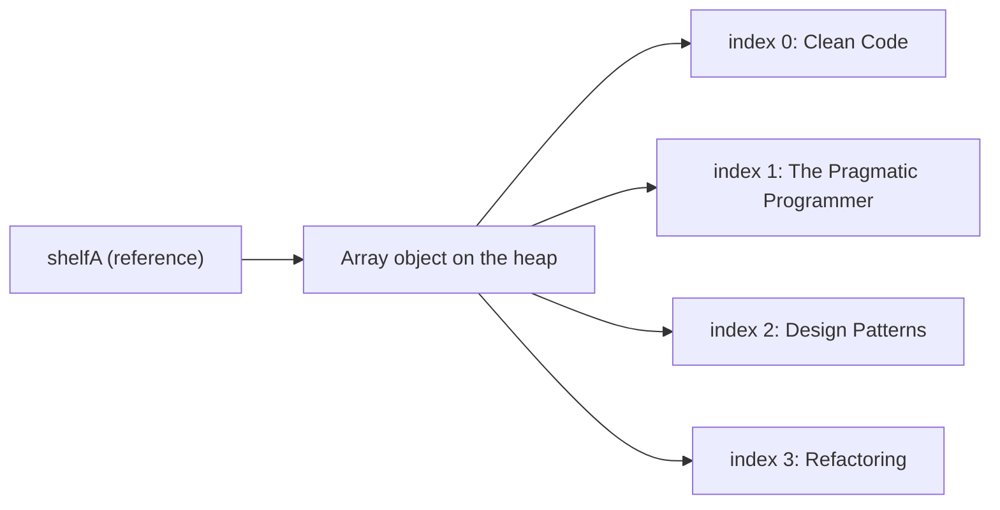
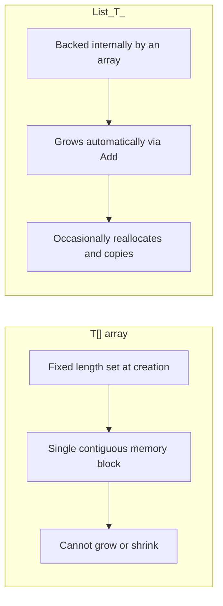

# One-Dimensional Arrays

## Introduction

Before reading this lesson, you should already be comfortable with **[while and do-while Loops](../01-fundamentals/01-12-while-and-do-while-loops.md)** — repeating a block of code based on a condition. This lesson introduces the data structure loops most commonly operate on: the array. Once you can hold a fixed collection of values under one name, `for` and `foreach` stop being abstract exercises and start being genuinely useful tools.

By the end of this lesson, you will be able to:

- Declare and initialize a one-dimensional array using both traditional and modern collection-expression syntax
- Access array elements by index, understanding that indexing starts at zero
- Use the `Length` property to iterate safely without hardcoding a size
- Explain why arrays are fixed-size, reference-type objects allocated on the heap
- Iterate an array with both `for` and `foreach`, recognizing when each is the better fit

## One-Dimensional Arrays — A Layman's Perspective

Picture an egg carton — the kind with exactly twelve molded slots in a single row. The moment that carton was manufactured, its slot count was locked in: it will never grow a thirteenth slot, and it will never shrink to eleven, no matter what you put in it or take out. Each slot also has a fixed position — the first slot, the second slot, and so on — and you could label them if you wanted, though most people just count "first, second, third" by their position in the row.

Here's the part that trips people up the first time they meet it in code: in C#, that egg carton's slots are numbered starting from zero, not one. The very first slot is slot 0, the second is slot 1, and the last slot in a twelve-slot carton is slot 11 — not slot 12. If you tried to reach for "slot 12" thinking it meant the twelfth egg, you'd actually be reaching one slot past the end of the carton entirely, into a space that was never molded — and C# will stop you immediately with an error rather than let you grab thin air.

An array behaves exactly like that egg carton. You decide up front how many slots you need — four, ten, a hundred — and that number is fixed for the lifetime of that particular carton. You can absolutely change *what's in* slot 2 (swap out a cracked egg for a fresh one), but you can't make the carton itself hold thirteen eggs; if you need more room, you have to get a whole new, bigger carton and move everything over. This is precisely why arrays are described as "fixed-size" — the size is a property of the carton, decided at creation time, not something you can renegotiate later.

There's one more useful detail: the carton itself has a label on it — "this carton holds 12 eggs" — so that anyone using it can ask "how many slots does this hold?" without literally counting them by hand. That's the array's `Length`. And if you're planning to check every single egg one at a time, you have a choice: you could go by slot number ("check slot 0, then slot 1, then slot 2, ..."), which is what a `for` loop does, or you could simply say "check every egg in this carton, in order, whatever's here" without caring about slot numbers at all — which is what `foreach` does.

The bridge back to programming: an array is a single, named container holding a fixed number of values of the same type, each reachable by a zero-based position, with a built-in `Length` that tells you exactly how many positions exist.

## One-Dimensional Arrays — A Programming Language Perspective

An array in C# is a fixed-size, zero-indexed sequence of elements of a single element type `T`, declared with the syntax `T[] name`. Every array is a reference type derived from the abstract base class `System.Array`, meaning the array variable itself is a reference stored wherever it's declared, while the actual element storage lives on the managed heap as a single contiguous block, allocated once at creation and never resized. Arrays can be created with `new T[n]` (elements default to `0`/`null`/`false` as appropriate), with an explicit initializer `new T[] { a, b, c }`, or — idiomatically since C# 12 and standard practice through C# 14 — with a target-typed collection expression, `T[] name = [a, b, c]`, which the compiler lowers to the equivalent array-creation code. The `Length` property (an `int`) reports the element count in constant time, and out-of-range indexing throws `IndexOutOfRangeException` at run time rather than silently corrupting memory.

## How to Declare and Use One-Dimensional Arrays in C#

Declare an array by writing the element type followed by square brackets, then initialize it either with `new T[size]` for an empty, pre-sized array, or with a collection expression `[v1, v2, ...]` when you already know the values. Access any element with `name[index]`, where `index` is zero-based; assigning to `name[index]` overwrites that slot without changing the array's size. Always use `.Length` rather than a hardcoded number when looping, so the code keeps working if the array's contents change later.


*Figure 1: A variable holds a reference to a single array object; the array itself owns four fixed, indexed slots.*

```csharp
// Program.cs — .NET 10 / C# 14
string[] shelfA = ["Clean Code", "The Pragmatic Programmer", "Design Patterns", "Refactoring"];

Console.WriteLine($"Shelf A holds {shelfA.Length} books.");
Console.WriteLine($"First book: {shelfA[0]}");
Console.WriteLine($"Last book: {shelfA[shelfA.Length - 1]}");

for (int i = 0; i < shelfA.Length; i++)
{
    Console.WriteLine($"[{i}] {shelfA[i]}");
}

shelfA[2] = "Design Patterns (2nd Edition)";
Console.WriteLine($"Updated: {shelfA[2]}");
```

**Console Output:**

```text
Shelf A holds 4 books.
First book: Clean Code
Last book: Refactoring
[0] Clean Code
[1] The Pragmatic Programmer
[2] Design Patterns
[3] Refactoring
Updated: Design Patterns (2nd Edition)
```

`shelfA.Length - 1` is the standard idiom for "the last valid index" — since indexing starts at 0, a 4-element array's valid indices run from 0 to 3, and `Length` itself (4) is always one past the last valid slot. Reassigning `shelfA[2]` changed what's stored *in* that slot without changing `shelfA.Length`, which still reports 4 — a direct consequence of arrays being fixed-size: you can overwrite contents freely, but the number of slots never moves.

## Real-Time Example: One-Dimensional Arrays in Library/Inventory Management

We continue building on the Library/Inventory Management case study. A branch manager wants a week's worth of daily loan counts summarized: the total loans for the week, the daily average, and which single day was busiest — all classic array-processing tasks before you've even reached for LINQ.

Two parallel arrays represent the data: the day names, and the number of books loaned out that day. A `for` loop walks both arrays together by index, accumulating a running total and tracking the busiest day seen so far, while also flagging any day that met or exceeded the branch's daily processing capacity.

```csharp
// Program.cs — .NET 10 / C# 14 — Real-Time Example
string[] daysOfWeek = ["Mon", "Tue", "Wed", "Thu", "Fri", "Sat", "Sun"];
int[] booksLoanedOut = [12, 9, 15, 7, 20, 25, 11];
const int dailyCapacity = 20;

int totalLoans = 0;
int busiestDayIndex = 0;

for (int i = 0; i < booksLoanedOut.Length; i++)
{
    totalLoans += booksLoanedOut[i];

    if (booksLoanedOut[i] > booksLoanedOut[busiestDayIndex])
    {
        busiestDayIndex = i;
    }

    string status = booksLoanedOut[i] >= dailyCapacity ? " (at/over capacity!)" : "";
    Console.WriteLine($"{daysOfWeek[i]}: {booksLoanedOut[i]} loans{status}");
}

double averageLoans = (double)totalLoans / booksLoanedOut.Length;

Console.WriteLine();
Console.WriteLine($"Total loans this week: {totalLoans}");
Console.WriteLine($"Average loans/day: {averageLoans:F1}");
Console.WriteLine($"Busiest day: {daysOfWeek[busiestDayIndex]} with {booksLoanedOut[busiestDayIndex]} loans");
```

**Console Output:**

```text
Mon: 12 loans
Tue: 9 loans
Wed: 15 loans
Thu: 7 loans
Fri: 20 loans (at/over capacity!)
Sat: 25 loans (at/over capacity!)
Sun: 11 loans

Total loans this week: 99
Average loans/day: 14.1
Busiest day: Sat with 25 loans
```

Because `daysOfWeek` and `booksLoanedOut` are aligned by position — index 4 means "Friday" in both arrays at once — a single `for` loop can read both in lockstep, something a plain `foreach` over just one of them couldn't do without a separately tracked counter. `busiestDayIndex` is a running "best so far" pattern you'll see constantly: it starts pointing at index 0 and only moves when a strictly larger value appears, so it always ends the loop pointing at the true maximum. This is exactly the kind of small, self-contained reporting logic a real library system runs nightly against its circulation database.

## Array vs List<T>

An array and a `List<T>` both hold an ordered sequence of same-typed values, but they differ in one fundamental way: an array's size is fixed the moment it's created, while `List<T>` can grow or shrink as elements are added or removed. Under the hood, `List<T>` is actually implemented *using* an array — it keeps a backing array with some spare capacity, and when you add more elements than that capacity allows, it silently allocates a new, larger backing array and copies everything over. That extra flexibility comes at a small cost: `List<T>` carries a bit more memory overhead and occasional reallocation work that a plain array never needs to do, since a plain array's slot count is guaranteed never to change.

For now, arrays are the right tool whenever the number of elements is known and fixed up front — a week's worth of days, a fixed-size lookup table, coordinates, and similar cases. `List<T>` becomes the better choice once the number of elements can genuinely change while the program runs, which is covered fully once collections are introduced later in the curriculum.


*Figure 2: List<T> trades an array's fixed size for automatic growth, at the cost of occasional internal reallocation.*

| Aspect | Array (`T[]`) | `List<T>` |
|---|---|---|
| Size | Fixed at creation | Grows/shrinks dynamically |
| Declared with | `T[] name = [...]` | `List<T> name = [...]` |
| Adding elements | Not possible — must create a new array | `Add()`, `AddRange()`, etc. |
| Memory overhead | Minimal — just the elements | Slightly higher — tracks capacity separately from count |
| Typical use case | Known, unchanging element count | Element count changes during the program's run |

## Types of Array-Related Constructs in C#

One-dimensional arrays are the simplest array shape in C#; here's how they connect to related constructs covered elsewhere in this module:

1. **[Multidimensional and Jagged Arrays](../01-fundamentals/01-14-multidimensional-and-jagged-arrays.md)** — true grid-shaped arrays and arrays-of-arrays, for data with more than one dimension.
2. **[Strings in C#](../01-fundamentals/01-15-strings-in-csharp.md)** — a `string` behaves like a read-only array of `char`, complete with an indexer and a `Length` property.
3. **[for and foreach Loops](../01-fundamentals/01-11-for-and-foreach-loops.md)** — the two loop constructs used to walk through an array's elements, covered two lessons back.
4. **`Array` static helper methods** — `Array.Sort`, `Array.Reverse`, and `Array.IndexOf`, built-in operations for common array tasks without writing a manual loop.
5. **Array of `struct` vs array of `class`** — value-type elements are stored inline within the array's memory block, while reference-type elements store only a reference in each slot, with the actual object elsewhere on the heap.
6. Dynamically-sized collections such as `List<T>` — the resizable alternative introduced once the collections module of this curriculum begins.

## What You've Learned & What's Next

An array is a fixed-size, zero-indexed, reference-type container for a known number of same-typed values, created either the traditional way or with the now-idiomatic collection-expression syntax. Its `Length` property and index-based access make it the natural partner for the `for` and `foreach` loops from the previous two lessons.

Continue your learning journey with **[Multidimensional and Jagged Arrays](../01-fundamentals/01-14-multidimensional-and-jagged-arrays.md)**, where we extend this single row of slots into grids and rows of differing lengths.

---
*Applies to: .NET 10 / C# 14. Last reviewed 2026-08-16.*
