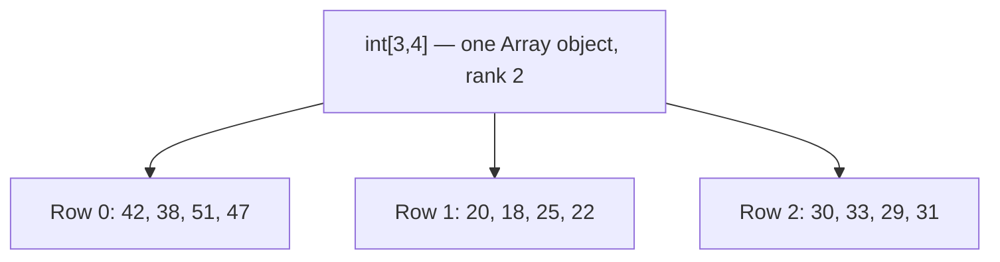
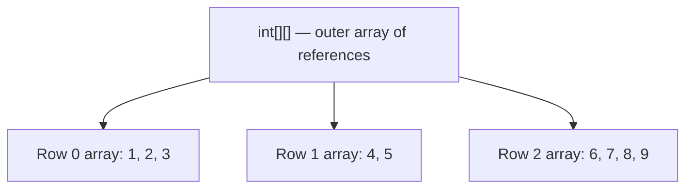

# Multidimensional and Jagged Arrays

## Introduction

Before reading this lesson, you should already be comfortable with **[One-Dimensional Arrays](../01-fundamentals/01-13-one-dimensional-arrays.md)** — a single, fixed-size row of same-typed values reachable by index. This lesson extends that idea in two different directions: a true grid with rows and columns (a "multidimensional" array), and a row of rows where each row is free to have its own length (a "jagged" array). They look similar at first glance but are structured completely differently underneath.

By the end of this lesson, you will be able to:

- Declare and use a rectangular multidimensional array (`int[,]`) with `GetLength`
- Declare and use a jagged array (`int[][]`) where each row is an independently sized array
- Explain the structural difference between a rectangular array and a jagged array
- Iterate a two-dimensional structure using nested loops
- Choose rectangular vs. jagged arrays appropriately for a given data shape
- Avoid the most common pitfalls: confusing `Length` with `GetLength`, and assuming jagged rows are equal length

## Multidimensional and Jagged Arrays — A Layman's Perspective

Picture a muffin tin — the standard kind with, say, three rows of four cups each. Every single row has exactly four cups; there's no way to bake a tin where row one has four cups but row two only has two. The shape is rigid and uniform by construction: it's a fixed grid, and every row is guaranteed the same width as every other row. If you know the tin has 3 rows and 4 columns, you already know there are exactly 12 cups total, and you can find any cup by its row-and-column position alone. This is exactly how a rectangular multidimensional array behaves — one single object, with a fixed number of rows and a fixed number of columns, and every row is the same length as every other row, no exceptions.

Now picture a bookshelf instead — several shelves stacked one above another. Nothing forces every shelf to hold the same number of books. The top shelf might hold three thick hardcovers, the shelf below might hold nine paperbacks, and the bottom shelf might hold just one oversized atlas. Each shelf is really its own independent, self-contained row, and the bookshelf itself is just a way of keeping track of "shelf one, shelf two, shelf three" — a shelf of shelves, if you like, where every individual shelf is free to be whatever length makes sense for what's actually sitting on it. This is a jagged array: not one uniform grid, but an outer array whose slots each point to their own separate inner array, and those inner arrays can be any length at all, independent of each other.

The muffin tin is efficient when your data is naturally, unavoidably rectangular — a chessboard, a spreadsheet region, a photograph's pixel grid — where every row genuinely does have the same number of columns as every other row. The bookshelf is the better model whenever rows are naturally different sizes — a school with different numbers of students in each classroom, a delivery route with a different number of stops on Monday than on Tuesday, or a library member who's checked out a different number of books than the member next to them. Trying to force naturally uneven data into a muffin tin means either padding the short rows with wasted, meaningless empty slots, or the whole thing simply not fitting.

The bridge back to programming: a rectangular multidimensional array (`int[,]`) is one single array object with fixed, uniform dimensions, best suited to data that is genuinely grid-shaped. A jagged array (`int[][]`) is an array of independently-sized arrays, best suited to data where each row's length can legitimately differ from the next.

## Multidimensional and Jagged Arrays — A Programming Language Perspective

A rectangular multidimensional array, declared as `T[,]` for two dimensions (or `T[,,]` for three, and so on), is a single instance of `System.Array` with rank greater than one; its elements are laid out contiguously, and every "row" has exactly the same number of columns by construction — there is no way to construct a ragged rectangular array. Its per-dimension size is retrieved with `GetLength(dimension)`, not `Length` (`Length` on a rectangular array returns the *total* element count across all dimensions, which is rarely what you want when iterating a single dimension).

A jagged array, declared as `T[][]`, is fundamentally different: it is a one-dimensional array whose element type is itself an array (`T[]`), meaning the outer array holds references to independently allocated inner array objects, each with its own, independently set `Length`. Because each inner array is a separate object, jagged arrays can represent genuinely irregular row lengths and can also be initialized lazily, one row at a time, unlike a rectangular array whose full rank and extents must be fixed at creation.

## How to Declare and Use Multidimensional and Jagged Arrays in C#

A rectangular array is declared with a comma inside the brackets — `T[,]` for two dimensions — and initialized with nested braces or a nested collection expression; access an element with `array[row, col]`, and get each dimension's size with `array.GetLength(0)`, `array.GetLength(1)`, and so on. A jagged array is declared with repeated bracket pairs — `T[][]` — and each row is itself a separate array that can be a different length; access an element with `array[row][col]`, and get an individual row's length with `array[row].Length`.


*Figure 1: A rectangular array is a single object; every row is guaranteed the same length.*

```csharp
// Program.cs — .NET 10 / C# 14
int[,] visitorsByBranchAndDay = new int[3, 4]
{
    { 42, 38, 51, 47 },   // Downtown branch, Mon-Thu
    { 20, 18, 25, 22 },   // Uptown branch, Mon-Thu
    { 30, 33, 29, 31 }    // Riverside branch, Mon-Thu
};
string[] branchNames = ["Downtown", "Uptown", "Riverside"];

for (int branch = 0; branch < visitorsByBranchAndDay.GetLength(0); branch++)
{
    int weeklyTotal = 0;
    for (int day = 0; day < visitorsByBranchAndDay.GetLength(1); day++)
    {
        weeklyTotal += visitorsByBranchAndDay[branch, day];
    }
    Console.WriteLine($"{branchNames[branch]}: {weeklyTotal} visitors (Mon-Thu)");
}

Console.WriteLine();

int[][] booksPerShelf =
[
    [1, 2, 3],
    [4, 5],
    [6, 7, 8, 9]
];

for (int shelf = 0; shelf < booksPerShelf.Length; shelf++)
{
    Console.WriteLine($"Shelf {shelf} has {booksPerShelf[shelf].Length} books: [{string.Join(", ", booksPerShelf[shelf])}]");
}
```

**Console Output:**

```text
Downtown: 178 visitors (Mon-Thu)
Uptown: 85 visitors (Mon-Thu)
Riverside: 123 visitors (Mon-Thu)

Shelf 0 has 3 books: [1, 2, 3]
Shelf 1 has 2 books: [4, 5]
Shelf 2 has 4 books: [6, 7, 8, 9]
```

The rectangular array's two `GetLength` calls — `GetLength(0)` for the number of branches and `GetLength(1)` for the number of days — are what make the nested loop bounds correct; using `.Length` instead would have returned 12 (3 × 4, the total cell count), silently breaking both loops. The jagged array, by contrast, needed no such distinction: each shelf's own `Length` (3, 2, and 4 respectively) is exactly right for that shelf alone, because each inner array genuinely is a different size — something a rectangular array could never represent without wasting space on unused slots.

## Real-Time Example: Multidimensional and Jagged Arrays in Library/Inventory Management

We continue building on the Library/Inventory Management case study, extending the array-of-shelves idea from the "How to" section into member checkout records. Different members legitimately have different numbers of books checked out at once — exactly the kind of naturally uneven data a jagged array is built for, and exactly the kind of data a rectangular array would handle poorly, since it would have to be padded to the longest member's list, wasting slots for everyone else.

```csharp
// Program.cs — .NET 10 / C# 14 — Real-Time Example
string[] memberNames = ["Aisha", "Ben", "Chidi"];

string[][] checkedOutBooks =
[
    ["Clean Code", "Refactoring"],
    ["The Hobbit"],
    ["Dune", "Foundation", "Neuromancer", "Snow Crash"]
];

const int loanLimit = 3;

for (int member = 0; member < memberNames.Length; member++)
{
    string[] titles = checkedOutBooks[member];
    Console.WriteLine($"{memberNames[member]} has {titles.Length} book(s) checked out:");

    for (int book = 0; book < titles.Length; book++)
    {
        Console.WriteLine($"  - {titles[book]}");
    }

    if (titles.Length > loanLimit)
    {
        Console.WriteLine($"  Over the {loanLimit}-book limit — {memberNames[member]} cannot check out more until a return.");
    }
}
```

**Console Output:**

```text
Aisha has 2 book(s) checked out:
  - Clean Code
  - Refactoring
Ben has 1 book(s) checked out:
  - The Hobbit
Chidi has 4 book(s) checked out:
  - Dune
  - Foundation
  - Neuromancer
  - Snow Crash
  Over the 3-book limit — Chidi cannot check out more until a return.
```

Each member's row is a genuinely independent array — `checkedOutBooks[0]` has two elements, `checkedOutBooks[1]` has one, and `checkedOutBooks[2]` has four — and the outer loop only ever asks each row for its *own* `Length`, never assuming any shared width across members. This mirrors how a real library system tracks active loans: the number of books any given member currently holds is inherently variable, capped by a policy limit rather than a fixed array dimension, which is exactly the shape jagged arrays are designed to model.

## Rectangular vs Jagged Arrays

A rectangular array is a single object with a fixed rank and uniform dimensions — every row is guaranteed to be the same length, because there is only one underlying array, not several. A jagged array is an array of arrays — the outer array stores references to separate inner array objects, each independently sized, which means rows can differ in length and can even be `null` until explicitly assigned.

This structural difference has real consequences. A rectangular array is more memory-compact for genuinely uniform data, since it's one contiguous allocation rather than several smaller ones. A jagged array is more flexible and often faster to iterate for irregular data, since there's no wasted space, but it costs one extra level of indirection — accessing `array[i][j]` means first following a reference to row `i`'s array object, then indexing into that. Mixing up the two is a common source of bugs: assuming every jagged row has the same length (and indexing off the end of a shorter one), or trying to initialize a rectangular array's rows with different lengths (which is a compile-time error, not merely a runtime surprise).


*Figure 2: A jagged array's outer array holds references to independent inner arrays of differing lengths.*

| Aspect | Rectangular (`int[,]`) | Jagged (`int[][]`) |
|---|---|---|
| Underlying objects | One array object, rank 2+ | One outer array + one inner array per row |
| Row lengths | Always uniform | Independent per row |
| Access syntax | `array[row, col]` | `array[row][col]` |
| Getting a dimension's size | `GetLength(0)`, `GetLength(1)` | `array.Length` (rows), `array[row].Length` (that row) |
| Best suited to | Genuinely grid-shaped data (boards, matrices, pixel grids) | Naturally irregular row lengths (per-member, per-classroom data) |

## Types of Array Structures in C#

Rectangular and jagged arrays are the two ways C# extends a one-dimensional array into more than one row; related constructs include:

1. **[One-Dimensional Arrays](../01-fundamentals/01-13-one-dimensional-arrays.md)** — the single-row building block both structures in this lesson are built from.
2. **Three-dimensional and higher-rank rectangular arrays** (`int[,,]` and beyond) — rare in everyday code, but supported for genuinely cube- or hypercube-shaped data.
3. **Jagged arrays of jagged arrays** (`int[][][]`) — arrays of arrays of arrays, for tree-like or deeply nested irregular data.
4. **[Strings in C#](../01-fundamentals/01-15-strings-in-csharp.md)** — a `string` is itself a one-dimensional, array-like sequence of `char`, with the same `Length`-and-indexer shape as the arrays in this lesson.
5. **[for and foreach Loops](../01-fundamentals/01-11-for-and-foreach-loops.md)** — nested `for` loops are the standard way to walk both rectangular and jagged structures, one dimension per loop.

## What You've Learned & What's Next

A rectangular array (`int[,]`) is one object with fixed, uniform rows — perfect for genuinely grid-shaped data — while a jagged array (`int[][]`) is an array of independently sized arrays, perfect for data whose row lengths legitimately vary. Getting a dimension's size uses `GetLength` on a rectangular array but `Length` per-row on a jagged one — mixing those up is the most common bug this lesson's constructs produce.

Continue your learning journey with **[Strings in C#](../01-fundamentals/01-15-strings-in-csharp.md)**, where we look at a type that behaves like an array of characters but comes with its own rules around immutability.

---
*Applies to: .NET 10 / C# 14. Last reviewed 2026-08-16.*
