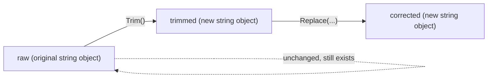
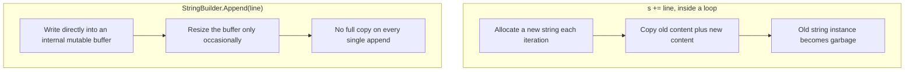

# Strings in C#

## Introduction

Before reading this lesson, you should already be comfortable with **[Multidimensional and Jagged Arrays](../01-fundamentals/01-14-multidimensional-and-jagged-arrays.md)** — grids and arrays of arrays. A `string` will turn out to have a lot in common with an array under the hood, but it comes with one crucial rule arrays don't have: once created, a string can never be changed. This lesson covers what that means in practice, the string methods you'll use daily, and the newer raw string literal syntax for multi-line and quote-heavy text.

By the end of this lesson, you will be able to:

- Explain why strings are immutable reference types and what that means when you call a method like `Replace`
- Use the everyday string methods: `Substring`, `Split`, `Trim`, `Replace`, and `Contains`
- Write a raw string literal (`"""`) for multi-line or quote-heavy text without escape sequences
- Recognize when repeated string concatenation becomes a real performance problem
- Compare strings correctly, understanding that `==` compares content, not reference, for strings

## Strings in C# — A Layman's Perspective

Imagine a printed, laminated sign — the kind you'd see at a shop counter. Once it's printed and laminated, you cannot erase a single letter on it and write a different one in its place; the lamination makes the sign permanent. If the price on the sign is wrong and needs to say "$24.99" instead of "$29.99," nobody scratches out a digit — the shop prints an entirely new sign and puts it up in place of the old one. The old sign either gets thrown away or kept somewhere out of sight, but it itself was never altered.

A C# string works exactly like that laminated sign: once created, its contents are permanent. When you call a method like `Replace` or `Trim` on a string, you are not editing the original sign at all — you are asking for a brand-new sign to be printed with the requested change already made, and you're handed that new sign. The original sign still exists, completely unchanged, for as long as anything else is still holding onto it. This is why, in C#, you always have to *capture the result* of a string method — `text.Trim()` does nothing useful on its own; you need `text = text.Trim()` (or a new variable) to actually keep the freshly printed sign, because the old one was never touched.

Now, here's a subtlety that surprises a lot of newcomers. Normally, when you compare two objects in C# with `==`, you're asking "are these literally the exact same physical thing?" — the same laminated sign, not just two signs that happen to say the same words. But strings are a deliberate exception: C# overloads `==` for strings specifically so that it compares the *words printed on the sign*, not whether it's the literal same physical sign. Two completely separately printed signs that both say "Wireless Mouse" will compare as equal with `==`, because C# recognizes that, for text, what usually matters is what it says, not which physical copy you're holding.

This permanence has a real, practical cost worth knowing about early. If you're assembling a long piece of text by repeatedly gluing more words onto the end — printing sign after sign after sign, each one slightly longer than the last, discarding the previous sign every single time — that's enormously wasteful once you're doing it hundreds or thousands of times over, since each new sign has to be printed completely from scratch, copying over everything the old sign already said plus the new bit. There's a better tool for that specific job, one built from the ground up to be editable in place rather than reprinted every time — and that's exactly what the next lesson introduces.

The bridge back to programming: a string never changes after it's created; every "editing" method actually returns an entirely new string, leaving the original untouched, and this immutability is precisely why a different tool exists for building up long text efficiently.

## Strings in C# — A Programming Language Perspective

`string` is a keyword alias for the sealed reference type `System.String`, representing an immutable, ordered sequence of UTF-16 `char` values stored on the managed heap. Every method that appears to "modify" a string — `Substring`, `Replace`, `ToUpper`, `Trim`, and the rest — actually allocates and returns a new `string` instance, leaving the receiver's underlying character data completely unchanged; there is no method on `string` that mutates it in place, because none can exist. Unusually among reference types, `string` overloads `==` and `!=` to perform ordinal value comparison of contents rather than reference comparison, and also overrides `Equals` and `GetHashCode` accordingly, so two distinct string objects with identical content are `==` and `Equals`-equal even though `ReferenceEquals` would report `false`.

Raw string literals, introduced in C# 11 and standard practice through C# 14, use three or more consecutive double-quote characters (`"""`) to delimit content that may freely contain quotes, backslashes, and multiple lines without any escape sequences; the closing delimiter's column determines how much common leading whitespace is stripped from every content line, and prefixing the opening `$"""` allows interpolation holes (`{expression}`) inside the raw literal exactly as with a normal interpolated string.

## How to Work with Strings in C#

Most everyday string work is a chain of small, focused method calls: `Trim` removes leading/trailing whitespace, `Contains` checks for a substring, `Substring(start, length)` extracts a portion, `Split` breaks a string into an array on a separator, and `Replace` swaps one substring for another — each of these returns a brand-new string rather than altering the original. Raw string literals use triple-quotes for multi-line text without needing `\n` or escaped inner quotes at all.


*Figure 1: Every string method returns a new object; the original is never modified in place.*

```csharp
// Program.cs — .NET 10 / C# 14
string raw = "   Order #A1042 - Wireless Mouse, Qty: 2   ";

string trimmed = raw.Trim();
Console.WriteLine($"Trimmed: '{trimmed}'");

bool hasWireless = trimmed.Contains("Wireless");
Console.WriteLine($"Contains 'Wireless': {hasWireless}");

string orderNumber = trimmed.Substring(7, 5);
Console.WriteLine($"Order number: {orderNumber}");

string[] parts = trimmed.Split(", ");
Console.WriteLine($"Part count: {parts.Length}");
foreach (string part in parts)
{
    Console.WriteLine($"  - {part}");
}

string corrected = trimmed.Replace("Qty: 2", "Qty: 3");
Console.WriteLine($"Corrected: {corrected}");

string receiptTemplate = """
    Receipt
    -------
    Item:  Wireless Mouse
    Total: $24.99
    """;
Console.WriteLine(receiptTemplate);

Console.WriteLine($"Original 'raw' is unchanged: '{raw}'");
```

**Console Output:**

```text
Trimmed: 'Order #A1042 - Wireless Mouse, Qty: 2'
Contains 'Wireless': True
Order number: A1042
Part count: 2
  - Order #A1042 - Wireless Mouse
  - Qty: 2
Corrected: Order #A1042 - Wireless Mouse, Qty: 3
Receipt
-------
Item:  Wireless Mouse
Total: $24.99
Original 'raw' is unchanged: '   Order #A1042 - Wireless Mouse, Qty: 2   '
```

The very last line proves the whole point of this lesson: even after `Trim`, `Substring`, `Split`, and `Replace` were all called using `raw` (directly or via `trimmed`, which came from it), the original `raw` variable still holds its untouched value, spaces and all — nothing along the way ever modified it. The raw string literal needed no `\n` characters and no escaped quotes to produce a clean, multi-line receipt; the compiler stripped the leading indentation based on where the closing `"""` was placed.

## Real-Time Example: Strings in E-Commerce Order Processing

We continue building on the E-Commerce Order Processing case study. A checkout confirmation step needs to clean up raw customer input (trimming stray whitespace, normalizing an email to lowercase for consistent storage) and then assemble a human-readable order confirmation receipt — a perfect showcase for combining string methods with a raw interpolated string literal.

```csharp
// Program.cs — .NET 10 / C# 14 — Real-Time Example
string customerName = "  Priya Nair  ";
string customerEmail = "PRIYA.NAIR@EXAMPLE.COM";
string[] orderLines = ["Wireless Mouse x2 - $49.98", "USB-C Hub x1 - $34.00", "Webcam x1 - $59.99"];

string cleanName = customerName.Trim();
string normalizedEmail = customerEmail.ToLower();

Console.WriteLine($"Preparing confirmation for {cleanName} <{normalizedEmail}>");

string summary = string.Empty;
foreach (string line in orderLines)
{
    summary += line + "\n"; // fine for 3 lines; hundreds would call for StringBuilder instead
}

string receipt = $"""
    Order Confirmation
    -------------------
    Customer: {cleanName}
    Email:    {normalizedEmail}

    {summary.TrimEnd()}
    """;

Console.WriteLine(receipt);

bool looksLikeGmail = normalizedEmail.EndsWith("@gmail.com");
Console.WriteLine($"Is a Gmail address: {looksLikeGmail}");
```

**Console Output:**

```text
Preparing confirmation for Priya Nair <priya.nair@example.com>
Order Confirmation
-------------------
Customer: Priya Nair
Email:    priya.nair@example.com

Wireless Mouse x2 - $49.98
USB-C Hub x1 - $34.00
Webcam x1 - $59.99
Is a Gmail address: False
```

`Trim` and `ToLower` each returned a fresh string rather than modifying `customerName` or `customerEmail`, which is why the code has to capture their results in `cleanName` and `normalizedEmail` to actually use the cleaned-up values. The `summary += line + "\n"` loop is intentionally called out in a comment: for exactly three order lines this is harmless, but it's the same pattern that becomes a genuine performance problem at scale — a real checkout system assembling a receipt with hundreds of line items, or doing this inside a hot request path serving thousands of orders a minute, would reach for `StringBuilder` instead, which is exactly where the next lesson picks up.

## String Concatenation (+=) vs StringBuilder

Building up text with repeated `+=` is simple to write and perfectly fine for a handful of appends, but every single `+=` on a string creates an entirely new string object, copies the old content into it, appends the new piece, and discards the previous string as garbage. Do that inside a loop that runs `n` times, and the total amount of copying grows roughly with `n²`, since each new string is longer than the last and has to be recopied in full every time.

`StringBuilder` (covered next) exists precisely to avoid this. It maintains one mutable internal character buffer that it appends into directly, only occasionally allocating a larger buffer and copying when it runs out of room — turning that same `n`-iteration loop from roughly `n²` character copies down to roughly `n`. For a handful of concatenations, plain `+=` is more readable and the difference is unmeasurable; once a loop is involved, that difference becomes very real.


*Figure 2: Repeated += reallocates and copies on every iteration; StringBuilder mutates one buffer in place.*

| Aspect | `string` concatenation (`+=`) | `StringBuilder` |
|---|---|---|
| Mutability | Immutable — every `+=` creates a new object | Mutable internal buffer |
| Cost of many appends | Roughly grows with the square of the count | Roughly grows linearly with the count |
| Readability for a few appends | Simple, direct | Slightly more ceremony (`Append`, then `ToString()`) |
| Typical use case | A handful of known concatenations | Building text inside a loop, especially at scale |

## Types of String-Related Constructs in C#

Strings connect to several related constructs, some covered here and some in the lessons around this one:

1. **[StringBuilder and String Interpolation](../01-fundamentals/01-16-stringbuilder-and-interpolation.md)** — the mutable alternative for building strings efficiently inside a loop, plus a closer look at `$"..."` interpolation.
2. **Raw string literals** (`"""..."""`, C# 11+) — used above for the receipt template, ideal for multi-line text and content containing embedded quotes.
3. **Culture-aware vs. ordinal comparison** (`string.Equals(a, b, StringComparison.OrdinalIgnoreCase)`) — important once text comparisons need to be locale-independent or case-insensitive.
4. **[Multidimensional and Jagged Arrays](../01-fundamentals/01-14-multidimensional-and-jagged-arrays.md)** — the prerequisite lesson's array-of-arrays structure, since a `string` is itself conceptually a read-only array of `char`.
5. **`Span<char>` / `ReadOnlySpan<char>`** — a high-performance, allocation-free way to slice strings, covered later once the curriculum reaches memory management.
6. **[for and foreach Loops](../01-fundamentals/01-11-for-and-foreach-loops.md)** — both loop kinds can iterate a string's individual characters directly, since `string` implements `IEnumerable<char>`.

## What You've Learned & What's Next

Strings are immutable, heap-allocated reference types: every method that looks like it edits a string actually returns a new one, leaving the original untouched, and `==` compares their content rather than their identity. `Substring`, `Split`, `Trim`, `Replace`, and `Contains` cover the majority of everyday text processing, and raw string literals remove the need for escape sequences in multi-line or quote-heavy content. Repeated `+=` concatenation is fine in small doses but scales poorly inside a loop.

Continue your learning journey with **[StringBuilder and String Interpolation](../01-fundamentals/01-16-stringbuilder-and-interpolation.md)**, where we cover the mutable, efficient way to build up long strings, along with a deeper look at interpolation.

---
*Applies to: .NET 10 / C# 14. Last reviewed 2026-08-16.*
