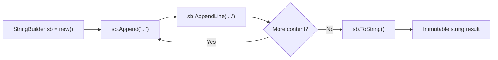
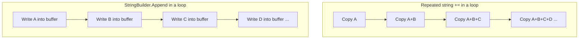

# StringBuilder and String Interpolation

## Introduction

Before reading this lesson, you should already be comfortable with **[Strings in C#](../01-fundamentals/01-15-strings-in-csharp.md)**, especially the fact that every `string` in .NET is immutable — once created, its contents never change. In this lesson we build directly on that fact to introduce two closely related tools: **`StringBuilder`**, a mutable text buffer designed for the exact situations where string immutability becomes a performance problem, and **string interpolation**, the modern syntax for embedding values inside text without clunky concatenation.

By the end of this lesson, you will be able to:

- Explain why repeated `string` concatenation in a loop is expensive, and what `StringBuilder` does differently
- Use `StringBuilder`'s core methods (`Append`, `AppendLine`, `Insert`, `Replace`, `ToString`) to build text incrementally
- Use string interpolation (`$"..."`) with format specifiers to produce formatted, readable output
- Use raw string interpolation (`$"""..."""` and `$$"""..."""`) to embed multi-line templates like JSON without escaping headaches
- Choose correctly between concatenation, `StringBuilder`, and interpolation based on the situation

## StringBuilder and String Interpolation — A Layman's Perspective

Imagine you're a scribe in a world before word processors, and someone hands you a stack of index cards, one word at a time, asking you to compose a paragraph. If you insisted on treating each card as final and unchangeable, here's what you'd have to do: write "The" on a fresh sheet of paper, then throw that sheet away and copy out "The quick" onto a brand-new sheet, then throw *that* away and copy "The quick brown" onto yet another new sheet, and so on — recopying everything you'd already written, every single time a new word arrived. For a short paragraph this is merely wasteful. For a whole book, dictated one word at a time, it would take longer than writing the book itself, because you'd be re-copying an ever-growing document thousands of times over.

A smarter scribe does something different: they keep a single working notepad with some blank space at the bottom, and they simply add each new word to the end of what's already there. Only when the paragraph is finished and needs to be handed to someone else — printed, mailed, displayed — do they copy the final result onto a clean, official sheet. The notepad itself was never "final" during the writing process; it was a scratch space designed to be changed, over and over, cheaply.

That notepad is exactly what `StringBuilder` is. Ordinary C# strings behave like that stack of "final" sheets — every time you concatenate two strings with `+`, C# doesn't modify either one; it creates an entirely new string containing both, and the old ones are left to be cleaned up later. That's fine for a one-off greeting message, but disastrous inside a loop that appends thousands of small pieces of text, because you re-copy the entire accumulated string on every single iteration — the same "recopy the whole book" problem the scribe faced. `StringBuilder` is the working notepad: it keeps an internal buffer with room to grow, and appending to it just writes into the free space (occasionally resizing the buffer, much less often than every single append). Only when you're done do you call `.ToString()` to get the final, "official," immutable string.

String interpolation solves a completely different, but related, everyday annoyance: filling in a template with values. Instead of gluing pieces of text and variables together with `+` signs like assembling a sentence out of scattered puzzle pieces, interpolation lets you write the sentence naturally, in order, and simply mark where the variables go — much like writing "Dear ___, your order of ___ items will arrive on ___" and then filling in the blanks in place, rather than cutting the sentence into fragments to glue a name and a date in between them.

The bridge back to programming: `StringBuilder` changes *how* you accumulate text over time; string interpolation changes *how* you write the text itself. Used together, they make building any non-trivial piece of output — a report, a receipt, a log message — both fast and readable.

## StringBuilder and String Interpolation — A Programming Language Perspective

`System.Text.StringBuilder` is a mutable, resizable sequence of characters backed by an internal `char` buffer that grows (typically by doubling) as content is appended, avoiding the repeated allocation and copying that `string` concatenation (`+`/`+=`) incurs in a loop, since `string` instances themselves remain immutable. Its core API — `Append`, `AppendLine`, `AppendFormat`, `Insert`, `Remove`, `Replace`, and `ToString()` — returns `this` from most mutator methods, enabling fluent chaining, and exposes `Length` and `Capacity` for buffer inspection.

String interpolation (`$"...{expression}..."`, introduced in C# 6) compiles to either a `string.Format` call or, in most modern contexts, a compiler-synthesized `DefaultInterpolatedStringHandler` that writes formatted segments directly into a buffer, avoiding intermediate allocations. Format specifiers (`{value:F2}`, `{value,10}`) control numeric precision and column alignment. Raw string literals (C# 11+), written with three or more double quotes, support interpolation via `$"""..."""`; prefixing with additional `$` characters (`$$"""..."""`) raises the number of consecutive braces required to trigger interpolation, letting literal `{` and `}` characters — common in JSON or code templates — appear unescaped.

## How to Use StringBuilder and Interpolation in C#

`StringBuilder` is instantiated with `new StringBuilder()` (optionally with a starting capacity or initial string), then built up with chained `Append`/`AppendLine` calls. String interpolation is used inline wherever you'd otherwise concatenate — including inside the arguments you pass to `StringBuilder.Append`. Format specifiers follow a colon inside the interpolation hole (`{price:F2}` for two decimal places), and alignment follows a comma (`{name,-10}` left-pads to a minimum width of 10, negative meaning left-justified).


*Figure 1: StringBuilder accumulates content in a mutable buffer; only the final ToString() call produces an immutable string.*

```csharp
// Program.cs — .NET 10 / C# 14
using System.Text;

var sb = new StringBuilder();
sb.Append("Processing order ");
sb.Append(1024);
sb.AppendLine("...");
sb.AppendLine("Status: Shipped");

Console.Write(sb.ToString());

string customerName = "Ava";
int itemCount = 3;
double total = 129.5;

Console.WriteLine($"{customerName} ordered {itemCount} items totaling ${total:F2}.");

string json = $$"""
{
  "customer": "{{customerName}}",
  "items": {{itemCount}}
}
""";
Console.WriteLine(json);
```

**Console Output:**

```text
Processing order 1024...
Status: Shipped
Ava ordered 3 items totaling $129.50.
{
  "customer": "Ava",
  "items": 3
}
```

The `StringBuilder` accumulated three `Append` calls into one internal buffer before `ToString()` produced the final text — no intermediate strings were created along the way. The interpolated string `{total:F2}` formatted the `double` to two decimal places inline. The raw string literal used `$$` because its body contains JSON braces (`{` and `}`) that should be treated as literal text; because the delimiter is doubled, the interpolation holes must also be doubled (`{{customerName}}`), leaving single braces free for JSON syntax.

## Real-Time Example: StringBuilder and Interpolation in E-Commerce Order Processing

We continue building on the **E-Commerce Order Processing** case study introduced earlier in the series. Before an order confirmation is emailed or printed, its line items, subtotal, tax, and total need to be assembled into a single block of formatted text — precisely the job `StringBuilder` and interpolation were designed for. Building this confirmation with repeated `+=` string concatenation would mean re-copying the growing message on every line item; using `StringBuilder` instead keeps the work proportional to the amount of text actually written.

```csharp
// Program.cs — .NET 10 / C# 14 — Real-Time Example
using System.Text;

var orderItems = new (string ProductName, int Quantity, decimal UnitPrice)[]
{
    ("Wireless Mouse", 2, 18.99m),
    ("USB-C Cable", 3, 9.50m),
    ("Laptop Stand", 1, 34.00m)
};

const decimal TaxRate = 0.08m;

var confirmation = new StringBuilder();
confirmation.AppendLine("=== E-Commerce Order Confirmation ===");
confirmation.AppendLine("Order #: 1007");
confirmation.AppendLine(new string('-', 46));

decimal subtotal = 0m;
foreach (var (name, qty, price) in orderItems)
{
    decimal lineTotal = qty * price;
    subtotal += lineTotal;
    confirmation.AppendLine($"{name,-16}x{qty,2}  @ ${price,6:F2}  = ${lineTotal,7:F2}");
}

decimal tax = subtotal * TaxRate;
decimal grandTotal = subtotal + tax;

confirmation.AppendLine(new string('-', 46));
confirmation.AppendLine($"{"Subtotal:",-34}${subtotal,7:F2}");
confirmation.AppendLine($"{"Tax (8%):",-34}${tax,7:F2}");
confirmation.AppendLine($"{"Total:",-34}${grandTotal,7:F2}");

Console.Write(confirmation.ToString());
```

**Console Output:**

```text
=== E-Commerce Order Confirmation ===
Order #: 1007
----------------------------------------------
Wireless Mouse  x 2  @ $ 18.99  = $  37.98
USB-C Cable     x 3  @ $  9.50  = $  28.50
Laptop Stand    x 1  @ $ 34.00  = $  34.00
----------------------------------------------
Subtotal:                         $ 100.48
Tax (8%):                         $   8.04
Total:                            $ 108.52
```

Every `AppendLine` writes into the same growing buffer, and every dollar figure is formatted inline with alignment (`,7`) and precision (`:F2`) specifiers rather than manually padding strings with spaces. In a real order-processing system, this exact pattern generates the plain-text body of a confirmation email, a printed receipt, or a log entry — anywhere a loop over line items needs to become one coherent block of text.

## StringBuilder vs String Concatenation

The core tradeoff is *when* copying happens. Each `+` or `+=` concatenation between two `string` values allocates a brand-new string containing both operands' characters — the originals are untouched (they can't be touched; they're immutable) but are now garbage. Inside a loop, this means the *n*-th iteration copies all the text accumulated by the previous *n-1* iterations, making the total work grow roughly quadratically with the number of iterations. `StringBuilder` instead maintains one resizable internal array; appending usually just writes into existing free space, and only occasionally (when the buffer fills up) does it allocate a larger array and copy the existing content once — making the total work grow linearly.

For a handful of concatenations — building one log line, joining a first and last name — the difference is invisible, and plain concatenation or interpolation is more readable. The problem appears specifically when concatenation happens *repeatedly*, inside a loop whose iteration count isn't tiny.


*Figure 2: String concatenation re-copies all prior content on every iteration; StringBuilder writes into a shared, growing buffer.*

| Aspect | String Concatenation (`+`/`+=`) | `StringBuilder` |
|---|---|---|
| Mutability | Each result is a new, immutable string | Mutates one internal buffer in place |
| Cost in a tight loop | Grows roughly quadratically with iterations | Grows roughly linearly with total characters |
| Readability for a few joins | Very readable, no setup needed | Slightly more ceremony (`new StringBuilder()`, `.ToString()`) |
| Best use case | A handful of one-off joins outside a loop | Building text incrementally across many appends/iterations |

## Types of String Building and Formatting Techniques in C#

1. **[Strings in C#](../01-fundamentals/01-15-strings-in-csharp.md)** — the immutable `string` fundamentals that make `StringBuilder` necessary in the first place.
2. **[`Span<T>` and `Memory<T>`](../08-memory-management/08-06-span-t-and-memory-t.md)** — the lower-level, allocation-conscious building blocks that underpin high-performance text handling.
3. **[`System.Text.Json` in Depth](../09-file-io-serialization/09-05-system-text-json-in-depth.md)** — when structured, machine-readable output is a better fit than hand-formatted text.
4. **[Working with CSV Files](../09-file-io-serialization/09-07-working-with-csv-files.md)** — a common real-world `StringBuilder` use case: generating delimited reports line by line.
5. **[Boxing and Unboxing](../08-memory-management/08-07-boxing-and-unboxing.md)** — why passing value types through older formatting APIs could allocate, and how modern interpolation avoids it.

## What You've Learned & What's Next

You've learned why `string` immutability makes repeated concatenation expensive, how `StringBuilder` solves that with a mutable internal buffer, and how string interpolation — including raw string interpolation for multi-line templates — makes formatted text both easy to write and easy to read.

Continue your learning journey with **[Methods in C#](../01-fundamentals/01-17-methods-in-csharp.md)**, where we cover how to package logic like the order-confirmation builder above into reusable, named methods.

---
*Applies to: .NET 10 / C# 14. Last reviewed 2026-08-16.*
