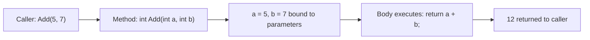
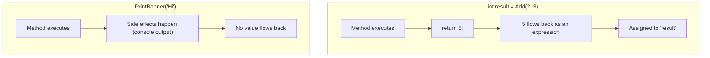

# Methods in C#

## Introduction

Before reading this lesson, you should already be comfortable with **[StringBuilder and String Interpolation](../01-fundamentals/01-16-stringbuilder-and-interpolation.md)**, since the examples here package that kind of logic into reusable units. In this lesson we introduce **methods** — the fundamental unit of reusable, named behavior in C#, and the building block every class, every library, and every application is ultimately made of.

By the end of this lesson, you will be able to:

- Declare a method with a name, parameter list, and return type
- Distinguish `void` methods (which perform an action) from methods that return a value
- Call methods with the correct number and type of arguments
- Write expression-bodied methods for concise, single-expression logic
- Understand a method's signature and why it matters for the compiler

## Methods in C# — A Layman's Perspective

Think about a recipe card in a family cookbook. A recipe has a name ("Banana Bread"), a list of ingredients it needs (flour, bananas, sugar, eggs), and a set of steps that turn those ingredients into a finished result. Crucially, the recipe card itself doesn't bake anything — it's just a reusable set of instructions. Nothing happens until someone actually follows it, gathering the specific ingredients on that particular day and producing an actual loaf of bread. You can follow the same recipe card a hundred times, with different bananas and different eggs each time, and get a fresh loaf every time, without ever having to rewrite the instructions.

A method in C# is exactly that recipe card. It has a name ("CalculateTotal", "PrintReceipt", "ValidateEmail"), a list of ingredients it needs to do its job (its parameters — the specific numbers, names, or objects it will operate on), and a body containing the steps to follow. Just like a recipe, defining the method doesn't run anything by itself; someone has to "call" it — hand it real ingredients (arguments) — before any work actually happens. And just like the same recipe card produces a fresh loaf each time regardless of which specific bananas you used, the same method produces a result based on whatever arguments you pass it this particular time, without needing to be rewritten.

Some recipes produce something you take away and use elsewhere — a loaf of bread you can slice, photograph, or serve at dinner. Other recipes are really more like chores: "wash the dishes," "set the table" — you follow the steps, something in the kitchen changes, but there's no single "product" to carry away afterward. Methods split the same way: some methods calculate and hand back a result (a returned value), while others just perform an action — updating something, printing something, saving something — and hand nothing back at all. In C#, that second kind is marked with the word `void`, meaning "produces no value to return."

Finally, notice that a recipe card is precise about its ingredients — it doesn't just say "some fruit," it says "3 ripe bananas." A method is the same: it specifies exactly what kind of ingredients (what data types) it expects, in what order, so that whoever uses the recipe knows precisely what to bring to the kitchen.

The bridge back to programming: a method is a named, reusable block of code that takes some inputs, does something with them, and either hands back a result or simply performs an action — and defining one is how you turn repeated logic into something you write once and use everywhere.

## Methods in C# — A Programming Language Perspective

A **method** is a named, callable member that encapsulates a block of statements, declared with an access modifier (implicitly `private` for local top-level functions, or explicit for type members), a return type (or `void` if it returns nothing), a name, and a parenthesized parameter list specifying each parameter's type and name. The combination of a method's name and its parameter types (not its return type) forms its **signature**, which the compiler uses to resolve calls and distinguish overloads. A method that declares a return type must return a value of that type (or a compatible type) via a `return` statement on every reachable code path; a `void` method may use a bare `return;` to exit early but returns no value. C# 6 introduced **expression-bodied members** — `ReturnType MethodName(params) => expression;` — as concise sugar for a method body that is a single `return` expression (or, for `void` methods, a single statement expression).

## How to Declare and Use Methods in C#

A method declaration in C# follows the shape `[modifiers] returnType MethodName(parameterType parameterName, ...)`, followed by either a statement block in braces or, for a single-expression body, `=> expression;`. Calling a method means writing its name followed by parentheses containing arguments that match the declared parameters in order and type. Local functions — methods declared inside `Program.cs` at the top level, or nested inside another method — work identically and are a convenient way to organize small, file-local helpers.


*Figure 1: Calling a method binds the arguments to its parameters, executes the body, and (if not void) returns a value to the call site.*

```csharp
// Program.cs — .NET 10 / C# 14
Console.WriteLine(Add(5, 7));
Console.WriteLine(Square(6));
PrintBanner("Methods Demo");

static int Add(int a, int b)
{
    return a + b;
}

static int Square(int number) => number * number;

static void PrintBanner(string title)
{
    Console.WriteLine(new string('=', title.Length + 4));
    Console.WriteLine($"= {title} =");
    Console.WriteLine(new string('=', title.Length + 4));
}
```

**Console Output:**

```text
12
36
================
= Methods Demo =
================
```

`Add` and `Square` both declare `int` as their return type and hand a value back to the caller — `Square` uses the expression-bodied form since its entire logic is one expression. `PrintBanner` is declared `void`: it performs three `Console.WriteLine` actions and returns nothing, which is why it's called as a standalone statement rather than wrapped in `Console.WriteLine(...)`.

## Real-Time Example: Methods in Banking/ATM Balance Operations

We continue building on the **Banking/ATM** case study. Every balance-changing operation an ATM performs — a deposit, a withdrawal, printing a receipt — is a natural fit for a method: a named, reusable piece of logic that takes the current state and an amount, and produces either an updated balance or a printed confirmation.

```csharp
// Program.cs — .NET 10 / C# 14 — Real-Time Example
decimal balance = 500.00m;

Console.WriteLine($"Starting balance: ${balance:F2}");

balance = Deposit(balance, 250.00m);
PrintReceipt("Deposit", 250.00m, balance);

balance = Withdraw(balance, 100.00m);
PrintReceipt("Withdrawal", 100.00m, balance);

try
{
    balance = Withdraw(balance, 1000.00m);
}
catch (InvalidOperationException ex)
{
    Console.WriteLine($"Transaction declined: {ex.Message}");
}

static decimal Deposit(decimal currentBalance, decimal amount) => currentBalance + amount;

static decimal Withdraw(decimal currentBalance, decimal amount)
{
    if (amount > currentBalance)
    {
        throw new InvalidOperationException("Insufficient funds.");
    }

    return currentBalance - amount;
}

static void PrintReceipt(string transactionType, decimal amount, decimal balanceAfter)
{
    Console.WriteLine($"{transactionType}: ${amount:F2} | New balance: ${balanceAfter:F2}");
}
```

**Console Output:**

```text
Starting balance: $500.00
Deposit: $250.00 | New balance: $750.00
Withdrawal: $100.00 | New balance: $650.00
Transaction declined: Insufficient funds.
```

Notice that `Deposit` and `Withdraw` both take the *current* balance as a parameter and *return* the new balance — they don't try to reach out and modify some ambient "account" variable directly, they simply compute and hand back a result, which the caller then assigns. `PrintReceipt` is `void`: its entire job is the side effect of printing, so it has nothing to return. This separation — computing a value versus performing an action — is exactly the `void`-vs-returning distinction from the previous section, applied to a real transaction flow. In a production ATM or banking API, these same shapes reappear as service methods, just with a database call standing in for the plain `decimal` parameter.

## void Methods vs Value-Returning Methods

The distinction between `void` and value-returning methods is about *what the caller can do with the call*. A value-returning method's call is itself an expression — you can assign it to a variable, pass it as an argument to another method, or use it inside a larger expression. A `void` method's call is only ever a standalone statement; there is no value produced, so `int x = PrintBanner("test");` would not compile — the compiler flags it as a type error, because you cannot assign "nothing" to a variable.


*Figure 2: A value-returning method's call site receives a value that can be used in an expression; a void method's call site receives nothing.*

| Aspect | `void` Method | Value-Returning Method |
|---|---|---|
| Declared return type | `void` | Any type (`int`, `string`, custom types, etc.) |
| Can the call be assigned to a variable? | No | Yes |
| Purpose | Perform an action / side effect | Compute and hand back a result |
| Early exit statement | `return;` (no value) | `return value;` (must match declared type) |

## Types of Method Declarations in C#

1. **[`ref`, `out`, and `in` Parameters](../01-fundamentals/01-18-ref-out-in-parameters.md)** — passing parameters by reference instead of by value.
2. **[Optional and Named Arguments](../01-fundamentals/01-19-optional-and-named-arguments.md)** — giving parameters default values and calling methods by parameter name.
3. **[Method Overloading](../02-oop/02-10-method-overloading.md)** — declaring multiple methods with the same name but different parameter signatures.
4. **[Local Functions](../02-oop/02-29-local-functions.md)** — methods declared entirely inside another method's body, scoped to that method.
5. **[Lambda Expressions](../06-delegates-events/06-06-lambda-expressions.md)** — compact, unnamed method bodies assigned to a delegate or passed as an argument.
6. **[Generic Methods](../03-collections-generics/03-17-generic-methods.md)** — methods parameterized over a type, so the same logic works across many data types.

## What You've Learned & What's Next

You've learned that a method is a reusable, named block of logic with a signature (name + parameter types), that `void` methods perform actions while other methods compute and return a value, and that expression-bodied syntax offers a concise alternative when a method's entire body is one expression.

Continue your learning journey with **[`ref`, `out`, and `in` Parameters](../01-fundamentals/01-18-ref-out-in-parameters.md)**, where we go beyond passing arguments by value and learn how C# lets a method modify the caller's variables directly.

---
*Applies to: .NET 10 / C# 14. Last reviewed 2026-08-16.*
