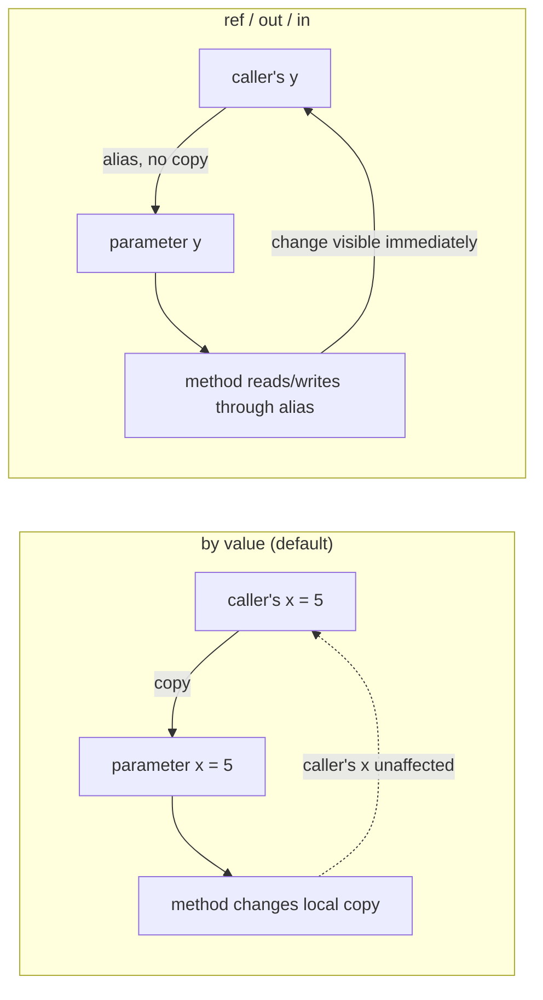
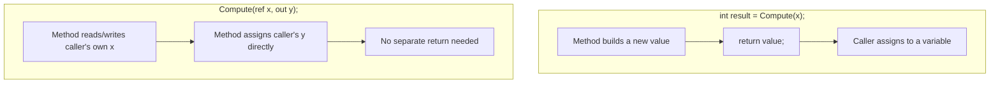

# ref, out, and in Parameters

## Introduction

Before reading this lesson, you should already be comfortable with **[Methods in C#](../01-fundamentals/01-17-methods-in-csharp.md)**, including how parameters are declared and how arguments are passed at a call site. In this lesson we look at what actually happens to that argument during the call — specifically, the difference between handing a method a *copy* of your data versus handing it the *actual variable* — and introduce the three keywords, `ref`, `out`, and `in`, that let a method work directly with the caller's own storage location.

By the end of this lesson, you will be able to:

- Explain the difference between pass-by-value and pass-by-reference semantics in C#
- Use `ref` to let a method read and modify the caller's variable
- Use `out` to have a method guarantee it assigns a value before returning
- Use `in` to pass a large value type by reference without allowing the callee to modify it
- Recognize when each keyword is appropriate versus simply returning a value

## ref, out, and in Parameters — A Layman's Perspective

Imagine you ask a friend to help you fill out a form. There are two very different ways you could hand it to them. In the first way, you photocopy the form and give your friend the copy. Your friend can scribble all over that copy, cross things out, even set it on fire — none of it touches your original form sitting on your desk. Whatever they hand back to you afterward is a completely separate piece of paper. This is how most values travel into a method in C# by default: the method gets its own private copy to play with, and your original variable back home is untouched no matter what the method does to its copy.

Now imagine the second way: instead of a photocopy, you hand your friend the *original* form itself. Now anything your friend writes on it is written on your actual document. When they hand it back, it's the same physical page, just with their changes now baked in. This is what `ref` does — it hands the method your actual variable, not a copy, so any assignment the method makes changes your variable directly, visible the moment the method returns.

`out` is a stricter version of the same idea, used for a different situation: imagine you hand a blank form to a clerk at a government office and say, "fill this out completely and hand it back to me — I don't care what's on it right now, but you must fill in every required field before you give it back." The clerk isn't allowed to read what was there before (there might be nothing, or garbage), but they are required to fill it in before they're done. That's `out` — the method must assign a value to that parameter before it returns, no exceptions, and the caller doesn't need the variable to have any value beforehand.

`in` is about a different concern entirely — not about writing back, but about efficiency when the "document" you're handing over is very large. If a form were a hundred pages long, physically photocopying it every time you asked someone to glance at it would be wasteful. `in` says "here's the original document, you may read it, but you are not permitted to write anything on it" — you avoid the cost of copying without risking the clerk changing your original by mistake.

The bridge back to programming: `ref`, `out`, and `in` all pass a *reference* to the caller's actual storage location instead of a copy of its value, but they differ in the promises attached — `ref` allows reading and writing, `out` demands writing, and `in` permits only reading, chosen for performance rather than for mutation.

## ref, out, and in Parameters — A Programming Language Perspective

By default, C# parameters use **pass-by-value** semantics: the argument's value (for a value type, the data itself; for a reference type, the reference/pointer value) is copied into the parameter. The `ref`, `out`, and `in` keywords switch a parameter to **pass-by-reference**, meaning the parameter becomes an alias for the caller's own storage location rather than a separate copy. A `ref` parameter can be both read and written by the method, and the corresponding argument must already be a definitely-assigned variable, marked with `ref` at both the declaration and the call site. An `out` parameter must be assigned by the method on every code path before it returns, and the compiler enforces this via **definite assignment analysis**; the caller's variable need not be initialized beforehand, and the call site requires the `out` keyword (or C# 7's inline `out var` declaration). An `in` parameter (introduced in C# 7.2) passes a value type by reference as a performance optimization for large structs, but the compiler enforces read-only access inside the method, effectively treating the parameter as `readonly ref`.

## How to Use ref, out, and in Parameters in C#

Each keyword must appear both in the method's parameter list and, with the exception of `in` in many cases, at the call site, so the compiler and the reader can both see clearly that reference semantics are in play. `ref` requires the argument to be initialized before the call; `out` does not, but the compiler will refuse to compile the method unless every parameter marked `out` is assigned along every path before the method returns. `in` is usually applied to `readonly struct` types where the caller does not need to do anything special, since the compiler can pass by reference transparently, though explicit `in` at the call site is also legal.


*Figure 1: Pass-by-value copies data into the parameter; ref/out/in bind the parameter directly to the caller's storage location.*

```csharp
// Program.cs — .NET 10 / C# 14
int a = 10;
int b = 20;
Swap(ref a, ref b);
Console.WriteLine($"After swap: a = {a}, b = {b}");

if (int.TryParse("42", out int parsed))
{
    Console.WriteLine($"Parsed value: {parsed}");
}

var point = new Point3D(1.5, 2.5, 3.5);
double magnitude = Magnitude(in point);
Console.WriteLine($"Magnitude: {magnitude:F2}");

static void Swap(ref int x, ref int y)
{
    (x, y) = (y, x);
}

static double Magnitude(in Point3D p)
{
    return Math.Sqrt(p.X * p.X + p.Y * p.Y + p.Z * p.Z);
}

readonly struct Point3D(double x, double y, double z)
{
    public double X { get; } = x;
    public double Y { get; } = y;
    public double Z { get; } = z;
}
```

**Console Output:**

```text
After swap: a = 20, b = 10
Parsed value: 42
Magnitude: 4.30
```

`Swap` takes both parameters `ref`, so `(x, y) = (y, x)` rearranges the caller's own `a` and `b` in place — no return value is needed because the method already changed the originals. `int.TryParse` demonstrates the extremely common `out` pattern: it returns a `bool` for success/failure while also handing back the parsed value through `out int parsed`, declared inline at the call site. `Magnitude` takes the `Point3D` struct `in`, avoiding a copy of its three `double` fields while guaranteeing the method cannot modify the caller's point.

## Real-Time Example: ref, out, and in Parameters in Banking/ATM Transfers

We continue building on the **Banking/ATM** case study, extending the `Deposit`/`Withdraw` style methods from the previous lesson to a fund-transfer operation between two accounts. A transfer needs to modify *two* balances at once (a natural fit for `ref`), and a validation step needs to report back both a success flag and a specific failure reason (a natural fit for `out`).

```csharp
// Program.cs — .NET 10 / C# 14 — Real-Time Example
decimal checking = 800.00m;
decimal savings = 200.00m;

Console.WriteLine($"Checking: ${checking:F2} | Savings: ${savings:F2}");

if (TryTransfer(ref checking, ref savings, 300.00m, out string? error))
{
    Console.WriteLine($"Transfer succeeded.");
    Console.WriteLine($"Checking: ${checking:F2} | Savings: ${savings:F2}");
}
else
{
    Console.WriteLine($"Transfer failed: {error}");
}

if (!TryTransfer(ref checking, ref savings, 10000.00m, out string? secondError))
{
    Console.WriteLine($"Transfer failed: {secondError}");
}

static bool TryTransfer(ref decimal from, ref decimal to, decimal amount, out string? error)
{
    if (amount <= 0)
    {
        error = "Transfer amount must be positive.";
        return false;
    }

    if (amount > from)
    {
        error = "Insufficient funds in source account.";
        return false;
    }

    from -= amount;
    to += amount;
    error = null;
    return true;
}
```

**Console Output:**

```text
Checking: $800.00 | Savings: $200.00
Transfer succeeded.
Checking: $500.00 | Savings: $500.00
Transfer failed: Insufficient funds in source account.
```

`TryTransfer` takes `from` and `to` as `ref decimal`, so a single method call updates both account balances directly — there is no need to return a tuple of two new balances and reassign them manually, and no risk of the caller forgetting to reassign one of them. The `out string? error` parameter mirrors the well-known `TryParse` pattern from the .NET Base Class Library: the `bool` return value tells the caller whether the operation succeeded, while `out error` explains *why* it didn't, without requiring an exception for what is really just an expected, recoverable business rule violation. This `Try`-prefixed, `bool`-returning, `out`-explaining shape is idiomatic throughout .NET, from `int.TryParse` to `Dictionary<TKey,TValue>.TryGetValue`.

## ref/out vs Returning a Value

Both `ref`/`out` parameters and ordinary return values are ways for a method to hand information back to its caller, but they solve different shaped problems. A return value is the natural choice when a method produces exactly one new piece of output computed from its inputs — it composes cleanly into expressions and is the default, idiomatic style in C#. `ref`/`out` become useful when a method needs to hand back *multiple* independent pieces of information (as `TryParse` does with a success flag plus a parsed value), or when it needs to modify an existing variable in place rather than replace it with something built fresh, as `Swap` does. Overusing `ref`/`out` where a simple return value (or a small record/tuple) would do makes code harder to read, since the effect on the caller's variables is less visible at the call site than an assignment from a return value.


*Figure 2: A return value produces one new result the caller assigns; ref/out let a method modify or populate the caller's existing variables directly, including more than one at once.*

| Aspect | Return Value | `ref` / `out` Parameter |
|---|---|---|
| Number of outputs | Exactly one | One or more, alongside the return value |
| Requires pre-initialized variable? | N/A (produces a new value) | `ref` yes; `out` no |
| Call-site visibility | Value flows via assignment (`x = M(...)`) | Effect is on an existing variable, less visually obvious |
| Typical use case | Computing and handing back a single result | Multiple outputs (`TryParse`), or mutating the caller's variable in place (`Swap`) |

## Types of Reference-Passing Parameters in C#

1. **`ref`** — the argument must be assigned before the call; the method may both read and write it, and changes are visible to the caller immediately.
2. **`out`** — the argument need not be assigned before the call, but the method must assign it on every path before returning.
3. **`in`** — the argument is passed by reference for performance (avoiding a copy of a large struct) but the method cannot modify it.
4. **`ref readonly`** — a return-value variant (not covered in this lesson) that lets a method return a reference to data the caller cannot modify.
5. **[Optional and Named Arguments](../01-fundamentals/01-19-optional-and-named-arguments.md)** — a complementary way to make parameter lists more flexible, without reference semantics.

## What You've Learned & What's Next

You've learned that C# parameters are pass-by-value by default, and that `ref`, `out`, and `in` each switch a parameter to pass-by-reference with a different contract: `ref` for two-way read/write access to the caller's variable, `out` for guaranteed-assignment output (as seen in `TryParse`-style methods), and `in` for read-only, copy-avoiding access to large value types.

Continue your learning journey with **[Optional and Named Arguments](../01-fundamentals/01-19-optional-and-named-arguments.md)**, where we look at making parameter lists more flexible with default values and calling methods by parameter name instead of position.

---
*Applies to: .NET 10 / C# 14. Last reviewed 2026-08-16.*
