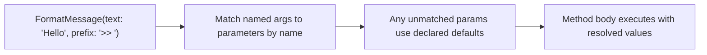
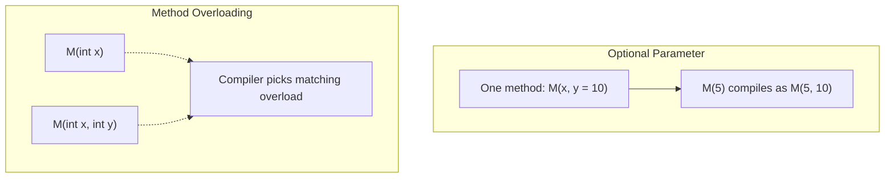

# Optional and Named Arguments

## Introduction

Before reading this lesson, you should already be comfortable with **[ref, out, and in Parameters](../01-fundamentals/01-18-ref-out-in-parameters.md)**, since both lessons deal with how arguments travel between a caller and a method. In this lesson we step away from reference semantics and look at flexibility instead: how a method can let some parameters be skipped entirely by giving them **default values**, how a caller can supply arguments by **name** rather than position, and how the `params` keyword lets a single parameter absorb any number of trailing arguments.

By the end of this lesson, you will be able to:

- Declare a method parameter with a default value, making it optional at the call site
- Call a method using named arguments, in any order, for improved readability
- Combine positional, optional, and named arguments correctly in a single call
- Use `params` to accept a variable number of arguments, including any collection type (C# 13+)
- Understand how the compiler resolves which overload to call when several are available

## Optional and Named Arguments — A Layman's Perspective

Picture ordering a coffee at a café. The barista's "recipe" for a latte technically needs several things specified: the size, the milk type, whether it's decaf, how many shots of espresso, and any flavor syrup. But in practice, almost nobody rattles off every single detail every time. You just say "a latte, please," and the barista fills in sensible defaults behind the counter — medium size, regular milk, one shot, no syrup — unless you say otherwise. You only mention the details that differ from the usual: "a latte, but oat milk" or "a latte, decaf, extra hot." The barista doesn't need you to specify everything in a fixed order either; you can say "oat milk latte, decaf" or "decaf latte, oat milk" and be understood exactly the same way, because you're naming what you want rather than reciting it in some rigid sequence.

This is exactly what default parameter values and named arguments give you in C#. A method can declare that some of its parameters have a sensible "usual" value, so that a caller who doesn't care about them can simply omit them from the call entirely — just like not mentioning milk type gives you the regular kind. And when a caller does want to specify something out of the ordinary, they can call out that parameter *by its name*, the same way you'd say "oat milk" rather than memorizing "milk type is always the third thing after size and roast." This makes the call site read like a plain English description of what you actually want, rather than a mysterious list of values whose meaning depends entirely on their position.

Now imagine a food delivery order form that has one section: "list any additional items." You might add zero extra items, or three, or ten — the form doesn't need a separate numbered box for each possible item; it just accepts however many you write down as a single flexible list. This is what `params` gives a method: instead of forcing every possible call to supply an exact, fixed number of arguments, one parameter is marked as "collect however many trailing values are given, as one convenient group," so calling it with zero, one, or fifty values all just work.

The bridge back to programming: default values let a caller skip parameters they don't care about, named arguments let a caller specify only what matters (in whatever order is clearest), and `params` lets a single parameter absorb a variable-length list of trailing arguments — together they make method calls read closer to natural language and far less dependent on rigid positional order.

## Optional and Named Arguments — A Programming Language Perspective

A parameter is declared **optional** by supplying a compile-time constant default value in its declaration (`void M(int x, string label = "default")`); optional parameters must appear after all required (non-optional) parameters in the declaration, and any call that omits the argument uses the compiled-in default. A **named argument** is supplied at the call site as `parameterName: value`, allowing arguments to appear in any order (though named arguments must follow any positional arguments in the same call) and letting a caller supply only a subset of optional parameters — skipping earlier ones entirely — as long as every subsequent one is named. The `params` modifier marks the final parameter of a method as accepting zero or more trailing arguments, packaged into a collection; since C# 13, a `params` parameter may target any type implementing `IEnumerable<T>` with an appropriate constructor or collection-builder (`List<T>`, `Span<T>`, `ReadOnlySpan<T>`, or a custom collection), not only arrays as in earlier versions. **Overload resolution** — the compiler's process for choosing which of several like-named methods a given call binds to — considers arity, argument types, and applicability of defaults/`params`, preferring the most specific applicable match.

## How to Use Optional and Named Arguments in C#

A parameter becomes optional the moment its declaration includes `= defaultValue`; every parameter after the first optional one must also be optional. At the call site, arguments matched by position must come first, left to right; any argument after that point must be named. A named argument can also be used earlier in the list purely for clarity, as long as no required positional argument would be skipped over. `params` is declared on the last parameter with the `params` keyword before its type.


*Figure 1: Named arguments bind to parameters by name; any parameter left unspecified falls back to its declared default.*

```csharp
// Program.cs — .NET 10 / C# 14
Console.WriteLine(FormatMessage("Build complete"));
Console.WriteLine(FormatMessage("Build failed", prefix: "!! ", uppercase: true));
Console.WriteLine(FormatMessage(text: "Deploy started", uppercase: true));

Console.WriteLine(Sum(1, 2, 3, 4, 5));
Console.WriteLine(Sum());

static string FormatMessage(string text, string prefix = "-> ", bool uppercase = false)
{
    string formatted = uppercase ? text.ToUpperInvariant() : text;
    return $"{prefix}{formatted}";
}

static int Sum(params ReadOnlySpan<int> numbers)
{
    int total = 0;
    foreach (int n in numbers)
    {
        total += n;
    }
    return total;
}
```

**Console Output:**

```text
-> Build complete
!! BUILD FAILED
-> DEPLOY STARTED
15
0
```

The first call to `FormatMessage` supplies only the required `text`, letting `prefix` and `uppercase` fall back to their defaults. The second call names both `prefix` and `uppercase` explicitly, overriding both defaults. The third call names `text` and `uppercase` but skips `prefix` entirely, relying on its default — this only works because `uppercase` is also named rather than positional. `Sum` uses `params ReadOnlySpan<int>`, a C# 13+ capability: earlier versions only allowed `params` on arrays (`params int[] numbers`), but a `params` parameter can now target `Span<T>`/`ReadOnlySpan<T>` for lower allocation overhead, and calling `Sum()` with zero arguments is perfectly valid, producing an empty span and a total of `0`.

## Real-Time Example: Optional and Named Arguments in Library/Inventory Search

We continue building on the **Library/Inventory Management** case study, adding a book search method that supports many optional filters — title, author, availability, and maximum results — without forcing every caller to specify all of them.

```csharp
// Program.cs — .NET 10 / C# 14 — Real-Time Example
var catalog = new List<Book>
{
    new("Clean Code", "Robert C. Martin", true),
    new("The Pragmatic Programmer", "David Thomas", false),
    new("Clean Architecture", "Robert C. Martin", true),
    new("Refactoring", "Martin Fowler", true),
};

PrintResults(SearchCatalog(catalog, author: "Robert C. Martin"));
PrintResults(SearchCatalog(catalog, availableOnly: true, maxResults: 2));
PrintResults(SearchCatalog(catalog, title: "Refactoring", availableOnly: true));

static List<Book> SearchCatalog(
    List<Book> catalog,
    string? title = null,
    string? author = null,
    bool availableOnly = false,
    int maxResults = 10)
{
    IEnumerable<Book> query = catalog;

    if (title is not null)
    {
        query = query.Where(b => b.Title.Contains(title, StringComparison.OrdinalIgnoreCase));
    }

    if (author is not null)
    {
        query = query.Where(b => b.Author.Contains(author, StringComparison.OrdinalIgnoreCase));
    }

    if (availableOnly)
    {
        query = query.Where(b => b.IsAvailable);
    }

    return query.Take(maxResults).ToList();
}

static void PrintResults(List<Book> results)
{
    Console.WriteLine($"--- {results.Count} result(s) ---");
    foreach (Book book in results)
    {
        string status = book.IsAvailable ? "Available" : "Checked out";
        Console.WriteLine($"{book.Title} by {book.Author} [{status}]");
    }
}

record Book(string Title, string Author, bool IsAvailable);
```

**Console Output:**

```text
--- 2 result(s) ---
Clean Code by Robert C. Martin [Available]
Clean Architecture by Robert C. Martin [Available]
--- 2 result(s) ---
Clean Code by Robert C. Martin [Available]
Clean Architecture by Robert C. Martin [Available]
--- 1 result(s) ---
Refactoring by Martin Fowler [Available]
```

`SearchCatalog` has four optional filters, but each call only names the ones that matter for that particular search. The first call filters by `author` alone, leaving `title`, `availableOnly`, and `maxResults` at their defaults. The second call skips `title` and `author` entirely, going straight to `availableOnly` and `maxResults` by name. Without named arguments, a caller would have to pass `null, null` as placeholders just to reach the parameters they actually care about — named arguments eliminate that noise and make each call site self-documenting, which matters enormously in a real catalog search API with many optional filters.

## Optional Parameters vs Method Overloading

Optional parameters and method overloading both let a single logical operation be called in several different shapes, but they solve the problem differently. Optional parameters keep one method body and let the compiler substitute default values for anything omitted — the defaults are baked into the *caller's* compiled code at each call site, since defaults are compile-time constants. Method overloading instead declares several distinct methods sharing a name but differing in parameter lists, each with its own body, resolved at compile time based on the arguments supplied. Optional parameters are more concise when the "missing" behavior is truly just "use this constant instead," while overloading is necessary when omitting a parameter should trigger meaningfully different logic, not just a different constant.


*Figure 2: An optional parameter is resolved by substituting a compiled-in default into one method; overloading resolves to one of several distinct method bodies.*

| Aspect | Optional Parameter | Method Overloading |
|---|---|---|
| Number of method bodies | One | Two or more |
| Default value evaluated | At compile time, baked into caller | N/A — a distinct body runs |
| Best for | Skipping a parameter that has one sensible default | Genuinely different logic per parameter shape |
| Can mix with named arguments? | Yes | Yes, resolution still applies per overload |

## Types of Argument-Passing Flexibility in C#

1. **Optional parameters** — declared with `= defaultValue`, letting a caller omit trailing arguments entirely.
2. **Named arguments** — supplied as `name: value` at the call site, matched by name instead of position.
3. **`params` collections** — a trailing parameter that absorbs any number of arguments, targeting arrays, `Span<T>`, or any compatible collection type since C# 13.
4. **[Method Overloading](../02-oop/02-10-method-overloading.md)** — multiple methods sharing a name, distinguished by their parameter signatures.
5. **[ref, out, and in Parameters](../01-fundamentals/01-18-ref-out-in-parameters.md)** — a complementary way to change how arguments are passed, independent of optionality.

## What You've Learned & What's Next

You've learned that default parameter values make arguments optional at the call site, that named arguments let a caller specify parameters by name in any order (improving readability for methods with many optional filters), and that `params` lets one parameter accept a variable number of trailing arguments — now targeting any suitable collection type, not just arrays, as of C# 13.

Continue your learning journey with **[Nullable Value Types](../01-fundamentals/01-20-nullable-value-types.md)**, where we look at how C# lets value types like `int` and `bool` represent "no value at all" using `Nullable<T>`.

---
*Applies to: .NET 10 / C# 14. Last reviewed 2026-08-16.*
