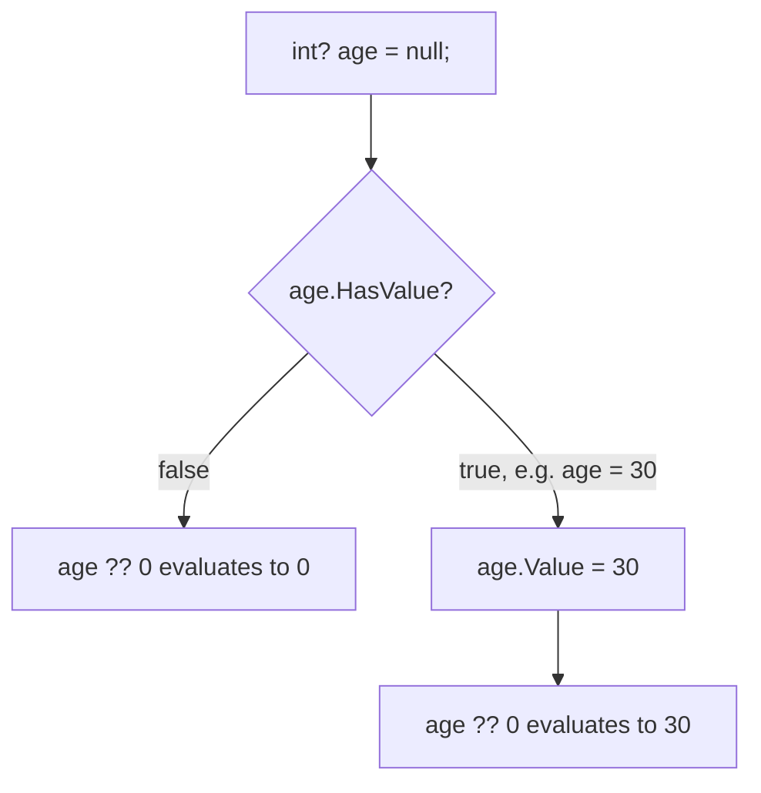
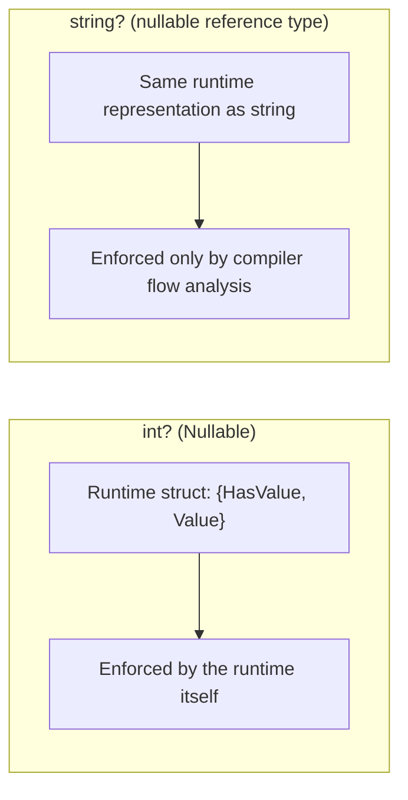

# Nullable Value Types

## Introduction

Before reading this lesson, you should already be comfortable with **[Optional and Named Arguments](../01-fundamentals/01-19-optional-and-named-arguments.md)**, particularly the idea that a parameter can be "not supplied." In this lesson we look at a related but distinct idea: how a *value type* itself — an `int`, a `bool`, a `DateTime`, a `struct` — can represent "no value at all," something value types cannot do on their own since they always hold some concrete value.

By the end of this lesson, you will be able to:

- Explain why ordinary value types like `int` cannot represent "no value" without help
- Declare a nullable value type using `Nullable<T>` or its shorthand `T?`
- Safely check and read a nullable value type's contents with `HasValue` and `Value`
- Use the null-coalescing operator (`??`) and `GetValueOrDefault()` to supply a fallback
- Recognize common scenarios (optional data, database columns) where nullable value types fit naturally

## Nullable Value Types — A Layman's Perspective

Think about a printed form with a box labeled "Number of children." If you have two children, you write "2." If you have zero children, you write "0." But what if the person filling out the form simply doesn't know yet, or the question doesn't apply to them at all — say, it's a form about a business, not a family? There's a real difference between "the answer is zero" and "there is no answer to give," but a plain numeric box on the form can't tell those two apart; whatever you write in it just looks like a number, whether it means "zero" or is standing in for "unknown."

Now imagine the form is redesigned with a checkbox next to that field: "☐ Not applicable." Suddenly the box can represent three distinct states clearly: a specific number, or explicitly "not applicable," with no confusion between the two. Someone reading the completed form first checks whether the "not applicable" box is ticked before even looking at the number field — because if it's ticked, whatever happens to be written in the number box (even a stray zero) shouldn't be trusted or used.

This is exactly the problem nullable value types solve. An ordinary `int` variable in C# is like that plain numeric box — it always holds *some* actual whole number; there's no built-in way for it to mean "no number was ever provided." But plenty of real-world data genuinely has a "not applicable" state: a customer's middle name field, a product's optional discount percentage, a sensor reading that hasn't arrived yet, a database column explicitly allowed to be empty. C#'s nullable value types add that "not applicable" checkbox to any value type, letting a variable represent either a real value or the deliberate absence of one, and — crucially — forcing your code to check which situation you're in before trusting the value, the same way a careful form-reader checks the checkbox first.

The bridge back to programming: wrapping a value type in `Nullable<T>` (written `T?`) adds exactly that extra "has no value" state on top of the type's normal range of values, and the type's API — `HasValue` and `Value` — mirrors the checkbox-then-read pattern, so your code is forced to acknowledge the possibility of "no value" rather than silently misreading a default as if it were real data.

## Nullable Value Types — A Programming Language Perspective

`Nullable<T>` is a generic `readonly struct` in the `System` namespace, constrained to value types (`where T : struct`), that wraps a value of type `T` alongside a `bool` flag indicating whether a value is actually present. C# provides the shorthand syntax `T?` (e.g., `int?`, `bool?`, `DateTime?`) as syntactic sugar for `Nullable<T>`. The struct exposes `HasValue` (a `bool` indicating whether a value was assigned), `Value` (the underlying `T`, which throws `InvalidOperationException` if accessed when `HasValue` is `false`), and `GetValueOrDefault()` (returns `Value` if present, or `default(T)` — or a supplied fallback overload — otherwise, without throwing). The compiler also permits an unwrapped comparison of a nullable value type against `null` directly (`if (x != null)`), and supports the null-coalescing operator `??` to produce a non-nullable fallback expression, and null-coalescing assignment `??=` to assign only when the variable is currently `null`. Arithmetic and comparison operators are "lifted" over `Nullable<T>`, so `int? a = 5; int? b = null; int? c = a + b;` yields `null` rather than throwing.

## How to Use Nullable Value Types in C#

Declaring a nullable value type is as simple as appending `?` after the underlying value type's name. Before reading the wrapped value, code should check `HasValue` (or compare against `null`, which the compiler translates to the same check) to avoid an `InvalidOperationException` from accessing `Value` when nothing was assigned. The null-coalescing operator `??` is the most common way to convert a nullable value into a plain, non-nullable one by supplying a fallback for the "no value" case in a single expression.


*Figure 1: HasValue distinguishes "no value" from a real value; the ?? operator collapses either state into a plain, non-nullable result.*

```csharp
// Program.cs — .NET 10 / C# 14
int? middleNameLength = null;
int? bonusPoints = 150;

Console.WriteLine($"Middle name length has value: {middleNameLength.HasValue}");
Console.WriteLine($"Bonus points has value: {bonusPoints.HasValue}");

int safeMiddleNameLength = middleNameLength ?? 0;
Console.WriteLine($"Safe middle name length: {safeMiddleNameLength}");

int safeBonusPoints = bonusPoints.GetValueOrDefault();
Console.WriteLine($"Safe bonus points: {safeBonusPoints}");

int? a = 10;
int? b = null;
int? sum = a + b;
Console.WriteLine($"Lifted sum (a + b): {(sum.HasValue ? sum.Value.ToString() : "null")}");

if (bonusPoints is int points)
{
    Console.WriteLine($"Pattern-matched points: {points}");
}
```

**Console Output:**

```text
Middle name length has value: False
Bonus points has value: True
Safe middle name length: 0
Safe bonus points: 150
Lifted sum (a + b): null
Pattern-matched points: 150
```

`middleNameLength` is declared but never assigned a real value, so `HasValue` is `false`; using `??` against it produces the fallback `0` without ever throwing. `bonusPoints.GetValueOrDefault()` achieves the same safe unwrapping in method form. The lifted addition `a + b` shows that arithmetic on nullable value types propagates "no value": since `b` is `null`, the entire expression is `null`, even though `a` has a real value — this mirrors how a spreadsheet formula referencing a blank cell often produces a blank result rather than treating the blank as zero. The final `is int points` pattern match is a concise, modern alternative to checking `HasValue` and then reading `Value` separately.

## Real-Time Example: Nullable Value Types in E-Commerce Order Processing

We continue building on the **E-Commerce Order Processing** case study, modeling a `Coupon` that a customer may or may not apply to an order. The discount percentage only makes sense when a coupon is present, so it is naturally represented as `decimal?` rather than forcing a fake sentinel value like `-1` or `0` to mean "no coupon."

```csharp
// Program.cs — .NET 10 / C# 14 — Real-Time Example
var orders = new List<Order>
{
    new("ORD-1001", 249.99m, DiscountPercent: 10m),
    new("ORD-1002", 89.50m, DiscountPercent: null),
    new("ORD-1003", 500.00m, DiscountPercent: 25m),
};

foreach (Order order in orders)
{
    decimal finalTotal = CalculateFinalTotal(order);
    string couponNote = order.DiscountPercent.HasValue
        ? $"{order.DiscountPercent.Value:F0}% coupon applied"
        : "no coupon applied";

    Console.WriteLine($"{order.OrderId}: ${order.Subtotal:F2} -> ${finalTotal:F2} ({couponNote})");
}

static decimal CalculateFinalTotal(Order order)
{
    decimal discountFraction = order.DiscountPercent.GetValueOrDefault() / 100m;
    return order.Subtotal - (order.Subtotal * discountFraction);
}

record Order(string OrderId, decimal Subtotal, decimal? DiscountPercent);
```

**Console Output:**

```text
ORD-1001: $249.99 -> $224.99 (10% coupon applied)
ORD-1002: $89.50 -> $89.50 (no coupon applied)
ORD-1003: $500.00 -> $375.00 (25% coupon applied)
```

`DiscountPercent` is `decimal?` because "no coupon" is a genuinely different state from "a 0% coupon" — a distinction that matters if the order history ever needs to report how many orders actually used a coupon versus received no discount. `CalculateFinalTotal` uses `GetValueOrDefault()` to safely treat a missing coupon as a `0` discount for the arithmetic, while the reporting logic separately uses `HasValue` to decide what message to print, keeping the "is there a coupon at all" question distinct from "what do we compute." In a real order-processing system backed by a database, `DiscountPercent` would map directly to a nullable numeric column, since SQL databases distinguish `NULL` from `0` in exactly the same way.

## Nullable Value Types vs Nullable Reference Types

Both nullable value types (`int?`) and nullable reference types (`string?`, covered in the next lesson) use the same `?` syntax and the same intent — representing "this might have no value" — but they work completely differently under the hood and at different points in the type system. `Nullable<T>` is a real runtime wrapper struct that changes what values a variable of type `T?` can actually hold at runtime: `HasValue` is checked with real, runtime-visible data. Nullable *reference* types, by contrast, add no runtime wrapper at all — a `string?` and a `string` are identical at runtime; the `?` only enables extra compile-time flow analysis by the compiler, which warns you about possible null-dereferences but does not stop a `null` from being assigned or throw automatically at the point of assignment.


*Figure 2: Nullable value types add a real runtime wrapper; nullable reference types add only compile-time annotations with no runtime change.*

| Aspect | Nullable Value Type (`int?`) | Nullable Reference Type (`string?`) |
|---|---|---|
| Runtime representation | `Nullable<T>` struct with `HasValue`/`Value` | Identical to the non-nullable reference type |
| Enforcement | Runtime-checked (`Value` throws if empty) | Compile-time warnings only, not enforced at runtime |
| Applies to | `struct` types (`int`, `bool`, `DateTime`, custom structs) | `class`, `interface`, `delegate`, `string`, array types |
| Introduced in | .NET Framework 2.0 / C# 2 | C# 8 (opt-in via `#nullable enable` or project setting) |

## Types of Nullable Value Type Usage in C#

1. **`Nullable<T>` / `T?` declaration** — wrapping any `struct` type to add a "no value" state.
2. **`HasValue` / `Value`** — the safe check-then-read pattern for accessing the wrapped value.
3. **`??` null-coalescing operator** — collapsing a nullable value into a plain value with a fallback in one expression.
4. **`GetValueOrDefault()`** — a non-throwing alternative to `Value`, optionally accepting an explicit fallback.
5. **[Nullable Reference Types](../01-fundamentals/01-21-nullable-reference-types.md)** — the compile-time-only counterpart for reference types like `string` and custom classes.
6. **[Tuples, Deconstruction, and Pattern Matching](../01-fundamentals/01-25-tuples-deconstruction-pattern-matching.md)** — pattern matching (`is int x`) offers a concise alternative to explicit `HasValue` checks.

## What You've Learned & What's Next

You've learned that ordinary value types cannot represent "no value" on their own, that `Nullable<T>` (written `T?`) wraps any `struct` with a `HasValue`/`Value` pair to add that missing state, and that `??` and `GetValueOrDefault()` provide safe, concise ways to fall back to a default when no value is present.

Continue your learning journey with **[Nullable Reference Types](../01-fundamentals/01-21-nullable-reference-types.md)**, where we apply this same "might have no value" idea to reference types like `string` and custom classes, enforced entirely through compile-time analysis rather than a runtime wrapper.

---
*Applies to: .NET 10 / C# 14. Last reviewed 2026-08-16.*
