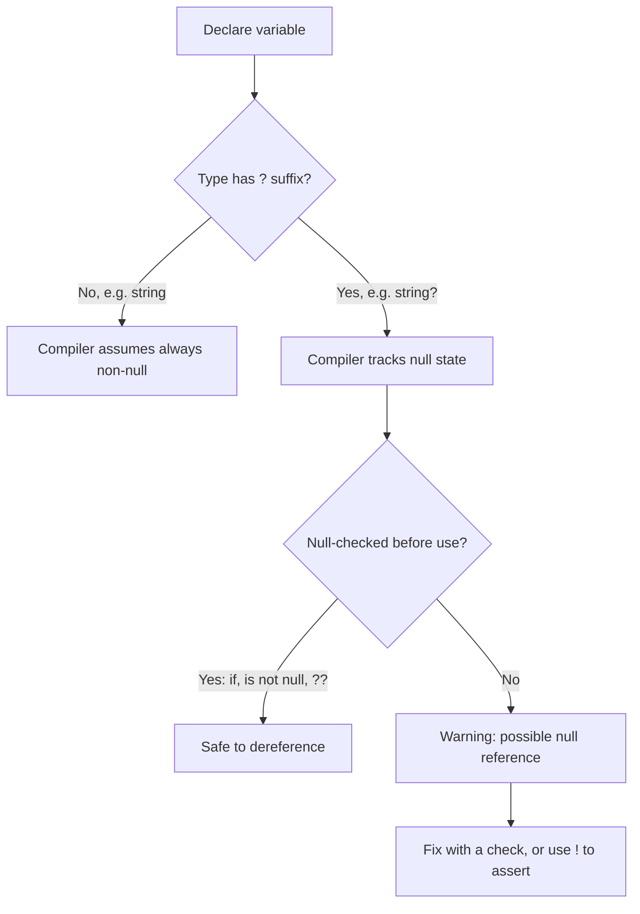
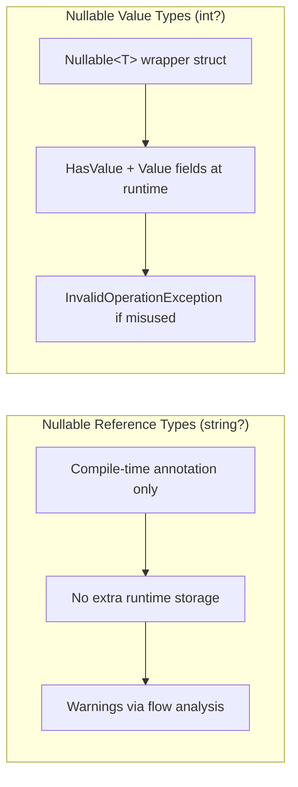

# Nullable Reference Types

## Introduction

Before reading this lesson, you should already be comfortable with **[Nullable Value Types](../01-fundamentals/01-20-nullable-value-types.md)** — how `int?` wraps a value type in `Nullable<T>` so it can represent "no value." In this lesson we build directly on that foundation to introduce **nullable reference types**, the compiler feature that brings the same "can this be missing?" question to `string`, arrays, and every other reference type.

By the end of this lesson, you will be able to:

- Explain the difference between `string` and `string?` in a nullable-enabled project
- Understand that nullable reference types are a compile-time analysis feature, not a runtime type change
- Read and resolve common nullable-warning codes the compiler produces
- Use the null-forgiving operator (`!`) correctly, and know why it should be rare
- Enable (or disable) the nullable context for a project via `<Nullable>enable</Nullable>`

## Nullable Reference Types — A Layman's Perspective

Imagine a shipping company that processes delivery labels all day long. Every label has a "Recipient Name" field. On some forms, that field is stamped "REQUIRED" — the warehouse clerk who fills it out is trained to never let that slip through blank, and everyone downstream (the driver, the scanner, the delivery app) can safely assume a name is always printed there. On other forms, the field is stamped "OPTIONAL — leave blank if unknown," perhaps because the package is being dropped at a business address where the exact recipient isn't known yet.

Now picture a meticulous quality-control inspector standing at the end of the packing line. Their entire job is to watch labels go by and flag anything suspicious — specifically, any process downstream that blindly assumes a name is present on a label that was only ever stamped "optional." If the loading-dock software tries to print "Attn: " followed by the recipient name, and that name field came from an "optional" label, the inspector raises a hand and says, "Wait — are you sure this label has a name on it? I can't guarantee it does." That's not the inspector refusing to let the package ship; it's a warning, a tap on the shoulder before a problem happens at the customer's doorstep instead of on the factory floor.

Sometimes the person operating the machinery knows something the inspector doesn't. Maybe the machine already checked the label three steps earlier and confirmed it has a name, but the inspector, watching only this one station, has no way to see that. In that case, the operator can sign a small override slip that says, "I have personally verified this — let it through." That's a deliberate, visible decision, not something you do out of habit — because if the operator is wrong, and the label genuinely has no name, the package still fails at the doorstep. The override slip doesn't fix a missing name; it just tells the inspector to stop asking.

This is exactly what nullable reference types do in C#. A reference type marked as "always present" (`string`) is like a label required to have a name — the compiler expects every path in your code to actually provide one. A reference type marked with `?` (`string?`) is like the optional label — the compiler tracks, statement by statement, whether you've confirmed it's non-null before you use it, and warns you the moment you try to use it without checking. The null-forgiving operator (`!`) is the override slip: a deliberate, visible signal that you — the developer — have reasoned about safety in a way the compiler's flow analysis couldn't see, and you're accepting responsibility if you're wrong.

The bridge back to programming: nullable reference types don't stop `null` from existing at runtime — reference types could always be `null` in C#, long before this feature existed. What changed is that the compiler now *tells you, while you're typing*, exactly where an unguarded `null` could reach a dereference — turning a class of bugs that used to surface as 2 a.m. production crashes into warnings you see the moment you write the line.

## Nullable Reference Types — A Programming Language Perspective

Nullable reference types (NRT) are a compile-time-only annotation and flow-analysis feature, active when a project's nullable context is `enable` (the default for new SDK-style project templates, set via `<Nullable>enable</Nullable>` in the `.csproj`). Within that context, every reference type has two spellings: `string` (the compiler expects it non-null on every path) and `string?` (the compiler tracks it as "may be null" and requires narrowing — via `if (x is not null)`, `??`, pattern matching, or similar — before allowing an unguarded dereference). Violations surface as compiler warnings (e.g., CS8600, CS8602, CS8604), not errors, and not IL differences — `string` and `string?` compile to the identical runtime type `System.String`; nothing about the CLR changes. The null-forgiving operator `!` suppresses the compiler's warning for a single expression without altering runtime behavior at all: if the value truly is `null`, `!` does not prevent the eventual `NullReferenceException`. Nullability can also be toggled locally with `#nullable enable`/`#nullable disable` directives.

## How to Use Nullable Reference Types in C#

Once a project has `<Nullable>enable</Nullable>` (the default since .NET 6, and still the modern default in .NET 10), the compiler performs flow analysis on every reference-typed variable. It starts each `string?` as "maybe null," and every `if`, `is`, `??`, or early `return` that rules out `null` narrows that variable to "known non-null" for the rest of that code path. Dereferencing a variable while it's still in the "maybe null" state produces a warning; dereferencing it after narrowing does not. Method parameters and return types are annotated the same way, so nullability becomes part of a method's contract, visible to every caller.


*Figure 1: How the compiler's null-flow analysis narrows a `string?` before allowing a dereference.*

```csharp
// Program.cs — .NET 10 / C# 14
// New SDK-style projects enable nullable reference types by default
// (<Nullable>enable</Nullable> in the .csproj), so this file assumes that context.

string firstName = "Ada";
string? middleName = null;

Console.WriteLine($"First name length: {firstName.Length}");

if (middleName is not null)
{
    // Inside this block, the compiler has narrowed middleName to non-null.
    Console.WriteLine($"Middle name length: {middleName.Length}");
}
else
{
    Console.WriteLine("No middle name on file.");
}

Console.WriteLine($"Parsed age: {ParseAge("34")}");
Console.WriteLine($"Parsed age (unknown): {ParseAge(null)}");

string? cachedName = GetCachedName();
if (cachedName is not null)
{
    Console.WriteLine($"Cached name: {cachedName}");
}

// Null-forgiving operator: use only when you're certain the compiler's flow
// analysis simply can't see what you already know to be true.
string trustedName = GetCachedName()!;
Console.WriteLine($"Trusted name: {trustedName}");

static int ParseAge(string? rawAge)
{
    if (rawAge is null)
    {
        return 0;
    }

    return int.Parse(rawAge);
}

static string? GetCachedName() => "Grace";
```

**Console Output:**

```text
First name length: 4
No middle name on file.
Parsed age: 34
Parsed age (unknown): 0
Cached name: Grace
Trusted name: Grace
```

Notice that `firstName.Length` needed no check at all — the compiler already knows `firstName` is non-null because its declared type is `string`, not `string?`. Every other dereference of a `string?` value had to be earned, either through an `is not null` check that narrows the variable within its scope, or through the `!` operator, which tells the compiler "trust me" without changing what happens if that trust turns out to be misplaced.

## Real-Time Example: Nullable Reference Types in Library/Inventory Management

We continue building on the Library/Inventory Management case study. A `Member` record has a required `Email` (every member must have one to register) but an optional `PhoneNumber` (many members never provide one). When the library sends overdue-loan reminders, it needs to pick a notification channel per member — SMS when a phone number exists, email otherwise — and nullable reference types make that fallback logic explicit and compiler-checked rather than a hopeful assumption.

```csharp
// Program.cs — .NET 10 / C# 14 — Real-Time Example
// Extends the Library/Inventory Management case study introduced earlier in the module.

var members = new List<Member>
{
    new Member(1, "Grace Hopper", "grace@example.com", "555-0100"),
    new Member(2, "Ada Lovelace", "ada@example.com", null),
};

var overdueLoans = new List<Loan>
{
    new Loan(memberId: 1, bookTitle: "The Pragmatic Programmer", daysOverdue: 3),
    new Loan(memberId: 2, bookTitle: "Clean Code", daysOverdue: 7),
    new Loan(memberId: 99, bookTitle: "Refactoring", daysOverdue: 1),
};

foreach (Loan loan in overdueLoans)
{
    Member? member = members.Find(m => m.Id == loan.MemberId);

    if (member is null)
    {
        Console.WriteLine($"Warning: no member record found for loan of '{loan.BookTitle}'.");
        continue;
    }

    NotifyMember(member, loan);
}

static void NotifyMember(Member member, Loan loan)
{
    string channel = member.PhoneNumber is not null ? "SMS" : "email";
    string destination = member.PhoneNumber ?? member.Email;

    Console.WriteLine(
        $"Sending {channel} reminder to {member.Name} ({destination}): " +
        $"'{loan.BookTitle}' is {loan.DaysOverdue} day(s) overdue.");
}

record Member(int Id, string Name, string Email, string? PhoneNumber);
record Loan(int MemberId, string BookTitle, int DaysOverdue);
```

**Console Output:**

```text
Sending SMS reminder to Grace Hopper (555-0100): 'The Pragmatic Programmer' is 3 day(s) overdue.
Sending email reminder to Ada Lovelace (ada@example.com): 'Clean Code' is 7 day(s) overdue.
Warning: no member record found for loan of 'Refactoring'.
```

Notice `Member.Email` is declared as plain `string` — the compiler enforces that every `Member` instance must have one, so `member.Email` never needs a null check. `PhoneNumber` and the result of `List<T>.Find` (which returns `null` when nothing matches) are both `string?` and `Member?` respectively, forcing the fallback logic and the missing-record check to exist. In a real library system, skipping either check would mean a silent crash the next time a member genuinely has no phone number, or a loan record that doesn't match any known member — exactly the kind of bug NRT is designed to surface at compile time instead of in production.

## Nullable Reference Types vs Nullable Value Types

Both features answer the same question — "can this be missing?" — but they work through entirely different mechanisms because reference types and value types are represented differently at runtime. A `string?` is still, at the CLR level, just a `System.String` reference that happens to be `null`; the `?` adds zero runtime overhead and zero new members — it exists purely so the compiler can track and warn. An `int?`, by contrast, really is a different runtime construct: `Nullable<int>`, a struct wrapping the `int` alongside a `bool HasValue` flag, and accessing `.Value` when `HasValue` is `false` throws an `InvalidOperationException` at runtime — a real runtime check, not just a compile-time warning.


*Figure 2: Nullable reference types are a compiler-only concept; nullable value types are a real runtime wrapper struct.*

| Aspect | Nullable Reference Types (`string?`) | Nullable Value Types (`int?`) |
|---|---|---|
| Underlying mechanism | Compiler annotation + flow analysis | `Nullable<T>` struct |
| Runtime representation | Identical to the non-nullable type | Extra `HasValue`/`Value` fields |
| Enforcement | Warnings only (opt-in via project setting) | Real runtime exception if misused |
| Can be fully disabled | Yes, per-project or per-file | No — it's a core language/BCL feature |
| Typical failure mode | `NullReferenceException` if warnings ignored | `InvalidOperationException` from `.Value` |

## Variants of Null-Handling Syntax in C#

Nullable reference types work alongside several other null-handling constructs you'll use constantly:

1. **[Nullable Value Types](../01-fundamentals/01-20-nullable-value-types.md)** — the `Nullable<T>` mechanism for value types like `int?`, covered in the previous lesson.
2. **Null-conditional and null-coalescing operators (`?.`, `??`, `??=`)** — covered as part of **[Operators in C#](../01-fundamentals/01-06-operators-in-csharp.md)** — the concise way to narrow or default a nullable value in a single expression.
3. **Pattern-based null checks (`is null` / `is not null`)** — previewed here and covered fully in **[Tuples, Deconstruction, and Pattern Matching](../01-fundamentals/01-25-tuples-deconstruction-pattern-matching.md)**.
4. **`required` Members and Object Initializers** — covered in **[required Members and Object Initializers](../02-oop/02-22-required-members-object-initializers.md)** — enforcing non-null state at construction, one layer beyond NRT's warnings.
5. **`ArgumentNullException.ThrowIfNull`** — a runtime guard clause covered alongside **[Custom Exceptions](../05-exception-handling/05-04-custom-exceptions.md)** for validating nullable inputs at public API boundaries.
6. **Equality checks on nullable types** — explored further in **[Equality: Equals, ==, and IEquatable\<T\>](../02-oop/02-33-equality-equals-iequatable.md)**.

## What You've Learned & What's Next

Nullable reference types don't change what can happen at runtime — reference types could always be `null` — but they give the compiler enough information to warn you, at the exact line of code, whenever an unguarded `null` might reach a dereference. That turns a huge category of runtime crashes into compile-time feedback, provided you resist reaching for `!` as a shortcut instead of an honest, checked assertion.

Continue your learning journey with **[var and dynamic](../01-fundamentals/01-22-var-and-dynamic.md)**, where we look at two very different kinds of "flexible" typing — one still fully checked by the compiler, the other resolved only at runtime.

---
*Applies to: .NET 10 / C# 14. Last reviewed 2026-08-16.*
