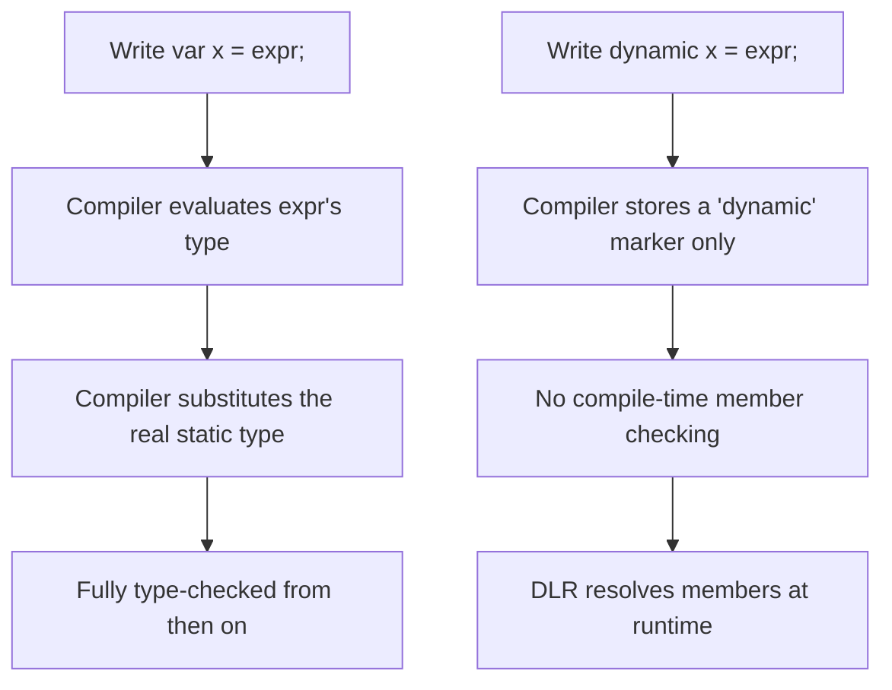
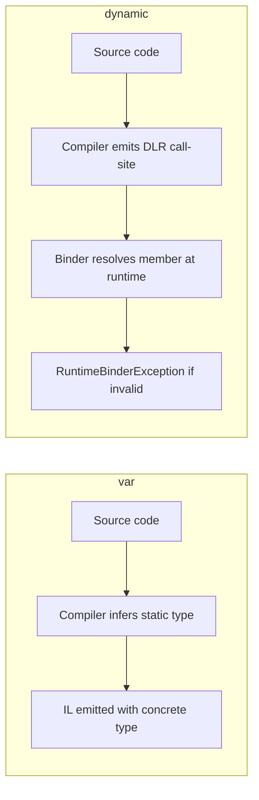

# var and dynamic

## Introduction

Before reading this lesson, you should already be comfortable with **[Nullable Reference Types](../01-fundamentals/01-21-nullable-reference-types.md)** — how the compiler tracks whether a reference might be `null`. That tracking depends entirely on the compiler knowing a variable's exact type at compile time. In this lesson we look at two keywords that sound similar but sit on opposite ends of that spectrum: **`var`**, which asks the compiler to infer a concrete static type for you, and **`dynamic`**, which asks the compiler to defer typing entirely until the program is running.

By the end of this lesson, you will be able to:

- Explain why `var` is still fully statically typed, despite looking "untyped"
- Explain how `dynamic` defers member resolution to the runtime via the DLR
- Recognize when each keyword is the appropriate (and inappropriate) choice
- Predict what happens when a `dynamic` operation can't actually be resolved at runtime
- Set up a project correctly so that `dynamic` compiles at all in modern .NET

## var and dynamic — A Layman's Perspective

Picture a shipping warehouse where every outgoing box needs a label describing exactly what's inside, because the automated sorting machinery downstream reads that label to route the box correctly. When a worker packs a box, they could write the label out by hand — or they could hand the box to a labeling machine that inspects the contents the instant the box is sealed and prints an exact, permanent label: "Ceramic Mug, Fragile, 1.2kg." From that moment on, every downstream machine trusts that label completely; it was determined once, at packing time, and it never changes. That's `var`. It doesn't mean "no label" — it means "let the machine figure out the exact label for me, right now, based on what I'm actually putting in the box," and once printed, that label is exactly as fixed and precise as if the worker had written it by hand.

`dynamic` describes a very different box: one stamped "CONTENTS DETERMINED AT DELIVERY." Nobody inspects what's inside when it's packed and sealed — the label is deliberately left blank. This is genuinely useful for certain shipments — say, a box coming from an overseas partner warehouse whose exact contents and labeling conventions your own systems can't predict in advance. But it comes at a cost: every downstream machine that would normally read a label and act instantly now has to stop, open the box, and figure out what's inside before doing anything with it — every single time that box passes through a station. And if a machine expects to find, say, a fragile item needing padding, but the box actually contains loose bolts, that mismatch isn't caught back at the packing line. It's discovered — sometimes with a crash — at the exact station trying to handle it, however far down the line that is.

This is the crucial distinction people get backwards: `var` is not "give up on typing." It's "let the compiler write the precise type down for me instead of me typing it out by hand" — and once it's written down, it behaves exactly like it would if you'd typed `string name = ...` yourself. IntelliSense, compile errors, and refactoring tools all work on a `var` exactly as they would on any explicitly typed variable, because as far as the compiler is concerned, there's no difference after that first line compiles. `dynamic`, on the other hand, genuinely does give up compile-time checking for that variable — the compiler accepts almost anything you write against it and waits until the program is actually running to find out whether it makes sense, exactly like that unlabeled box waiting to be opened at its final stop.

The bridge back to programming: reach for `var` constantly, for readability, with zero type-safety cost. Reach for `dynamic` rarely, and deliberately, only when you're genuinely working with something whose shape truly can't be known until runtime — like data from an external, loosely structured source.

## var and dynamic — A Programming Language Perspective

`var` is a compile-time type-inference keyword: the compiler examines the initializer expression, determines its exact static type, and substitutes that type into the compiled code as if you had written it explicitly. `var` requires an initializer, cannot change the inferred type afterward, and produces zero runtime difference from explicit typing — it is purely a source-level convenience. `dynamic`, by contrast, is a genuine static type in the C# type system (`System.Object` at the CLR level, tagged with `DynamicAttribute` in metadata) whose member access, operators, and method calls are *not* resolved by the C# compiler at all. Instead, the compiler emits call sites that invoke the **Dynamic Language Runtime (DLR)**, which performs the equivalent of overload resolution and member lookup at runtime, against the object's actual runtime type. Errors that would normally be `CS`-prefixed compile errors instead surface as a `Microsoft.CSharp.RuntimeBinder.RuntimeBinderException` thrown while the program is running.

## How to Use var and dynamic in C#

`var` can be used anywhere a local variable is declared with an initializer — the compiler determines the type from the right-hand side and locks it in. `dynamic` can be used for variables, fields, parameters, and return types; wherever it appears, the compiler stops checking members and operators on that value and instead defers to the DLR at runtime. In modern .NET SDK-style console/library projects, using `dynamic` also requires adding a package reference to `Microsoft.CSharp`, since — unlike the old .NET Framework — it isn't part of the default shared framework.


*Figure 1: `var` resolves its type once, at compile time; `dynamic` defers resolution to every runtime call site.*

```csharp
// Program.cs — .NET 10 / C# 14
// Requires a package reference to Microsoft.CSharp for the dynamic examples below:
//   <PackageReference Include="Microsoft.CSharp" Version="4.7.0" />

var count = 42;                                     // inferred as int
var name = "Ada Lovelace";                           // inferred as string
var prices = new List<decimal> { 19.99m, 5.49m };    // inferred as List<decimal>

Console.WriteLine($"count is {count.GetType().Name}");
Console.WriteLine($"name is {name.GetType().Name}");
Console.WriteLine($"prices is {prices.GetType().Name}, total = {prices.Sum()}");

dynamic value = 10;
Console.WriteLine($"dynamic value = {value}, runtime type = {value.GetType().Name}");

value = "now I'm a string";
Console.WriteLine($"dynamic value = {value}, runtime type = {value.GetType().Name}");

try
{
    value = 5;
    // int has no .Length member — the compiler allows this line to compile
    // because 'value' is dynamic, but resolving the member is deferred to runtime.
    Console.WriteLine(value.Length);
}
catch (Microsoft.CSharp.RuntimeBinder.RuntimeBinderException ex)
{
    Console.WriteLine($"Runtime error: {ex.Message}");
}
```

**Console Output:**

```text
count is Int32
name is String
prices is List`1, total = 25.48
dynamic value = 10, runtime type = Int32
dynamic value = now I'm a string, runtime type = String
Runtime error: 'int' does not contain a definition for 'Length'
```

Every `var` in this example is fully typed the instant it compiles — `count` is exactly `int`, `prices` is exactly `List<decimal>`, and IntelliSense would show `.Sum()` and every other `List<decimal>` member immediately. The `dynamic value`, however, changes its *runtime* type freely from `int` to `string` and back, and the compiler never objects to any member access on it — not even `.Length` on an `int`, which doesn't exist. That mistake is only caught when the DLR actually tries to resolve it, which is why we needed a `try`/`catch` around it — something you'd never need for a `var`-typed value making the same mistake, because the compiler would simply refuse to build.

## Real-Time Example: var and dynamic in Banking/ATM

We continue building on the Banking/ATM case study's `Account` type. Most of the code uses `var` for ordinary, fully-known local variables — there's nothing risky here, just less typing. But the bank also integrates with an external payment gateway partner whose response payload shape isn't controlled by our own codebase; here, `dynamic` (backed by `ExpandoObject`) lets us consume that loosely-structured response without writing — and constantly updating — a dedicated class for every partner's quirks.

```csharp
// Program.cs — .NET 10 / C# 14 — Real-Time Example
// Extends the Banking/ATM case study's Account type from earlier fundamentals lessons.
using System.Dynamic;
using System.Globalization;

var culture = CultureInfo.GetCultureInfo("en-US");
var account = new Account(accountNumber: "ACC-1001", balance: 500.00m);
Console.WriteLine($"Account {account.AccountNumber} balance: {account.Balance.ToString("C", culture)}");

// A partner payment gateway returns its response as a loosely-typed payload
// whose exact shape depends on which gateway integration is configured.
dynamic gatewayResponse = BuildGatewayResponse();

decimal depositAmount = gatewayResponse.Amount;
string reference = gatewayResponse.ReferenceId;

var updatedAccount = account with { Balance = account.Balance + depositAmount };

Console.WriteLine($"Applied deposit of {depositAmount.ToString("C", culture)} (ref: {reference})");
Console.WriteLine($"New balance for {updatedAccount.AccountNumber}: {updatedAccount.Balance.ToString("C", culture)}");

static dynamic BuildGatewayResponse()
{
    dynamic response = new ExpandoObject();
    response.Amount = 250.00m;
    response.ReferenceId = "GW-88213";
    return response;
}

record Account(string AccountNumber, decimal Balance);
```

**Console Output:**

```text
Account ACC-1001 balance: $500.00
Applied deposit of $250.00 (ref: GW-88213)
New balance for ACC-1001: $750.00
```

The `var account`, `var updatedAccount`, and `var culture` declarations are all ordinary type inference — nothing about `Account` or `CultureInfo` is uncertain, so `var` is just a readability choice with zero runtime cost. `gatewayResponse`, on the other hand, genuinely needs `dynamic`: its two properties (`Amount`, `ReferenceId`) are attached at runtime via `ExpandoObject`, and no compile-time class describes them. The moment we read `gatewayResponse.Amount` into a strongly-typed `decimal depositAmount`, we're back in fully checked, `var`-friendly territory — `dynamic` is deliberately confined to the narrow boundary where the data genuinely originates outside our own type system.

## var vs dynamic

The core distinction is *when* typing happens, not *whether* typing happens. `var` types happen exactly once, at compile time, and are indistinguishable from explicit types afterward — the compiler, IntelliSense, and every analyzer treat a `var x = "hi"` exactly like `string x = "hi"`. `dynamic` genuinely postpones typing to runtime: the same line of code can succeed or throw depending on what object happens to be assigned to it when that line actually executes, and refactoring tools can't safely rename members on a `dynamic` value because they have no static type to check against.


*Figure 2: `var` is resolved once by the compiler; `dynamic` is resolved on every call, by the runtime binder.*

| Aspect | `var` | `dynamic` |
|---|---|---|
| Type resolved | Compile time, from the initializer | Runtime, from the actual object each time |
| Static type safety | Full — identical to explicit typing | None — the compiler checks nothing |
| Performance | No overhead vs explicit typing | Runtime binder overhead on every call |
| IntelliSense / refactoring | Full support | Effectively none |
| Typical use case | Readability for any local variable | COM interop, reflection-heavy code, loosely-typed external data |
| Failure surfaces as | Compile error | `RuntimeBinderException` at runtime |

## Variants of Flexible Typing in C#

`var` and `dynamic` are two ends of a spectrum; several other constructs sit between or alongside them:

1. **[Anonymous Types](../02-oop/02-28-anonymous-types.md)** — `var` is actually required here, since an anonymous type has no name you could write explicitly.
2. **[Type Conversion and Casting](../01-fundamentals/01-08-type-conversion-and-casting.md)** — the statically-typed way to change how a value is treated, in contrast to `dynamic`'s runtime resolution.
3. **[Records in C#](../02-oop/02-19-records-in-csharp.md)** — `var` is idiomatic when constructing a record instance, since the record's own name is usually redundant on the right-hand side.
4. **[Dynamic Type Inspection](../13-reflection-sourcegen-lowlevel/13-03-dynamic-type-inspection.md)** — a more structured, explicit alternative to `dynamic` for examining an object's shape at runtime.
5. **[Pattern Matching and Type Patterns](../01-fundamentals/01-25-tuples-deconstruction-pattern-matching.md)** — a statically-checked way to branch on an object's runtime type, without giving up compile-time safety the way `dynamic` does.
6. **[Generic Methods](../03-collections-generics/03-17-generic-methods.md)** — another route to flexible, reusable code that stays fully type-checked, unlike `dynamic`.

## What You've Learned & What's Next

`var` is a compiler convenience: it saves you typing without costing you a single ounce of type safety, because the exact type is still nailed down at compile time. `dynamic` is the opposite trade — genuinely useful at the narrow boundary where you're consuming data whose shape truly isn't known until the program runs, but a keyword to reach for sparingly, since every member access on it skips the compiler entirely.

Continue your learning journey with **[Constants and readonly Fields](../01-fundamentals/01-23-constants-and-readonly.md)**, where we look at two more ways C# nails down a value once — one at compile time, one at runtime.

---
*Applies to: .NET 10 / C# 14. Last reviewed 2026-08-16.*
