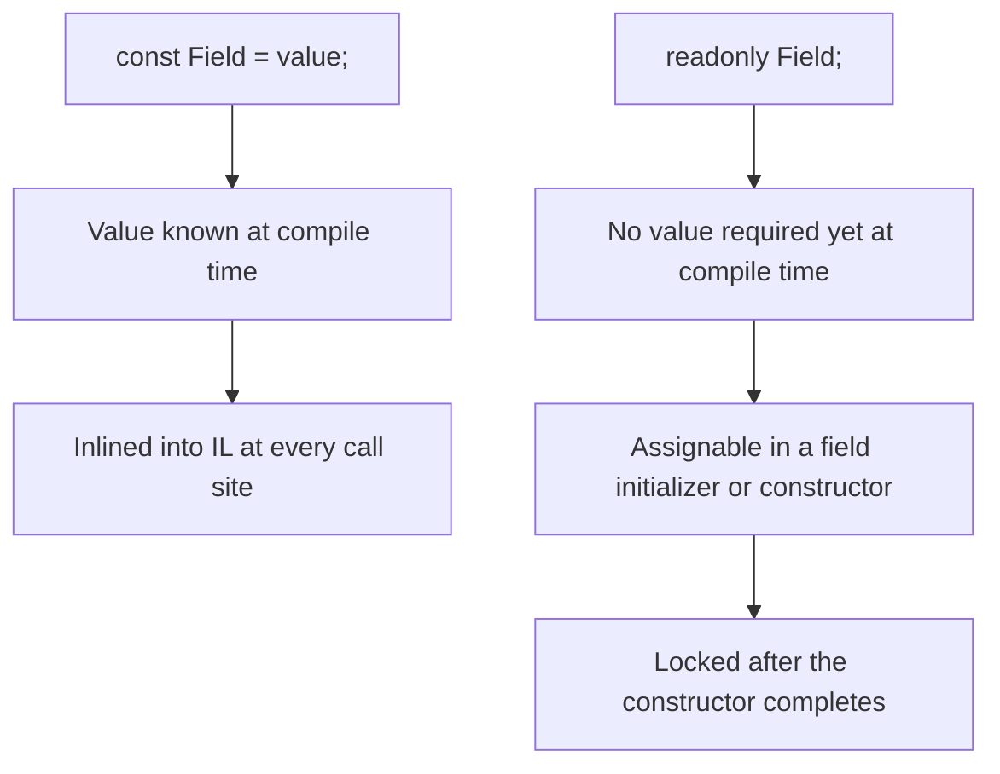
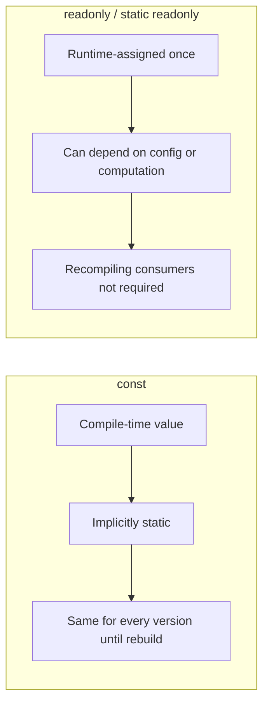

# Constants and readonly Fields

## Introduction

Before reading this lesson, you should already be comfortable with **[var and dynamic](../01-fundamentals/01-22-var-and-dynamic.md)** — and specifically with the idea that some things in C# are locked down at compile time while others are resolved at runtime. That same distinction is exactly what separates **`const`** from **`readonly`**, the two keywords this lesson covers for values that, once set, are never allowed to change again.

By the end of this lesson, you will be able to:

- Declare a `const` field and explain why its value must be known at compile time
- Declare a `readonly` field and explain where it may legally be assigned
- Use `static readonly` for a shared value that's computed once, at runtime
- Choose correctly between `const` and `readonly` for a given business rule
- Explain why changing a `const` in a shared library can require recompiling its consumers

## Constants and readonly Fields — A Layman's Perspective

Imagine two very different ways an organization can "lock in" a number so nobody can quietly change it later. The first is an engraved stone plaque, mounted in the lobby before the building even opens: "Maximum Occupancy: 200 Persons." That number was decided during the architectural planning stage, chiseled permanently into the stone, and it is now physically identical everywhere anyone reads it — every fire-safety poster, every laminated card at reception, every reference to "maximum occupancy" in any document was printed by copying that exact chiseled number at the time each document was made. If the fire marshal later approves a higher limit, the stone plaque doesn't magically update — you have to physically re-carve a new plaque and reprint every single document that had copied the old number onto itself.

The second is a sealed envelope, handed personally to each new employee on their very first day of orientation, containing that employee's unique badge number. Nobody decided badge numbers when the building's blueprints were drawn — they can't have, since nobody knew who would be hired yet. Instead, HR fills in and seals a fresh envelope the moment each person actually joins, using information only available at that moment (the next number in sequence, that person's specific role). Once sealed on day one, the envelope is never reopened or rewritten — that badge number is that employee's for as long as they work there — but critically, it was decided at "move-in" time, not baked into the building's original blueprints, and it's allowed to be different for every single employee.

The stone plaque is `const`: a value fixed so early and so completely that it gets physically copied into every place that references it, and changing it later means updating every one of those copies. The sealed envelope is `readonly`: a value that can only be decided once — during a specific, well-defined window (here, orientation; in C#, a constructor) — using information that might not exist any earlier, and which can legitimately differ from one instance to the next.

There's a third pattern worth knowing: a single master ledger book kept at the front desk, computed once when the building first opens — say, "today's approved emergency contact number" — that every employee's orientation packet defers to rather than each carrying their own copy. That's `static readonly`: a value shared across every instance, but, like the sealed envelope, computed once at "startup" rather than chiseled into the original blueprints.

The bridge back to programming: reach for the stone plaque (`const`) only for values that are truly universal and truly fixed forever, like a mathematical fact. Reach for the sealed envelope (`readonly`) for anything that depends on information only available at construction time, or that you might reasonably need to change without forcing every downstream consumer to recompile.

## Constants and readonly Fields — A Programming Language Perspective

A `const` field is a compile-time constant: its initializer must be an expression the compiler can fully evaluate during compilation (a numeric literal, string literal, `enum` member, or an expression composed entirely of other constants). `const` fields are implicitly `static`, and — critically — the compiler substitutes the literal value directly into the IL of every consuming assembly at compile time, rather than emitting a reference to a shared memory location. A `readonly` field, by contrast, may be assigned only within a field initializer or within the constructor of its declaring type (instance `readonly`) — or within a static constructor or static field initializer for `static readonly` — after which no further assignment is permitted from anywhere. Because `readonly` assignment happens at runtime, its value may depend on runtime data: configuration, environment, or a computed expression unavailable at compile time. `static readonly` combines both: one value, shared across all instances, computed once when the type is first used.

## How to Declare Constants and readonly Fields in C#

Declare a `const` with the `const` keyword and an initializer the compiler can evaluate immediately — no constructor call, no method call, no runtime lookup. Declare a `readonly` field with the `readonly` keyword; it starts unassigned (or holds its field-initializer value) and may be assigned exactly once more, inside a constructor, after which the compiler enforces that it can never be reassigned again — including from within the same class's other methods.


*Figure 1: `const` is inlined at compile time; `readonly` keeps an open assignment window through the constructor.*

```csharp
// Program.cs — .NET 10 / C# 14

const double TaxRate = 0.08; // compile-time constant, inlined wherever it's used

var order1 = new Order(subtotal: 100m, createdAtUtc: new DateTime(2026, 1, 10, 9, 30, 0, DateTimeKind.Utc));
var order2 = new Order(subtotal: 250m, createdAtUtc: new DateTime(2026, 1, 10, 14, 0, 0, DateTimeKind.Utc));

Console.WriteLine($"Order 1 subtotal: {order1.Subtotal:C}, tax: {(double)order1.Subtotal * TaxRate:C}");
Console.WriteLine($"Order 1 created: {order1.CreatedAtUtc:yyyy-MM-dd HH:mm} UTC");
Console.WriteLine($"Order 2 subtotal: {order2.Subtotal:C}, tax: {(double)order2.Subtotal * TaxRate:C}");
Console.WriteLine($"Order 2 created: {order2.CreatedAtUtc:yyyy-MM-dd HH:mm} UTC");
Console.WriteLine($"Max items allowed per order: {Order.MaxItemsPerOrder}");

class Order
{
    // static readonly: computed once at runtime (here, from a stand-in "config"
    // method) rather than baked in at compile time the way a const would be.
    public static readonly int MaxItemsPerOrder = LoadMaxItemsFromConfig();

    // instance readonly: assigned once, in the constructor, and can hold a
    // different value per instance — a const could never do this.
    public readonly DateTime CreatedAtUtc;
    public decimal Subtotal { get; }

    public Order(decimal subtotal, DateTime createdAtUtc)
    {
        Subtotal = subtotal;
        CreatedAtUtc = createdAtUtc;
    }

    private static int LoadMaxItemsFromConfig() => 50;
}
```

**Console Output:**

```text
Order 1 subtotal: $100.00, tax: $8.00
Order 1 created: 2026-01-10 09:30 UTC
Order 2 subtotal: $250.00, tax: $20.00
Order 2 created: 2026-01-10 14:00 UTC
Max items allowed per order: 50
```

`TaxRate` is inlined by the compiler everywhere it's referenced — there's no runtime lookup happening at all. `MaxItemsPerOrder` is shared by every `Order` instance, but unlike `TaxRate`, it was computed by actually calling a method at runtime — the compiler couldn't have inlined it even if it wanted to, because it doesn't know at compile time what `LoadMaxItemsFromConfig()` will return. And `CreatedAtUtc` is genuinely different for `order1` and `order2`, something a `const` field, being shared and fixed for the whole program, could never express.

## Real-Time Example: Constants and readonly Fields in Banking/ATM

We continue building on the Banking/ATM case study's `Account` type. A bank has a business rule that's genuinely fixed and universal — no account may be opened below a minimum balance — alongside a daily withdrawal limit that in a real system would come from configuration and could vary by environment, and each account's own account number, fixed the moment that specific account is created.

```csharp
// Program.cs — .NET 10 / C# 14 — Real-Time Example
// Extends the Banking/ATM case study's Account type from earlier fundamentals lessons.

var checking = new Account("ACC-2001", openingBalance: 500m);
var savings = new Account("ACC-2002", openingBalance: 1200m);

Console.WriteLine($"Minimum opening balance allowed: {Account.MinimumOpeningBalance:C}");
Console.WriteLine($"Daily withdrawal limit: {Account.DailyWithdrawalLimit:C}");
Console.WriteLine();

TryWithdraw(checking, 300m);
TryWithdraw(checking, 400m);
TryWithdraw(savings, 1500m);

static void TryWithdraw(Account account, decimal amount)
{
    if (amount > Account.DailyWithdrawalLimit)
    {
        Console.WriteLine($"{account.AccountNumber}: withdrawal of {amount:C} exceeds the daily limit.");
        return;
    }

    if (amount > account.Balance)
    {
        Console.WriteLine($"{account.AccountNumber}: insufficient funds for {amount:C}.");
        return;
    }

    account.Withdraw(amount);
    Console.WriteLine($"{account.AccountNumber}: withdrew {amount:C}, new balance {account.Balance:C}.");
}

class Account
{
    // const: a fixed business rule that will never vary by environment or
    // instance, and is known at compile time.
    public const decimal MinimumOpeningBalance = 25m;

    // static readonly: shared across every Account, but computed at
    // startup — in a real system this might come from configuration.
    public static readonly decimal DailyWithdrawalLimit = LoadWithdrawalLimit();

    // instance readonly: fixed once per account, at construction, and
    // never reassigned afterward.
    public readonly string AccountNumber;
    public decimal Balance { get; private set; }

    public Account(string accountNumber, decimal openingBalance)
    {
        if (openingBalance < MinimumOpeningBalance)
        {
            throw new ArgumentException($"Opening balance must be at least {MinimumOpeningBalance:C}.");
        }

        AccountNumber = accountNumber;
        Balance = openingBalance;
    }

    public void Withdraw(decimal amount) => Balance -= amount;

    private static decimal LoadWithdrawalLimit() => 1000m;
}
```

**Console Output:**

```text
Minimum opening balance allowed: $25.00
Daily withdrawal limit: $1,000.00

ACC-2001: withdrew $300.00, new balance $200.00.
ACC-2001: insufficient funds for $400.00.
ACC-2002: withdrawal of $1,500.00 exceeds the daily limit.
```

`MinimumOpeningBalance` never changes and needs no runtime computation, so `const` is exactly right — and every `Account` constructor call benefits from that value being baked directly into the compiled code. `DailyWithdrawalLimit`, however, is deliberately `static readonly` rather than `const`: in a real bank it would be loaded from configuration that might differ across environments, and using `readonly` here means changing that source doesn't require recompiling every assembly that references it — only rerunning the app.

## const vs readonly vs static readonly

The real dividing line isn't "compile time vs runtime" alone — it's *whose* value it is and *when* that value can legally be decided. `const` values are decided once, for the entire compiled program, before it even runs, and every consumer gets a private copy baked into its own IL. `readonly` values are decided once per object, during that object's construction, using whatever runtime information is available at that moment. `static readonly` sits in between: one shared value like `const`, but decided at runtime like `readonly` — the practical choice whenever a "constant" actually needs to be computed, read from configuration, or simply might change in a future release without forcing every consumer to rebuild.


*Figure 2: `const` bakes a value into every consumer at compile time; `readonly` defers assignment to runtime.*

| Aspect | `const` | `readonly` (instance) | `static readonly` |
|---|---|---|---|
| Value known | Compile time | Runtime, per instance | Runtime, once for the type |
| Assignable where | Inline initializer only | Field initializer or constructor | Field initializer or static constructor |
| Can differ per instance | No | Yes | No — shared |
| Cross-assembly updates | Requires recompiling consumers | Just redeploy the defining assembly | Just redeploy the defining assembly |
| Typical use | True universal constants (`Math.PI`-style) | Per-instance identity or config | Shared computed/config values |

## Types of "Locked-Once" Values in C#

`const` and `readonly` are the two most direct tools, but several related lessons build on the same "assign once" idea:

1. **[Enums in C#](../01-fundamentals/01-24-enums-in-csharp.md)** — a type-safe alternative to loosely related integer constants, covered next.
2. **[`init`-Only Setters](../02-oop/02-32-init-only-setters.md)** — another way to allow one-time assignment, but from an object initializer rather than only inside the constructor body.
3. **[Immutability in C#](../02-oop/02-31-immutability-in-csharp.md)** — `const` and `readonly` are two of the basic building blocks of a fully immutable type.
4. **[`required` Members and Object Initializers](../02-oop/02-22-required-members-object-initializers.md)** — enforcing that a value *must* be set once, at the type level, rather than just permitting it.
5. **[Configuration and the Options Pattern](../10-aspnetcore/10-19-configuration-and-options-pattern.md)** — where real-world `static readonly` configuration values are typically sourced from.
6. **[Singleton Pattern](../12-advanced-concepts/12-06-singleton-pattern.md)** — a design pattern commonly implemented with a `static readonly` field holding the single shared instance.

## What You've Learned & What's Next

`const` locks a value in so early and so completely that the compiler copies it directly into every consumer at compile time — appropriate only for values that are truly universal and truly permanent. `readonly` (and its `static` cousin) defer that same "assign once" guarantee to runtime, letting the value depend on construction-time or startup-time information, without forcing every downstream project to recompile if it changes.

Continue your learning journey with **[Enums in C#](../01-fundamentals/01-24-enums-in-csharp.md)**, where we look at a type-safe, named alternative to scattering related integer constants throughout your code.

---
*Applies to: .NET 10 / C# 14. Last reviewed 2026-08-16.*
