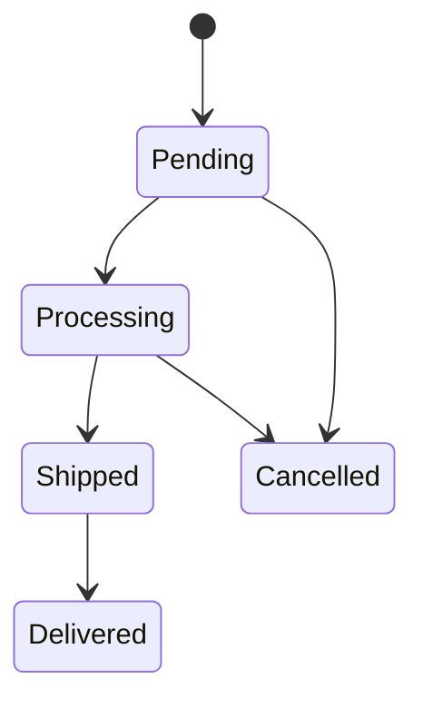
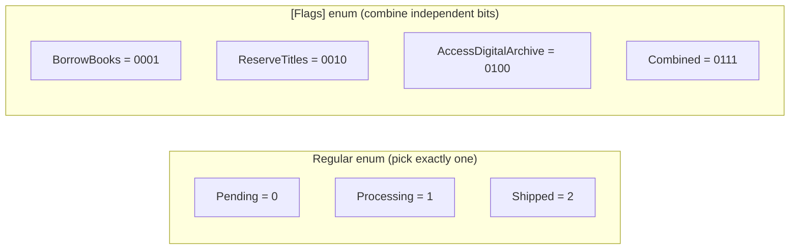

# Enums in C#

## Introduction

Before reading this lesson, you should already be comfortable with **[Constants and readonly Fields](../01-fundamentals/01-23-constants-and-readonly.md)** — specifically the idea of a value that's fixed and known at compile time. An `enum` takes that idea further: instead of one loose constant, it's a whole named, closed set of related constants, grouped under a single type. In this lesson we cover how to declare them, how their underlying storage works, and how to combine and inspect them safely.

By the end of this lesson, you will be able to:

- Declare an `enum` and understand its default underlying type and values
- Choose an explicit underlying type (`byte`, `long`, etc.) and explicit member values
- Use `[Flags]` enums to combine multiple values with bitwise operators
- Convert between strings and enum values with `Enum.Parse`/`Enum.TryParse`
- Use `switch` expressions and pattern matching to branch cleanly on an enum value

## Enums in C# — A Layman's Perspective

Think about the two very different kinds of choices you make when filling out a form at a pizza restaurant. The first is the size selector: a row of radio buttons — Small, Medium, Large — where the whole point of a radio button group is that exactly one option can be selected at a time. Choosing "Large" physically deselects "Medium"; there's no way to accidentally order a pizza that's simultaneously Small and Large, because the form itself makes that combination impossible to express. This is a closed, mutually exclusive set of named choices, and the form's structure enforces that constraint before the order ever reaches the kitchen.

The second is the toppings selector: a column of checkboxes — Extra Cheese, Mushrooms, Pepperoni, Thin Crust — where the entire point is the opposite. You're meant to be able to select any combination: just pepperoni, pepperoni and extra cheese, all four at once, or none at all. Each checkbox is independent of every other one, and the kitchen ticket that comes out simply lists whichever combination got checked, however many that turns out to be.

A regular `enum` in C# is the radio-button row: `OrderStatus.Pending`, `OrderStatus.Shipped`, `OrderStatus.Delivered` — pick exactly one, and the type system won't let you accidentally treat a variable as being in two states simultaneously. A `[Flags]` enum is the topping checkboxes: `Toppings.ExtraCheese`, `Toppings.Mushrooms`, `Toppings.Pepperoni` — each one occupies its own independent "checkbox," and you're expected to combine any subset of them together into one value, the same way a real order ticket lists "Pepperoni + Extra Cheese" as one combined line rather than forcing you to pick only one topping.

Underneath both, though, there's a librarian's card catalog doing the actual bookkeeping: each named option is really just a small number in disguise — Small might be card #0, Medium card #1, Large card #2 — and the enum type is what lets everyone in the kitchen, the register, and the delivery app refer to "Large" by that clear, readable name instead of everyone needing to memorize that "2 means Large" the way you'd have to if sizes were just raw numbers scattered through the code.

The bridge back to programming: an `enum` gives a small, closed set of named integer values real type identity — the compiler won't let you pass a raw, unrelated number where an `OrderStatus` is expected, the same way the pizza form's structure won't let you write "Extra Large" where only Small/Medium/Large were ever offered.

## Enums in C# — A Programming Language Perspective

An `enum` declares a distinct value type whose members are named constants of an underlying integral type — `int` by default, or explicitly `byte`, `sbyte`, `short`, `ushort`, `long`, or `ulong` — declared with `enum Name : UnderlyingType { ... }`. Each member, unless given an explicit value, receives the next sequential integer starting from `0`. An enum decorated with `[System.FlagsAttribute]` is treated as a bit field: its members are conventionally assigned distinct powers of two (`1`, `2`, `4`, `8`, ...) so that the bitwise OR (`|`) operator combines them into a single value representing multiple simultaneous flags, and `Enum.HasFlag` (or a manual bitwise `AND` check) tests membership. `Enum.Parse<TEnum>`/`Enum.TryParse<TEnum>` convert a string to its corresponding enum member, and `switch` expressions/statements — including property and relational patterns — provide exhaustive, compiler-assisted branching over enum values.

## How to Declare and Use Enums in C#

Declare an `enum` with the `enum` keyword, list its named members, and optionally specify an underlying type after a colon. Unless you assign explicit values, members are numbered `0, 1, 2, ...` in declaration order. You can cast between an enum and its underlying integral type explicitly, convert to/from strings with `ToString()` and `Enum.Parse`/`TryParse`, and enumerate every defined value with `Enum.GetValues<TEnum>()`.


*Figure 1: The `OrderStatus` enum models a closed set of mutually exclusive states an order can move through.*

```csharp
// Program.cs — .NET 10 / C# 14

OrderStatus status = OrderStatus.Processing;
Console.WriteLine($"Status: {status} (underlying value: {(int)status})");

Console.WriteLine(Describe(status));
Console.WriteLine(Describe(OrderStatus.Shipped));

if (Enum.TryParse("Delivered", out OrderStatus parsed))
{
    Console.WriteLine($"Parsed status: {parsed}");
}

foreach (OrderStatus value in Enum.GetValues<OrderStatus>())
{
    Console.WriteLine($" - {value} = {(int)value}");
}

static string Describe(OrderStatus status) => status switch
{
    OrderStatus.Pending => "Waiting to be processed",
    OrderStatus.Processing => "Being prepared for shipment",
    OrderStatus.Shipped => "On its way to the customer",
    OrderStatus.Delivered => "Delivered to the customer",
    OrderStatus.Cancelled => "Cancelled before completion",
    _ => "Unknown status"
};

enum OrderStatus
{
    Pending,
    Processing,
    Shipped,
    Delivered,
    Cancelled
}
```

**Console Output:**

```text
Status: Processing (underlying value: 1)
Being prepared for shipment
On its way to the customer
Parsed status: Delivered
 - Pending = 0
 - Processing = 1
 - Shipped = 2
 - Delivered = 3
 - Cancelled = 4
```

Because no explicit values were assigned, `Pending` through `Cancelled` are numbered `0` through `4` in declaration order — the underlying type defaults to `int`. The `switch` expression in `Describe` reads far more clearly than a chain of `if`/`else` comparisons against raw numbers, and because `OrderStatus` is a real type rather than a loose set of `int` constants, the compiler would reject any attempt to pass an unrelated number where an `OrderStatus` is expected.

## Real-Time Example: [Flags] Enums in Library/Inventory Management

We continue building on the Library/Inventory Management case study. Unlike an order's status — which is always exactly one state — a library membership can hold *any combination* of privileges at once: a member might be able to borrow books and reserve titles but not yet access the digital archive. That's a natural fit for a `[Flags]` enum, where each privilege occupies its own independent bit and any subset can be combined.

```csharp
// Program.cs — .NET 10 / C# 14 — Real-Time Example
// Extends the Library/Inventory Management case study.

var member = new LibraryMember(
    "Ada Lovelace",
    Privileges.BorrowBooks | Privileges.ReserveTitles | Privileges.AccessDigitalArchive);

Console.WriteLine($"{member.Name}'s privileges: {member.Privileges}");
Console.WriteLine($"Can borrow books? {member.Has(Privileges.BorrowBooks)}");
Console.WriteLine($"Can request interlibrary loans? {member.Has(Privileges.InterlibraryLoan)}");

member.Grant(Privileges.InterlibraryLoan);
Console.WriteLine($"After upgrade: {member.Privileges}");
Console.WriteLine($"Can request interlibrary loans now? {member.Has(Privileges.InterlibraryLoan)}");

[Flags]
enum Privileges
{
    None = 0,
    BorrowBooks = 1 << 0,
    ReserveTitles = 1 << 1,
    AccessDigitalArchive = 1 << 2,
    InterlibraryLoan = 1 << 3
}

class LibraryMember
{
    public string Name { get; }
    public Privileges Privileges { get; private set; }

    public LibraryMember(string name, Privileges privileges)
    {
        Name = name;
        Privileges = privileges;
    }

    public bool Has(Privileges privilege) => Privileges.HasFlag(privilege);

    public void Grant(Privileges privilege) => Privileges |= privilege;
}
```

**Console Output:**

```text
Ada Lovelace's privileges: BorrowBooks, ReserveTitles, AccessDigitalArchive
Can borrow books? True
Can request interlibrary loans? False
After upgrade: BorrowBooks, ReserveTitles, AccessDigitalArchive, InterlibraryLoan
Can request interlibrary loans now? True
```

Notice how `Privileges` combines three separate values with a single bitwise OR (`|`), and printing it with `{member.Privileges}` automatically renders the readable, comma-separated list of every flag that's set — .NET's built-in `[Flags]`-aware `ToString()` handles that formatting for us. `HasFlag` and the `|=` compound-assignment in `Grant` are the two workhorse operations for checking and adding privileges without disturbing whatever flags were already set — exactly like checking one box on a form without erasing whichever ones were checked before.

## Enum vs [Flags] Enum

A regular `enum` models a closed, mutually exclusive choice — every valid value is one, and only one, named member, and mixing two members together with `|` produces a number that doesn't correspond to any single, meaningful named state. A `[Flags]` enum inverts that assumption entirely: it's specifically designed so that combining members with `|` produces another valid, meaningful value, provided each member is assigned its own distinct bit (a power of two) rather than a sequential number. Using `|` on a non-`[Flags]` enum still compiles — the compiler doesn't forbid it — but the result is usually a value with no defined name, silently defeating the entire point of using an enum in the first place.


*Figure 2: Regular enum members are sequential and mutually exclusive; `[Flags]` members occupy independent bits meant to be combined.*

| Aspect | Regular `enum` | `[Flags]` `enum` |
|---|---|---|
| Intended member values | Sequential (`0, 1, 2, ...`) | Powers of two (`1, 2, 4, 8, ...`) |
| Combination via `\|` | Not meaningful | The whole point |
| Membership test | Direct equality (`==`, `switch`) | `HasFlag`, or bitwise `&` |
| Naming convention | Singular (`OrderStatus`) | Often plural (`Privileges`, `FileAccess`) |
| `ToString()` behavior | Prints the single member name | Prints a comma-separated list of set flags |
| Typical use case | State machines, categories | Permissions, options, capabilities |

## Types of Enum Usage in C#

Enums interact with several other constructs covered elsewhere in this curriculum:

1. **Underlying Types (`byte`, `long`, etc.)** — covered as part of **[Integer and Floating-Point Types](../01-fundamentals/01-03-integer-and-floating-point-types.md)**, which every enum's storage ultimately rests on.
2. **[Constants and readonly Fields](../01-fundamentals/01-23-constants-and-readonly.md)** — the looser, un-typed alternative that enums usually improve upon (covered in the previous lesson).
3. **[switch Statements and switch Expressions](../01-fundamentals/01-10-switch-statements-and-expressions.md)** — the primary tool for branching cleanly over an enum's members.
4. **[Tuples, Deconstruction, and Pattern Matching](../01-fundamentals/01-25-tuples-deconstruction-pattern-matching.md)** — where enum values combine with property patterns for richer, multi-condition matching, covered next.
5. **[Custom Attributes](../13-reflection-sourcegen-lowlevel/13-02-custom-attributes.md)** — how metadata like display names or descriptions gets attached to individual enum members.
6. **[State Pattern](../12-advanced-concepts/12-23-state-pattern.md)** — a design pattern that often starts life as a simple enum before growing into full state objects.

## What You've Learned & What's Next

A regular `enum` gives a closed, mutually exclusive set of named values real type identity, replacing scattered "magic numbers" with self-documenting code the compiler can check. A `[Flags]` enum flips that model to represent independent, combinable options using bitwise operations — as long as each member claims its own distinct bit.

Continue your learning journey with **[Tuples, Deconstruction, and Pattern Matching](../01-fundamentals/01-25-tuples-deconstruction-pattern-matching.md)**, the capstone lesson of this module, where `switch` expressions grow into full property-pattern matching over enums, records, and more.

---
*Applies to: .NET 10 / C# 14. Last reviewed 2026-08-16.*
