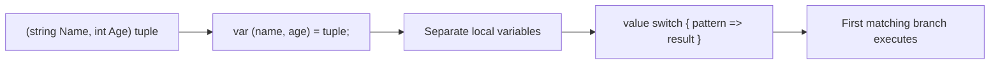
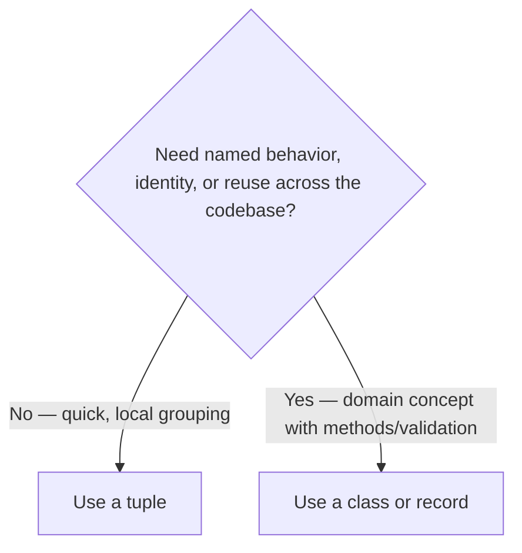

# Tuples, Deconstruction, and Pattern Matching

## Introduction

Before reading this lesson, you should already be comfortable with **[Enums in C#](../01-fundamentals/01-24-enums-in-csharp.md)** — a closed, named set of values you can branch over with a `switch`. This lesson is the capstone of Module 01: it introduces **value tuples** for grouping a handful of related values without a dedicated type, **deconstruction** for unpacking that group back into individual variables, and **pattern matching** for branching not just on an enum's value but on an object's entire shape at once — pulling together variables, methods, and enums from everything you've learned so far.

By the end of this lesson, you will be able to:

- Create and read a value tuple with named elements, like `(string Name, int Age)`
- Deconstruct a tuple, or any type with a `Deconstruct` method, into separate variables
- Write `switch` expressions using type patterns, property patterns, and `is` checks
- Combine multiple conditions in a single pattern instead of nested `if` statements
- See how these three features set up everything Module 02 builds using classes and records

## Tuples, Deconstruction, and Pattern Matching — A Layman's Perspective

Picture picking up a takeout order at a small counter restaurant. When your order is ready, the cashier doesn't hand you a full customer file with your entire order history — you get a small printed slip stapled to the bag with just three things on it: your order number, your table number, and the total charged. That little slip is exactly enough information for this specific moment, bundled together without anyone needing to design and print a whole dedicated form just for it. That's a tuple: a quick, informal grouping of a few related values, good for a short errand, not meant to become a permanent record in anyone's filing cabinet.

Now imagine you get home and want to jot each piece of that slip onto three separate sticky notes on your fridge — one for the order number, one for the table number, one for the total — because that's more useful for what you're doing next. You don't have to read the slip line by line and manually copy each number; you can lay the slip down next to three blank sticky notes shaped to match its layout, and each value slides directly into its matching note. That direct, shape-matched unpacking is deconstruction — pulling a bundled group of values apart into individually named pieces in one motion, because the "shape" of the source (three items, in this order) matches the shape of the destination (three named notes).

Pattern matching is what happens at the restaurant's host stand, seating guests as they walk in. A good host doesn't ask one question at a time — "Do you have a reservation? Okay, now, how many in your party? Okay, now, do you need a high chair?" — sequentially peeling through fields one by one. An experienced host takes in the whole shape of the situation in a single glance — a party of two with no reservation gets pointed to the bar; a party of six with a confirmed reservation gets walked straight to the private room; a solo diner carrying a to-go bag clearly doesn't need seating at all. Each of those is a distinct *shape* — a combination of several facts at once — and the host routes people based on matching the whole shape, not by checking each fact in isolation with a long chain of separate questions.

C#'s pattern matching works exactly like that host: a `switch` expression can look at an object's type, its specific property values, and combinations of both, all in one clean case — "an order that's `Pending` and over a thousand dollars" is one shape; "an order that's `Cancelled`," regardless of its total, is a different shape entirely — and the case that matches the object's actual shape is the one that runs, in the order those shapes are listed.

The bridge back to programming: tuples let you group a few values informally, for a short-lived purpose; deconstruction unpacks that same grouping back into individually named variables in one step; and pattern matching lets you branch based on an object's entire shape at once, rather than one property at a time.

## Tuples, Deconstruction, and Pattern Matching — A Programming Language Perspective

A **value tuple** is a lightweight, compiler-supported grouping of values of the `System.ValueTuple` family, written with literal syntax like `(string Name, int Age)`. Named tuple elements are a compile-time-only convenience — preserved via `System.Runtime.CompilerServices.TupleElementNamesAttribute` in metadata — layered over an underlying `ValueTuple<T1, T2, ...>` struct, giving value semantics and structural equality without a dedicated class. **Deconstruction** unpacks any value — a tuple, a `record` (which synthesizes a `Deconstruct` method from its primary constructor automatically), or any custom type exposing one or more `Deconstruct` methods — into separate variables via `var (a, b) = value;` syntax. **Pattern matching**, expressed through `is` expressions and `switch` expressions/statements, tests a value's shape: type patterns (`is Order o`), property patterns (`{ Status: OrderStatus.Cancelled }`), positional patterns (using a type's `Deconstruct`), relational patterns (`> 1000m`), and logical combinators (`and`, `or`, `not`) can all be combined into a single case, evaluated top-to-bottom until the first matching case wins.

## How to Use Tuples, Deconstruction, and Pattern Matching in C#

A tuple literal groups values with parentheses; naming its elements (`(string Name, int Age)`) makes each position self-documenting instead of forcing callers to remember that `.Item1` means the name. Deconstruction reverses that grouping with `var (x, y) = tupleOrObject;`, binding each element to its own local variable in one statement. A `switch` expression evaluates a value against an ordered list of patterns and returns the result of the first one that matches — mixing type checks, property checks, and guard clauses (`when`) freely.


*Figure 1: A tuple groups values, deconstruction unpacks them, and pattern matching branches on shape and value together.*

```csharp
// Program.cs — .NET 10 / C# 14

(string Name, int Age) person = ("Ada", 34);
Console.WriteLine($"{person.Name} is {person.Age} years old.");

var (name, age) = person;
Console.WriteLine($"Deconstructed: name={name}, age={age}");

Console.WriteLine(Describe(5));
Console.WriteLine(Describe(-3));
Console.WriteLine(Describe(0));
Console.WriteLine(Describe("hello"));
Console.WriteLine(Describe(new Point(0, 0)));
Console.WriteLine(Describe(new Point(3, -2)));

static string Describe(object value) => value switch
{
    int n when n > 0 => $"{n} is a positive integer",
    int n when n < 0 => $"{n} is a negative integer",
    int => "zero",
    string s => $"a string of length {s.Length}",
    Point { X: 0, Y: 0 } => "the origin point",
    Point(var x, var y) => $"a point at ({x}, {y})",
    _ => "something else"
};

record Point(int X, int Y);
```

**Console Output:**

```text
Ada is 34 years old.
Deconstructed: name=Ada, age=34
5 is a positive integer
-3 is a negative integer
zero
a string of length 5
the origin point
a point at (3, -2)
```

The `person` tuple's named elements (`Name`, `Age`) make `person.Name` self-explanatory, and `var (name, age) = person;` unpacks both in a single line. Inside `Describe`, notice the ordering: `Point { X: 0, Y: 0 }` — a property pattern — is checked *before* `Point(var x, var y)` — a positional pattern using `Point`'s auto-generated `Deconstruct` — so the origin is reported specially, and every other point falls through to the general positional case. Patterns are tried top-to-bottom, and the first one that matches wins, exactly like the host seating guests in the order they're checked.

## Real-Time Example: Tuples, Deconstruction, and Pattern Matching in E-Commerce Order Processing

This capstone example ties together variables, methods, an enum, tuples, deconstruction, and pattern matching — nearly everything covered across Module 01 — inside the E-Commerce Order Processing case study. Each `Order` carries a `Status` (the enum from the previous lesson); one method returns a named tuple breaking a total into subtotal/tax/total, and another uses a `switch` expression with property patterns to decide what message — and whether an action flag — applies to each order.

```csharp
// Program.cs — .NET 10 / C# 14 — Real-Time Example
// A capstone example for the E-Commerce Order Processing case study, combining
// variables, methods, an enum, tuples, deconstruction, and pattern matching —
// everything covered across Module 01.

var orders = new List<Order>
{
    new Order("ORD-1001", "Grace Hopper", 249.99m, OrderStatus.Pending),
    new Order("ORD-1002", "Ada Lovelace", 899.50m, OrderStatus.Shipped),
    new Order("ORD-1003", "Alan Turing", 40.00m, OrderStatus.Cancelled),
    new Order("ORD-1004", "Katherine Johnson", 1250.00m, OrderStatus.Delivered),
    new Order("ORD-1005", "Marie Curie", 1499.00m, OrderStatus.Pending),
};

foreach (Order order in orders)
{
    (decimal subtotal, decimal tax, decimal total) = CalculateTotals(order.Total);
    (string message, bool requiresAction) = Summarize(order);

    Console.WriteLine($"{order.OrderId} — {order.CustomerName}");
    Console.WriteLine($"  Subtotal: {subtotal:C}, Tax: {tax:C}, Total: {total:C}");
    Console.WriteLine($"  {message}{(requiresAction ? "  [ACTION NEEDED]" : "")}");
}

static (decimal Subtotal, decimal Tax, decimal Total) CalculateTotals(decimal subtotal)
{
    const decimal taxRate = 0.08m;
    decimal tax = Math.Round(subtotal * taxRate, 2);
    return (subtotal, tax, subtotal + tax);
}

static (string Message, bool RequiresAction) Summarize(Order order) => order switch
{
    { Status: OrderStatus.Cancelled } => ("Order was cancelled.", false),
    { Status: OrderStatus.Pending, Total: > 1000m } => ("High-value order awaiting review.", true),
    { Status: OrderStatus.Pending } => ("Waiting to be processed.", false),
    { Status: OrderStatus.Shipped } => ("On its way to the customer.", false),
    { Status: OrderStatus.Delivered } => ("Delivered successfully.", false),
    _ => ("Unknown status.", true)
};

enum OrderStatus
{
    Pending,
    Processing,
    Shipped,
    Delivered,
    Cancelled
}

record Order(string OrderId, string CustomerName, decimal Total, OrderStatus Status);
```

**Console Output:**

```text
ORD-1001 — Grace Hopper
  Subtotal: $249.99, Tax: $20.00, Total: $269.99
  Waiting to be processed.
ORD-1002 — Ada Lovelace
  Subtotal: $899.50, Tax: $71.96, Total: $971.46
  On its way to the customer.
ORD-1003 — Alan Turing
  Subtotal: $40.00, Tax: $3.20, Total: $43.20
  Order was cancelled.
ORD-1004 — Katherine Johnson
  Subtotal: $1,250.00, Tax: $100.00, Total: $1,350.00
  Delivered successfully.
ORD-1005 — Marie Curie
  Subtotal: $1,499.00, Tax: $119.92, Total: $1,618.92
  High-value order awaiting review.  [ACTION NEEDED]
```

Every named-tuple return value — `CalculateTotals` and `Summarize` — is deconstructed immediately into plain local variables, so the calling code never has to write `.Item1`/`.Item2` or track which position means what. The property patterns inside `Summarize` check `Status` and, for the `Pending` case, `Total` together in a single case — `{ Status: OrderStatus.Pending, Total: > 1000m }` — which is exactly why ORD-1005 gets flagged for review while ORD-1001, also `Pending` but under the threshold, gets the ordinary message. Notice too that the `Cancelled` case is listed first: cancelled orders skip the total-based logic entirely regardless of their amount, because pattern order determines which case wins.

## Tuples vs Custom Types (Classes/Records)

A tuple is the right tool when a grouping of values is local, short-lived, and doesn't need its own identity, behavior, or reuse across the codebase — like a method's temporary return value that's deconstructed immediately at the call site. The moment that same grouping needs a name other code refers to, validation rules, methods of its own, or genuine reuse across multiple files, it has outgrown a tuple and become a real domain concept — exactly what a `class` or `record` is for. This is precisely the transition Module 02 makes: from grouping data ad hoc, to designing dedicated types around it.


*Figure 2: Tuples suit quick, local groupings; classes and records suit reusable domain concepts.*

| Aspect | Tuple | Class / Record |
|---|---|---|
| Intended scope | Local, short-lived | Reusable across the codebase |
| Named members | Optional, compile-time only | Formal, part of the type's public surface |
| Behavior (methods) | None | Can carry validation and logic |
| Equality | Structural, built-in | Reference (class) or structural (record) |
| Typical use | A method's temporary return value | A first-class domain concept (`Order`, `Account`) |

## Types That Build on This Capstone

Everything in this lesson feeds directly into Module 02, which is entirely about designing real types instead of ad hoc groupings:

1. **[Classes and Objects in C#](../02-oop/02-01-classes-and-objects.md)** — the very next lesson, where full custom types replace ad hoc tuples for anything with real identity or behavior.
2. **[Records in C#](../02-oop/02-19-records-in-csharp.md)** — takes deconstruction and value equality further than a plain tuple can.
3. **[`record struct` and Value-Based Records](../02-oop/02-20-record-struct-value-based-records.md)** — a value-type alternative that behaves even more like an upgraded tuple.
4. **[switch Statements and switch Expressions](../01-fundamentals/01-10-switch-statements-and-expressions.md)** — the foundation that pattern matching in `switch` expressions builds on.
5. **[`IEnumerable<T>` and `IEnumerator<T>`](../03-collections-generics/03-13-ienumerable-and-ienumerator.md)** — deconstruction patterns reappear constantly when iterating over key/value pairs and grouped sequences.
6. **[Equality: Equals, ==, and IEquatable\<T\>](../02-oop/02-33-equality-equals-iequatable.md)** — how the structural equality tuples and records get "for free" is actually implemented.

## What You've Learned & What's Next

Tuples let you group a handful of values informally, without designing a dedicated type, for the many places in code where that grouping is local and short-lived. Deconstruction unpacks that grouping — or any type with a `Deconstruct` method — back into individually named variables in one step, and pattern matching lets you branch on an object's entire shape, not just a single property, using type patterns, property patterns, and guard clauses together. That closes out Module 01: every fundamental building block — variables, types, operators, control flow, methods, nullability, and now data shape — is now in place.

Continue your learning journey with **[Classes and Objects in C#](../02-oop/02-01-classes-and-objects.md)**, the first lesson of Module 02, where you'll start designing full custom types instead of leaning on tuples and loose data groupings.

---
*Applies to: .NET 10 / C# 14. Last reviewed 2026-08-16.*
