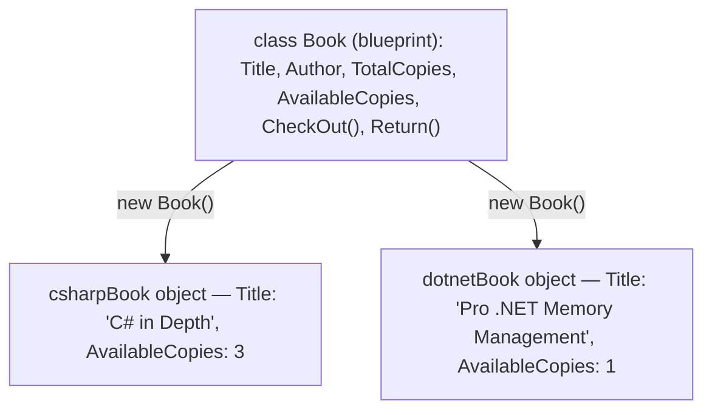
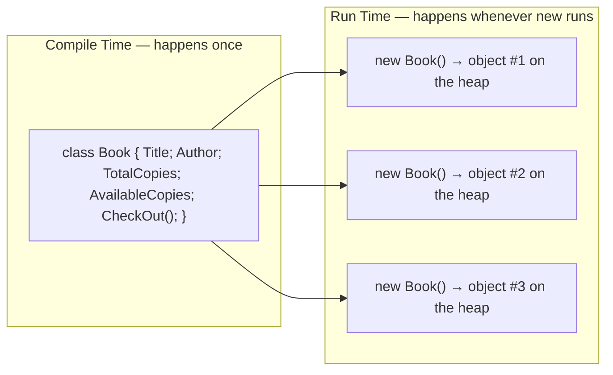

# Classes and Objects in C#

## Introduction

Before reading this lesson, you should already be comfortable with **[Tuples, Deconstruction, and Pattern Matching](../01-fundamentals/01-25-tuples-deconstruction-pattern-matching.md)** — the Module 01 capstone that showed you the limits of grouping data informally. In this lesson we cross into Module 02 and introduce **classes** and **objects**: the construct C# gives you the moment a loose grouping of values needs a name, a permanent shape, and behavior of its own. Everything else in this curriculum — constructors, properties, inheritance, interfaces, records — is built on top of the class/object relationship you'll learn here, which is exactly why this is one of the most important lessons in the entire series.

By the end of this lesson, you will be able to:

- Explain what a class is: a user-defined blueprint that bundles **state** (fields) and **behavior** (methods) into a single named type
- Explain what an object is: a concrete, independent instance of a class, created and living in memory at run time
- Declare a class with fields and methods, and create objects from it using the `new` keyword
- Access an object's fields and call its methods using dot notation
- Explain why a class is defined exactly once, while the objects created from it can be created many times, each with its own independent state
- See why every custom type covered later in this curriculum — records, structs, interfaces — starts from this same class/object relationship

## Classes and Objects — A Layman's Perspective

Picture an architect designing a house model for a new subdivision — call it "The Willow." The architect draws up one set of blueprints: how many bedrooms it has, where the kitchen sits, how tall the ceilings are, what the front door looks like, and which switches control which lights. That blueprint is drawn exactly once. It is not a house. Nobody can walk into a blueprint, put a couch in its living room, or lock its front door at night, because a blueprint has no physical existence of its own — it is only a specification of what any house built from it *will* have and what any house built from it *will be able to do*.

Now the construction crew breaks ground. Using that single Willow blueprint, they build a house at 12 Maple Street. Then they build a second house, identical in layout, at 14 Maple Street. Then a third, at 16 Maple Street. All three houses share the exact same design — three bedrooms, the same kitchen layout, the same front-door mechanism — because they were all built from the same blueprint. But each one is a completely separate, physical building. The house at 12 Maple Street can be painted blue while the one at 14 Maple Street is painted white. A family can move into 12 Maple Street while 16 Maple Street sits empty. Locking the front door at 12 Maple Street has absolutely no effect on the front door at 14 Maple Street, even though both doors work identically, because they are two distinct doors on two distinct, independently-existing houses.

Notice the two different kinds of things the blueprint captures. Some of it is *data that varies per house* — its street address, its current paint color, whether its front door is currently locked. Some of it is *what every house can do*, regardless of which one you're standing in front of — lock the front door, turn on the porch light, open the garage. The blueprint defines both, once. Each actual house then carries its own current values for the data part, while sharing the same defined actions for the behavior part.

The bridge back to programming: a **class** is that blueprint — a single, one-time definition of what data a type will hold and what actions it can perform. An **object** is one of those actual houses — a real, independently-existing instance built from the blueprint, with its own current values for that data, created the moment you tell the program to build one.

## Classes and Objects — A Programming Language Perspective

Formally, a **class** is a user-defined reference type — declared with the `class` keyword — that bundles **state** (data, held in **fields**) and **behavior** (**methods** that act on that data) under a single named type. The class declaration itself allocates nothing; it is compiled once into the program's metadata and exists only as a description of what instances of that type will look like. An **object** is an instance of a class: a region of memory allocated on the managed heap at run time, created by the `new` operator, holding its own independent copy of every field the class declares. Because `class` produces a *reference type*, a variable of a class type does not hold the object itself — it holds a reference (an address) to where that object lives on the heap, which is why assigning one object variable to another copies the reference, not the object (a distinction explored fully once inheritance and structs are introduced). Every object is created independently: calling `new` twice against the same class produces two objects with entirely separate state, connected only by the fact that they share the same class definition and therefore the same set of fields and methods.

## How to Declare a Class and Create Objects in C#

A class declaration starts with an access modifier (`public`, for now), the `class` keyword, and a PascalCase name, followed by a body in braces containing its fields and methods. Fields are declared like variables directly inside the class body; methods are declared like the standalone methods you already know, but living inside the class instead. To bring an object into existence, you call `new ClassName()`, which allocates memory for one instance and hands you back a reference to it; from there, dot notation (`objectName.FieldName`, `objectName.MethodName()`) reads or changes that specific object's state and invokes its behavior.


*Figure 1: One class definition produces independent objects each time `new` runs — each with its own state.*

```csharp
// Program.cs — .NET 10 / C# 14
public class Book
{
    public string Title;
    public string Author;
    public int TotalCopies;
    public int AvailableCopies;

    public void CheckOut()
    {
        if (AvailableCopies > 0)
        {
            AvailableCopies--;
            Console.WriteLine($"'{Title}' checked out. {AvailableCopies} of {TotalCopies} copies remain.");
        }
        else
        {
            Console.WriteLine($"'{Title}' has no copies available.");
        }
    }
}

Book csharpBook = new Book();
csharpBook.Title = "C# in Depth";
csharpBook.Author = "Jon Skeet";
csharpBook.TotalCopies = 3;
csharpBook.AvailableCopies = 3;

Book dotnetBook = new Book();
dotnetBook.Title = "Pro .NET Memory Management";
dotnetBook.Author = "Konrad Kokosa";
dotnetBook.TotalCopies = 1;
dotnetBook.AvailableCopies = 1;

csharpBook.CheckOut();
csharpBook.CheckOut();
dotnetBook.CheckOut();
dotnetBook.CheckOut();

Console.WriteLine($"{csharpBook.Title}: {csharpBook.AvailableCopies}/{csharpBook.TotalCopies} available.");
Console.WriteLine($"{dotnetBook.Title}: {dotnetBook.AvailableCopies}/{dotnetBook.TotalCopies} available.");
```

**Console Output:**

```text
'C# in Depth' checked out. 2 of 3 copies remain.
'C# in Depth' checked out. 1 of 3 copies remain.
'Pro .NET Memory Management' checked out. 0 of 1 copies remain.
'Pro .NET Memory Management' has no copies available.
C# in Depth: 1/3 available.
Pro .NET Memory Management: 0/1 available.
```

`Book` is declared exactly once, but `new Book()` runs twice, producing two entirely separate objects — `csharpBook` and `dotnetBook` — each with its own `Title`, `Author`, and copy counts. Calling `CheckOut()` twice on `csharpBook` only ever changes `csharpBook.AvailableCopies`; it has zero effect on `dotnetBook`, because each object owns its own state even though both run the exact same `CheckOut` method defined once on the class. (Note: this lesson uses plain public fields to keep the class/object mechanics isolated and visible — **[Fields, Properties, and the field Keyword](../02-oop/02-03-fields-properties-field-keyword.md)** shows why real code almost never leaves fields exposed like this.)

## Real-Time Example: Classes and Objects in Library/Inventory Management

We open the **Library/Inventory Management** case study, which several upcoming Module 02 lessons will keep extending. Here, a small front desk scenario models a shelf of `Book` objects and processes a day's worth of checkout requests against it — a realistic first use of a class beyond a single pair of hand-built objects.

```csharp
// Program.cs — .NET 10 / C# 14 — Real-Time Example: Library/Inventory Management
var catalog = new List<Book>
{
    new Book { Title = "Clean Code", Author = "Robert C. Martin", TotalCopies = 2, AvailableCopies = 2 },
    new Book { Title = "The Pragmatic Programmer", Author = "Andrew Hunt", TotalCopies = 4, AvailableCopies = 4 },
    new Book { Title = "Design Patterns", Author = "Erich Gamma", TotalCopies = 1, AvailableCopies = 1 },
};

string[] requests = { "Clean Code", "Design Patterns", "Design Patterns", "The Pragmatic Programmer" };

foreach (string title in requests)
{
    Book? match = FindByTitle(catalog, title);
    if (match is null)
    {
        Console.WriteLine($"No book titled '{title}' in the catalog.");
        continue;
    }
    match.CheckOut();
}

Console.WriteLine();
Console.WriteLine("End-of-day inventory:");
foreach (Book book in catalog)
{
    Console.WriteLine($"  {book.Title}: {book.AvailableCopies}/{book.TotalCopies} available");
}

static Book? FindByTitle(List<Book> catalog, string title) =>
    catalog.FirstOrDefault(b => b.Title == title);

public class Book
{
    public string Title = "";
    public string Author = "";
    public int TotalCopies;
    public int AvailableCopies;

    public void CheckOut()
    {
        if (AvailableCopies > 0)
        {
            AvailableCopies--;
            Console.WriteLine($"'{Title}' checked out. {AvailableCopies} of {TotalCopies} copies remain.");
        }
        else
        {
            Console.WriteLine($"'{Title}' has no copies available.");
        }
    }
}
```

**Console Output:**

```text
'Clean Code' checked out. 1 of 2 copies remain.
'Design Patterns' checked out. 0 of 1 copies remain.
'Design Patterns' has no copies available.
'The Pragmatic Programmer' checked out. 3 of 4 copies remain.

End-of-day inventory:
  Clean Code: 1/2 available
  The Pragmatic Programmer: 3/4 available
  Design Patterns: 0/1 available
```

Two things worth noticing here beyond the earlier example. First, `new Book { Title = "Clean Code", ... }` is an *object initializer* — shorthand for calling `new Book()` and then assigning each named field, all in one expression, useful the moment a class has more than a couple of fields to set. Second, the `catalog` list holds three genuinely independent `Book` objects; `FindByTitle` searches through them and returns a reference to whichever one matches, so calling `CheckOut()` on the result modifies that exact object inside the list — which is exactly why the end-of-day inventory correctly reflects every checkout that happened during the day, in the order the shelf was originally stocked.

## Class vs Object

A class and an object are easy to conflate because you only ever write the word "class" once but interact with objects constantly — so it's worth being precise about what each one actually is and when it comes into existence. The class is a compile-time concept: a single description, part of your program's metadata, that never itself occupies "an instance's worth" of memory. The object is a run-time concept: a real allocation on the managed heap, created fresh every time `new` executes, holding actual values rather than a description of what values are possible.


*Figure 2: A class is compiled once; the objects created from it can multiply, on demand, only at run time.*

| Aspect | Class | Object |
|---|---|---|
| What it is | A blueprint / type definition | A concrete instance of that blueprint |
| When it exists | Compiled once, part of the program's metadata | Created at run time, whenever `new` executes |
| Memory | No per-instance memory allocated for the definition itself | Allocated on the managed heap each time `new` runs |
| State | Declares *which* fields exist | Holds *actual* field values, independent per instance |
| Count in a running program | Exactly one definition | Zero, one, or many — as many as `new` is called |
| Example in this lesson | `Book` | `csharpBook`, `dotnetBook`, each catalog entry |

## Types of Classes in C#

`class` is the starting point for several more specialized forms covered later in this module, once more of the type system is in place:

1. **[Static Members and Static Classes](../02-oop/02-09-static-members-and-classes.md)** — classes (and members) that belong to the type itself rather than to any individual object.
2. **[Abstract Classes and Methods](../02-oop/02-14-abstract-classes-and-methods.md)** — classes that define a shape other classes must complete, and can never be instantiated directly.
3. **[Sealed Classes and Methods](../02-oop/02-17-sealed-classes-and-methods.md)** — classes that explicitly forbid further inheritance.
4. **[Records in C# (`record class`)](../02-oop/02-19-records-in-csharp.md)** — a class variant purpose-built for value-like data, with equality and `ToString` generated for you.
5. **[Partial Classes and Partial Methods](../02-oop/02-25-partial-classes-and-methods.md)** — one class definition split across multiple files.
6. **[Nested Types in C#](../02-oop/02-27-nested-types-in-csharp.md)** — a class declared entirely inside another class, for tightly-scoped helper types.

## What You've Learned & What's Next

A class is a one-time, compile-time blueprint bundling state and behavior under a single name; an object is a real, independent instance of that blueprint, allocated at run time by `new`, holding its own values while sharing the class's defined behavior. Every object created from the same class starts out shaped the same way but lives its own life from that point on — exactly what let `csharpBook` and `dotnetBook`, and every `Book` in the library catalog, track their own checkout state independently.

Continue your learning journey with **[Constructors in C#](../02-oop/02-02-constructors-in-csharp.md)**, where you'll replace this lesson's manual field-by-field setup with code that guarantees every new object starts out valid the moment it's created.

---
*Applies to: .NET 10 / C# 14. Last reviewed 2026-08-16.*
