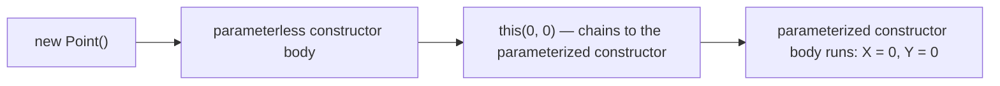
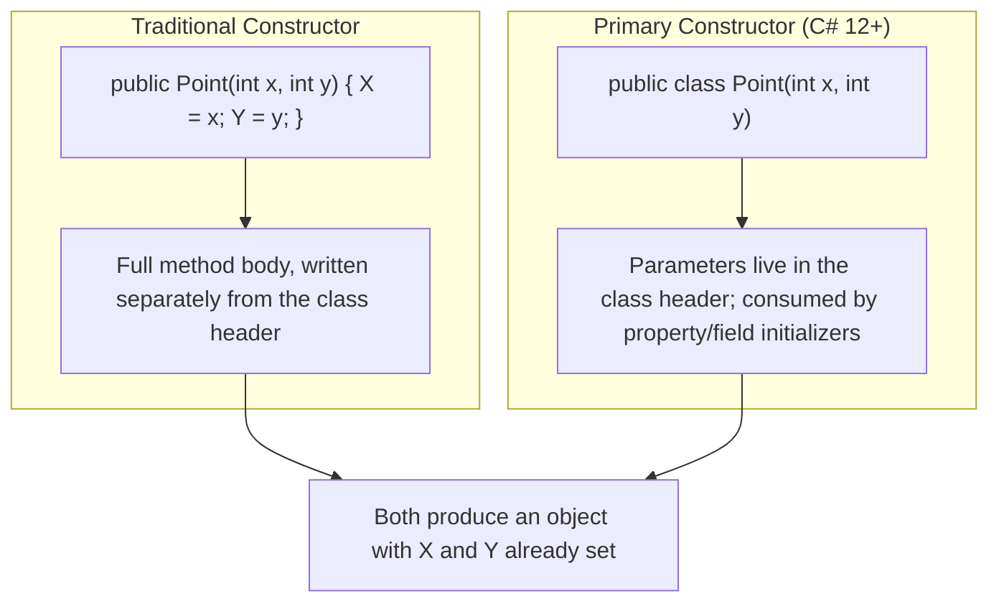

# Constructors in C#

## Introduction

Before reading this lesson, you should already be comfortable with **[Classes and Objects in C#](../02-oop/02-01-classes-and-objects.md)** — in particular that creating an object with `new Book()` and then assigning every field afterward, line by line, is how we got a `Book` into existence in that lesson. That approach has an obvious problem: nothing stops you from forgetting a field, or from using the object before you've finished setting it up. This lesson introduces **constructors** — the mechanism that guarantees an object arrives already fully and validly initialized the moment `new` finishes running.

By the end of this lesson, you will be able to:

- Explain what a constructor is and why every class always has one, even if you never write one yourself
- Write parameterized constructors that require the data a valid object needs, up front
- Overload constructors to offer more than one way to build the same type
- Chain one constructor to another using `this(...)` to avoid duplicating initialization logic
- Write a **primary constructor** (C# 12+) — the concise, now-idiomatic way most new C# classes declare their constructor
- Know the rule governing how primary constructors and additional explicit constructors coexist on the same class

## Constructors — A Layman's Perspective

Think about checking into a hotel room. A hotel doesn't hand you a bare room and then have you, the guest, walk around afterward turning on the lights, making the bed, restocking the minibar, and setting the thermostat before it's usable. That would be absurd — and dangerous, because a rushed guest might skip a step and end up in a room with no towels. Instead, housekeeping runs a fixed setup routine *before* the door is ever unlocked for a guest: bed made, towels stocked, thermostat set to a sensible default, minibar filled. By the time you swipe your key card, the room is already guaranteed to be in a valid, ready-to-use state. You never see — and never have to perform — the setup steps yourself.

Now suppose the hotel offers different room types with different setup routines: a standard room gets the default minibar and thermostat setting, but a "business suite" booking also triggers an extra step — stocking the in-room desk with notepads and chargers. Rather than writing two completely separate, unrelated setup checklists from scratch, a well-run hotel writes the business suite's checklist as "do everything on the standard checklist, then do these two extra things." The extra checklist *reuses* the standard one instead of duplicating it. That's chaining one setup routine into another — do the shared work once, in one place, then layer anything extra on top.

A hotel that has no business suites and only ever prepares one kind of room doesn't bother writing an explicit checklist at all — the default cleaning routine just runs, unconditionally, before any guest checks in. That's the equivalent of a class that declares no constructor at all: C# still guarantees the object arrives set up (in this bare case, its fields default to zero, empty, or `null`), even though you never had to write the setup logic yourself.

The bridge back to programming: a constructor is the guaranteed setup routine that runs the instant `new` creates an object, before any other code can touch it. Constructor overloading offers multiple checklists for different booking scenarios. Chaining with `this(...)` lets one checklist reuse another instead of repeating its steps. And when a class needs no special setup at all, C# quietly runs a default one for you.

## Constructors — A Programming Language Perspective

A **constructor** is a special member, named identically to its containing class with no return type, that runs exactly once, automatically, whenever `new` allocates an object — its job is to bring that object into a valid initial state before any other code can reference it. If a class declares no constructor at all, the compiler supplies an implicit, public, parameterless **default constructor** that leaves fields at their default values (`0`, `false`, `null`, and so on). Declaring one or more explicit constructors removes that implicit default; declaring several constructors with different parameter lists is **constructor overloading**, resolved by the compiler using the same overload-resolution rules as any other method. One constructor can delegate to another declared in the same class via a `: this(...)` initializer, so shared setup logic lives in exactly one place. Since **C# 12**, a **primary constructor** — parameters attached directly to the class declaration, e.g. `public class Book(string title, string author)` — lets a class's main constructor parameter list live in the type's header itself; those parameters are in scope throughout the class body, most commonly used to initialize fields and properties, and are now the idiomatic way most new classes declare their primary way of being constructed.

## How to Declare Constructors in C#

A parameterized constructor looks like a method named after its class, with parameters but no return type, whose body assigns those parameters into fields. Overloading works exactly as it does for ordinary methods: declare more than one constructor with different parameter lists. To have one constructor reuse another's logic instead of duplicating it, add a `: this(...)` initializer that names which other constructor on the same class to run first.


*Figure 1: `new Point()` doesn't duplicate setup logic — it chains, via `this(0, 0)`, into the parameterized constructor that does the real work.*

```csharp
// Program.cs — .NET 10 / C# 14
public class Point
{
    public int X;
    public int Y;

    public Point()
        : this(0, 0)
    {
    }

    public Point(int x, int y)
    {
        X = x;
        Y = y;
    }

    public override string ToString() => $"({X}, {Y})";
}

Point origin = new Point();
Point custom = new Point(3, -4);

Console.WriteLine($"origin = {origin}");
Console.WriteLine($"custom = {custom}");
```

**Console Output:**

```text
origin = (0, 0)
custom = (3, -4)
```

`Point` overloads its constructor twice: a parameterless version and a two-parameter version. Rather than repeating `X = 0; Y = 0;` inside the parameterless constructor, `: this(0, 0)` hands off to the parameterized constructor and lets it do the actual assignment — one piece of initialization logic, reused instead of duplicated.

**Latest: Primary Constructors (C# 12+, now the idiomatic default).** The same type can be written far more concisely by attaching its main constructor's parameters directly to the class declaration:

```csharp
// Program.cs — .NET 10 / C# 14 — Primary Constructor
public class PointPrimary(int x, int y)
{
    public int X { get; } = x;
    public int Y { get; } = y;

    public PointPrimary() : this(0, 0)
    {
    }

    public override string ToString() => $"({X}, {Y})";
}

PointPrimary originP = new PointPrimary();
PointPrimary customP = new PointPrimary(3, -4);

Console.WriteLine($"originP = {originP}");
Console.WriteLine($"customP = {customP}");
```

**Console Output:**

```text
originP = (0, 0)
customP = (3, -4)
```

`x` and `y` in `PointPrimary(int x, int y)` are the primary constructor's parameters — no separate constructor body is written at all; they're consumed directly by the property initializers `= x` and `= y`. Crucially, once a class has a primary constructor, **every other explicitly declared instance constructor must chain to it**, directly or indirectly, via `: this(...)` — which is exactly why `public PointPrimary() : this(0, 0)` is required here rather than optional; omitting the `: this(0, 0)` would be a compile error (CS8862). Pre-2023 C# tutorials don't cover this syntax at all, since it didn't exist for classes before C# 12 — yet it's now the style you'll see in most new .NET 10 codebases.

## Real-Time Example: Constructors in Library/Inventory Management

We continue the **Library/Inventory Management** case study, replacing Lesson 1's field-by-field `Book` setup with a properly constructed version. The primary constructor validates its inputs directly in its property initializers — throwing immediately if a book is given a blank title, blank author, or a non-positive copy count — while a second, overloaded constructor covers the common case of stocking exactly one copy.

```csharp
// Program.cs — .NET 10 / C# 14 — Real-Time Example: Library/Inventory Management
public class Book(string title, string author, int totalCopies)
{
    public string Title { get; } = string.IsNullOrWhiteSpace(title)
        ? throw new ArgumentException("Title is required.", nameof(title))
        : title;

    public string Author { get; } = string.IsNullOrWhiteSpace(author)
        ? throw new ArgumentException("Author is required.", nameof(author))
        : author;

    public int TotalCopies { get; } = totalCopies > 0
        ? totalCopies
        : throw new ArgumentOutOfRangeException(nameof(totalCopies), "Must stock at least one copy.");

    public int AvailableCopies { get; private set; } = totalCopies;

    public Book(string title, string author) : this(title, author, totalCopies: 1)
    {
    }

    public void CheckOut()
    {
        if (AvailableCopies > 0)
        {
            AvailableCopies--;
            Console.WriteLine($"'{Title}' checked out. {AvailableCopies} of {TotalCopies} remain.");
        }
        else
        {
            Console.WriteLine($"'{Title}' has no copies available.");
        }
    }
}

var catalog = new List<Book>();

try
{
    catalog.Add(new Book("Clean Code", "Robert C. Martin", 2));
    catalog.Add(new Book("Refactoring", "Martin Fowler"));
    catalog.Add(new Book("  ", "Unknown", 3));
}
catch (ArgumentException ex)
{
    Console.WriteLine($"Could not add book: {ex.Message}");
}

foreach (Book book in catalog)
{
    book.CheckOut();
}

Console.WriteLine($"Catalog size: {catalog.Count} books.");
```

**Console Output:**

```text
Could not add book: Title is required.
Parameter name: title
'Clean Code' checked out. 1 of 2 remain.
'Refactoring' checked out. 0 of 1 remain.
Catalog size: 2 books.
```

The first two `Book`s construct successfully — the second using the overloaded single-copy constructor, which chains to the primary constructor via `: this(title, author, totalCopies: 1)`. The third attempt passes a blank title, so the primary constructor's `Title` property initializer throws before the object (or the `Add` call) ever completes, and the `catch` block reports it — the object is never added to `catalog`, which is why the final count is 2, not 3. This is exactly the guarantee constructors exist to provide: an invalid `Book` can never exist in the first place.

## Traditional Constructors vs Primary Constructors

A traditional constructor and a primary constructor can express identical logic — the difference is where that logic lives and how much of it you have to write by hand. A traditional constructor gives you a full method body, ideal when initialization needs multiple statements, loops, or logic that doesn't fit neatly into a single expression. A primary constructor is ideal when initialization is simple assignment (with, at most, a validating expression per member) — which describes the overwhelming majority of classes you'll write, which is exactly why it has become the default starting point for new class declarations.


*Figure 2: Traditional and primary constructors can build an identically-shaped object — primary constructors just remove the separate, hand-written body for straightforward cases.*

| Aspect | Traditional Constructor | Primary Constructor (C# 12+) |
|---|---|---|
| Where parameters live | In a separate constructor method | In the class declaration's header |
| Best suited for | Multi-statement setup, loops, complex validation | Straightforward assignment, with optional per-member validation |
| Additional constructors | Freely declared, independent of each other | Must chain to the primary constructor via `: this(...)` |
| Boilerplate | A field/property assignment per line, in a body | Often none — parameters flow straight into initializers |
| Availability | All C# versions | C# 12 and later only |

## Types of Constructors in C#

Constructors connect to several related topics covered elsewhere in this module:

1. **[Fields, Properties, and the field Keyword](../02-oop/02-03-fields-properties-field-keyword.md)** — the very next lesson, covering what constructors are actually initializing.
2. **[Static Members and Static Classes](../02-oop/02-09-static-members-and-classes.md)** — static constructors, which run once per type rather than once per object.
3. **[Records in C# (`record class`)](../02-oop/02-19-records-in-csharp.md)** — records use the same primary constructor syntax to generate positional construction, equality, and deconstruction together.
4. **[required Members and Object Initializers](../02-oop/02-22-required-members-object-initializers.md)** — an alternative to constructor parameters for guaranteeing required data is supplied.
5. **[Immutability in C# (records, readonly, init)](../02-oop/02-31-immutability-in-csharp.md)** — why constructors (and constructor chaining) matter even more once a type's data can't change after creation.
6. **[Singleton Pattern](../12-advanced-concepts/12-06-singleton-pattern.md)** — a design pattern built entirely around making a constructor `private` so only one object can ever exist.

## What You've Learned & What's Next

A constructor is the guaranteed setup routine every object runs through before any other code can use it — supplied implicitly if you write none, overloaded when a type needs more than one way to be built, and chained with `this(...)` so shared setup logic lives in exactly one place. Primary constructors, available since C# 12, now let most classes express all of that directly in the class header, with the rule that any additional explicit constructor must chain back to it.

Continue your learning journey with **[Fields, Properties, and the field Keyword](../02-oop/02-03-fields-properties-field-keyword.md)**, where we look closely at exactly what those constructors were initializing, and at C# 14's brand-new way to add custom logic to a property without a manually-declared backing field.

---
*Applies to: .NET 10 / C# 14. Last reviewed 2026-08-16.*
