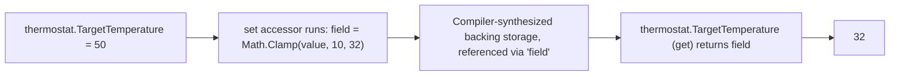
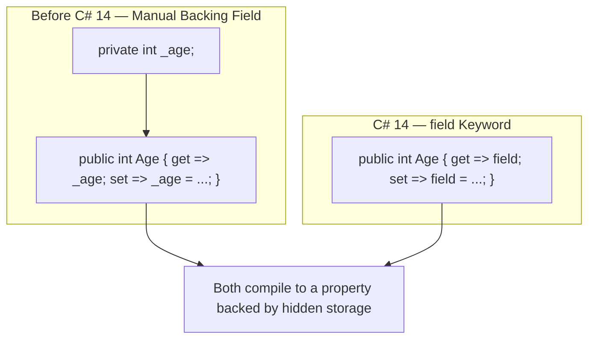

# Fields, Properties, and the field Keyword

## Introduction

Before reading this lesson, you should already be comfortable with **[Constructors in C#](../02-oop/02-02-constructors-in-csharp.md)** — in particular that a constructor's job is to set a new object's fields to a valid starting state. This lesson looks closely at exactly what those fields are, why exposing them directly (as Lesson 1's `Book` did) is usually a mistake, and how **properties** let you keep the simple `object.Member` syntax callers expect while quietly running your own logic underneath. It closes with a genuinely new piece of syntax: the C# 14 **`field` keyword**, which lets a property run custom logic without you ever declaring a backing field by hand.

By the end of this lesson, you will be able to:

- Explain the difference between a plain field and a property
- Write an auto-property and explain what the compiler generates for you behind the scenes
- Write a property with fully custom `get`/`set` logic using a manually-declared backing field
- Use the C# 14 `field` keyword to write that same custom logic with no backing field declaration at all
- Recognize why this is a genuinely new capability — one no C# tutorial could show you before C# 14 existed

## Fields, Properties, and the field Keyword — A Layman's Perspective

Picture the fuel gauge on a car's dashboard. Underneath the dashboard sits the actual fuel tank — a physical container holding a real, specific quantity of gasoline at any given moment. That tank is private machinery; you never reach into it directly, you never see it, and you're not meant to. What you interact with is the gauge on the dashboard: a simple, public-facing needle that shows you how full the tank is, and a fuel cap you use to add more. The gauge and the cap are a *controlled interface* to the tank — you get to read its level and add fuel to it, but always through a mechanism the manufacturer designed, not by physically reaching in and sloshing gasoline around by hand.

Now think about what that controlled interface actually buys you. The dashboard gauge doesn't just parrot back the tank's raw physical level — it can smooth out the reading so the needle doesn't jitter wildly every time you go over a bump. And the fuel cap doesn't just let gasoline pour in unrestricted — there's a valve that stops accepting fuel once the tank is genuinely full, no matter how much you keep pouring. The dashboard's job is to sit between you and the tank and enforce sensible rules, even though from the driver's seat, "checking the fuel level" and "adding fuel" still feel exactly as simple as reading a number and pouring from a nozzle.

Now imagine an older, cheaper car model where there's no gauge at all — the manufacturer just cut a hole in the dashboard so you can see straight into the tank and stick your own hand in. It's technically simpler to build, but nothing stops you from splashing fuel everywhere or misjudging how much is really in there, because there's no controlled interface doing any smoothing or limiting on your behalf. That bare hole is what a public field looks like: direct, unfiltered access to the actual storage, with no logic standing between you and it.

The bridge back to programming: a **field** is the raw tank — actual storage, holding an actual value. A **property** is the gauge and the cap — a controlled, `object.Member`-shaped interface that can validate, smooth, or transform what happens on the way in and out, while still feeling exactly as simple to use as reaching straight into the tank would.

## Fields, Properties, and the field Keyword — A Programming Language Perspective

A **field** is a variable declared directly inside a class or struct, representing actual storage for that instance's (or, if `static`, the type's) data. A **property** is a member that exposes data through `get` and/or `set` **accessors**, syntactically used exactly like a field (`obj.Name`, `obj.Name = value`) but backed by executable code rather than raw storage. An **auto-property** (`public int Age { get; set; }`) is the compiler generating both a hidden, compiler-named backing field and the trivial get/set logic to read and write it, for the common case where no custom logic is needed. Before **C# 14**, giving a property custom logic — validation, clamping, computed transformation — required manually declaring your own backing field (conventionally `_age`) and referencing it from inside the accessors. **C# 14** introduces the contextual **`field` keyword**, usable inside any property accessor, which refers to a compiler-synthesized backing field with no name of your own choosing and no separate declaration required — giving auto-property-level conciseness even when the accessors contain real logic, a capability that simply does not exist in any C# version before it.

## How to Use Fields, Properties, and the field Keyword in C#

An auto-property needs no backing field at all when it has no custom logic. The moment a property needs to validate or transform a value, older C# required a manually-declared private field for the accessors to read and write; the `field` keyword replaces that manual field with a compiler-provided one, referenced by the contextual word `field` inside `get` and `set`.


*Figure 1: The `field` keyword lets a property's accessors reference the compiler's own hidden storage directly — no manually declared backing field required.*

```csharp
// Program.cs — .NET 10 / C# 14
public class Thermostat
{
    // Auto-property: the compiler generates a hidden backing field automatically.
    public string Location { get; set; } = "Living Room";

    // Custom logic using the C# 14 'field' keyword — no manual backing field needed.
    public int TargetTemperature
    {
        get => field;
        set => field = Math.Clamp(value, 10, 32);
    }
}

Thermostat thermostat = new Thermostat();

thermostat.TargetTemperature = 24;
Console.WriteLine($"{thermostat.Location}: target = {thermostat.TargetTemperature}°C");

thermostat.TargetTemperature = 50;
Console.WriteLine($"{thermostat.Location}: target = {thermostat.TargetTemperature}°C");

thermostat.TargetTemperature = -5;
Console.WriteLine($"{thermostat.Location}: target = {thermostat.TargetTemperature}°C");
```

**Console Output:**

```text
Living Room: target = 24°C
Living Room: target = 32°C
Living Room: target = 10°C
```

`Location` is a plain auto-property — the compiler builds its backing field and trivial accessors for us, exactly as it has since C# 3. `TargetTemperature` is different: its `set` accessor runs real logic, `Math.Clamp(value, 10, 32)`, yet there is no `private int _targetTemperature;` anywhere in the class. The `field` keyword inside both accessors refers to storage the compiler generates on your behalf — which is why setting `50` and `-5` are silently clamped to `32` and `10` rather than accepted as-is, with the same amount of code an auto-property would have needed.

## Real-Time Example: Fields, Properties, and the field Keyword in Library/Inventory Management

We continue the **Library/Inventory Management** case study, replacing the plain public fields from **[Classes and Objects in C#](../02-oop/02-01-classes-and-objects.md)** with properties. `AvailableCopies` now uses the `field` keyword to enforce, inside the property itself, an invariant that Lesson 1's version could never guarantee: it can never fall below zero or rise above `TotalCopies`, no matter what calling code does.

```csharp
// Program.cs — .NET 10 / C# 14 — Real-Time Example: Library/Inventory Management
public class Book
{
    public string Title { get; }
    public string Author { get; }
    public int TotalCopies { get; }

    // AvailableCopies enforces its own invariant directly inside the property,
    // using the C# 14 'field' keyword — no manually declared backing field.
    public int AvailableCopies
    {
        get => field;
        private set => field = Math.Clamp(value, 0, TotalCopies);
    }

    public Book(string title, string author, int totalCopies)
    {
        Title = title;
        Author = author;
        TotalCopies = totalCopies;
        AvailableCopies = totalCopies;
    }

    public void CheckOut()
    {
        if (AvailableCopies > 0)
        {
            AvailableCopies--;
            Console.WriteLine($"'{Title}' checked out. {AvailableCopies} of {TotalCopies} remain.");
        }
        else
        {
            Console.WriteLine($"'{Title}' has no copies available.");
        }
    }

    public void Return()
    {
        AvailableCopies++;
        Console.WriteLine($"'{Title}' returned. {AvailableCopies} of {TotalCopies} now available.");
    }
}

Book book = new Book("Domain-Driven Design", "Eric Evans", 2);

book.CheckOut();
book.CheckOut();
book.CheckOut();
book.Return();
book.Return();
book.Return();
```

**Console Output:**

```text
'Domain-Driven Design' checked out. 1 of 2 remain.
'Domain-Driven Design' checked out. 0 of 2 remain.
'Domain-Driven Design' has no copies available.
'Domain-Driven Design' returned. 1 of 2 now available.
'Domain-Driven Design' returned. 2 of 2 now available.
'Domain-Driven Design' returned. 2 of 2 now available.
```

Watch the final call closely: `Return()` naively increments `AvailableCopies` a third time even though only two copies exist in total, yet the output still reads `2 of 2` rather than an impossible `3 of 2`. The `Math.Clamp` logic inside `AvailableCopies`'s `set` accessor caught it, because the invariant lives inside the property itself rather than depending on every caller to check first. Lesson 1's public-field version of `Book` offered no such protection — `book.AvailableCopies = 999` would simply have worked. This is the real payoff of moving from fields to properties: the object protects its own state.

## Manually-Declared Backing Field vs the field Keyword

Before C# 14, any property needing custom accessor logic required you to declare a private field yourself and reference it from both accessors — extra boilerplate, and one more name (`_targetTemperature`, `_availableCopies`) you had to choose and keep in sync with the property it backs. The `field` keyword removes that requirement entirely for the common case: the compiler still generates a backing field, but you never name it, declare it, or risk anyone in the class accessing it by a name other than through the property's own accessors.


*Figure 2: Both approaches produce a property backed by real storage — the `field` keyword just removes the manually-declared, manually-named field.*

| Aspect | Manually-Declared Backing Field | `field` Keyword (C# 14) |
|---|---|---|
| Backing storage | An explicit private field you declare and name (`_age`) | Compiler-synthesized, accessed only via `field` |
| Boilerplate per property | Two members: the field and the property | One member — the property itself |
| Naming | You choose the field's name and keep it consistent | No name to choose — no naming collisions possible |
| When still needed | The field must be visible to other members by name, outside the property's own accessors | Custom logic that only this property's own accessors need |
| Availability | All C# versions | C# 14 / .NET 10 and later only |

## Types of Fields and Properties in C#

Fields, properties, and the `field` keyword connect to several related topics elsewhere in this module:

1. **[Indexers in C#](../02-oop/02-04-indexers-in-csharp.md)** — the very next lesson, where `this[...]` accessors use the same get/set accessor shape as properties.
2. **[Access Modifiers and Encapsulation](../02-oop/02-06-access-modifiers-and-encapsulation.md)** — the broader principle of restricting direct access to a type's state, which properties exist to serve.
3. **[required Members and Object Initializers](../02-oop/02-22-required-members-object-initializers.md)** — marking a property as mandatory to set during construction.
4. **[init-Only Setters](../02-oop/02-32-init-only-setters.md)** — properties that can only be set during object initialization, then never again.
5. **[Immutability in C# (records, readonly, init)](../02-oop/02-31-immutability-in-csharp.md)** — how get-only properties like `Title` and `Author` in this lesson's `Book` support genuinely immutable objects.
6. **[Static Members and Static Classes](../02-oop/02-09-static-members-and-classes.md)** — fields and properties that belong to the type itself, shared across every instance.

## What You've Learned & What's Next

A field is raw storage; a property is a controlled, field-shaped interface to that storage that can validate, clamp, or transform values on the way in and out — an auto-property when no custom logic is needed, and, since C# 14, a property using the `field` keyword when it is, with no manually-declared backing field required either way. That single change removes a whole category of boilerplate that every C# tutorial written before 2025 simply had no way to avoid.

Continue your learning journey with **[Indexers in C#](../02-oop/02-04-indexers-in-csharp.md)**, where you'll see the `this[...]` syntax that lets your own types support array-like, bracketed access.

---
*Applies to: .NET 10 / C# 14. Last reviewed 2026-08-16.*
