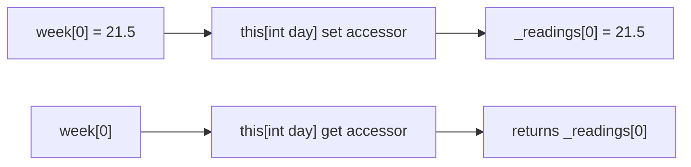
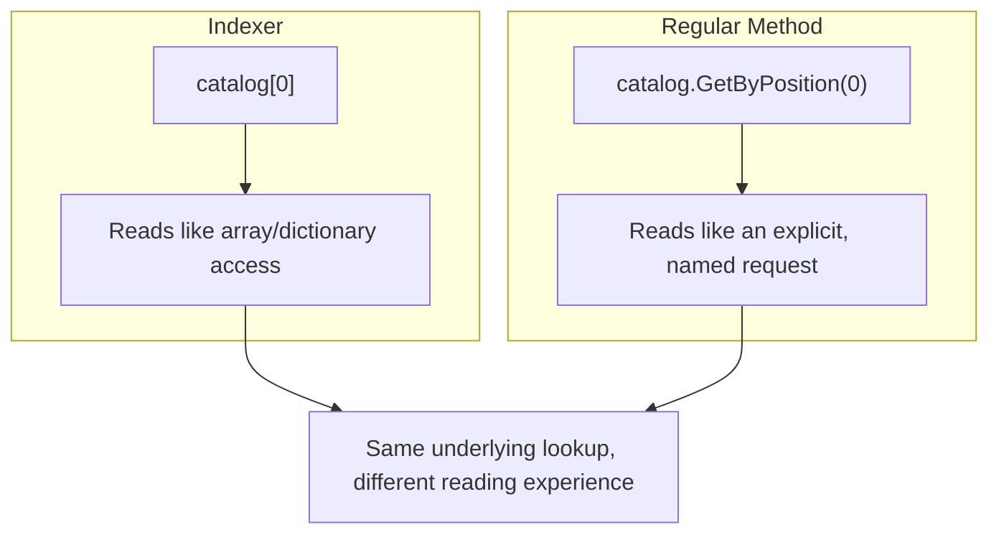

# Indexers in C#

## Introduction

Before reading this lesson, you should already be comfortable with **[Fields, Properties, and the field Keyword](../02-oop/02-03-fields-properties-field-keyword.md)** — in particular that a property lets an object expose data through `get`/`set` accessors while still reading like a plain member. This lesson introduces **indexers**: a special member that gives your own type the bracketed, `object[key]` access you already use constantly with arrays, `List<T>`, and `Dictionary<TKey, TValue>` — except now you get to define what the brackets mean for a type you designed yourself.

By the end of this lesson, you will be able to:

- Explain what an indexer is and recognize the `this[...]` declaration syntax
- Give a custom type array-like access using `this[int index]`
- Write an indexer's `get` and `set` accessors, just like a property
- Overload an indexer so the same type supports lookup by more than one kind of key
- Decide when an indexer makes a type more readable, and when a plain named method is the better choice

## Indexers — A Layman's Perspective

Picture a wall of numbered lockers at a gym. Every locker has a number stamped on its door — 1, 2, 3, and so on — and to get to whatever is inside, you simply walk up to the locker with the number you want and open it. You don't ask the front desk "please retrieve item number 14 for me"; you don't fill out a form describing what you're looking for. You just go straight to locker 14 and open it yourself, because the numbering system is public and consistent, and every locker responds to being addressed by its number in exactly the same way.

Now picture a coat check at a fancier venue, where instead of a number, you're handed a claim ticket with your name written on it. To get your coat back, you don't recite a locker number — you hand over the ticket with your name, and the attendant retrieves the coat associated with that name. Same underlying idea — direct, immediate retrieval by a key you already have in hand — but the "key" here is a name rather than a number. The gym and the coat check are both offering the exact same kind of convenience: hand over the right kind of key, get the right thing back immediately, without needing a separate named request for every possible lookup.

Some venues offer both systems at once: a claim ticket lets you retrieve your coat by name, but a staff member restocking the racks might instead walk rack by rack, position 1, position 2, position 3, checking each coat in order regardless of whose name is on it. Two different but equally valid ways of reaching into the same collection of coats — by name, or by position — depending on what the person doing the reaching actually needs at that moment.

The bridge back to programming: an indexer is what turns your own type into that numbered locker wall or coat check counter — bracketed, `object[key]` access to whatever it's holding, defined however makes sense for that type. And just as a venue can offer lookup by number *and* by name, a type can overload its indexer to accept more than one kind of key.

## Indexers — A Programming Language Perspective

An **indexer** is a special class or struct member, declared with the `this` keyword followed by a parameter list in square brackets — `public T this[TKey key] { get; set; }` — that lets instances of the type be accessed using the same bracketed syntax as arrays: `instance[key]`. Structurally, an indexer is a property in every meaningful sense: it can define `get` and/or `set` accessors, its accessors can contain arbitrary logic (including the C# 14 `field` keyword when appropriate), and it can be read-only by omitting `set`. What makes an indexer distinct from a regular property is that it is *parameterized* — the value in the brackets is passed as an argument to the accessor, and a type may declare **multiple overloaded indexers**, differing by the type (or number) of their parameters, resolved by the compiler using ordinary overload resolution against the bracketed expression. Unlike a regular property, an indexer has no name of its own at the call site — it is always invoked through `this[...]` syntax, and a type can declare at most one indexer per distinct parameter signature.

## How to Declare and Use an Indexer in C#

An indexer is declared inside a class using `public ReturnType this[ParameterType parameterName]`, followed by `get` and/or `set` accessor bodies exactly like a property's. Once declared, instances of the type support `instance[value]` for reading and, if a `set` accessor is present, `instance[value] = newValue` for writing.


*Figure 1: An indexer's `get` and `set` accessors run whenever bracketed syntax is used against the object, just like a property's accessors run for dot-member access.*

```csharp
// Program.cs — .NET 10 / C# 14
public class TemperatureLog
{
    private readonly double[] _readings = new double[7];

    public double this[int day]
    {
        get => _readings[day];
        set => _readings[day] = value;
    }

    public int Length => _readings.Length;
}

TemperatureLog week = new TemperatureLog();
week[0] = 21.5;
week[1] = 23.0;
week[2] = 19.8;

Console.WriteLine($"Monday: {week[0]}°C");
Console.WriteLine($"Tuesday: {week[1]}°C");
Console.WriteLine($"Wednesday: {week[2]}°C");
Console.WriteLine($"Log holds {week.Length} days.");
```

**Console Output:**

```text
Monday: 21.5°C
Tuesday: 23°C
Wednesday: 19.8°C
Log holds 7 days.
```

`week[0] = 21.5` calls the indexer's `set` accessor, which stores the value into the private `_readings` array at position 0; `week[0]` later calls the `get` accessor to retrieve it. From outside the class, `TemperatureLog` behaves exactly like an array — `week[day]` — even though `_readings` itself stays private, giving the class room to change its internal storage later without breaking any code that uses the indexer.

## Real-Time Example: Indexers in Library/Inventory Management

We continue the **Library/Inventory Management** case study with a `Catalog` class wrapping a shelf of `Book` objects. `Catalog` overloads its indexer twice: `this[int position]` retrieves a book by its position on the shelf, like an array, while `this[string title]` retrieves a book by title, like a dictionary keyed by name.

```csharp
// Program.cs — .NET 10 / C# 14 — Real-Time Example: Library/Inventory Management
public class Book
{
    public string Title { get; }
    public string Author { get; }

    public Book(string title, string author)
    {
        Title = title;
        Author = author;
    }
}

public class Catalog
{
    private readonly List<Book> _books = new();

    public void Add(Book book) => _books.Add(book);

    // Indexer overload #1 — access by shelf position, like an array.
    public Book this[int position] => _books[position];

    // Indexer overload #2 — access by title, like a dictionary key.
    public Book this[string title]
    {
        get
        {
            Book? match = _books.FirstOrDefault(b => b.Title == title);
            return match ?? throw new KeyNotFoundException($"No book titled '{title}' in the catalog.");
        }
    }

    public int Count => _books.Count;
}

Catalog catalog = new Catalog();
catalog.Add(new Book("Clean Code", "Robert C. Martin"));
catalog.Add(new Book("The Pragmatic Programmer", "Andrew Hunt"));
catalog.Add(new Book("Design Patterns", "Erich Gamma"));

Console.WriteLine($"First on the shelf: {catalog[0].Title}");
Console.WriteLine($"Third on the shelf: {catalog[2].Title}");
Console.WriteLine($"By title: {catalog["The Pragmatic Programmer"].Author}");
Console.WriteLine($"Catalog holds {catalog.Count} books.");

try
{
    Console.WriteLine(catalog["Refactoring"].Title);
}
catch (KeyNotFoundException ex)
{
    Console.WriteLine($"Lookup failed: {ex.Message}");
}
```

**Console Output:**

```text
First on the shelf: Clean Code
Third on the shelf: Design Patterns
By title: Andrew Hunt
Catalog holds 3 books.
Lookup failed: No book titled 'Refactoring' in the catalog.
```

`catalog[0]` and `catalog[2]` resolve to the `this[int position]` overload, while `catalog["The Pragmatic Programmer"]` and `catalog["Refactoring"]` resolve to the `this[string title]` overload — the compiler picks the right one based on the bracketed argument's type, exactly like any other overloaded member. A front-desk system built on `Catalog` reads naturally either way: reaching for "the third book on this shelf" or "the book called Refactoring" both feel like direct, immediate lookups, with the failed-lookup case handled by an exception rather than a silent `null`.

## Indexers vs Regular Lookup Methods

Every indexer could, in principle, be written as a plainly-named method instead — `catalog.GetByPosition(0)` or `catalog.GetByTitle("Clean Code")` — executing identical logic. An indexer is the right choice when a type has one (or a small, clearly-overloaded few) obvious, primary way of being looked up by key, and callers already think of the type as "a collection of things reachable by key" — exactly how `Catalog`, `List<T>`, and `Dictionary<TKey, TValue>` all behave. A named method remains the better choice the moment a lookup needs a descriptive name to stay clear, or when there would be too many subtly different lookup behaviors to safely distinguish using only overload resolution on the bracket's argument type.


*Figure 2: An indexer and a named lookup method can retrieve identical data — the difference is whether the call site reads like a collection lookup or an explicit request.*

| Aspect | Indexer (`catalog[key]`) | Regular Method (`.GetByX(key)`) |
|---|---|---|
| Call-site readability | Reads like array/dictionary access | Reads like an explicit, named action |
| Best suited for | A type with one or two obvious, key-based lookups | Lookups needing a descriptive name, or many subtly different behaviors |
| Overloading | By parameter type only, resolved at the bracket | Any number of distinctly-named methods, however similar |
| Discoverability | Implicit — must already know the type supports it | Shows up directly in IntelliSense with a descriptive name |
| Typical types | Collections, matrices, lookup-style wrappers | Anything without an obvious "this is a collection" shape |

## Types of Indexers in C#

Indexers connect to several related topics covered elsewhere in the curriculum:

1. **[Operator Overloading in Depth](../02-oop/02-05-operator-overloading-in-depth.md)** — the very next lesson; indexers and operators are both special syntax resolved to methods you write yourself.
2. **[Multidimensional and Jagged Arrays](../01-fundamentals/01-14-multidimensional-and-jagged-arrays.md)** — the foundation multi-parameter indexers mirror, e.g. `this[int row, int column]`.
3. **[`Dictionary<TKey,TValue>` in Depth](../03-collections-generics/03-05-dictionary-in-depth.md)** — the built-in type whose own key-based indexer inspired `Catalog`'s title-based overload.
4. **[Building a Custom Collection Type](../03-collections-generics/03-21-building-a-custom-collection-type.md)** — indexers are a core building block of any custom collection.
5. **[`IEnumerable<T>` and `IEnumerator<T>`](../03-collections-generics/03-13-ienumerable-and-ienumerator.md)** — pairs naturally with indexers so a custom type supports both `foreach` and bracketed access.
6. **[Introduction to Generics](../03-collections-generics/03-15-introduction-to-generics.md)** — writing an indexer generically, e.g. `this[TKey key]`, instead of hard-coding one key type.

## What You've Learned & What's Next

An indexer gives your own type the same bracketed, `object[key]` access you already rely on with arrays and dictionaries, declared with `this[...]` and backed by `get`/`set` accessors exactly like a property's. Overloading an indexer lets the same type support more than one natural way of being looked up — by position, by name, or by whatever key makes sense for that type — resolved automatically by the type of whatever sits inside the brackets.

Continue your learning journey with **[Operator Overloading in Depth](../02-oop/02-05-operator-overloading-in-depth.md)**, where we return to the operator overloading you saw briefly in Module 01 and cover the full rule set — including which operators must be overloaded in pairs, and which can never be overloaded at all.

---
*Applies to: .NET 10 / C# 14. Last reviewed 2026-08-16.*
