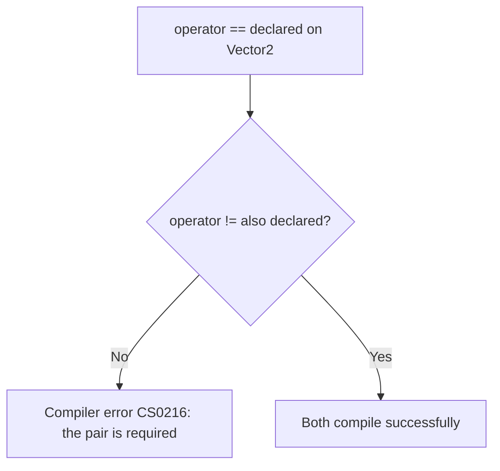
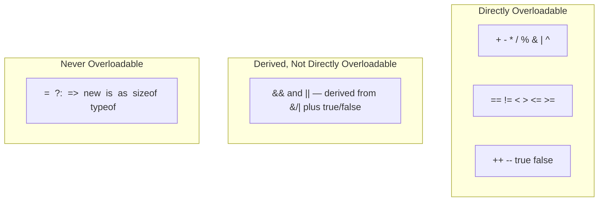

# Operator Overloading in Depth

## Introduction

Before reading this lesson, you should already be comfortable with **[Indexers in C#](../02-oop/02-04-indexers-in-csharp.md)** and with the brief introduction to operator overloading back in **[Operator Overloading Basics](../01-fundamentals/01-07-operator-overloading-basics.md)**, where you saw `public static operator` syntax for the first time on a simple `Money` type. This lesson returns to that topic now that classes are fully in view, and covers the complete rule set: every category of operator you're allowed to overload, the operators C# forces you to overload in matching pairs, and the operators you can never overload no matter what your type represents.

By the end of this lesson, you will be able to:

- List the full categories of operators C# allows you to overload: unary, binary arithmetic, comparison, and increment/decrement
- Explain the compiler-enforced pairing rules for `==`/`!=`, `<`/`>`, and `<=`/`>=`
- Overload unary operators, including `++` and `--`, on a custom type
- Explain why `&&` and `||` cannot be overloaded directly, and how they're derived instead from `&`, `|`, and the `true`/`false` operator pair
- Recognize which operators — `=`, `?:`, `=>`, `new`, and others — can never be overloaded under any circumstances

## Operator Overloading in Depth — A Layman's Perspective

Picture a currency exchange counter at an airport. Every counter posts two rates side by side on its board: a buy rate and a sell rate — how much local currency you get for your dollars, and how many dollars you'd need to buy back that same local currency. No reputable exchange counter ever posts only one of the two. A rate board with a buy price but no sell price would leave travelers stranded on the way back through the airport, unable to reverse the transaction they were just invited to make. The two rates are inseparable — quoting one without the other isn't a shortcut, it's a broken exchange counter.

The same logic governs a scale used to compare two items' weight at a shipping counter. If the scale can tell you "this package is lighter than that one," it had better also be able to tell you "this package is heavier than that one" — the two comparisons are just opposite readings of the exact same physical fact. A shipping counter that could only ever tell you "lighter than" and never "heavier than" would be useless the moment a customer asked the question the other way around, even though, mechanically, answering it requires no new capability at all — just flipping which side the arrow points.

Now think about the exchange counter's teller badge, which reads "OPEN" on one side and "CLOSED" on the other — never both, never neither. Some questions only make sense with exactly two mutually exclusive answers, and a badge that could only ever say "OPEN," with no defined "CLOSED" state, would leave customers unable to tell whether the counter was actually running.

C# treats certain operators the exact same way it treats the exchange counter's buy/sell rates and the shipping scale's lighter/heavier readings: if you teach your type one half of a related pair, the compiler insists you teach it the other half too, because a type that only knows how to answer one direction of a two-directional question is exactly as broken as an exchange counter with no sell rate.

The bridge back to programming: operator overloading in depth is about learning the full rulebook — which operators are freely overloadable on their own, which ones the compiler requires you to define in matching pairs, and which ones, like `=` itself, are permanently off-limits no matter what your type represents.

## Operator Overloading in Depth — A Programming Language Perspective

C# allows overloading of the unary operators (`+`, `-`, `!`, `~`, `++`, `--`, and the rarely-used `true`/`false` pair), the binary arithmetic and bitwise operators (`+`, `-`, `*`, `/`, `%`, `&`, `|`, `^`, `<<`, `>>`, `>>>`), and the comparison operators (`==`, `!=`, `<`, `>`, `<=`, `>=`), each declared as a `public static operator` method on the containing type. The compiler enforces three **matching-pair rules**: `==` and `!=` must be overloaded together, `<` and `>` must be overloaded together, and `<=` and `>=` must be overloaded together — omitting one half of any pair produces compiler error CS0216. A type that overloads `true` and `false` together enables the compiler to evaluate that type directly in an `if`, `while`, or ternary condition without an implicit conversion to `bool`; more importantly, overloading `&` (or `|`) alongside a `true`/`false` pair is what allows the compiler to evaluate the short-circuiting `&&` (or `||`) operator on that type automatically — **`&&` and `||` themselves can never be overloaded directly**. Assignment (`=`), the conditional operator (`?:`), lambda arrow (`=>`), `new`, `is`, `as`, `sizeof`, and `typeof` can never be overloaded under any circumstances; compound assignment forms like `+=` require no separate overload, since they are always derived automatically from the corresponding binary operator. Since C# 11, operators may also declare a `checked` variant (`public static Money operator checked +(...)`), invoked only inside a `checked` context.

## How to Overload Operators Fully in C#

Overloading follows the same `public static operator` shape regardless of category: unary operators take a single parameter of the containing type, binary operators take two, and comparison operators return `bool`. The compiler's matching-pair rule means you plan `==`/`!=`, `<`/`>`, and `<=`/`>=` as pairs from the start, not as afterthoughts.


*Figure 1: Overloading `==` without also overloading `!=` (or vice versa) is a compile-time error, not a runtime concern — C# enforces the pairing rule up front.*

```csharp
// Program.cs — .NET 10 / C# 14
public readonly struct Vector2(double x, double y)
{
    public double X { get; } = x;
    public double Y { get; } = y;

    public static Vector2 operator +(Vector2 a, Vector2 b) => new Vector2(a.X + b.X, a.Y + b.Y);
    public static Vector2 operator -(Vector2 v) => new Vector2(-v.X, -v.Y);
    public static Vector2 operator ++(Vector2 v) => new Vector2(v.X + 1, v.Y + 1);

    public static bool operator ==(Vector2 a, Vector2 b) => a.X == b.X && a.Y == b.Y;
    public static bool operator !=(Vector2 a, Vector2 b) => !(a == b);

    public override bool Equals(object? obj) => obj is Vector2 other && this == other;
    public override int GetHashCode() => HashCode.Combine(X, Y);

    public override string ToString() => $"({X}, {Y})";
}

Vector2 a = new Vector2(2, 3);
Vector2 b = new Vector2(2, 3);
Vector2 sum = a + new Vector2(1, 1);
Vector2 negated = -a;
Vector2 incremented = a;
incremented++;

Console.WriteLine($"a == b: {a == b}");
Console.WriteLine($"a + (1,1) = {sum}");
Console.WriteLine($"-a = {negated}");
Console.WriteLine($"a++ = {incremented}");
```

**Console Output:**

```text
a == b: True
a + (1,1) = (3, 4)
-a = (-2, -3)
a++ = (3, 4)
```

`Vector2` overloads a binary operator (`+`), a unary operator (`-`), an increment operator (`++`), and the required `==`/`!=` pair together. Notice `incremented++` works even though only `operator ++` was declared, not `+= 1` — the compiler automatically applies the declared `++` and assigns the result back to `incremented`, exactly the way it derives `+=` from `+`. Also notice `==` and `!=` were declared as a pair; declaring only one would have failed to compile with error CS0216, regardless of how correct that one operator's logic was.

## Real-Time Example: Operator Overloading in Depth in Banking/ATM

We return to the **Banking/ATM** case study's `Balance` type, first introduced in **[Operator Overloading Basics](../01-fundamentals/01-07-operator-overloading-basics.md)**, and give it the full operator treatment: `+` and `-` for deposits and withdrawals (with a guard against overdrawing), `++`/`--` for monthly interest and fees, and the complete, correctly-paired comparison set.

```csharp
// Program.cs — .NET 10 / C# 14 — Real-Time Example: Banking/ATM
public readonly struct Balance
{
    public decimal Amount { get; }

    public Balance(decimal amount) => Amount = amount;

    public static Balance operator +(Balance balance, decimal deposit) =>
        new Balance(balance.Amount + deposit);

    public static Balance operator -(Balance balance, decimal withdrawal)
    {
        if (withdrawal > balance.Amount)
        {
            throw new InvalidOperationException("Insufficient funds for withdrawal.");
        }
        return new Balance(balance.Amount - withdrawal);
    }

    public static Balance operator ++(Balance balance) => new Balance(balance.Amount + 25.00m);
    public static Balance operator --(Balance balance) => new Balance(balance.Amount - 10.00m);

    public static bool operator ==(Balance a, Balance b) => a.Amount == b.Amount;
    public static bool operator !=(Balance a, Balance b) => !(a == b);
    public static bool operator <(Balance a, Balance b) => a.Amount < b.Amount;
    public static bool operator >(Balance a, Balance b) => a.Amount > b.Amount;
    public static bool operator <=(Balance a, Balance b) => a.Amount <= b.Amount;
    public static bool operator >=(Balance a, Balance b) => a.Amount >= b.Amount;

    public override bool Equals(object? obj) => obj is Balance other && this == other;
    public override int GetHashCode() => Amount.GetHashCode();

    public override string ToString() => Amount.ToString("C");
}

Balance checking = new Balance(500.00m);
Balance savings = new Balance(500.00m);

Console.WriteLine($"checking == savings: {checking == savings}");

checking += 250.00m;
Console.WriteLine($"After deposit: {checking}");

checking -= 100.00m;
Console.WriteLine($"After withdrawal: {checking}");

checking++;
Console.WriteLine($"After interest: {checking}");

checking--;
Console.WriteLine($"After monthly fee: {checking}");

if (checking > savings)
{
    Console.WriteLine("Checking now holds more than savings.");
}
else
{
    Console.WriteLine("Checking does not hold more than savings.");
}

try
{
    savings -= 10000.00m;
}
catch (InvalidOperationException ex)
{
    Console.WriteLine($"Withdrawal blocked: {ex.Message}");
}
```

**Console Output:**

```text
checking == savings: True
After deposit: $750.00
After withdrawal: $650.00
After interest: $675.00
After monthly fee: $665.00
Checking now holds more than savings.
Withdrawal blocked: Insufficient funds for withdrawal.
```

Every compound assignment here — `+=`, `-=`, `++`, `--` — is derived automatically from the four operators actually declared (`+`, `-`, `++`, `--`); nothing extra had to be written for them to work. The full, correctly-paired comparison set (`==`/`!=`, `<`/`>`, `<=`/`>=`) lets `checking > savings` read exactly like comparing two numbers, and the guard inside `operator -` protects every withdrawal path — including the compound `-=` form — from ever producing a negative balance, throwing instead of silently corrupting the account.

## Overloadable vs Non-Overloadable Operators

Not every symbol in C# can be given new meaning, and it's worth knowing the boundary precisely rather than by trial and error. Arithmetic, bitwise, comparison, and increment/decrement operators are all fair game, always as `public static operator` methods on your own type. A second, smaller category — `&&` and `||` — occupies a special middle ground: you can't overload them directly, but overloading `&`/`|` together with the `true`/`false` operator pair lets the compiler derive short-circuiting `&&`/`||` behavior for your type automatically. A final category is permanently off-limits, because allowing it would undermine something the language depends on staying fixed — `=` always means "rebind this variable," never something a type can redefine.


*Figure 2: Most operators can be overloaded directly; `&&`/`||` are derived from simpler pieces instead; a fixed set can never be overloaded at all.*

| Aspect | Overloadable | Not Overloadable |
|---|---|---|
| Arithmetic | `+`, `-`, `*`, `/`, `%` (unary and binary) | — |
| Bitwise | `&`, `\|`, `^`, `~`, `<<`, `>>`, `>>>` | — |
| Comparison | `==`/`!=`, `<`/`>`, `<=`/`>=` (must be overloaded in pairs) | — |
| Logical short-circuit | Derived automatically from `&`/`\|` plus `true`/`false` | `&&`, `\|\|` directly |
| Increment/Decrement | `++`, `--` | — |
| Assignment | Compound forms (`+=`, `-=`, ...) derived automatically | `=` itself, always |
| Other language symbols | — | `?:`, `=>`, `new`, `is`, `as`, `sizeof`, `typeof` |

## Types of Operator-Related Topics in C#

Operator overloading connects to several related topics, some already introduced and some still ahead:

1. **[Access Modifiers and Encapsulation](../02-oop/02-06-access-modifiers-and-encapsulation.md)** — the very next lesson, covering how visibility rules apply to the members surrounding a type's overloaded operators.
2. **[Type Conversion and Casting](../01-fundamentals/01-08-type-conversion-and-casting.md)** — user-defined `implicit`/`explicit` conversion operators, a closely related but distinct feature from arithmetic/comparison operator overloading.
3. **[Equality: Equals, ==, and IEquatable\<T\>](../02-oop/02-33-equality-equals-iequatable.md)** — the deeper contract `==` and `Equals` must satisfy together once a type overloads either.
4. **[Records in C# (`record class`)](../02-oop/02-19-records-in-csharp.md)** — records generate a correctly-paired `==`/`!=` overload for you automatically, based on value equality.
5. **[`IComparable<T>` and `IComparer<T>`](../03-collections-generics/03-20-icomparable-and-icomparer.md)** — the interface-based alternative to overloading `<`/`>` when a type needs to support sorting, not just direct comparison.
6. **[Structs vs Classes](../02-oop/02-21-structs-vs-classes.md)** — why `Balance` in this lesson is a `struct`, and how value-type semantics interact with operator overloading.

## What You've Learned & What's Next

The full operator overloading rule set comes down to three things: most arithmetic, bitwise, comparison, and increment/decrement operators can be overloaded directly on your own type; `==`/`!=`, `<`/`>`, and `<=`/`>=` must always be overloaded in matching pairs, enforced by the compiler; and a fixed set of operators — `=`, `?:`, `=>`, `new`, and a handful of others, along with `&&`/`||` directly — can never be overloaded, though `&&`/`||` can still be *derived* from simpler pieces you do overload. With that, Module 02's coverage of how a single type declares its own data, construction, member access, and operator behavior is complete.

Continue your learning journey with **[Access Modifiers and Encapsulation](../02-oop/02-06-access-modifiers-and-encapsulation.md)**, where we formalize the visibility rules — `public`, `private`, `protected`, and `internal` — that decide who can see and use everything you've built so far.

---
*Applies to: .NET 10 / C# 14. Last reviewed 2026-08-16.*
