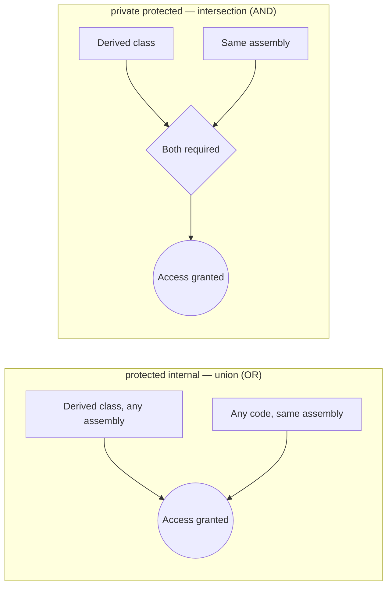

# Access Modifiers and Encapsulation

## Introduction

Before reading this lesson, you should already be comfortable with **[Operator Overloading in Depth](../02-oop/02-05-operator-overloading-in-depth.md)** — giving your own types custom behavior for built-in operators. Every class you've built so far has quietly used `public` and `private` without much explanation. This lesson stops and looks directly at *why* those keywords exist: the mechanics C# gives you for controlling exactly which code is allowed to see and touch a type or its members.

By the end of this lesson, you will be able to:

- Name all six C# access modifiers and state precisely what each one permits
- Apply `public`, `private`, `protected`, and `internal` to classes, fields, methods, and properties
- Explain the difference between `protected internal` (a union) and `private protected` (an intersection)
- Restrict a type to a single source file using the C# 11 `file` modifier
- Identify the default accessibility C# assumes when no modifier is written

## Access Modifiers and Encapsulation — A Layman's Perspective

Picture a large office building shared by several companies. The lobby is open to absolutely anyone off the street — no badge required, no questions asked. That's `public`: available to any code, anywhere, that references your type.

Now picture your own personal desk drawer. Nobody but you ever opens it — not your teammates, not people from other departments, not even someone who inherits your job title after you leave. That's `private`: visible only inside the exact class where it's declared, full stop.

Some rooms in this building are family rooms — reserved for you and your direct descendants, so to speak: your understudy who takes over your exact role, and their understudy after that, no matter which floor or company they eventually work for. That's `protected`: accessible to the declaring class and to anything that inherits from it, regardless of where that subclass lives.

Other rooms use a company badge instead of a family badge — any employee of your company can walk in, whether they're in accounting, engineering, or sales, as long as they work for the same company (the same compiled assembly). That's `internal`: visible to any code compiled into the same project, but invisible the moment another company's (another assembly's) code tries to reference it.

Two rooms combine these rules in opposite ways. One room posts a sign reading "family OR company badge" — either your relatives or your coworkers can enter, whichever applies. That's `protected internal`, a union: broader than either rule alone. Another room posts a stricter sign reading "family AND company badge required" — you must be both a descendant of the original owner and an employee at this specific company; a descendant working at a different company is turned away. That's `private protected`, an intersection: narrower than either rule alone.

Finally, imagine a single working document — a shared notebook page — where a note is meaningful only to whoever else is writing on that exact same page right now. Nobody outside that one physical page even knows the note exists, no matter what department or family they belong to. That's the `file` modifier: a type that exists only for the one source file it's declared in, invisible even to the rest of its own project.

The bridge back to programming: access modifiers are the badge system that decides which code — the same class, a subclass, the same project, or literally anyone — is allowed through the door to see or use a given type or member. Choosing the right one for each field, property, and method is the first mechanical step toward encapsulation, the design principle the next lesson builds on top of this.

## Access Modifiers and Encapsulation — A Programming Language Perspective

C# defines six access levels. **`public`** members are visible to any code that can see the containing type. **`private`** members — the default for class members when no modifier is written — are visible only within the declaring type itself. **`protected`** members are visible within the declaring type and any type that derives from it, in any assembly. **`internal`** members — the default for top-level types — are visible anywhere within the same compiled assembly, but not from a separate assembly referencing it. **`protected internal`** is the *union* of `protected` and `internal`: accessible from a derived type in any assembly, or from any code in the same assembly. **`private protected`** (added in C# 7.2) is the *intersection*: accessible only from a derived type that is *also* within the same assembly. Since C# 11, the **`file`** modifier restricts a top-level type declaration to the single source file it appears in — invisible even to other files in the same project — commonly used by source generators and internal implementation helpers that should never leak beyond one file.

## How to Apply Access Modifiers in C#

Access modifiers are written directly before a type or member declaration. A field marked `private` can only be touched by code written inside that same class — not even a derived class can reach it directly. A field or method marked `protected` opens that same door to subclasses. Marking a class `internal` (or leaving it unmarked, since `internal` is the default for top-level types) keeps it out of reach for other assemblies entirely, while `public` removes that restriction.


*Figure 1: Access modifiers ordered roughly from narrowest (`private`) to broadest (`public`). `private protected` is the intersection of `protected` and `internal`; `protected internal` is their union.*

```csharp
// Program.cs — .NET 10 / C# 14
var van = new DeliveryVan("1FTBW3", 12_500);
Console.WriteLine(van.Describe());

van.CompleteRoute(85);
Console.WriteLine(van.Describe());

RouteLogger.LogCompletion(van.Describe());

// van.mileage += 1000;    // Compile error: 'mileage' is inaccessible due to its protection level
// van.AddMileage(1000);   // Compile error: 'AddMileage' is protected, only Vehicle and derived types can call it

public class Vehicle
{
    private readonly string vin;
    protected int mileage;

    public Vehicle(string vin, int mileage)
    {
        this.vin = vin;
        this.mileage = mileage;
    }

    public string Describe() => $"VIN {vin}: {mileage:N0} miles";

    protected void AddMileage(int miles) => mileage += miles;
}

internal class DeliveryVan : Vehicle
{
    public DeliveryVan(string vin, int mileage) : base(vin, mileage) { }

    public void CompleteRoute(int milesDriven) => AddMileage(milesDriven);
}

file class RouteLogger
{
    public static void LogCompletion(string summary) => Console.WriteLine($"[log] {summary}");
}
```

**Console Output:**

```text
VIN 1FTBW3: 12,500 miles
VIN 1FTBW3: 12,585 miles
[log] VIN 1FTBW3: 12,585 miles
```

`Vehicle.vin` is `private`, so not even `DeliveryVan` — a class that inherits from `Vehicle` — can touch it directly; only `Vehicle`'s own code can read or write it. `mileage`, marked `protected`, is exactly the field `DeliveryVan` needs to reach through the inherited `AddMileage` method, which is itself `protected` so outside callers can't bypass validation by calling it directly. `DeliveryVan` is marked `internal` — it's meant to be used anywhere in this project, but never referenced from another compiled assembly. `RouteLogger` uses `file`, so it exists only for this one file; if a second file in the same project declared its own `class RouteLogger`, the two would not conflict at all, because each is invisible outside its own file.

## Real-Time Example: Access Modifiers in Banking/ATM

We apply access modifiers to the **Banking/ATM** case study: a `BankAccount` keeps its balance completely private, exposes a `protected` helper that only trusted subclasses like `SavingsAccount` can call, and an `internal` logging utility records activity for anything else inside the same banking application.

```csharp
// Program.cs — .NET 10 / C# 14 — Real-Time Example
var savings = new SavingsAccount("SAV-1042", 5000m, 0.03m);
Console.WriteLine(savings.Describe());

savings.ApplyMonthlyInterest();
Console.WriteLine(savings.Describe());

savings.Withdraw(500m);
Console.WriteLine(savings.Describe());

// savings.balance -= 1000m;      // Compile error: 'balance' is private to BankAccount
// savings.ApplyInterest(0.03m);  // Compile error: 'ApplyInterest' is protected

AtmTransactionLog.Record($"Interest applied to {savings.AccountNumber}");

public class BankAccount
{
    private decimal balance;

    public string AccountNumber { get; }

    public BankAccount(string accountNumber, decimal openingBalance)
    {
        AccountNumber = accountNumber;
        balance = openingBalance;
    }

    public string Describe() => $"{AccountNumber}: {balance:C}";

    public void Withdraw(decimal amount)
    {
        if (amount > balance)
        {
            throw new InvalidOperationException("Insufficient funds.");
        }
        balance -= amount;
    }

    protected void ApplyInterest(decimal rate) => balance += Math.Round(balance * rate, 2);
}

public class SavingsAccount : BankAccount
{
    private readonly decimal interestRate;

    public SavingsAccount(string accountNumber, decimal openingBalance, decimal interestRate)
        : base(accountNumber, openingBalance)
    {
        this.interestRate = interestRate;
    }

    public void ApplyMonthlyInterest() => ApplyInterest(interestRate);
}

internal static class AtmTransactionLog
{
    public static void Record(string message) => Console.WriteLine($"[ATM LOG] {message}");
}
```

**Console Output:**

```text
SAV-1042: $5,000.00
SAV-1042: $5,150.00
SAV-1042: $4,650.00
[ATM LOG] Interest applied to SAV-1042
```

`balance` never leaves `BankAccount` directly — every change goes through `Withdraw` or the `protected` `ApplyInterest`, so a `SavingsAccount` (or any future account type) can adjust its own balance only through methods that enforce the bank's rules, never by poking the field itself. `AtmTransactionLog` is `internal`, meaning any class in this banking application can log activity, but a separate application referencing this assembly could never call it — exactly the boundary a shared audit utility needs.

## `protected internal` vs `private protected`

These two modifiers are easy to confuse because both combine "protected" and "internal," but they combine them in opposite ways. `protected internal` is a **union**: access is granted if *either* condition holds — a derived class in a completely different assembly can reach the member, and so can any ordinary code sharing the same assembly, even if it isn't a subclass at all. `private protected` is an **intersection**: access requires *both* conditions at once — a type must be a subclass *and* live in the same assembly; a subclass declared in a different project is refused, even though ordinary `protected` alone would have allowed it.


*Figure 2: `protected internal` grants access if either condition is met; `private protected` requires both at once.*

| Aspect | `protected internal` | `private protected` |
|---|---|---|
| Combining logic | Union (OR) | Intersection (AND) |
| Broader or narrower than plain `protected` | Broader | Narrower |
| Reachable from a subclass in another assembly | Yes | No |
| Reachable from same-assembly code that isn't a subclass | Yes | No |
| Introduced in | C# 2.0 | C# 7.2 |
| Typical use | A framework base class meant to be extended externally *and* used internally | An internal class hierarchy that must never grant extra access to outside subclasses |

## Types Related to Access Control in C#

1. **[Encapsulation — The First Pillar of OOP](../02-oop/02-07-encapsulation-pillar-of-oop.md)** — the very next lesson, where these mechanics become a deliberate design principle rather than just syntax.
2. **[Fields, Properties, and the `field` Keyword](../02-oop/02-03-fields-properties-field-keyword.md)** — properties are the usual partner for a `private` backing field.
3. **[Static Members and Static Classes](../02-oop/02-09-static-members-and-classes.md)** — `internal static` utility classes like `AtmTransactionLog` recur throughout larger applications.
4. **[Sealed Classes and Methods](../02-oop/02-17-sealed-classes-and-methods.md)** — restricting further inheritance is a close cousin of restricting access.
5. **[Interfaces in C#](../02-oop/02-15-interfaces-in-csharp.md)** — interface members are implicitly `public` and cannot carry an access modifier of their own.
6. **[Nested Types in C#](../02-oop/02-27-nested-types-in-csharp.md)** — a nested type can be `private`, tightening visibility even further than any top-level type can go.

## What You've Learned & What's Next

You've learned all six C# access modifiers — `public`, `private`, `protected`, `internal`, `protected internal`, and `private protected` — plus the C# 11 `file` modifier, and how each draws a different boundary around who can see a type or member. `protected internal` is a union of its two rules; `private protected` is their intersection.

Continue your learning journey with **[Encapsulation — The First Pillar of OOP](../02-oop/02-07-encapsulation-pillar-of-oop.md)**, where these access rules stop being isolated syntax and become the foundation of a core OOP design principle.

---
*Applies to: .NET 10 / C# 14. Last reviewed 2026-08-16.*
