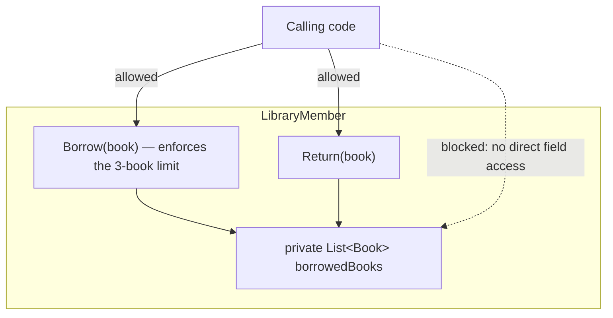
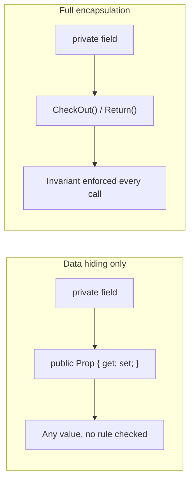

# Encapsulation — The First Pillar of OOP

## Introduction

Before reading this lesson, you should already be comfortable with **[Access Modifiers and Encapsulation](../02-oop/02-06-access-modifiers-and-encapsulation.md)** — the `public`/`private`/`protected`/`internal` keywords that decide who can see a member. That lesson covered the *mechanics* of restricting access. This lesson covers the *reason* those mechanics exist: encapsulation as a design principle, the first of the four pillars of object-oriented programming — bundling data together with the behavior that operates on it, and refusing to let anything outside that bundle put it into an invalid state.

By the end of this lesson, you will be able to:

- Define encapsulation as a design principle, not merely "making fields private"
- Explain why bundling data and behavior together protects a class's invariants
- Recognize the "anemic" smell of a class that hides fields but exposes raw setters
- Design a class whose public surface is a set of intent-revealing operations
- Distinguish encapsulation (this lesson) from abstraction (the next pillar)

## Encapsulation — A Layman's Perspective

Picture a vending machine. You never reach inside it to rearrange the coils, adjust the coin counter, or nudge a snack forward by hand. You press a button, and the machine's own internal mechanism does everything: it checks you inserted enough money, decrements its own stock count, dispenses exactly one item, and updates its internal ledger — all in one motion that you never see and never touch directly. If you *could* reach inside and set the coin counter to any number you liked, or yank the stock count down without ever dispensing anything, the machine's books would stop making sense within a day. Its internal state and the rules for changing that state are bundled together and sealed behind a small, simple panel of buttons.

This is exactly what encapsulation means for a class. It isn't merely "hide the fields" — a vending machine with its coils exposed but a padlock on the front is still a mess if the padlock only stops you from grabbing snacks, but the machine's price and stock counters are still adjustable through some side panel with no rules attached. Real encapsulation bundles the data (how much stock is left, how much money has been collected) together with the *only* operations allowed to change that data (`Vend`, `RestockItem`, `CollectCoins`) — and each of those operations enforces the machine's rules every single time, so the internal numbers can never drift into nonsense no matter who presses which button, in what order, how many times.

Contrast that with a vending machine redesigned so that anyone can open a little door and directly rewrite the "items remaining" number with a marker. Technically the number is still just a field somewhere inside the machine — but now nothing guarantees it stays accurate, because changing it doesn't go through the one process (`Vend`) that keeps the money collected and the stock remaining in sync. That's what a class looks like when it merely hides fields behind `private` but then exposes a public setter for each one anyway: the padlock is cosmetic, because every field can still be set to anything from outside, one at a time, with none of the machine's rules applied.

The bridge back to programming: encapsulation means designing a class so that its internal state can only change through operations the class itself defines and enforces — never by letting outside code poke at individual fields directly, even indirectly through a bare setter. The previous lesson's access modifiers are the padlock; encapsulation is the discipline of only ever offering a small, rule-enforcing panel of buttons instead of a door anyone can open.

## Encapsulation — A Programming Language Perspective

**Encapsulation** is the OOP principle of bundling a type's data (fields) together with the methods that operate on that data into a single unit — a class — and restricting direct access to that data so it can only be modified through the type's own well-defined public interface. Mechanically, this relies on the access modifiers from the previous lesson (`private` fields, `public` methods), but encapsulation as a *design* goal is stricter than that mechanical minimum: it means the public surface should consist of operations that enforce the type's invariants — the rules that must always hold true about its internal state — rather than raw getters and setters that let any field be set to any value independent of the others. A class that hides its fields but exposes an unrestricted public setter for each one has achieved data hiding without achieving encapsulation, since its invariants are still enforceable, or not, entirely at the whim of the caller.

## How to Design an Encapsulated Class in C#

An encapsulated class keeps its fields `private`, exposes read access only where it's genuinely needed (often through a read-only property or an `IReadOnlyList<T>` view rather than the mutable collection itself), and offers a small number of methods named for what they *do* — not for which field they touch. Each of those methods is where the class's rules live, checked every time, so no caller can bypass them.


*Figure 1: Calling code can only reach `borrowedBooks` through `Borrow`/`Return`, so the borrowing limit is enforced every time — never bypassed.*

```csharp
// Program.cs — .NET 10 / C# 14
var member = new LibraryMember("Amara Okafor");

member.Borrow(new Book("Clean Code"));
member.Borrow(new Book("The Pragmatic Programmer"));
Console.WriteLine($"{member.Name} has {member.BorrowedCount} book(s) checked out.");

foreach (Book book in member.BorrowedBooks)
{
    Console.WriteLine($"  - {book.Title}");
}

member.Borrow(new Book("Refactoring"));
member.Borrow(new Book("Domain-Driven Design")); // exceeds the limit

Console.WriteLine($"{member.Name} has {member.BorrowedCount} book(s) checked out.");

member.Return(new Book("Clean Code"));
Console.WriteLine($"{member.Name} has {member.BorrowedCount} book(s) checked out.");

class LibraryMember
{
    private const int MaxBorrowed = 3;
    private readonly List<Book> borrowedBooks = new();

    public string Name { get; }

    public LibraryMember(string name) => Name = name;

    public int BorrowedCount => borrowedBooks.Count;

    public IReadOnlyList<Book> BorrowedBooks => borrowedBooks;

    public void Borrow(Book book)
    {
        if (borrowedBooks.Count >= MaxBorrowed)
        {
            Console.WriteLine($"  Cannot borrow \"{book.Title}\": limit of {MaxBorrowed} reached.");
            return;
        }
        borrowedBooks.Add(book);
    }

    public void Return(Book book) => borrowedBooks.RemoveAll(b => b.Title == book.Title);
}

record Book(string Title);
```

**Console Output:**

```text
Amara Okafor has 2 book(s) checked out.
  - Clean Code
  - The Pragmatic Programmer
  Cannot borrow "Domain-Driven Design": limit of 3 reached.
Amara Okafor has 3 book(s) checked out.
Amara Okafor has 2 book(s) checked out.
```

Notice that `borrowedBooks` never leaves `LibraryMember` as a mutable list — `BorrowedBooks` returns it typed as `IReadOnlyList<Book>`, so calling code can read it but never call `.Add` or `.Clear` on it directly. Every change to the collection goes through `Borrow` or `Return`, which is exactly why attempting to borrow a fourth book prints a rejection message instead of silently corrupting the count. The `MaxBorrowed` rule is enforced in exactly one place, checked on every single call, regardless of how many different parts of a larger program call `Borrow`.

## Real-Time Example: Encapsulation in Library/Inventory Management

We go one level deeper into the **Library/Inventory Management** case study with a `BookInventory` class. It bundles a book's total and available copy counts together with the only two operations allowed to change them, so "available copies" can never go negative or exceed the total, no matter what calling code does.

```csharp
// Program.cs — .NET 10 / C# 14 — Real-Time Example
var inventory = new BookInventory("Clean Architecture", totalCopies: 3);
Console.WriteLine(inventory.Describe());

Console.WriteLine(inventory.CheckOut() ? "Checked out." : "Not available.");
Console.WriteLine(inventory.CheckOut() ? "Checked out." : "Not available.");
Console.WriteLine(inventory.CheckOut() ? "Checked out." : "Not available.");
Console.WriteLine(inventory.CheckOut() ? "Checked out." : "Not available.");

Console.WriteLine(inventory.Describe());

inventory.Return();
Console.WriteLine(inventory.Describe());

class BookInventory
{
    public string Title { get; }
    public int TotalCopies { get; }
    public int AvailableCopies { get; private set; }

    public BookInventory(string title, int totalCopies)
    {
        Title = title;
        TotalCopies = totalCopies;
        AvailableCopies = totalCopies;
    }

    public bool CheckOut()
    {
        if (AvailableCopies == 0)
        {
            return false;
        }
        AvailableCopies--;
        return true;
    }

    public void Return()
    {
        if (AvailableCopies < TotalCopies)
        {
            AvailableCopies++;
        }
    }

    public string Describe() => $"{Title}: {AvailableCopies}/{TotalCopies} available";
}
```

**Console Output:**

```text
Clean Architecture: 3/3 available
Checked out.
Checked out.
Checked out.
Not available.
Clean Architecture: 0/3 available
Clean Architecture: 1/3 available
```

`AvailableCopies` has a `private set`, so only `BookInventory`'s own methods can change it — no other class can ever push it below zero or above `TotalCopies`. The fourth `CheckOut` call correctly fails once every copy is out, and `Return` refuses to push the count past `TotalCopies` even if it were called more times than books had actually been checked out. This is precisely why a real library system trusts `BookInventory` to never report an impossible count, like `-1/3` or `5/3` available — the invariant is enforced inside the one class responsible for it, not hoped for by every caller.

## Data Hiding vs Full Encapsulation

It's common to conflate encapsulation with simply marking fields `private`. That's data hiding — a necessary mechanic, but not sufficient on its own. A class that hides its fields yet exposes an unrestricted public setter for each one (`public int AvailableCopies { get; set; }`) has technically hidden nothing meaningful: any caller can still set `AvailableCopies` to `-50` or `9000`, one field at a time, with none of the class's rules applied. Full encapsulation additionally requires that the *only* way to change that data is through methods the class itself controls, each of which enforces the invariant every time it runs.


*Figure 2: Hiding a field behind a bare public setter still lets any value through unchecked; full encapsulation routes every change through a rule-enforcing method.*

| Aspect | Data Hiding Alone | Full Encapsulation |
|---|---|---|
| What's private | Fields | Fields *and* the logic for changing them |
| Public surface | Getters/setters per field | Intent-revealing methods (`CheckOut`, `Borrow`) |
| Where invariants are checked | Nowhere, or scattered at each call site | Centralized inside the class |
| Can state become invalid? | Yes, easily | No, not through the public API |

## Types Related to Encapsulation in C#

1. **[Abstraction — The Second Pillar of OOP](../02-oop/02-08-abstraction-pillar-of-oop.md)** — the very next lesson, a related but distinct pillar: hiding complexity, not just protecting state.
2. **[Access Modifiers and Encapsulation](../02-oop/02-06-access-modifiers-and-encapsulation.md)** — the mechanical toolkit (`private`, `protected`, etc.) this lesson's principle relies on.
3. **[Fields, Properties, and the `field` Keyword](../02-oop/02-03-fields-properties-field-keyword.md)** — properties are the usual gateway between private state and public access.
4. **[Immutability in C# (records, `readonly`, `init`)](../02-oop/02-31-immutability-in-csharp.md)** — an even stronger guarantee than encapsulation: state that cannot change after construction at all.
5. **[`init`-Only Setters](../02-oop/02-32-init-only-setters.md)** — a middle ground between a fully mutable property and a read-only one.
6. **[Introduction to SOLID Principles](../02-oop/02-34-introduction-to-solid-principles.md)** — encapsulation underpins the Single Responsibility Principle's idea of one class owning one set of rules.

## What You've Learned & What's Next

Encapsulation means bundling data with the behavior that governs it, so a class's internal state can only ever change through operations the class itself defines and enforces — hiding fields behind `private` is necessary but not sufficient; the public methods you expose must also enforce the class's invariants every time they run.

Continue your learning journey with **[Abstraction — The Second Pillar of OOP](../02-oop/02-08-abstraction-pillar-of-oop.md)**, where we look at a related idea — exposing only relevant behavior while hiding implementation complexity — and see exactly how it differs from encapsulation.

---
*Applies to: .NET 10 / C# 14. Last reviewed 2026-08-16.*
