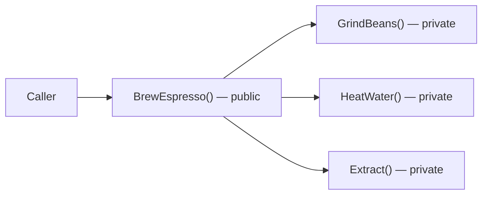
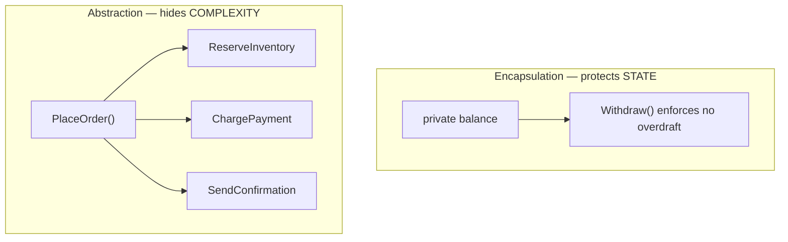

# Abstraction — The Second Pillar of OOP

## Introduction

Before reading this lesson, you should already be comfortable with **[Encapsulation — The First Pillar of OOP](../02-oop/02-07-encapsulation-pillar-of-oop.md)** — bundling data with the behavior that protects it. This lesson introduces the second pillar: **abstraction**, a closely related but genuinely distinct idea. Where encapsulation asks "who is allowed to change this state, and how?", abstraction asks "what does this thing do, and what do I actually need to know to use it?" — deliberately hiding the multi-step complexity behind a small, focused public surface.

By the end of this lesson, you will be able to:

- Define abstraction as exposing only relevant behavior while hiding implementation detail
- Design a class whose public method hides a multi-step internal process
- Explain why callers benefit when implementation steps can change without breaking them
- Recognize abstraction operating at more than one level — inside a method, and across a class's whole API
- Explain precisely how abstraction differs from encapsulation, even though the two are often confused

## Abstraction — A Layman's Perspective

Picture driving a car with an automatic transmission. To get from your driveway to the grocery store, you use exactly three controls: the steering wheel, the accelerator, and the brake. That's it. You never think about fuel injection timing, the torque converter deciding when to shift gears, or the dozen sensors constantly adjusting the engine's behavior hundreds of times per second. All of that machinery exists, and it's genuinely complicated — but none of it is *relevant* to you as a driver trying to reach the store. The dashboard and pedals are a deliberately simplified interface standing in front of an enormously complex system, showing you only the handful of controls you actually need.

Now imagine what would happen if car manufacturers instead handed every driver a direct panel of switches for fuel-air ratio, spark plug timing, and transmission gear ratios, expecting each driver to operate the engine manually at that level of detail. Almost nobody could drive safely, and every car trip would require an engineering degree. The whole point of the dashboard is that it hides layers of real complexity behind a small set of controls named for *what they accomplish* — "go faster," "turn," "slow down" — rather than *how the engine achieves it*.

This is different from a related but separate idea: whether a random passenger can reach under the hood and physically rewire the fuel injectors mid-drive. That's a question about protecting the engine's internal state from being tampered with — that's encapsulation, the previous lesson's concern. Abstraction is a different question entirely: even if the engine bay were welded shut and perfectly protected, the dashboard would still need to be simple, because the goal isn't just "keep people out" — it's "let the driver accomplish their goal without needing to understand everything happening underneath."

The bridge back to programming: abstraction means designing a class's public methods around *what a caller wants to accomplish*, hiding however many internal steps that actually takes, so callers never need to understand — or even be aware of — the implementation underneath. It works hand in hand with encapsulation, but they solve different problems: encapsulation protects state from being changed incorrectly; abstraction protects callers from needing to understand complexity they don't care about.

## Abstraction — A Programming Language Perspective

**Abstraction** is the OOP principle of exposing only the essential operations a type's callers need, while hiding the implementation steps required to carry them out. In C#, abstraction operates at every scale: a single public method can hide several private helper methods it calls internally (as shown below), and — as covered in dedicated lessons later in this module — `abstract` classes and `interface` types let you define *only* the operations a type must support, with no implementation at all, deferring every detail to whatever concrete type eventually implements them. The defining benefit is decoupling: as long as a method's name, parameters, and return type stay the same, its internal implementation is free to change completely — swap an algorithm, add new internal steps, optimize a calculation — without requiring any change to the code that calls it. Callers depend on *what* a type promises to do, never on *how* it does it.

## How to Design an Abstraction in C#

The clearest sign of good abstraction is a public method whose name describes an outcome ("brew an espresso," "place an order") rather than a mechanism, with each step of actually achieving that outcome factored into private helper methods the caller never sees or calls directly.


*Figure 1: The caller sees one public operation; the three private steps behind it can change freely without affecting any calling code.*

```csharp
// Program.cs — .NET 10 / C# 14
var machine = new CoffeeMachine();
Console.WriteLine(machine.BrewEspresso());
Console.WriteLine(machine.BrewEspresso());

class CoffeeMachine
{
    private int beansRemainingGrams = 500;

    public string BrewEspresso()
    {
        GrindBeans(18);
        HeatWater(93);
        Extract(seconds: 25);
        return "Espresso ready.";
    }

    private void GrindBeans(int grams) => beansRemainingGrams -= grams;

    private void HeatWater(int celsius)
    {
        // Simulated: engages the boiler until it reaches `celsius`.
    }

    private void Extract(int seconds)
    {
        // Simulated: forces hot water through the grounds for `seconds`.
    }
}
```

**Console Output:**

```text
Espresso ready.
Espresso ready.
```

`CoffeeMachine` exposes exactly one public method. Calling code never sees `GrindBeans`, `HeatWater`, or `Extract` — it doesn't even know they exist. If tomorrow's implementation changed the grind amount, added a pre-infusion step, or replaced the entire brewing algorithm, `BrewEspresso()`'s two callers above wouldn't need a single line changed, because they never depended on *how* the espresso got made — only on the promise that calling `BrewEspresso()` would produce one.

## Real-Time Example: Abstraction in E-Commerce Order Processing

We apply abstraction to the **E-Commerce Order Processing** case study. `OrderProcessor.PlaceOrder` is the one method calling code ever needs to call — it hides inventory reservation, payment charging, and confirmation steps, each able to fail and roll back the ones before it, entirely inside the class.

```csharp
// Program.cs — .NET 10 / C# 14 — Real-Time Example
var processor = new OrderProcessor();

var order1 = new Order("ORD-2001", "Grace Hopper", 249.99m, StockOnHand: 5);
var order2 = new Order("ORD-2002", "Ada Lovelace", 899.50m, StockOnHand: 0);
var order3 = new Order("ORD-2003", "Alan Turing", 1500.00m, StockOnHand: 5);

Console.WriteLine(processor.PlaceOrder(order1));
Console.WriteLine(processor.PlaceOrder(order2));
Console.WriteLine(processor.PlaceOrder(order3));

record Order(string OrderId, string CustomerName, decimal Total, int StockOnHand);

class OrderProcessor
{
    public string PlaceOrder(Order order)
    {
        if (!ReserveInventory(order))
        {
            return $"{order.OrderId}: failed — out of stock.";
        }

        if (!ChargePayment(order))
        {
            ReleaseInventory(order);
            return $"{order.OrderId}: failed — payment declined.";
        }

        SendConfirmation(order);
        return $"{order.OrderId}: placed successfully for {order.CustomerName}.";
    }

    private bool ReserveInventory(Order order) => order.StockOnHand > 0;

    private bool ChargePayment(Order order) => order.Total <= 1000m;

    private void ReleaseInventory(Order order)
    {
        // Simulated: returns the reserved unit back to available stock.
    }

    private void SendConfirmation(Order order)
    {
        // Simulated: emails the customer an order confirmation.
    }
}
```

**Console Output:**

```text
ORD-2001: placed successfully for Grace Hopper.
ORD-2002: failed — out of stock.
ORD-2003: failed — payment declined.
```

The calling code at the top never touches `ReserveInventory`, `ChargePayment`, `ReleaseInventory`, or `SendConfirmation` — it calls `PlaceOrder` three times and reads back a result. Whether the real implementation later adds fraud checks, tax calculation, or a third-party payment gateway call, `PlaceOrder`'s signature and promise stay the same, so none of the calling code shown here would ever need to change. That's exactly what a real order-processing API needs: a stable, simple entry point in front of business logic that will only grow more complex over time.

## Encapsulation vs Abstraction

These two pillars are frequently confused because both involve "hiding" something, but they hide different things for different reasons. Encapsulation hides *state* to protect it from invalid changes — its question is "who can modify this, and under what rules?" Abstraction hides *complexity* to simplify usage — its question is "what does this do, and what do I need to know to use it?" A class can be encapsulated without being well abstracted (imagine `PlaceOrder` with a clean private `total` field, but a public API exposing eight separate methods a caller must call in the exact right order). A class can also be abstracted without being properly encapsulated (imagine a simple `BrewEspresso()` method sitting right next to a fully public, freely mutable `beansRemainingGrams` field). The two pillars work best together, but neither one guarantees the other.


*Figure 2: Encapsulation guards internal state through controlled methods; abstraction hides how many steps a single public method takes.*

| Aspect | Encapsulation | Abstraction |
|---|---|---|
| Primary concern | Protecting internal state and invariants | Hiding implementation complexity and detail |
| Core question | "Who can change this, and how?" | "What does this do, and what must I know to use it?" |
| C# mechanism | `private` fields + controlled public methods | A simple public method/type hiding multi-step internals; realized formally by `abstract` classes and interfaces |
| Can exist alone | Yes — hidden state behind a clumsy, multi-step API | Yes — a simple API in front of carelessly exposed state |
| Example from this lesson | `LibraryMember.Borrow()` enforcing the 3-book limit | `OrderProcessor.PlaceOrder()` hiding reserve/charge/confirm |

## Types Related to Abstraction in C#

1. **[Static Members and Static Classes](../02-oop/02-09-static-members-and-classes.md)** — the next lesson, covering members that belong to a type itself rather than any instance.
2. **[Abstract Classes and Methods](../02-oop/02-14-abstract-classes-and-methods.md)** — the language feature that lets a base type declare an operation with no implementation at all.
3. **[Interfaces in C#](../02-oop/02-15-interfaces-in-csharp.md)** — a pure contract describing *what* a type can do, with zero implementation of *how*.
4. **[Encapsulation — The First Pillar of OOP](../02-oop/02-07-encapsulation-pillar-of-oop.md)** — the related but distinct pillar this lesson contrasted against throughout.
5. **[Polymorphism — The Fourth Pillar of OOP](../02-oop/02-13-polymorphism-pillar-of-oop.md)** — abstraction's payoff: many concrete types honoring one abstract contract, used interchangeably.
6. **[Introduction to Design Patterns](../02-oop/02-35-introduction-to-design-patterns.md)** — patterns like Facade and Adapter exist almost entirely to add a clean abstraction layer in front of something messier.

## What You've Learned & What's Next

Abstraction means designing a type's public surface around what callers need to accomplish, hiding however many internal steps that actually requires — distinct from encapsulation, which protects internal state from invalid changes. The two pillars complement each other but answer different questions, and a well-designed class typically needs both.

Continue your learning journey with **[Static Members and Static Classes](../02-oop/02-09-static-members-and-classes.md)**, where we look at fields, methods, and entire classes that belong to a type itself rather than to any one instance of it.

---
*Applies to: .NET 10 / C# 14. Last reviewed 2026-08-16.*
