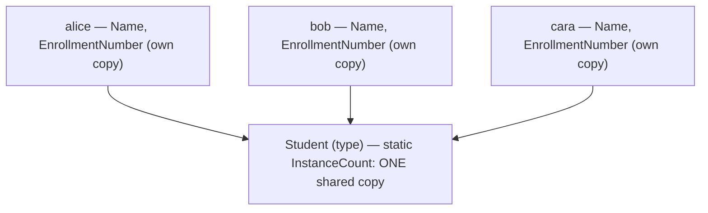
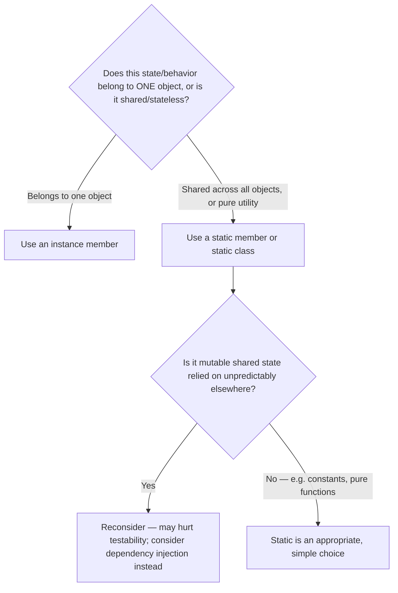

# Static Members and Static Classes

## Introduction

Before reading this lesson, you should already be comfortable with **[Abstraction — The Second Pillar of OOP](../02-oop/02-08-abstraction-pillar-of-oop.md)** and the instance-based classes built throughout this module so far — every field and method you've written has belonged to a specific object, created with `new`. This lesson introduces something different: members and even entire classes that belong to the *type itself*, shared by every instance rather than owned by any one of them.

By the end of this lesson, you will be able to:

- Declare static fields, methods, and properties, and explain how they differ from instance members
- Use a static field to share a single piece of state across every instance of a class
- Write a static constructor and explain exactly when the runtime executes it
- Declare an entire class `static` and recognize when that's the right design choice
- Recognize when static state is a poor fit — particularly for testability and shared mutable state

## Static Members and Static Classes — A Layman's Perspective

Picture a classroom. Every student has their own notebook — their own name written on the cover, their own notes filled in during the lesson, unique to them and them alone. That's the equivalent of an instance field: each `Student` object gets its own private copy.

Now look at the front of the room: there's a single whiteboard. It isn't copied thirty times, once per student's desk — there's exactly one, shared by everyone in the room, and if the teacher writes today's date on it, every single student sees the *same* date, because they're all looking at the *same* whiteboard, not their own personal copy of it. If a new student walks in halfway through the lesson, they see the whiteboard exactly as it already is — it doesn't reset or duplicate itself for the newcomer. That shared, single, type-level surface is exactly what a static field is.

Now consider the school's front office. You can call the front office and ask "how many students are enrolled at this school right now?" without needing to point at any particular student — the front office answers that question on behalf of the school as a whole, not on behalf of any one person. That's a static method: something you call through the type itself (`School.TotalEnrollment`), not through any particular instance.

And some organizations are *entirely* front office, with no individual "employee notebooks" at all — think of a public information desk whose entire job is answering standard questions ("what time do you open?") using fixed rules, with nothing personal to track per visitor. A class made entirely of static members, and marked `static` itself so it can never be instantiated, models exactly that: pure shared behavior with no per-object state at all.

The bridge back to programming: instance members belong to each object separately, like each student's own notebook; static members belong to the type itself, like the classroom's one shared whiteboard, existing in exactly one copy no matter how many instances — or none at all — currently exist.

## Static Members and Static Classes — A Programming Language Perspective

A member marked `static` belongs to the type itself rather than to any instance: there is exactly one copy of a static field for the entire application (per type, per `AppDomain`), and static methods and properties are invoked through the type name (`TypeName.Member`), never through an object reference. A **static constructor** — declared with no access modifier and no parameters (`static Student() { ... }`) — runs automatically, exactly once, at some point guaranteed to be before the first access to any static member of the type or the creation of its first instance, whichever comes first; the runtime, not your code, decides precisely when within that window. A **static class** must contain only static members, cannot be instantiated with `new`, and is implicitly `sealed`, making it appropriate for stateless utility functionality — the built-in `Math` and `Console` classes are both static classes. Static is the right tool for genuinely shared state, constants, factory-style counters, and pure utility logic; it becomes a liability when used for *mutable* shared state that different parts of a program depend on unpredictably, since that hidden shared dependency makes code harder to test in isolation.

## How to Declare Static Members in C#

A static field, property, or method is declared exactly like its instance counterpart with `static` added before its type. Static members can be read or invoked even before any instance of the class exists, and an instance constructor can read or update a static field just like any other member — which is exactly how a shared counter typically gets incremented once per object created.


*Figure 1: Each `Student` instance has its own `Name` and `EnrollmentNumber`, but all three share the exact same `InstanceCount` field on the type itself.*

```csharp
// Program.cs — .NET 10 / C# 14
Console.WriteLine($"Instances created before any Student: {Student.InstanceCount}");

var alice = new Student("Alice");
var bob = new Student("Bob");
var cara = new Student("Cara");

Console.WriteLine(alice.Greet());
Console.WriteLine(bob.Greet());
Console.WriteLine(cara.Greet());
Console.WriteLine($"Total students created: {Student.InstanceCount}");
Console.WriteLine($"School motto: {Student.SchoolMotto}");

class Student
{
    static Student()
    {
        SchoolMotto = "Learn, Question, Grow";
        Console.WriteLine("[Static constructor ran]");
    }

    public static int InstanceCount { get; private set; }
    public static string SchoolMotto { get; }

    public string Name { get; }
    public int EnrollmentNumber { get; }

    public Student(string name)
    {
        Name = name;
        InstanceCount++;
        EnrollmentNumber = InstanceCount;
    }

    public string Greet() => $"{Name} is student #{EnrollmentNumber}.";
}
```

**Console Output:**

```text
[Static constructor ran]
Instances created before any Student: 0
Alice is student #1.
Bob is student #2.
Cara is student #3.
Total students created: 3
School motto: Learn, Question, Grow
```

The very first line of `Main` reads `Student.InstanceCount` — a static member — before any `Student` has been created, which is enough to trigger the static constructor. Notice `[Static constructor ran]` prints *before* `Instances created before any Student: 0`, confirming the runtime ran it first and exactly once, even though three `Student` objects get created afterward. Each instance captures the shared counter's value into its own `EnrollmentNumber` field at the moment it's constructed, which is why `Greet()` reports a different, stable number per student even though `InstanceCount` itself keeps changing underneath them.

## Real-Time Example: Static Members in Banking/ATM

We apply static members to the **Banking/ATM** case study: a static class generates sequential account numbers, and `BankAccount` itself tracks a shared base interest rate and a running count of every account opened — state that belongs to the bank as a whole, not to any single account.

```csharp
// Program.cs — .NET 10 / C# 14 — Real-Time Example
var acc1 = new BankAccount("Meera Nair", 1000m);
var acc2 = new BankAccount("Jonas Berg", 2500m);
var acc3 = new BankAccount("Sofia Ramos", 500m);

Console.WriteLine(acc1.Describe());
Console.WriteLine(acc2.Describe());
Console.WriteLine(acc3.Describe());

BankAccount.BaseInterestRate = 0.045m;
Console.WriteLine($"New base interest rate: {BankAccount.BaseInterestRate * 100:0.0}%");
Console.WriteLine($"Total accounts opened: {BankAccount.TotalAccountsOpened}");

static class AccountNumberGenerator
{
    private static int nextNumber = 100000;

    public static string GenerateNext() => $"ACC-{nextNumber++}";
}

class BankAccount
{
    public static decimal BaseInterestRate { get; set; } = 0.02m;
    public static int TotalAccountsOpened { get; private set; }

    public string AccountNumber { get; }
    public string OwnerName { get; }
    public decimal Balance { get; }

    public BankAccount(string ownerName, decimal openingBalance)
    {
        AccountNumber = AccountNumberGenerator.GenerateNext();
        OwnerName = ownerName;
        Balance = openingBalance;
        TotalAccountsOpened++;
    }

    public string Describe() =>
        $"{AccountNumber} ({OwnerName}): {Balance:C} at {BaseInterestRate * 100:0.0}%";
}
```

**Console Output:**

```text
ACC-100000 (Meera Nair): $1,000.00 at 2.0%
ACC-100001 (Jonas Berg): $2,500.00 at 2.0%
ACC-100002 (Sofia Ramos): $500.00 at 2.0%
New base interest rate: 4.5%
Total accounts opened: 3
```

`AccountNumberGenerator` is a `static class` — it holds no per-instance state at all, only a shared counter, so it can never be instantiated and never needs to be. `BaseInterestRate` starts at `0.02m` for every account, because it's one shared value on `BankAccount` itself; changing it once, after all three accounts are already open, would apply to any account created afterward and to any code reading it going forward — exactly the behavior a bank's single, shared interest rate policy needs, without duplicating that rate onto every individual account object.

## Static Members vs Instance Members

The core distinction is ownership: an instance member exists once *per object*, while a static member exists exactly once *per type*, no matter how many objects — including zero — currently exist. This has a direct testability consequence worth being deliberate about: static *state* that's mutated from many unrelated places in a program (a static field silently changed by a dozen different classes) becomes difficult to reason about and difficult to isolate in unit tests, because tests can no longer control it through a single instance. Static is at its best for genuinely shared, rarely-changing data (constants, configuration read once) and for pure utility logic with no state at all (`Math.Max`, string helpers) — it's worth reconsidering when it starts acting as a hidden, freely mutable dependency threaded through unrelated parts of an application.


*Figure 2: Static members work well for shared, stable data or stateless utility logic; mutable shared state accessed unpredictably is where static becomes a liability.*

| Aspect | Instance Member | Static Member |
|---|---|---|
| Belongs to | Each object individually | The type itself — one shared copy |
| Accessed via | An instance reference (`account.Balance`) | The type name (`BankAccount.BaseInterestRate`) |
| Storage | One copy per object | Exactly one copy for the whole application |
| Requires an instance first? | Yes | No — usable before any instance exists |
| Typical use | Object-specific state (`Balance`, `OwnerName`) | Shared counters, constants, stateless utility logic |

## Types Related to Static Members in C#

1. **[Method Overloading](../02-oop/02-10-method-overloading.md)** — the next lesson, which applies equally to static and instance methods alike.
2. **[Constructors in C#](../02-oop/02-02-constructors-in-csharp.md)** — static constructors are a specialized cousin of the instance constructors covered there.
3. **[Fields, Properties, and the `field` Keyword](../02-oop/02-03-fields-properties-field-keyword.md)** — the same field/property syntax, with `static` layered on top.
4. **[Extension Methods in C#](../02-oop/02-23-extension-methods-in-csharp.md)** — every extension method is itself a `static` method inside a `static` class.
5. **[Constants and `readonly` Fields](../01-fundamentals/01-23-constants-and-readonly.md)** — a `const` field is implicitly static; `static readonly` is the mutable-at-startup alternative.
6. **[Singleton Pattern](../12-advanced-concepts/12-06-singleton-pattern.md)** — a design pattern built almost entirely out of a static field holding a single shared instance.

## What You've Learned & What's Next

Static members belong to a type itself rather than to any instance — one shared field, one shared method, accessible through the type name and available even before any object exists. A static constructor runs automatically, exactly once, before that first use, and a fully `static` class is the right tool for stateless utility logic, though mutable shared static state deserves caution once it's relied on unpredictably across a larger program.

Continue your learning journey with **[Method Overloading](../02-oop/02-10-method-overloading.md)**, where we look at how multiple methods can share the same name as long as their parameter lists differ — and how the compiler decides which one a given call actually means.

---
*Applies to: .NET 10 / C# 14. Last reviewed 2026-08-16.*
