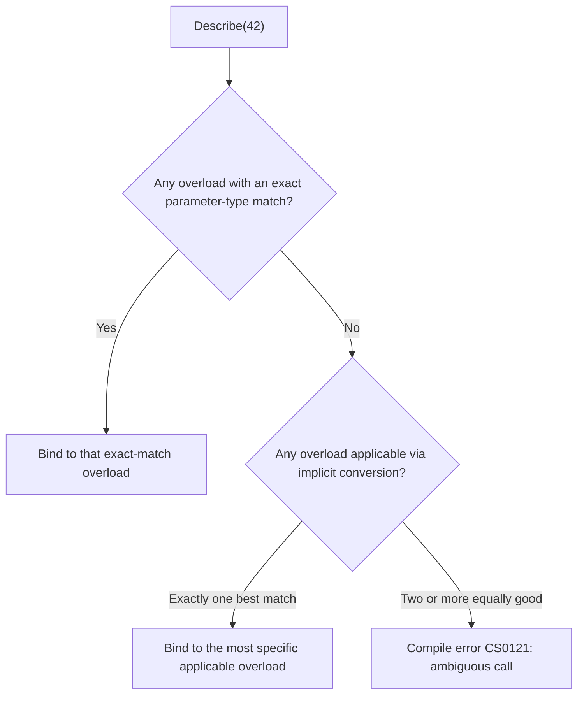
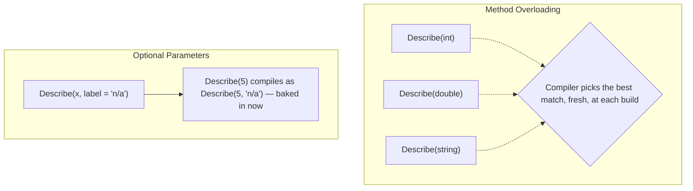

# Method Overloading

## Introduction

Before reading this lesson, you should already be comfortable with **[Static Members and Static Classes](../02-oop/02-09-static-members-and-classes.md)** — everything in this lesson applies equally to static and instance methods. This lesson looks at **method overloading**: declaring several methods that share the exact same name but differ in their parameter list, and letting the compiler decide, at each call site, which one you actually meant.

By the end of this lesson, you will be able to:

- Define method overloading and state the rule that distinguishes one overload from another
- Trace how the compiler performs overload resolution for a given call
- Recognize an ambiguous-call compile error and explain why the compiler refuses to guess
- Design overloads that differ meaningfully in parameter type or arity, not just parameter name
- Contrast method overloading with optional parameters, including a real versioning difference between them

## Method Overloading — A Layman's Perspective

Picture a shipping dock with a single worker whose job title is simply "Load." A pallet of loose boxes arrives, and the worker loads it one particular way — stacking and securing each box individually. A single sealed crate arrives, and the same worker loads it a completely different way — checking its weight rating and positioning it with a forklift. A whole shipping container arrives, and again, an entirely different procedure applies — coordinating with the crane operator. It's still the same word, "Load," and the same worker, but the *actual technique used* depends entirely on what physically shows up at the dock. Nobody needs three different job titles — "LoadPallet," "LoadCrate," "LoadContainer" — because what's being loaded is itself different enough that there's never any doubt about which procedure applies.

Now imagine two trucks pull up at the exact same moment, each carrying what looks, from the dock manager's clipboard, like an identical, indistinguishable shipment — same count, same generic description, nothing to tell them apart on paper. The dock manager can't respond by silently guessing which loading procedure to run; the whole system requires clarity about exactly which situation applies before any work begins. If the paperwork genuinely can't tell two shipments apart, the dock refuses to proceed until someone clarifies which one is meant.

This is exactly what method overloading is: several methods sharing one name, each shaped for a genuinely different kind of input — a different number of arguments, or arguments of different types — so that calling code reads naturally ("Describe this number," "Describe this piece of text") without needing an artificially distinct name for every variant. And just like the dock manager, the compiler won't guess when two overloads are an equally good match for the same call; it stops and reports the ambiguity rather than picking one arbitrarily.

The bridge back to programming: overloading lets one method name serve several distinct parameter shapes, each with its own dedicated implementation, and the compiler — not the running program — decides which implementation a given call binds to, based entirely on the number and types of arguments supplied.

## Method Overloading — A Programming Language Perspective

**Method overloading** is declaring two or more methods with the same name within the same type, distinguished by their **signature** — the number, order, and types of their parameters. Return type alone never distinguishes an overload; two methods with identical parameter lists but different return types are a compile error, not valid overloads. **Overload resolution** is the compiler's process, performed at each call site, of identifying every overload *applicable* to the arguments given (either by an exact type match or a valid implicit conversion) and then choosing the single *most specific* one according to a defined betterness ranking — an exact match beats an implicit numeric conversion, which beats a conversion requiring boxing, and so on. When two or more applicable overloads are equally good matches for a given call and neither is uniquely more specific than the other, the compiler reports **CS0121: "The call is ambiguous between the following methods or properties"** rather than picking one arbitrarily — a genuine compile-time error, not a runtime decision.

## How Overload Resolution Works in C#

At each call site, the compiler gathers every overload of the called name that's visible and applicable, ranks them by how well their parameters match the arguments — exact type matches first, then implicit conversions — and binds the call to whichever single overload comes out uniquely ahead.


*Figure 1: The compiler always prefers an exact match; failing that, it picks the single best implicit conversion — or refuses to compile if none is uniquely best.*

```csharp
// Program.cs — .NET 10 / C# 14
Console.WriteLine(Describe(42));
Console.WriteLine(Describe(3.14));
Console.WriteLine(Describe("hello"));
Console.WriteLine(Describe(42, "answer"));
Console.WriteLine(Describe((byte)5));
Console.WriteLine(Describe());

static string Describe() => "Nothing to describe.";
static string Describe(int value) => $"Integer: {value}";
static string Describe(double value) => $"Double: {value}";
static string Describe(string value) => $"String of length {value.Length}: \"{value}\"";
static string Describe(int value, string label) => $"{label} = {value}";
```

**Console Output:**

```text
Integer: 42
Double: 3.14
String of length 5: "hello"
answer = 42
Integer: 5
Nothing to describe.
```

`Describe(42)`, `Describe(3.14)`, and `Describe("hello")` each hit an exact type match, so resolution is immediate. `Describe(42, "answer")` matches by arity — it's the only two-parameter overload — binding to `Describe(int, string)`. `Describe((byte)5)` has no exact `byte` overload, so the compiler looks at implicit conversions: `byte` converts implicitly to both `int` and `double`, but `byte → int` is a strictly better-ranked conversion than `byte → double` in C#'s standard conversion ordering, so `Describe(int)` wins over `Describe(double)` even though both are technically applicable. If this class instead declared `Log(int id, long code)` alongside `Log(long id, int code)`, a call like `Log(5, 5)` would trigger CS0121: converting the literal `5` to `long` is an equally good implicit conversion in either position, and neither overload is uniquely more specific — the compiler stops rather than silently guessing.

## Real-Time Example: Method Overloading in Library/Inventory Search

We extend the **Library/Inventory Management** catalog search with three overloads of `SearchCatalog` — by title, by author, and by ISBN — each genuinely distinguished by parameter type or arity rather than by name alone. Note the ISBN overload uses a dedicated `Isbn` type specifically because a `string`-based ISBN parameter would otherwise be indistinguishable from the title overload's `string` parameter.

```csharp
// Program.cs — .NET 10 / C# 14 — Real-Time Example
var catalog = new List<Book>
{
    new("Clean Code", "Robert C. Martin", "9780132350884"),
    new("The Pragmatic Programmer", "David Thomas", "9780135957059"),
    new("Clean Architecture", "Robert C. Martin", "9780134494166"),
};

PrintResults(SearchCatalog(catalog, "Clean Code"));
PrintResults(SearchCatalog(catalog, "Robert C. Martin", exactAuthorMatch: true));
PrintResults(SearchCatalog(catalog, new Isbn("9780135957059")));

static List<Book> SearchCatalog(List<Book> catalog, string title) =>
    catalog.Where(b => b.Title.Contains(title, StringComparison.OrdinalIgnoreCase)).ToList();

static List<Book> SearchCatalog(List<Book> catalog, string author, bool exactAuthorMatch) =>
    exactAuthorMatch
        ? catalog.Where(b => b.Author == author).ToList()
        : catalog.Where(b => b.Author.Contains(author, StringComparison.OrdinalIgnoreCase)).ToList();

static List<Book> SearchCatalog(List<Book> catalog, Isbn isbn) =>
    catalog.Where(b => b.Isbn == isbn.Value).ToList();

static void PrintResults(List<Book> results)
{
    Console.WriteLine($"--- {results.Count} result(s) ---");
    foreach (Book book in results)
    {
        Console.WriteLine($"{book.Title} by {book.Author} [ISBN {book.Isbn}]");
    }
}

readonly record struct Isbn(string Value);

record Book(string Title, string Author, string Isbn);
```

**Console Output:**

```text
--- 1 result(s) ---
Clean Code by Robert C. Martin [ISBN 9780132350884]
--- 2 result(s) ---
Clean Code by Robert C. Martin [ISBN 9780132350884]
Clean Architecture by Robert C. Martin [ISBN 9780134494166]
--- 1 result(s) ---
The Pragmatic Programmer by David Thomas [ISBN 9780135957059]
```

Each call reads naturally — `SearchCatalog(catalog, "Clean Code")` clearly searches by title, `SearchCatalog(catalog, new Isbn(...))` clearly searches by ISBN — without ever needing separate names like `SearchByTitle` or `SearchByIsbn`. The `Isbn` wrapper type is doing real work here: without it, an ISBN overload taking a plain `string` would have an identical signature to the title overload, `(List<Book>, string)`, which the compiler would reject outright as a duplicate method, not a valid overload — a common trap when two conceptually different pieces of data happen to share the same underlying type.

## Method Overloading vs Optional Parameters

Both features let one logical operation be called in multiple shapes, and **[Optional and Named Arguments](../01-fundamentals/01-19-optional-and-named-arguments.md)** introduced this same contrast briefly — but there's a deeper, practical difference worth knowing once you're designing library APIs others will consume. An optional parameter's default value is a compile-time constant *baked directly into the caller's compiled code* at the call site; if a library later ships a new version changing that default, any already-compiled consumer keeps using the *old* default until it's recompiled against the new version. Method overloading carries the opposite risk: adding a brand-new, more specific overload to a class doesn't affect callers compiled against the old version at all, but the *next time those callers are recompiled*, overload resolution runs fresh and can silently redirect an existing call to the new overload instead of the one it used to bind to — a subtle source-compatibility hazard that optional parameters don't share, since they don't introduce new candidate methods to choose between.


*Figure 2: Overload resolution re-evaluates which method body applies every time source is recompiled; an optional parameter's default is fixed into the caller's IL at the moment it was last compiled.*

| Aspect | Method Overloading | Optional Parameters |
|---|---|---|
| Method bodies involved | Multiple, independent | One |
| Can differ only by parameter name? | No — must differ in number, type, or order | N/A |
| Where the "missing" value comes from | A different, dedicated method body runs | A compile-time constant substituted at the call site |
| Versioning risk | A new, more specific overload can silently redirect a recompiled call | A changed default doesn't reach callers until they recompile |
| Best for | Genuinely different logic per parameter shape | Skipping a parameter that has one sensible constant default |

## Types Related to Method Overloading in C#

1. **[Inheritance — The Third Pillar of OOP](../02-oop/02-11-inheritance-pillar-of-oop.md)** — the next lesson, and the pillar that introduces overloading's frequently-confused cousin.
2. **[Method Overriding](../02-oop/02-12-method-overriding.md)** — replacing a base class's implementation entirely, resolved at runtime — easy to confuse with overloading, resolved at compile time.
3. **[Optional and Named Arguments](../01-fundamentals/01-19-optional-and-named-arguments.md)** — the complementary Module 01 lesson this one directly contrasts against.
4. **[Generic Methods](../03-collections-generics/03-17-generic-methods.md)** — an alternative to writing near-identical overloads for every type.
5. **[Extension Methods in C#](../02-oop/02-23-extension-methods-in-csharp.md)** — extension methods can be overloaded exactly like ordinary methods.
6. **[Operator Overloading in Depth](../02-oop/02-05-operator-overloading-in-depth.md)** — operator overloading is method overloading applied to the compiler's built-in operator syntax.

## What You've Learned & What's Next

Method overloading lets several methods share one name as long as their parameter lists genuinely differ in number, order, or type — never by parameter name alone, and never by return type alone. The compiler resolves each call to the single most specific applicable overload, and refuses to compile — with error CS0121 — when two overloads are an equally good, ambiguous match.

Continue your learning journey with **[Inheritance — The Third Pillar of OOP](../02-oop/02-11-inheritance-pillar-of-oop.md)**, where classes begin building on one another directly, sharing and extending behavior instead of standing alone.

---
*Applies to: .NET 10 / C# 14. Last reviewed 2026-08-16.*
