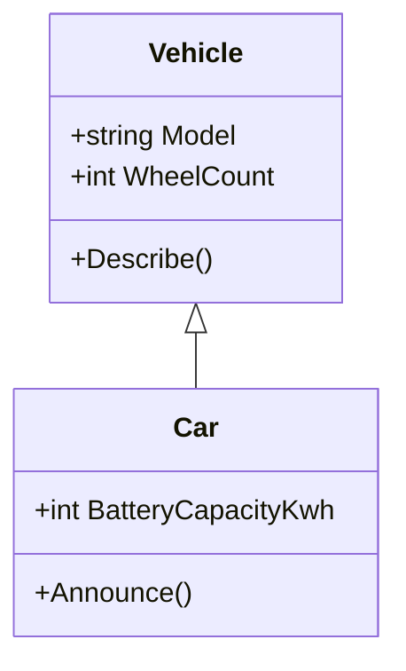
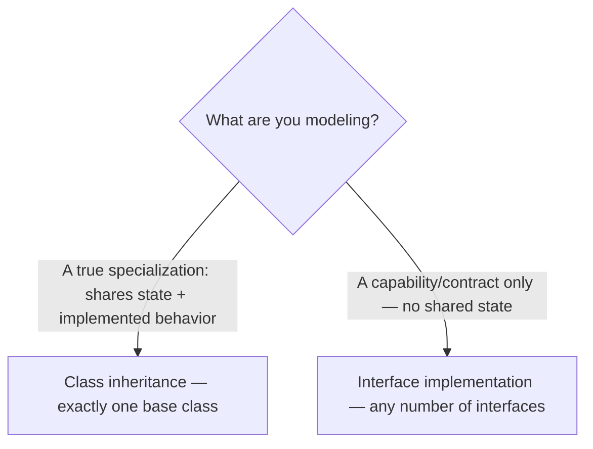

# Inheritance — The Third Pillar of OOP

## Introduction

Before reading this lesson, you should already be comfortable with **[Method Overloading](../02-oop/02-10-method-overloading.md)** — giving a single method name several different parameter signatures. This lesson moves from shaping individual classes to shaping *relationships between classes*: **inheritance**, the third pillar of object-oriented programming, alongside encapsulation and abstraction covered earlier in this module.

By the end of this lesson, you will be able to:

- Explain what inheritance means and why it is one of the four pillars of OOP
- Create a derived class from a base class using the `: BaseClass` syntax
- Use the `base` keyword to chain a derived class's constructor to its base class's constructor
- Call an inherited member and an explicitly base-qualified member from within a derived class
- Explain why a C# class supports only one direct base class, and how interfaces fill the gap

## Inheritance — A Layman's Perspective

Think about a family recipe for bread that gets passed down through three generations. Your grandmother wrote down the original: mix flour, water, yeast, and salt; knead for ten minutes; let it rise for an hour; bake at a fixed temperature for forty minutes. That recipe card is complete and works perfectly fine entirely on its own.

Your mother didn't throw that card away and start from scratch when she wanted to make her own version. Instead, she pinned a second, much shorter card next to it that said, in effect, "Do everything on Grandma's card, then knead in a handful of rosemary before the rise." She didn't need to re-explain how kneading works, how long to let dough rise, or what oven temperature to use — all of that was already fully specified, and she inherited it automatically just by referencing the original card. Her card only had to describe what was *new* or *different* about her version.

Now you come along and want to make your own loaf. You pin a third card next to your mother's, and it says something like, "Do everything on Mom's card — which already includes everything on Grandma's card — then add sun-dried tomatoes instead of rosemary, and increase the bake time by five minutes." Notice that you didn't have to retype the kneading instructions a third time, or even the rosemary instructions, since you're overriding just the one ingredient. You get the entire lineage of technique for free, and your card focuses purely on your own twist.

This is exactly what inheritance gives a class. A **derived class** doesn't retype everything a **base class** already does — it automatically has access to every field, property, and method the base class defined, and its own class body only needs to describe what's new or additional. And just as your mother's card had to explicitly point back at Grandma's card by name before it made sense (you can't "knead in rosemary" without first following the base kneading process), a derived class's constructor explicitly hands off to its base class's constructor before it can finish setting up its own additional details — that hand-off is what the `base` keyword expresses in code.

One more detail from the recipe box matters here: each card in that box points to exactly *one* previous card. Your mother's card built on Grandma's card, and yours built on your mother's — a single, unbroken chain of ancestry. Nobody pinned a card that said "combine two completely different, unrelated family recipes into one card," because that isn't how a card box like this works. That's the everyday version of why a C# class can have only one direct base class: a clean, single line of "this builds on that."

## Inheritance — A Programming Language Perspective

**Inheritance** lets a class derive from another class using the syntax `class Derived : Base`, gaining all of the base class's accessible members (its `public` and `protected` members) without redeclaring them. The derived class can add new members, and — as later lessons cover — override existing behavior. Because a derived class's fields exist only once it has fully initialized whatever its base class needs, C# requires the derived class's constructor to invoke a base class constructor, either implicitly (the base class's parameterless constructor runs automatically if one exists) or explicitly via `: base(arguments)` syntax, *before* the derived constructor's own body runs. The `base` keyword also lets code inside a derived class explicitly reference a member defined on its base class, such as `base.SomeMethod()`, disambiguating it from any member the derived class might define with the same name. C# supports **single inheritance** for classes — exactly one direct base class per class — a deliberate design choice that keeps the "diamond problem" of ambiguous, conflicting inherited implementations out of the language entirely; where a type needs to satisfy several unrelated contracts at once, C# instead uses **interfaces**, which a class may implement in any number.

## How to Use Inheritance in C#

A derived class declares its base class immediately after a colon following its own name: `class Car : Vehicle`. From that point on, every `public` and `protected` member `Vehicle` defines is also available on `Car`, as if `Car` had written it itself. If `Vehicle`'s constructor requires arguments, `Car`'s constructor must forward them using `: base(...)`, and that base constructor always finishes running before the derived constructor's own body executes.


*Figure 1: `Car` derives from `Vehicle`, inheriting `Model`, `WheelCount`, and `Describe()`, and adding its own `BatteryCapacityKwh` and `Announce()`.*

```csharp
// Program.cs — .NET 10 / C# 14

Vehicle vehicle = new Vehicle("Generic Vehicle", wheelCount: 4);
vehicle.Describe();

Car car = new Car("Tesla Model 3", wheelCount: 4, batteryCapacityKwh: 75);
car.Describe();   // inherited directly from Vehicle — Car never redefines it
car.Announce();   // Car's own method, which explicitly reuses base.Describe()

class Vehicle
{
    public string Model { get; }
    public int WheelCount { get; }

    public Vehicle(string model, int wheelCount)
    {
        Model = model;
        WheelCount = wheelCount;
    }

    public void Describe()
    {
        Console.WriteLine($"{Model} has {WheelCount} wheels.");
    }
}

class Car : Vehicle
{
    public int BatteryCapacityKwh { get; }

    // Constructor chaining: Car's constructor must hand off to Vehicle's
    // constructor via base(...) before it can set BatteryCapacityKwh.
    public Car(string model, int wheelCount, int batteryCapacityKwh)
        : base(model, wheelCount)
    {
        BatteryCapacityKwh = batteryCapacityKwh;
    }

    public void Announce()
    {
        base.Describe();
        Console.WriteLine($"It also carries a {BatteryCapacityKwh} kWh battery.");
    }
}
```

**Console Output:**

```text
Generic Vehicle has 4 wheels.
Tesla Model 3 has 4 wheels.
Tesla Model 3 has 4 wheels.
It also carries a 75 kWh battery.
```

`Car` never writes its own `Describe` method, yet `car.Describe()` works exactly as it does on `Vehicle` — that member was inherited outright. `Car`'s constructor uses `: base(model, wheelCount)` to forward those two values up to `Vehicle`'s constructor, which runs first and sets `Model` and `WheelCount`, before `Car`'s own constructor body sets `BatteryCapacityKwh`. Inside `Announce`, `base.Describe()` explicitly calls the inherited method, then adds a line of its own — the derived class extending, not replacing, its base's behavior.

## Real-Time Example: Inheritance in Banking/ATM Account Types

Banks don't design a single monolithic account type — they design one shared foundation and specialize from there. In this Banking/ATM case study, `BankAccount` is the base class holding everything every account type needs: an account number, an owner, and a balance, plus a `Deposit` method and a way to print a summary. `SavingsAccount` and `CheckingAccount` are two derived account types that each add exactly one piece of information particular to that kind of account, without re-declaring anything `BankAccount` already provides.

```csharp
// Program.cs — .NET 10 / C# 14 — Real-Time Example
// Banking/ATM case study: a shared BankAccount base class, with SavingsAccount
// and CheckingAccount as derived account types.

BankAccount savings = new SavingsAccount("SAV-1001", "Grace Hopper", openingBalance: 500m, interestRate: 0.03m);
BankAccount checking = new CheckingAccount("CHK-2002", "Ada Lovelace", openingBalance: 200m, overdraftLimit: 100m);

savings.Deposit(150m);
savings.PrintSummary();

checking.Deposit(50m);
checking.PrintSummary();

class BankAccount
{
    public string AccountNumber { get; }
    public string Owner { get; }
    public decimal Balance { get; protected set; }

    public BankAccount(string accountNumber, string owner, decimal openingBalance)
    {
        AccountNumber = accountNumber;
        Owner = owner;
        Balance = openingBalance;
    }

    public void Deposit(decimal amount)
    {
        Balance += amount;
    }

    public void PrintSummary()
    {
        Console.WriteLine($"{AccountNumber} ({Owner}): {Balance:C}");
    }
}

class SavingsAccount : BankAccount
{
    public decimal InterestRate { get; }

    public SavingsAccount(string accountNumber, string owner, decimal openingBalance, decimal interestRate)
        : base(accountNumber, owner, openingBalance)
    {
        InterestRate = interestRate;
    }
}

class CheckingAccount : BankAccount
{
    public decimal OverdraftLimit { get; }

    public CheckingAccount(string accountNumber, string owner, decimal openingBalance, decimal overdraftLimit)
        : base(accountNumber, owner, openingBalance)
    {
        OverdraftLimit = overdraftLimit;
    }
}
```

**Console Output:**

```text
SAV-1001 (Grace Hopper): $650.00
CHK-2002 (Ada Lovelace): $250.00
```

Neither `SavingsAccount` nor `CheckingAccount` writes its own `Deposit` or `PrintSummary` — both come straight from `BankAccount`, and both constructors chain to `BankAccount`'s constructor via `base(...)` to set the three shared fields correctly before adding their own. `Balance`'s setter is `protected`, meaning derived classes can adjust it internally, but code outside the hierarchy cannot set it directly — encapsulation and inheritance working together. This is exactly the shape real banking systems use: one well-tested core account model, specialized safely into every product a bank actually offers, without duplicating the balance and deposit logic in each one.

## Inheritance (Single) vs Interfaces (Multiple)

A class expresses a true "is-a" relationship through inheritance: a `SavingsAccount` really *is a* `BankAccount`, sharing its state and its already-implemented behavior, and C# only allows one such direct base class per class. When a type instead needs to promise several unrelated *capabilities* — "can be compared," "can be disposed," "can be reserved" — those are jobs for interfaces, which a class may implement in any number, because a contract to "do something" doesn't carry the same risk of ambiguous, conflicting shared state that multiple base classes would.


*Figure 2: Inheritance expresses a single specialization chain; interfaces express any number of independent capabilities.*

| Aspect | Class Inheritance | Interface Implementation |
|---|---|---|
| Relationship expressed | "is-a" | "can-do" / contract |
| How many allowed per type | Exactly one direct base class | Any number of interfaces |
| Shared implementation | Yes — fields, state, and method bodies | No shared state (default method bodies are covered in a later lesson) |
| Constructor involvement | Base constructor runs via `base(...)` | No constructors involved |
| Typical use | A true specialization hierarchy, like `SavingsAccount` from `BankAccount` | A cross-cutting capability, like `IComparable<T>` or `IDisposable` |

## Types of Inheritance in C#

C# expresses inheritance in a few recurring shapes, and several of the more advanced ones are covered in their own dedicated lessons:

1. **Single inheritance** — the only form C# allows for classes; every class has at most one direct base class.
2. **Multilevel inheritance** — a chain of derived classes (`A` → `B` → `C`), each building on everything before it, just like the three generations of the bread recipe.
3. **Hierarchical inheritance** — multiple derived classes branching from the same base, like `SavingsAccount` and `CheckingAccount` both extending `BankAccount`.
4. **[Multiple inheritance via interfaces](../02-oop/02-15-interfaces-in-csharp.md)** — a class can implement any number of interfaces even though it can extend only one class.
5. **[Sealed classes](../02-oop/02-17-sealed-classes-and-methods.md)** — explicitly closing a class off from being inherited any further.
6. **[Abstract base classes](../02-oop/02-14-abstract-classes-and-methods.md)** — a base class that supplies shared code but forces every derived class to implement certain members itself.

## What You've Learned & What's Next

Inheritance lets a derived class automatically gain everything a base class already defines, using `class Derived : Base` syntax, while its constructor uses `base(...)` to chain to the base class's own setup. A class supports exactly one direct base class — a single, unbroken line of specialization — with interfaces available for any capabilities that don't fit that single-ancestry model.

Continue your learning journey with **[Method Overriding](../02-oop/02-12-method-overriding.md)**, where `SavingsAccount` and `CheckingAccount` stop just inheriting `BankAccount`'s behavior unchanged and start customizing it with `virtual` and `override`.

---
*Applies to: .NET 10 / C# 14. Last reviewed 2026-08-16.*
