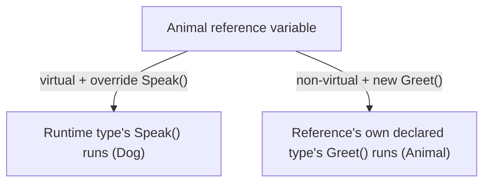
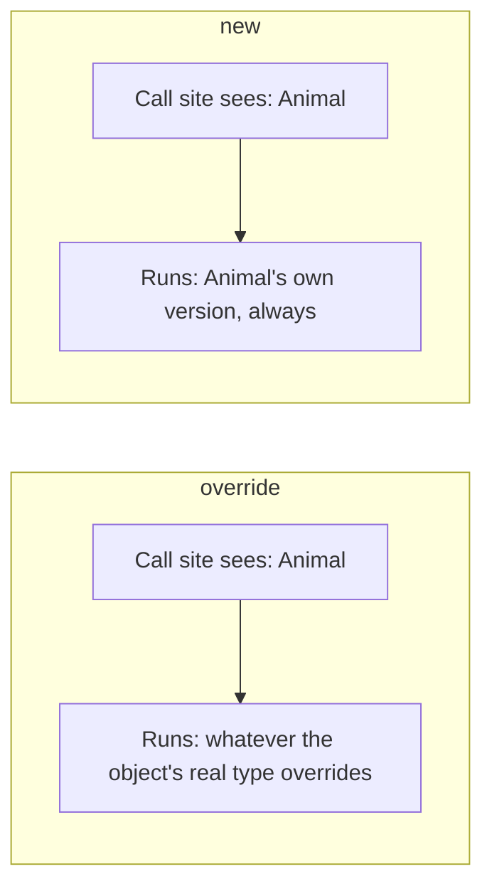

# Method Overriding

## Introduction

Before reading this lesson, you should already be comfortable with **[Inheritance — The Third Pillar of OOP](../02-oop/02-11-inheritance-pillar-of-oop.md)** — deriving a class from a base class and chaining constructors with `base`. So far, every inherited method has behaved identically whether it's called through the base class or the derived class. This lesson introduces **method overriding**: letting a derived class genuinely replace how an inherited method behaves, using the `virtual` and `override` keywords.

By the end of this lesson, you will be able to:

- Mark a base class method `virtual` so derived classes are permitted to change its behavior
- Override a virtual method in a derived class using the `override` keyword
- Call a base class's original version of an overridden method with `base.Method()`
- Explain the difference between overriding a method and merely hiding it with `new`
- Recognize why overriding, not hiding, is almost always what an OOP hierarchy actually needs

## Method Overriding — A Layman's Perspective

Picture a company with one central switchboard number that customers call to reach "the branch manager," no matter which branch they're actually trying to reach. The switchboard doesn't have its own generic manager script it reads out loud — it looks up which branch the customer is really being connected to, and then whichever manager is at *that* branch picks up and speaks according to their own particular way of greeting customers. A caller connected to the downtown branch hears the downtown manager's greeting; a caller connected to the airport branch hears the airport manager's greeting entirely. The switchboard doesn't need to know in advance which greeting will be used — it just knows that "the branch manager" role will be filled correctly by whoever is actually answering. That's the essence of overriding: a shared point of contact (a method defined on a base class) whose actual behavior is supplied by whichever specific branch (derived class) is really behind it.

Now contrast that with a very different situation. Suppose the airport branch, without telling head office, prints its own local flyer that also happens to say "Branch Manager" on it, with a picture and a different message, and posts it only inside that one branch's lobby. Someone who calls the *central switchboard number* asking for "the branch manager" is still routed through the official company directory, and hears the official, generic message — the local flyer plays no part in that call at all, because it was never wired into the routing system. Only someone who physically walks directly into that one lobby ever sees the flyer's version. Two "branch manager" messages exist side by side, but only one of them is reachable through the shared switchboard; the other is a disconnected look-alike that happens to share a name.

That second scenario is method *hiding*. In C#, if a base class method isn't marked `virtual`, a derived class technically can declare another method with the exact same name and signature using the `new` keyword — but doing so doesn't plug into the original routing mechanism at all. Code that reaches the object through a base-class-typed reference (the "central switchboard") still gets the base class's original version, while code that already knows it's holding the more specific derived type directly (the "walk right into that lobby") sees the new one instead.

The bridge back to programming: a `virtual` method on a base class is a genuine point of dispatch, wired so that calling it through any reference — base-typed or derived-typed — always reaches whichever derived class's `override` is really behind the object. A method hidden with `new`, by contrast, is really two separate, unconnected methods that happen to share a name; which one runs depends entirely on the type of the reference used to call it, not on what the object actually is underneath.

## Method Overriding — A Programming Language Perspective

A base class method marked `virtual` declares that derived classes are permitted to supply their own implementation. A derived class does so by declaring a method with an identical signature marked `override`. When a `virtual` method is called — through a variable of the base type, the derived type, or any type in between — the CLR performs **virtual dispatch**: it looks up the method table of the object's actual runtime type and invokes whichever override is present there, regardless of the compile-time type of the reference used to call it. Inside an `override` method, `base.Method()` explicitly invokes the base class's own implementation, letting a derived class extend rather than fully replace the inherited behavior. If a base method is *not* `virtual` (or `abstract`, covered in a later lesson), a derived class can still declare a same-named, same-signature method, but must mark it `new` to suppress a compiler warning; that member **hides** rather than overrides its base counterpart, and is resolved at compile time based on the reference's declared type, not the object's runtime type.

## How to Override a Method in C#

Declaring `virtual` on a base method and `override` on the matching derived method is what wires up dynamic dispatch. Anything declared without `virtual` can still be given a same-named, same-signature member in a derived class using `new`, but that member is resolved by the *reference's* type at compile time rather than by the object's actual type at runtime — the two mechanisms look similar in code but behave very differently.


*Figure 1: `override` dispatches by the object's actual runtime type; `new` resolves by the reference's compile-time type.*

```csharp
// Program.cs — .NET 10 / C# 14

Animal genericAnimal = new Animal();
genericAnimal.Speak();

Animal dogAsAnimal = new Dog();   // base-typed reference to a derived object
dogAsAnimal.Speak();              // virtual dispatch -> runs Dog's override

Cat catAsAnimal = new Cat();
Animal catAsBase = catAsAnimal;
catAsBase.Greet();     // reference type is Animal -> Animal.Greet() runs
catAsAnimal.Greet();   // reference type is Cat -> Cat.Greet() runs

class Animal
{
    public virtual void Speak()
    {
        Console.WriteLine("The animal makes a sound.");
    }

    public void Greet()
    {
        Console.WriteLine("Animal: hello.");
    }
}

class Dog : Animal
{
    public override void Speak()
    {
        Console.WriteLine("The dog barks.");
    }
}

class Cat : Animal
{
    // Greet() isn't virtual, so this hides it instead of overriding it.
    // 'new' makes that choice explicit rather than a compiler warning.
    public new void Greet()
    {
        Console.WriteLine("Cat: meow.");
    }
}
```

**Console Output:**

```text
The animal makes a sound.
The dog barks.
Animal: hello.
Cat: meow.
```

`dogAsAnimal` is declared as `Animal`, but calling `Speak()` still runs `Dog`'s override — the CLR dispatches based on the object's real type, not the variable's declared type. Compare that with `Greet()`: `catAsBase` and `catAsAnimal` refer to the *same* `Cat` object, yet calling `Greet()` on each produces a different result, because `Greet` was never `virtual` — `new` created a second, disconnected method, and which one runs depends purely on which type the compiler sees at that call site.

## Real-Time Example: Method Overriding in Banking/ATM Withdrawal Rules

This continues the `BankAccount` hierarchy from the Inheritance lesson. So far, `SavingsAccount` and `CheckingAccount` only inherited `BankAccount`'s behavior unchanged. In real banking, though, a savings account and a checking account enforce genuinely different withdrawal rules, so `BankAccount.Withdraw` is now `virtual`, and each derived account type supplies its own `override`.

```csharp
// Program.cs — .NET 10 / C# 14 — Real-Time Example
// Continues the Banking/ATM BankAccount hierarchy, giving each account type
// its own overridden withdrawal rule.

BankAccount savings = new SavingsAccount("SAV-1001", "Grace Hopper", openingBalance: 500m, minimumBalance: 100m);
BankAccount checking = new CheckingAccount("CHK-2002", "Ada Lovelace", openingBalance: 200m, overdraftLimit: 100m);

TryWithdraw(savings, 450m);
TryWithdraw(checking, 250m);
TryWithdraw(checking, 400m);

static void TryWithdraw(BankAccount account, decimal amount)
{
    bool success = account.Withdraw(amount);
    string outcome = success ? "approved" : "declined";
    Console.WriteLine($"{account.AccountNumber} withdraw {amount:C}: {outcome}. Balance: {FormatMoney(account.Balance)}");
}

static string FormatMoney(decimal value) =>
    value < 0 ? $"-${-value:N2}" : $"${value:N2}";

class BankAccount
{
    public string AccountNumber { get; }
    public string Owner { get; }
    public decimal Balance { get; protected set; }

    public BankAccount(string accountNumber, string owner, decimal openingBalance)
    {
        AccountNumber = accountNumber;
        Owner = owner;
        Balance = openingBalance;
    }

    public virtual bool Withdraw(decimal amount)
    {
        if (amount > Balance) return false;
        Balance -= amount;
        return true;
    }
}

class SavingsAccount : BankAccount
{
    public decimal MinimumBalance { get; }

    public SavingsAccount(string accountNumber, string owner, decimal openingBalance, decimal minimumBalance)
        : base(accountNumber, owner, openingBalance)
    {
        MinimumBalance = minimumBalance;
    }

    public override bool Withdraw(decimal amount)
    {
        if (Balance - amount < MinimumBalance) return false;
        Balance -= amount;
        return true;
    }
}

class CheckingAccount : BankAccount
{
    public decimal OverdraftLimit { get; }

    public CheckingAccount(string accountNumber, string owner, decimal openingBalance, decimal overdraftLimit)
        : base(accountNumber, owner, openingBalance)
    {
        OverdraftLimit = overdraftLimit;
    }

    public override bool Withdraw(decimal amount)
    {
        if (Balance - amount < -OverdraftLimit) return false;
        Balance -= amount;
        return true;
    }
}
```

**Console Output:**

```text
SAV-1001 withdraw $450.00: declined. Balance: $500.00
CHK-2002 withdraw $250.00: approved. Balance: -$50.00
CHK-2002 withdraw $400.00: declined. Balance: -$50.00
```

`TryWithdraw` accepts a plain `BankAccount` parameter and calls `account.Withdraw(amount)` without knowing or caring which concrete account type it received — virtual dispatch guarantees each account enforces its own rule. `SavingsAccount` refuses to let the balance drop below its `MinimumBalance`, so the $450 withdrawal is declined; `CheckingAccount` permits dropping below zero as long as it stays within `OverdraftLimit`, so the $250 withdrawal succeeds and pushes the balance to -$50.00, while the next $400 attempt would breach the limit and is declined. One shared method name, two genuinely different behaviors, selected automatically by what the object actually is.

## Overriding vs Hiding

Overriding, via `virtual`/`override`, is a genuine substitution: any code that calls the method — regardless of what type the reference variable happens to be declared as — reaches the derived class's version, because dispatch happens against the object's real, runtime type. Hiding, via `new`, produces two independent methods that merely share a name; the compiler decides which one to call using only the reference variable's declared type, without ever inspecting the object underneath. Outside of rare, deliberate cases, hiding is usually a sign that a member should have been `virtual` in the first place — most OOP designs want the substitutable behavior that overriding provides.


*Figure 2: `override` follows the object's real type wherever it's called from; `new` always follows the reference's declared type.*

| Aspect | Overriding (`override`) | Hiding (`new`) |
|---|---|---|
| Base method must be | `virtual` (or `abstract`) | Anything, virtual or not |
| Resolved by | The object's actual runtime type | The reference variable's compile-time type |
| Keyword on the derived method | `override` | `new` |
| Calling the base version | `base.Method()` | Not applicable — it's a separate, unconnected method |
| Typical use | The normal, intended way to specialize behavior across a hierarchy | Rare; usually signals the base member should have been `virtual` |

## Types of Method Overriding-Related Concepts

Overriding connects to several ideas covered elsewhere in this module:

1. **[Overriding an Abstract Method](../02-oop/02-14-abstract-classes-and-methods.md)** — where the base class supplies no default body at all, and overriding becomes mandatory rather than optional.
2. **[Sealing an Override](../02-oop/02-17-sealed-classes-and-methods.md)** — using `sealed override` to let a derived class override once, then forbid any further overriding beneath it.
3. **[Overriding `object`'s `ToString`, `Equals`, and `GetHashCode`](../02-oop/02-18-object-class-and-common-overrides.md)** — the most common overrides in everyday C# code.
4. **[Runtime Polymorphism Built on Overriding](../02-oop/02-13-polymorphism-pillar-of-oop.md)** — the very next lesson, where overriding becomes the mechanism behind treating many types uniformly.
5. **[The Liskov Substitution Principle](../12-advanced-concepts/12-03-liskov-substitution-principle.md)** — the design rule that an override must honor its base method's contract, or callers relying on the base type will break.

## What You've Learned & What's Next

`virtual` on a base method and `override` on a derived method wire up genuine substitution: calling the method through any reference always reaches whichever derived class actually implements the object, and `base.Method()` lets an override extend rather than discard the original behavior. A same-named `new` method, by contrast, is really a separate, disconnected method resolved by the reference's declared type — rarely what an OOP design actually wants.

Continue your learning journey with **[Polymorphism — The Fourth Pillar of OOP](../02-oop/02-13-polymorphism-pillar-of-oop.md)**, where this lesson's virtual dispatch becomes the foundation for treating a whole collection of different account types uniformly through a single base-typed list.

---
*Applies to: .NET 10 / C# 14. Last reviewed 2026-08-16.*
