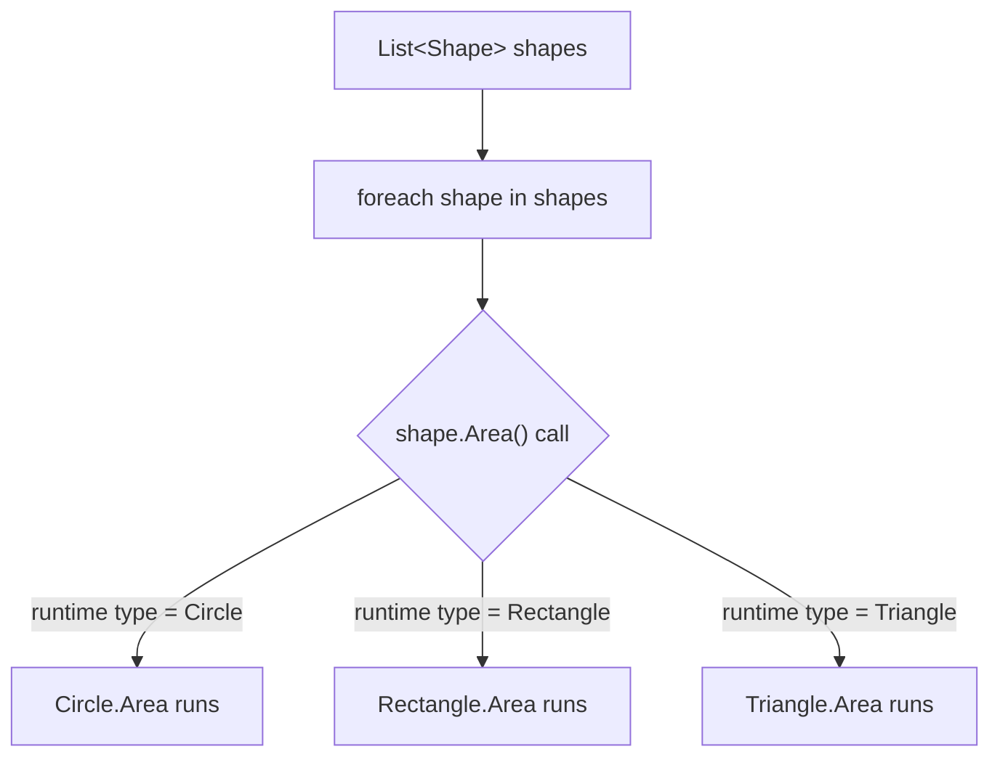
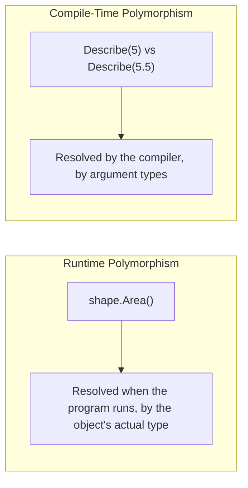

# Polymorphism — The Fourth Pillar of OOP

## Introduction

Before reading this lesson, you should already be comfortable with **[Method Overriding](../02-oop/02-12-method-overriding.md)** — using `virtual` and `override` so a derived class can genuinely replace inherited behavior. This lesson names and formalizes what that mechanism actually buys you: **polymorphism**, the fourth and culminating pillar of OOP. Polymorphism isn't a new keyword to memorize — it's the payoff that encapsulation, inheritance, and overriding have been building toward across this entire module.

By the end of this lesson, you will be able to:

- Define polymorphism and explain why it's considered the fourth, capstone pillar of OOP
- Distinguish runtime polymorphism (virtual dispatch through overriding) from compile-time polymorphism (overloading)
- Store objects of different derived types in a single base-typed collection and invoke overridden behavior uniformly
- Explain how encapsulation, inheritance, and overriding combine to make runtime polymorphism possible
- Recognize polymorphism as the reasoning behind "program to a base type, not a specific implementation"

## Polymorphism — A Layman's Perspective

Think about a standard electrical wall outlet. The outlet itself doesn't know or care what you're about to plug into it. You can plug in a lamp, a phone charger, a blender, or a vacuum cleaner, and every single one of them works, using the exact same socket, the exact same plug shape, the exact same act of pushing the plug in. The wall outlet's job is remarkably narrow: supply power through a standard interface. What happens *after* the power flows in — whether a room gets lit, a phone battery fills up, ice gets crushed, or a carpet gets cleaned — is entirely up to the specific appliance plugged in. The outlet never needed a special version of itself for lamps and a different version for blenders.

This is precisely what polymorphism gives a program. A piece of code that works with a general concept — "some `Shape`," "some `BankAccount`," "some `Employee`" — can be written exactly once, the same way a wall outlet is built exactly once, and yet it correctly triggers different, appropriate behavior depending on what's actually plugged into it at the time. A loop that computes `shape.Area()` for every shape in a list doesn't need a separate branch of code for circles versus rectangles versus triangles; it calls `Area()` once, in one place, and each shape answers according to its own specific formula, just as each appliance responds according to its own specific purpose.

It's worth pausing on how much had to be true *before* this trick becomes possible. The wall outlet only works because every appliance manufacturer already agreed to build a compatible plug (that's the shared shape supplied by inheriting from a common base). It only works because the outlet doesn't need to see inside the appliance's internal wiring to power it (that's encapsulation — the outlet interacts through a stable, public interface). And it only works because each appliance genuinely does its *own* thing once power reaches it, rather than all behaving identically (that's overriding — each derived type substitutes its own behavior at the one shared point of contact). Polymorphism is not a fourth, separate trick bolted on top of these three — it's the visible, useful *result* of all three working together at once.

The bridge back to programming: a single call site — one method call, on a base-typed reference or parameter — can trigger genuinely different behavior depending on the real object behind it, without that call site ever needing to know, or even ask, exactly which specific type it's holding.

## Polymorphism — A Programming Language Perspective

**Polymorphism** — literally "many forms" — is a type's ability to be treated uniformly through a shared base type or interface while still exhibiting behavior specific to its actual runtime type. C# expresses this in two distinct forms. **Runtime polymorphism** (also called dynamic or late-bound polymorphism) is what the previous lesson's `virtual`/`override` mechanism enables: a single call, `baseTypedReference.Method()`, is resolved by the CLR at execution time against the object's *actual* type, not the reference's declared type — this is what makes `foreach (Shape s in shapes) s.Area()` correctly invoke each shape's own formula. **Compile-time polymorphism** (also called static or early-bound polymorphism) is what method overloading provides: the *compiler*, not the runtime, selects which overload of a same-named method to call, based purely on the number and types of arguments at the call site — no inheritance or virtual dispatch is involved at all. Both are legitimately "polymorphism" because both let one name refer to more than one behavior; they differ entirely in *when* — compile time versus runtime — and *how* — argument matching versus object identity — that behavior is selected.

## How to Use Polymorphism in C#

Runtime polymorphism requires a base type (or interface) with a `virtual` member, and derived types that `override` it; calling that member through a base-typed reference or a base-typed collection element dispatches to whichever override the actual object supplies. Compile-time polymorphism, by contrast, needs no inheritance at all — just multiple methods sharing a name with different parameter lists, resolved by the compiler purely from the call site's argument types.


*Figure 1: One call site, `shape.Area()`, dispatches to a different override depending only on each object's actual runtime type — runtime polymorphism.*

```csharp
// Program.cs — .NET 10 / C# 14

List<Shape> shapes = new()
{
    new Circle(radius: 3),
    new Rectangle(width: 4, height: 5),
    new Triangle(baseLength: 6, height: 2),
};

foreach (Shape shape in shapes)
{
    Console.WriteLine($"{shape.GetType().Name}: area = {shape.Area():F2}");
}

Console.WriteLine(Describe(5));
Console.WriteLine(Describe(5.5));
Console.WriteLine(Describe("five"));

class Shape
{
    public virtual double Area() => 0;
}

class Circle : Shape
{
    private readonly double _radius;
    public Circle(double radius) => _radius = radius;
    public override double Area() => Math.PI * _radius * _radius;
}

class Rectangle : Shape
{
    private readonly double _width;
    private readonly double _height;
    public Rectangle(double width, double height)
    {
        _width = width;
        _height = height;
    }
    public override double Area() => _width * _height;
}

class Triangle : Shape
{
    private readonly double _baseLength;
    private readonly double _height;
    public Triangle(double baseLength, double height)
    {
        _baseLength = baseLength;
        _height = height;
    }
    public override double Area() => 0.5 * _baseLength * _height;
}

static string Describe(int n) => $"Describe(int): {n} is a whole number";
static string Describe(double d) => $"Describe(double): {d} is a floating-point number";
static string Describe(string s) => $"Describe(string): \"{s}\" is text";
```

**Console Output:**

```text
Circle: area = 28.27
Rectangle: area = 20.00
Triangle: area = 6.00
Describe(int): 5 is a whole number
Describe(double): 5.5 is a floating-point number
Describe(string): "five" is text
```

The `foreach` loop calls `shape.Area()` exactly once in the source code, yet three different formulas actually run — that's runtime polymorphism, resolved by each object's real type at execution time. `Describe` shows the other form: there's no inheritance anywhere in that part of the example, and the *compiler* — not the runtime — decides which of the three `Describe` overloads applies, purely by looking at whether the argument is an `int`, a `double`, or a `string`.

## Real-Time Example: Polymorphism in Banking/ATM Monthly Fee Processing

This continues the `BankAccount` hierarchy from the two previous lessons. A bank's month-end batch job has to apply a maintenance fee to every account it manages, but `SavingsAccount` and `CheckingAccount` each charge that fee differently. Runtime polymorphism lets the batch job be written once, against `List<BankAccount>`, without a single `if` statement checking account type.

```csharp
// Program.cs — .NET 10 / C# 14 — Real-Time Example
// Continues the Banking/ATM BankAccount hierarchy: a single List<BankAccount>
// processes fee deduction for every account, and each account type applies
// its own overridden rule — runtime polymorphism doing real work.

List<BankAccount> accounts = new()
{
    new SavingsAccount("SAV-1001", "Grace Hopper", openingBalance: 1200m, minimumBalance: 100m),
    new SavingsAccount("SAV-1002", "Marie Curie", openingBalance: 300m, minimumBalance: 100m),
    new CheckingAccount("CHK-2002", "Ada Lovelace", openingBalance: 500m, overdraftLimit: 100m),
};

foreach (BankAccount account in accounts)
{
    decimal fee = account.ApplyMonthlyFee();
    Console.WriteLine($"{account.AccountNumber}: fee {fee:C}, new balance {account.Balance:C}");
}

class BankAccount
{
    public string AccountNumber { get; }
    public string Owner { get; }
    public decimal Balance { get; protected set; }

    public BankAccount(string accountNumber, string owner, decimal openingBalance)
    {
        AccountNumber = accountNumber;
        Owner = owner;
        Balance = openingBalance;
    }

    public virtual decimal ApplyMonthlyFee()
    {
        const decimal fee = 5m;
        Balance -= fee;
        return fee;
    }
}

class SavingsAccount : BankAccount
{
    public decimal MinimumBalance { get; }

    public SavingsAccount(string accountNumber, string owner, decimal openingBalance, decimal minimumBalance)
        : base(accountNumber, owner, openingBalance)
    {
        MinimumBalance = minimumBalance;
    }

    public override decimal ApplyMonthlyFee()
    {
        const decimal highBalanceThreshold = 1000m;
        decimal fee = Balance >= highBalanceThreshold ? 0m : 2m;
        Balance -= fee;
        return fee;
    }
}

class CheckingAccount : BankAccount
{
    public decimal OverdraftLimit { get; }

    public CheckingAccount(string accountNumber, string owner, decimal openingBalance, decimal overdraftLimit)
        : base(accountNumber, owner, openingBalance)
    {
        OverdraftLimit = overdraftLimit;
    }

    public override decimal ApplyMonthlyFee()
    {
        const decimal fee = 10m;
        Balance -= fee;
        return fee;
    }
}
```

**Console Output:**

```text
SAV-1001: fee $0.00, new balance $1,200.00
SAV-1002: fee $2.00, new balance $298.00
CHK-2002: fee $10.00, new balance $490.00
```

The `foreach` loop's body — `account.ApplyMonthlyFee()` — is a single line that never mentions `SavingsAccount` or `CheckingAccount` by name, yet it correctly waives the fee for the high-balance savings account, charges a small fee for the lower-balance one, and charges the checking account's flat fee. This is precisely why real batch-processing code is written against base types: adding a future `BusinessAccount` type later requires no change at all to this loop, only a new `override`.

## Runtime Polymorphism vs Compile-Time Polymorphism

Runtime polymorphism is resolved by the CLR while the program is executing, based on the actual type of the object behind a reference — it's what `virtual`/`override` (built on inheritance) makes possible, and it's what lets one call site behave differently depending on which object is really there. Compile-time polymorphism is resolved entirely by the compiler while building the program, based on the number and types of arguments at a call site — it's what method overloading provides, and it requires no inheritance, no base type, and no runtime type inspection whatsoever.


*Figure 2: Runtime polymorphism is resolved by the object's identity while the program runs; compile-time polymorphism is resolved by argument types while the program builds.*

| Aspect | Runtime Polymorphism (Overriding) | Compile-Time Polymorphism (Overloading) |
|---|---|---|
| Resolved by | The CLR, at runtime, using the object's actual type | The compiler, at compile time, using argument types/count |
| Requires | Inheritance plus `virtual`/`override` | Multiple methods, same name, different signatures |
| Call site | One call site, many possible behaviors | One method name, compiler picks the matching overload |
| Also known as | Dynamic / late binding | Static / early binding |
| Covered in | Method Overriding (previous lesson) | Method Overloading |

## Types of Polymorphism in C#

Polymorphism shows up in several distinct forms across C#, some covered in their own dedicated lessons:

1. **Runtime polymorphism via method overriding** — the form built directly on the previous lesson's `virtual`/`override`.
2. **[Compile-time polymorphism via method overloading](../02-oop/02-10-method-overloading.md)** — resolved entirely by the compiler, with no inheritance involved.
3. **[Polymorphism through abstract classes](../02-oop/02-14-abstract-classes-and-methods.md)** — where the base type provides no default at all, only a mandatory contract.
4. **[Polymorphism through interfaces](../02-oop/02-15-interfaces-in-csharp.md)** — treating unrelated types uniformly through a shared contract rather than a shared ancestor.
5. **[Parametric polymorphism via generics](../03-collections-generics/03-15-introduction-to-generics.md)** — writing one algorithm that works across many types via type parameters, rather than via inheritance.
6. **[Operator overloading](../02-oop/02-05-operator-overloading-in-depth.md)** — giving the same operator symbol, like `+`, different meanings depending on the operand types involved.

## What You've Learned & What's Next

Polymorphism is the payoff of everything this module has built so far: because encapsulation keeps interaction through a stable public surface, because inheritance lets many types share a common base, and because overriding lets each type substitute its own behavior at that shared point of contact, a single call site can now trigger genuinely different, correct behavior depending on what's actually there — whether that's resolved at runtime through virtual dispatch, or at compile time through overload resolution.

Continue your learning journey with **[Abstract Classes and Methods](../02-oop/02-14-abstract-classes-and-methods.md)**, where you'll see how to force every derived class to supply its own override, by declaring a base member with no default implementation at all.

---
*Applies to: .NET 10 / C# 14. Last reviewed 2026-08-16.*
