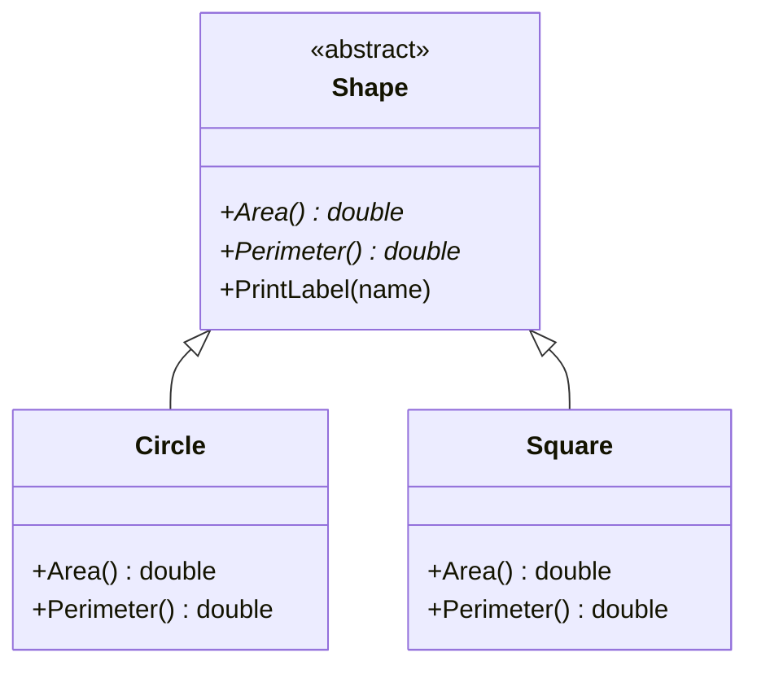
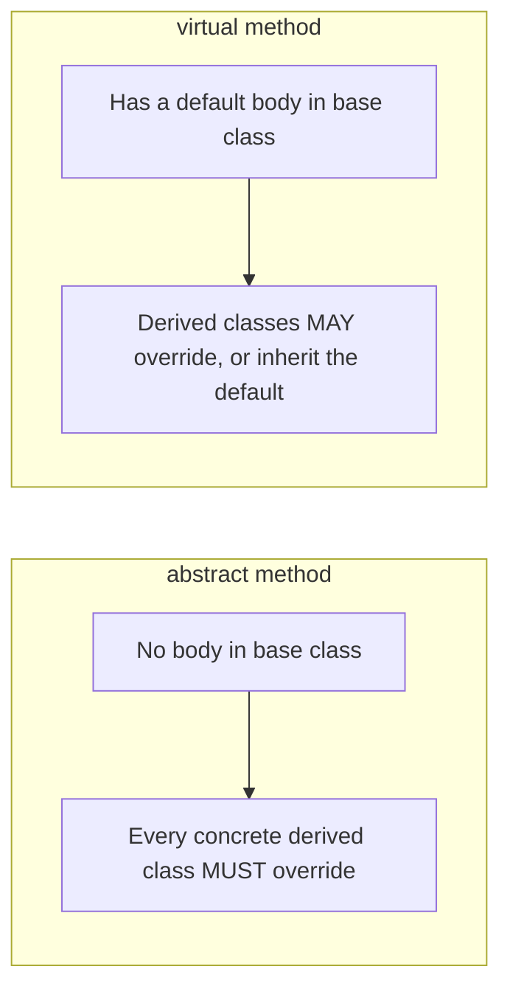

# Abstract Classes and Methods

## Introduction

Before reading this lesson, you should already be comfortable with **[Polymorphism — The Fourth Pillar of OOP](../02-oop/02-13-polymorphism-pillar-of-oop.md)** — treating objects of different derived types uniformly through a shared base type. Every base class used so far could still be instantiated on its own, even when it wasn't meant to represent anything real by itself. This lesson introduces **abstract classes and methods**: a way to declare a base type that exists purely to be built upon, and to force every derived class to supply behavior the base class deliberately leaves unfinished.

By the end of this lesson, you will be able to:

- Declare an abstract class with the `abstract` keyword and explain why it cannot be instantiated directly
- Declare an abstract method that has no body, and understand that every non-abstract derived class must implement it
- Mix abstract methods with fully implemented, ordinary members inside the same abstract class
- Distinguish `abstract` methods from `virtual` methods — mandatory override versus optional override
- Explain how abstract classes let a base type provide partial shared implementation while still enforcing a contract

## Abstract Classes and Methods — A Layman's Perspective

Picture a government passport application form. Most of the form is already filled in with fixed, official text that applies to every applicant identically: the issuing authority's name, the legal declarations, the standard instructions for where to mail it. You, the applicant, don't get to change any of that — it's already complete, shared, and correct for everyone who uses this form. But right in the middle of the page, there's a rectangular outline with the printed words "Attach your photograph here." That outline is not filled in. It cannot be filled in by the office that printed the form, because only the specific applicant knows what they actually look like. And critically, no passport office anywhere will accept that master form, blank photo box and all, as somebody's actual passport application — it exists only as a template, to be completed by someone specific before it becomes usable.

Every real, individual applicant fills out a form that looks exactly like that master template, keeping all of the shared, pre-printed sections exactly as they are, and supplying their own photograph in that one designated spot. Two different applicants end up with two different completed forms — different photos — but both forms are still built on that same required structure, and both had to supply *something* in that blank box before their form became valid. Nobody gets to leave it empty, and nobody gets to submit the bare template itself as if it were a real application.

That's exactly what an abstract class is. It supplies whatever can genuinely be shared and finished once — the standard sections everyone needs identically — and it also carries at least one section marked "you must fill this in yourself," which nobody can leave blank and which the office itself refuses to accept unfilled. The form itself, as a bare template, isn't a valid application to anyone; it only becomes one once a real applicant completes the required part. In code, that master template that can't be submitted on its own is the abstract class, and the box that must be filled in before anything can be built from it is the abstract method.

The bridge back to programming: an abstract class is a base type designed to be extended, never used directly — the compiler enforces that the same way a passport office refuses a form with the photo box left conspicuously blank — and an abstract method is that unavoidable blank box, a member with no body at all, which every concrete (non-abstract) derived class must supply an implementation for before it can be considered complete.

## Abstract Classes and Methods — A Programming Language Perspective

An **abstract class**, declared with the `abstract` keyword on the class itself, cannot be instantiated directly — attempting `new AbstractClass()` produces compiler error CS0144. It can still declare constructors, fields, and fully implemented methods, exactly like any other class; those are inherited by derived classes in the usual way. What makes it distinctive is that it may also declare one or more **abstract methods**: members marked `abstract`, with no body at all (just a signature ending in `;`), which every non-abstract class deriving from it *must* implement using `override`, or itself remain `abstract` and defer the obligation further down the hierarchy. Abstract members are implicitly virtual in the sense that they participate in dynamic dispatch, but they cannot also be marked `virtual` explicitly, nor can they be `private` or `static`, since a private or static member could never be overridden by a derived class in the first place. The key distinction from a plain `virtual` method (previous lessons) is that `virtual` supplies a working default that derived classes *may* override, while `abstract` supplies no default at all — overriding is not optional, it's the only way the member can ever run.

## How to Declare an Abstract Class in C#

An abstract class is declared with `abstract class Name`, and any member within it that has no sensible shared implementation is declared `abstract ReturnType MemberName(parameters);` — note there is no method body, just a signature terminated by a semicolon. A class that derives from an abstract class and provides `override` implementations for every abstract member becomes concrete, and can be instantiated normally; a class that leaves any abstract member unimplemented must itself be declared `abstract`.


*Figure 1: `Shape` cannot be instantiated directly; `Circle` and `Square` must each supply their own `Area()` and `Perimeter()`.*

```csharp
// Program.cs — .NET 10 / C# 14

Shape[] shapes = { new Circle(radius: 3), new Square(side: 5) };

foreach (Shape shape in shapes)
{
    Console.WriteLine($"{shape.GetType().Name}: area = {shape.Area():F2}, perimeter = {shape.Perimeter():F2}");
}

// Shape generic = new Shape(); // compile error CS0144: cannot create an instance
                                 // of the abstract type or interface 'Shape'

abstract class Shape
{
    public abstract double Area();
    public abstract double Perimeter();

    // Abstract classes may still hold ordinary, fully-implemented members.
    public void PrintLabel(string name) => Console.WriteLine($"--- {name} ---");
}

class Circle : Shape
{
    private readonly double _radius;
    public Circle(double radius) => _radius = radius;
    public override double Area() => Math.PI * _radius * _radius;
    public override double Perimeter() => 2 * Math.PI * _radius;
}

class Square : Shape
{
    private readonly double _side;
    public Square(double side) => _side = side;
    public override double Area() => _side * _side;
    public override double Perimeter() => 4 * _side;
}
```

**Console Output:**

```text
Circle: area = 28.27, perimeter = 18.85
Square: area = 25.00, perimeter = 20.00
```

`Shape` declares `Area()` and `Perimeter()` as `abstract` — neither has a body, and `Shape` itself could never be constructed, as the commented-out line demonstrates. `Circle` and `Square` are each forced to supply their own `override` for both members before the compiler considers them complete, concrete classes. `Shape.PrintLabel` shows that an abstract class isn't *only* abstract members — it can freely mix in fully working shared code alongside the parts it deliberately leaves unfinished.

## Real-Time Example: Abstract Classes in Library/Inventory Management

Consider a library catalog. Every catalog item — a book, a DVD, a magazine — shares a title and a check-out process, but the loan period allowed before it's due back genuinely differs by item type, and there's no sensible single default that fits all of them. `LibraryItem` models this as an abstract base class: it implements `CheckOut()` once, shared by everything, but declares `GetLoanPeriodDays()` as abstract, forcing every specific item type to state its own rule.

```csharp
// Program.cs — .NET 10 / C# 14 — Real-Time Example
// Library/Inventory Management case study: every catalog item shares a common
// shape (title, check-out behavior), but the loan period is something only
// each specific kind of item can define.

List<LibraryItem> catalog = new()
{
    new Book("Clean Code", "Robert C. Martin"),
    new Book("The Pragmatic Programmer", "David Thomas"),
    new Dvd("The Imitation Game", runtimeMinutes: 114),
};

foreach (LibraryItem item in catalog)
{
    item.CheckOut();
}

// LibraryItem generic = new LibraryItem("X"); // compile error — LibraryItem is abstract

abstract class LibraryItem
{
    public string Title { get; }

    protected LibraryItem(string title)
    {
        Title = title;
    }

    public abstract int GetLoanPeriodDays();

    public void CheckOut()
    {
        Console.WriteLine($"\"{Title}\" checked out — due in {GetLoanPeriodDays()} days.");
    }
}

class Book : LibraryItem
{
    public string Author { get; }

    public Book(string title, string author) : base(title)
    {
        Author = author;
    }

    public override int GetLoanPeriodDays() => 21;
}

class Dvd : LibraryItem
{
    public int RuntimeMinutes { get; }

    public Dvd(string title, int runtimeMinutes) : base(title)
    {
        RuntimeMinutes = runtimeMinutes;
    }

    public override int GetLoanPeriodDays() => 7;
}
```

**Console Output:**

```text
"Clean Code" checked out — due in 21 days.
"The Pragmatic Programmer" checked out — due in 21 days.
"The Imitation Game" checked out — due in 7 days.
```

`CheckOut()` is written exactly once, on `LibraryItem`, and never needs to know whether it's running on a `Book` or a `Dvd` — it simply calls `GetLoanPeriodDays()`, and because that member is abstract, every item type is guaranteed to have supplied a real answer. This is exactly the shape a real catalog system needs: shared behavior (the check-out process) implemented once, alongside a mandatory, per-type contract (the loan period) that the compiler itself refuses to let any item type skip.

## Abstract vs Virtual Methods

An `abstract` method has no body at all in the base class — it exists purely as a contract, and every concrete derived class *must* override it, because there is no fallback behavior to fall back on. A `virtual` method, by contrast, has a working default implementation right there in the base class, and derived classes are free to override it or simply inherit the default as-is. Choose `abstract` when there genuinely is no sensible one-size-fits-all default; choose `virtual` when there is a reasonable default that most derived types will keep, with only some needing to customize it.


*Figure 2: An abstract method leaves nothing to fall back on; a virtual method's default keeps working even if nobody overrides it.*

| Aspect | `abstract` method | `virtual` method |
|---|---|---|
| Body in the base class | None — ends with `;` | Has a working default implementation |
| Overriding in a derived class | Mandatory for every concrete derived class | Optional |
| Containing class | Must itself be `abstract`; cannot be instantiated | Can be a normal, instantiable class |
| Use when | Every subtype must supply its own behavior — no sensible default exists | There's a sensible default, but some subtypes may want to customize it |
| Keyword pairing | `abstract` (base) + `override` (derived) | `virtual` (base) + `override` (derived) |

## Types of Abstraction-Related Concepts in C#

Abstract classes sit alongside a few related ideas, some covered in their own dedicated lessons:

1. **[Overriding a Virtual Method](../02-oop/02-12-method-overriding.md)** — the optional counterpart to a mandatory abstract override.
2. **[Interfaces as a Fully Abstract Contract](../02-oop/02-15-interfaces-in-csharp.md)** — the next lesson, where *every* member is a contract and a type can satisfy any number of them at once.
3. **[Sealed Classes](../02-oop/02-17-sealed-classes-and-methods.md)** — the opposite instinct: closing a class off from any further derivation at all.
4. **[The Template Method Pattern](../12-advanced-concepts/12-21-template-method-pattern.md)** — a design pattern built directly on abstract classes, where a base class fixes the overall algorithm's shape and defers individual steps to abstract methods.
5. **[OOP in C# — Putting the Four Pillars Together](../02-oop/02-37-oop-four-pillars-together.md)** — where abstract classes take their place alongside encapsulation, inheritance, and polymorphism in a single, complete picture.

## What You've Learned & What's Next

An abstract class exists to be extended, never instantiated on its own, and can freely mix fully implemented shared members with abstract ones that have no body at all — members every concrete derived class is compiler-enforced to implement. Where a `virtual` method offers a sensible default that derived classes may optionally override, an `abstract` method offers no default whatsoever, making the override mandatory rather than optional.

Continue your learning journey with **[Interfaces in C#](../02-oop/02-15-interfaces-in-csharp.md)**, where you'll meet a contract that's abstract in its entirety — one a class can satisfy alongside any number of others, not just one at a time.

---
*Applies to: .NET 10 / C# 14. Last reviewed 2026-08-16.*
