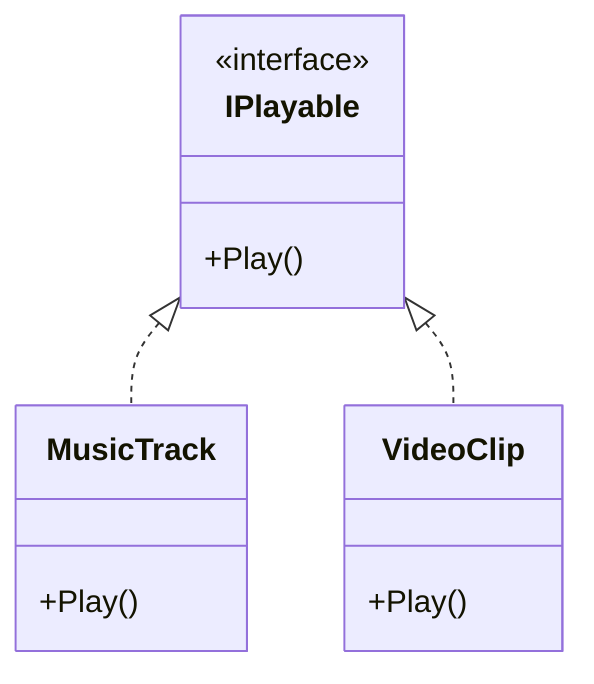
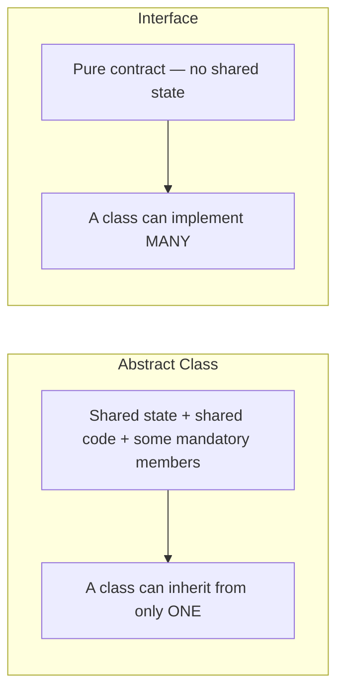

# Interfaces in C#

## Introduction

Before reading this lesson, you should already be comfortable with **[Abstract Classes and Methods](../02-oop/02-14-abstract-classes-and-methods.md)** — a base type that can't be instantiated and forces derived classes to implement certain members. Abstract classes still only let a class extend *one* of them at a time, the same single-inheritance limit every class has. This lesson introduces **interfaces**: a pure contract, unrelated to a class's ancestry, that a single class can implement any number of at once.

By the end of this lesson, you will be able to:

- Declare an interface using the `interface` keyword and define members with no implementation
- Implement one interface on a class using the `: IInterfaceName` syntax
- Implement multiple interfaces on the same class — something a class cannot do with base classes
- Treat any type implementing an interface uniformly, wherever that interface is expected
- Decide when to reach for an interface instead of an abstract class

## Interfaces — A Layman's Perspective

Consider a notary public certification. Someone can become a certified notary regardless of what their actual day job is — a lawyer can be a notary, a bank teller can be a notary, a small shop owner can be a notary. These people have no shared professional ancestry whatsoever; a lawyer and a shop owner didn't train under some common "notary-adjacent professional" base career that gradually specialized into each of them. What they *do* share is much narrower and much more specific: each of them has separately proven they can perform one particular action — verifying identity and formally witnessing a signature — to the exact standard the certification demands.

When a courthouse needs a document notarized, it doesn't ask what the person's regular job is, how they got into that job, or what else they're qualified to do. It asks exactly one question: "Do you hold the notary certification?" If the answer is yes, the courthouse hands over the document and trusts that the one specific, certified action will be performed correctly — completely indifferent to whether the person spends the rest of their day practicing law, cashing checks, or selling groceries. And the same person might well hold several such certifications at once — notary, first-aid responder, forklift operator — each one an entirely independent promise to perform some specific action, stacked on top of whatever their actual profession happens to be.

That's the essence of an interface. It isn't a family lineage the way a base class is — it doesn't care what a type "is" in some deep ancestral sense, and it doesn't hand down any shared internal state or half-finished behavior the way an abstract class can. It's a narrow, specific promise: "anything that holds this certification can perform this exact action, correctly, on request." Any class, no matter how unrelated to any other class, can pick up that promise, and a single class can pick up several such promises simultaneously, exactly as one person can hold several unrelated certifications side by side.

The bridge back to programming: an interface declares a set of members with no shared implementation and no shared ancestry requirement — purely a contract that says "anything satisfying me can do these specific things." A class earns the right to be treated as that interface not by descending from some common base, but simply by implementing every member the interface demands, and it can do this for as many separate interfaces as it needs, entirely independent of whatever single class it might also inherit from.

## Interfaces — A Programming Language Perspective

An **interface**, declared with the `interface` keyword, defines a set of members — methods, properties, events, or indexers — with no implementation of their own; every member is implicitly `public`. A class or struct implements an interface using the same colon syntax as class inheritance, `class Name : IInterfaceName`, and unlike a base class, a single type may implement **any number of interfaces**, listed after an optional single base class and separated by commas. Any variable, parameter, or collection typed as the interface can hold a reference to *any* type implementing it, regardless of what that type's actual class hierarchy looks like — the interface is the contract, and satisfying it is all that's required. Traditionally, interfaces could not declare instance fields or provide method bodies at all; C# 8 introduced **default interface methods**, letting an interface supply a body some implementers can simply inherit, and later versions added **static abstract members** for operator-like contracts — both are substantial enough topics to warrant their own dedicated next lesson rather than a summary here.

## How to Declare and Implement an Interface in C#

An interface lists member signatures with no bodies, the same way an abstract method does, but without the surrounding `abstract class`. Any class implementing it uses `: IInterfaceName` and must supply a concrete body for every member the interface declares; multiple interfaces are simply comma-separated in that same list.


*Figure 1: `MusicTrack` and `VideoClip` share no common base class, yet both satisfy `IPlayable` — a pure capability contract.*

```csharp
// Program.cs — .NET 10 / C# 14

List<IPlayable> playlist = new()
{
    new MusicTrack("Clair de Lune", durationSeconds: 300),
    new VideoClip("Conference Keynote", durationSeconds: 1800),
};

foreach (IPlayable item in playlist)
{
    item.Play();
}

interface IPlayable
{
    void Play();
}

class MusicTrack : IPlayable
{
    private readonly string _title;
    private readonly int _durationSeconds;

    public MusicTrack(string title, int durationSeconds)
    {
        _title = title;
        _durationSeconds = durationSeconds;
    }

    public void Play() => Console.WriteLine($"Playing track \"{_title}\" ({_durationSeconds}s).");
}

class VideoClip : IPlayable
{
    private readonly string _title;
    private readonly int _durationSeconds;

    public VideoClip(string title, int durationSeconds)
    {
        _title = title;
        _durationSeconds = durationSeconds;
    }

    public void Play() => Console.WriteLine($"Playing video \"{_title}\" ({_durationSeconds}s).");
}
```

**Console Output:**

```text
Playing track "Clair de Lune" (300s).
Playing video "Conference Keynote" (1800s).
```

`MusicTrack` and `VideoClip` share no base class beyond the implicit `object`, yet `List<IPlayable>` holds both of them side by side, and `item.Play()` correctly reaches each one's own implementation. Neither class needed to descend from anything in particular — they only needed to implement `IPlayable`'s one member, `Play()`, which is exactly what makes an interface a "can-do" contract rather than an "is-a" ancestry.

## Real-Time Example: Interfaces in Library/Inventory Management

This continues the `LibraryItem` hierarchy from the previous lesson. Reserving an item for a patron and tracking whether it's overdue are capabilities that cut across the `Book`/`Dvd` hierarchy rather than following it — some item types support reservation, some might support overdue tracking, and a class picks up exactly the interfaces relevant to it, independent of its position in the `LibraryItem` chain.

```csharp
// Program.cs — .NET 10 / C# 14 — Real-Time Example
// Continues the Library/Inventory LibraryItem hierarchy: Book and Dvd now also
// implement interfaces for reservation and overdue tracking — capabilities
// that have nothing to do with the Book/Dvd inheritance chain itself.

List<LibraryItem> catalog = new()
{
    new Book("Clean Code", "Robert C. Martin"),
    new Dvd("The Imitation Game", runtimeMinutes: 114),
};

foreach (LibraryItem item in catalog)
{
    item.CheckOut();

    if (item is IReservable reservable)
    {
        reservable.Reserve("Alan Turing");
    }
}

Book overdueBook = new Book("Refactoring", "Martin Fowler");
IOverdueTrackable overdueCheck = overdueBook;
int daysOverdue = overdueCheck.DaysOverdue(checkedOutOn: new DateTime(2026, 7, 1), asOf: new DateTime(2026, 8, 16));
Console.WriteLine($"\"{overdueBook.Title}\" is {daysOverdue} day(s) overdue.");

interface IReservable
{
    void Reserve(string patronName);
}

interface IOverdueTrackable
{
    int DaysOverdue(DateTime checkedOutOn, DateTime asOf);
}

abstract class LibraryItem
{
    public string Title { get; }

    protected LibraryItem(string title)
    {
        Title = title;
    }

    public abstract int GetLoanPeriodDays();

    public void CheckOut()
    {
        Console.WriteLine($"\"{Title}\" checked out — due in {GetLoanPeriodDays()} days.");
    }
}

class Book : LibraryItem, IReservable, IOverdueTrackable
{
    public string Author { get; }

    public Book(string title, string author) : base(title)
    {
        Author = author;
    }

    public override int GetLoanPeriodDays() => 21;

    public void Reserve(string patronName) =>
        Console.WriteLine($"\"{Title}\" reserved for {patronName}.");

    public int DaysOverdue(DateTime checkedOutOn, DateTime asOf)
    {
        DateTime dueDate = checkedOutOn.AddDays(GetLoanPeriodDays());
        int overdue = (asOf - dueDate).Days;
        return overdue > 0 ? overdue : 0;
    }
}

class Dvd : LibraryItem, IReservable
{
    public int RuntimeMinutes { get; }

    public Dvd(string title, int runtimeMinutes) : base(title)
    {
        RuntimeMinutes = runtimeMinutes;
    }

    public override int GetLoanPeriodDays() => 7;

    public void Reserve(string patronName) =>
        Console.WriteLine($"\"{Title}\" reserved for {patronName}.");
}
```

**Console Output:**

```text
"Clean Code" checked out — due in 21 days.
"Clean Code" reserved for Alan Turing.
"The Imitation Game" checked out — due in 7 days.
"The Imitation Game" reserved for Alan Turing.
"Refactoring" is 25 day(s) overdue.
```

`Book` implements two interfaces, `IReservable` and `IOverdueTrackable`, on top of deriving from `LibraryItem`; `Dvd` implements only `IReservable`. Neither choice affects the other — a class picks up exactly the contracts it needs. The `item is IReservable reservable` check inside the loop treats reservation as an optional capability any catalog item might or might not have, entirely independent of where that item sits in the `LibraryItem` inheritance chain, which is precisely the flexibility a growing real-world catalog needs as new item types are added.

## Abstract Class vs Interface

An abstract class expresses a true "is-a" specialization: it can hold shared state, fully implemented members, and a constructor, but a class can extend only one. An interface expresses a narrower "can-do" contract with no shared state of its own, and a class can implement as many as it needs. Reach for an abstract class when a family of closely related types genuinely shares state and real, working code; reach for an interface when you need to promise a specific capability across types that otherwise have nothing to do with each other.


*Figure 2: An abstract class is a single specialization a class inherits from; an interface is one of many independent contracts a class can satisfy.*

| Aspect | Abstract Class | Interface |
|---|---|---|
| Relationship | "is-a" (true specialization) | "can-do" (a capability/contract) |
| How many per class | One direct abstract base class | Any number of interfaces |
| Shared state (fields) | Yes | No — interfaces cannot declare instance fields |
| Shared implementation | Yes — concrete methods alongside abstract ones | Only via default interface methods (next lesson) |
| Constructor | Yes, invoked via `base(...)` | None |
| Typical use | A family of closely related types sharing real code (`LibraryItem` → `Book`, `Dvd`) | An unrelated set of types that can all do one thing (`IReservable`, `IComparable<T>`) |

## Types of Interfaces and Interface-Related Concepts in C#

Interfaces connect to several ideas covered elsewhere in this curriculum:

1. **[Default Interface Methods and Static Abstract Members](../02-oop/02-16-default-interface-methods-static-abstract.md)** — the very next lesson, where interfaces gain the ability to supply a shared default body and operator-like static contracts.
2. **[Generic Interfaces: `IComparable<T>` and `IComparer<T>`](../03-collections-generics/03-20-icomparable-and-icomparer.md)** — interfaces parameterized over a type, used throughout .NET's sorting and collection APIs.
3. **[`IEnumerable<T>` and `IEnumerator<T>`](../03-collections-generics/03-13-ienumerable-and-ienumerator.md)** — the interface pair behind every `foreach` loop in C#.
4. **[`IDisposable` and the `using` Statement](../08-memory-management/08-04-idisposable-and-using-statement.md)** — one of the most widely implemented interfaces in all of .NET, for deterministic resource cleanup.
5. **[The Interface Segregation Principle](../12-advanced-concepts/12-04-interface-segregation-principle.md)** — a design guideline for keeping interfaces small and focused rather than bloated with unrelated members.
6. **[Abstract Classes and Methods](../02-oop/02-14-abstract-classes-and-methods.md)** — revisited here as the alternative to reach for when a shared, working base implementation is really what a family of types needs.

## What You've Learned & What's Next

An interface, declared with `interface`, is a pure contract with no shared state or ancestry requirement: any class, regardless of what it inherits from, can implement it by supplying every member the interface demands, and a single class can implement as many interfaces as it genuinely needs — something the single-inheritance rule never allows for base classes. Reach for an interface when you need a specific, cross-cutting capability; reach for an abstract class when a family of types genuinely shares state and real, working code.

Continue your learning journey with **[Default Interface Methods and Static Abstract Members](../02-oop/02-16-default-interface-methods-static-abstract.md)**, where interfaces gain the ability to supply working default implementations and operator-like static contracts of their own.

---
*Applies to: .NET 10 / C# 14. Last reviewed 2026-08-16.*
