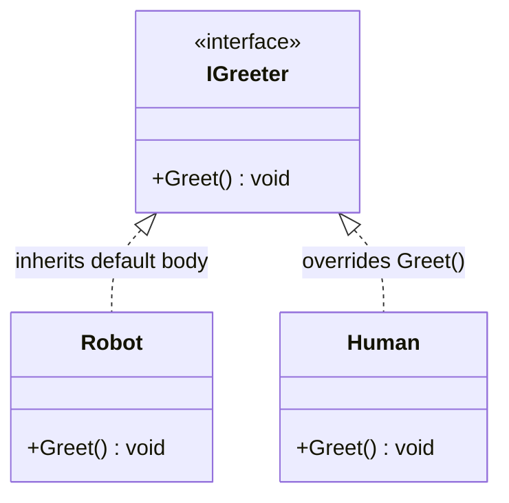
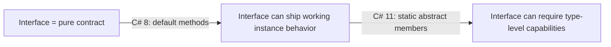

# Default Interface Methods and Static Abstract Members

## Introduction

Before reading this lesson, you should already be comfortable with **[Interfaces in C#](../02-oop/02-15-interfaces-in-csharp.md)** — a pure contract listing members that an implementing type must supply, with no code of its own. This lesson breaks that "pure contract" rule in two distinct directions: **default interface methods**, which let an interface ship a working method body that implementers inherit for free, and **static abstract members**, which let an interface demand a capability from the implementing *type itself* rather than from any one instance of it.

By the end of this lesson, you will be able to:

- Write a default method body directly inside an interface declaration
- Explain why a class can skip implementing a default member entirely and still compile
- Declare `static abstract` properties, methods, and operators on an interface
- Consume a `static abstract` member from generic code using `T.Member` syntax
- Recognize the "generic math" pattern these two features together make possible

## Default Interface Methods and Static Abstract Members — A Layman's Perspective

Think about how franchise agreements used to work when a coffee chain first started licensing its brand out to independent shop owners. The agreement was nothing but a checklist: "you must serve espresso, you must open by 7 a.m., you must display our logo on the awning." It never told the shop owner *how* to make the espresso or *how* to greet a customer walking in — that was left entirely up to each shop to work out on its own, every single time, even when nine out of ten shops would have written the exact same instructions anyway.

Now picture a modern version of that same agreement. The franchisor has noticed that almost every shop handles the "greet a walk-in customer" routine identically, so instead of leaving that line blank, the agreement now arrives with a ready-made greeting script printed right into the contract. Any shop owner can use that script as-is from day one, with zero extra work — but if a particular shop wants to hand out its own signature greeting instead, nothing stops them from crossing out that page and writing their own. A checklist item stopped being merely a requirement; some items now arrive with a working default already built in, usable immediately or replaced when a shop has something better.

There's a second, stranger kind of clause some modern agreements include, and it isn't a requirement on any one shop's counter at all — it's a demand made of the coffee-chain *company*, as a brand. "Whichever new blend headquarters launches next quarter, headquarters must be able to say how to brew a large-batch version of it" is a requirement pointed at the parent brand's own central recipe book, not at any individual shop. Every shop still opens, brews, and serves under the brand's rules exactly as before, but this particular obligation is met once, at the company level — every shop simply relies on the answer existing, rather than each one inventing its own large-batch formula from scratch.

An interface used to be exactly that old-style franchise checklist — a pure list of requirements, with all the actual behavior left to whoever signs on. Modern C# interfaces can now include ready-made default behavior that any implementer gets for free, and, separately, they can demand a capability from the *type itself* rather than from each individual instance of it — precisely the two new powers this lesson introduces.

## Default Interface Methods and Static Abstract Members — A Programming Language Perspective

A **default interface method** is a method (or property) body written directly inside an interface declaration, introduced in C# 8.0 to let library authors add new members to an already-published interface without breaking every existing implementer — any type that doesn't supply its own version automatically inherits the interface's body. A **static abstract member**, introduced in C# 11 (.NET 7) as part of the "generic math" feature set, is a static property, method, or operator declared abstract on an interface; unlike every other interface member that came before it, it is never invoked through an instance. It is invoked through a generic type parameter constrained to the interface (`where T : ISomeInterface`), written as `T.Member`, which means the *type itself* — not any particular object — is what must supply the implementation. Together, the two features push interfaces well past their historical "contract only, zero code, instance members only" definition: default methods let an interface ship real, working logic, and static abstract members let an interface describe requirements that live at the type level, which is exactly what makes uniform arithmetic-style operations — `+`, `Zero`, parsing — expressible across unrelated numeric and domain types through a single generic algorithm.

## How to Declare Default Interface Methods and Static Abstract Members in C#

A default method looks identical to a normal interface method, except it is given a body right there on the interface; any implementing type inherits that body automatically and only needs to write its own version if it wants different behavior. There is no `override` keyword involved on either side, because the implementing class is not overriding a base class member — it is simply choosing not to replace the interface's default. Static abstract members use a different pair of keywords stacked together: `static abstract`, applied to a property, method, or operator declared with no body at all. Every implementing type is required to supply a `static` implementation of its own, and that implementation is only reachable from generic code that constrains its type parameter to the interface.


*Figure 1: Robot relies on `IGreeter`'s default `Greet()` body; `Human` supplies its own override.*

```csharp
// Program.cs — .NET 10 / C# 14

IGreeter[] greeters = [new Robot(), new Human()];
foreach (IGreeter greeter in greeters)
{
    greeter.Greet();
}

Money total = Sum(new Money(10m), new Money(25m), new Money(5m));
Console.WriteLine($"Total: {total}");

interface IGreeter
{
    string Name { get; }

    // A default body — any implementer that doesn't override this gets it for free.
    void Greet() => Console.WriteLine($"Hello, {Name}! (default greeting)");
}

class Robot : IGreeter
{
    public string Name => "R2D2";
    // No Greet() override — uses IGreeter's default body as-is.
}

class Human : IGreeter
{
    public string Name => "Ada";
    public void Greet() => Console.WriteLine($"Hi, I'm {Name}."); // overrides the default
}

interface IAddable<T> where T : IAddable<T>
{
    static abstract T Zero { get; }
    static abstract T operator +(T left, T right);
}

readonly record struct Money(decimal Amount) : IAddable<Money>
{
    public static Money Zero => new(0m);
    public static Money operator +(Money left, Money right) => new(left.Amount + right.Amount);
    public override string ToString() => Amount.ToString("C");
}

static T Sum<T>(params T[] values) where T : IAddable<T>
{
    T total = T.Zero;
    foreach (T value in values)
    {
        total += value;
    }
    return total;
}
```

**Console Output:**

```text
Hello, R2D2! (default greeting)
Hi, I'm Ada.
Total: $40.00
```

`Robot` never writes a `Greet` method at all, yet `greeter.Greet()` still prints a message — it is running `IGreeter`'s default body. `Human` supplies its own `Greet`, so the default is shadowed entirely for that type. Lower down, `Sum<T>` never mentions `Money` by name; it only knows `T` is `IAddable<T>`, so it can call `T.Zero` and `total += value` — a static property and a static operator — purely through the generic constraint. That is the generic math pattern: one algorithm, written once, works for `Money` today and for any future type that implements `IAddable<T>` tomorrow.

## Real-Time Example: Default Interface Methods and Static Abstract Members in Banking/ATM

This example starts a new thread in the Banking/ATM case study. Two account types — `CheckingAccount` and `PremiumSavingsAccount` — share a single `IAccount` contract. Withdrawal validation is exactly the kind of policy that used to be copy-pasted into every account class separately; here it is written once, as a default method on the interface, while each account type supplies only the raw balance mutation and, optionally, its own withdrawal limit. A second interface, `IAccountFactory<TSelf>`, uses a `static abstract` member so generic code can open a brand-new, zero-balance account of any conforming type without knowing its constructor signature ahead of time.

```csharp
// Program.cs — .NET 10 / C# 14 — Real-Time Example
// Banking/ATM case study: a shared IAccount contract carries the withdrawal
// validation policy as a default method, while a static abstract factory
// member lets generic code open new accounts of any conforming type.

var checking = new CheckingAccount("CHK-100", 5000m);
var savings = new PremiumSavingsAccount("SAV-200", 8000m);

checking.TryWithdraw(1500m);
savings.TryWithdraw(1500m);

IAccount[] accounts = [checking, savings];
foreach (IAccount account in accounts)
{
    account.TryWithdraw(50m);
}

CheckingAccount freshAccount = OpenNewAccount<CheckingAccount>("CHK-101");
Console.WriteLine($"Opened {freshAccount.AccountNumber} with balance {freshAccount.Balance:C}.");

static TAccount OpenNewAccount<TAccount>(string accountNumber)
    where TAccount : IAccount, IAccountFactory<TAccount>
    => TAccount.OpenWithZeroBalance(accountNumber);

interface IAccount
{
    string AccountNumber { get; }
    decimal Balance { get; }

    // A default value — most accounts use it as-is; premium accounts override it.
    decimal WithdrawalLimit => 1000m;

    // Every account type supplies just the raw mutation...
    void Deduct(decimal amount);

    // ...while the shared validation policy ships once, as a default body.
    bool TryWithdraw(decimal amount)
    {
        if (amount <= 0)
        {
            Console.WriteLine($"{AccountNumber}: withdrawal amount must be positive.");
            return false;
        }
        if (amount > Balance)
        {
            Console.WriteLine($"{AccountNumber}: insufficient funds (balance {Balance:C}).");
            return false;
        }
        if (amount > WithdrawalLimit)
        {
            Console.WriteLine($"{AccountNumber}: {amount:C} exceeds withdrawal limit of {WithdrawalLimit:C}.");
            return false;
        }

        Deduct(amount);
        Console.WriteLine($"{AccountNumber}: withdrew {amount:C}, new balance {Balance:C}.");
        return true;
    }
}

interface IAccountFactory<TSelf> where TSelf : IAccount, IAccountFactory<TSelf>
{
    static abstract TSelf OpenWithZeroBalance(string accountNumber);
}

class CheckingAccount : IAccount, IAccountFactory<CheckingAccount>
{
    public string AccountNumber { get; }
    public decimal Balance { get; private set; }

    public CheckingAccount(string accountNumber, decimal balance)
    {
        AccountNumber = accountNumber;
        Balance = balance;
    }

    public void Deduct(decimal amount) => Balance -= amount;

    public static CheckingAccount OpenWithZeroBalance(string accountNumber) => new(accountNumber, 0m);
}

class PremiumSavingsAccount : IAccount
{
    public string AccountNumber { get; }
    public decimal Balance { get; private set; }
    public decimal WithdrawalLimit => 5000m; // overrides the interface default

    public PremiumSavingsAccount(string accountNumber, decimal balance)
    {
        AccountNumber = accountNumber;
        Balance = balance;
    }

    public void Deduct(decimal amount) => Balance -= amount;
}
```

**Console Output:**

```text
CHK-100: $1,500.00 exceeds withdrawal limit of $1,000.00.
SAV-200: withdrew $1,500.00, new balance $6,500.00.
CHK-100: withdrew $50.00, new balance $4,950.00.
SAV-200: withdrew $50.00, new balance $6,450.00.
Opened CHK-101 with balance $0.00.
```

`CheckingAccount` never writes a single line of withdrawal-validation logic, yet a $1,500 withdrawal against its $1,000 default limit is correctly rejected — that check lives once, on `IAccount`. `PremiumSavingsAccount` overrides only `WithdrawalLimit`, so the same shared `TryWithdraw` body enforces a $5,000 ceiling for it instead. Neither class implements `IAccountFactory` logic by hand at the call site: `OpenNewAccount<CheckingAccount>` reaches `CheckingAccount.OpenWithZeroBalance` purely through the `static abstract` constraint, which is exactly how a real onboarding pipeline could open new accounts of any type generically, without a giant `switch` over account types.

## Classic Interfaces vs. Modern Interfaces (Default Methods & Static Abstract Members)

For its first two decades, C#'s interface rule was simple and absolute: an interface declares members, a class or struct supplies every single one, and the interface itself never contains a line of executable code. That rule made evolving a published interface dangerous — adding one new member to `IEnumerable<T>`-style interfaces would break every implementer in the world that hadn't been recompiled against the change. Default interface methods solve exactly that problem: a new member can ship with a working body, so existing implementers keep compiling and behaving correctly without ever being touched. Static abstract members solve a different problem entirely — they let generic code express "any type `T` that can produce a `Zero` and add two of itself together," something that was previously only possible through non-generic interfaces like `IComparable`, and only for instance-level operations, never for operators or type-level constants.


*Figure 2: Interfaces evolved from pure contracts, to contracts with default behavior, to contracts that can reach the implementing type itself.*

| Aspect | Default Interface Methods | Static Abstract Members |
|---|---|---|
| Introduced in | C# 8.0 (.NET Core 3.0) | C# 11 (.NET 7) |
| What it adds | A method/property with a real body, written on the interface | A static property, method, or operator every implementer must supply |
| Invoked through | An interface-typed reference or instance | A generic type parameter constrained to the interface, as `T.Member` |
| Can be overridden? | Yes — an implementer supplies its own body instead | Not "overridden" — each type independently supplies its own required implementation |
| Typical use case | Evolving a published interface without breaking implementers; shared policy logic | Generic math, factory-style patterns, operator contracts across unrelated types |

## Types of Interface Capabilities Introduced or Affected by These Features

Default interface methods and static abstract members reshape how several related interface features are used across the rest of this curriculum:

1. **[Interfaces in C#](../02-oop/02-15-interfaces-in-csharp.md)** — the pure-contract foundation this lesson directly extends.
2. **[Introduction to Generics](../03-collections-generics/03-15-introduction-to-generics.md)** — the type-parameter mechanics that `T.Member` syntax builds on.
3. **[Generic Constraints](../03-collections-generics/03-16-generic-constraints.md)** — the `where T : IAddable<T>` clauses that make static abstract members reachable at all.
4. **[`IComparable<T>` and `IComparer<T>`](../03-collections-generics/03-20-icomparable-and-icomparer.md)** — a long-standing generic interface pattern that predates static abstract members but solves a related problem.
5. **[Equality: `Equals`, `==`, and `IEquatable<T>`](../02-oop/02-33-equality-equals-iequatable.md)** — another instance-level interface contract worth contrasting with a type-level, static abstract one.
6. **[Abstract Classes and Methods](../02-oop/02-14-abstract-classes-and-methods.md)** — the closest pre-existing alternative for sharing default behavior, and where it differs from an interface default method.

## What You've Learned & What's Next

Default interface methods let an interface ship working behavior that implementers inherit for free and can still override, while static abstract members let an interface demand a capability from the implementing type itself, reachable only through a generic type parameter — together they are what make patterns like generic math possible in C#. Neither feature erases the "interfaces are contracts" idea; they simply mean a modern interface's contract can include ready-made behavior and type-level requirements, not just instance-level promises.

Continue your learning journey with **[Sealed Classes and Methods](../02-oop/02-17-sealed-classes-and-methods.md)**, where you'll see the opposite kind of design decision: closing off further inheritance or overriding entirely, on purpose.

---
*Applies to: .NET 10 / C# 14. Last reviewed 2026-08-16.*
