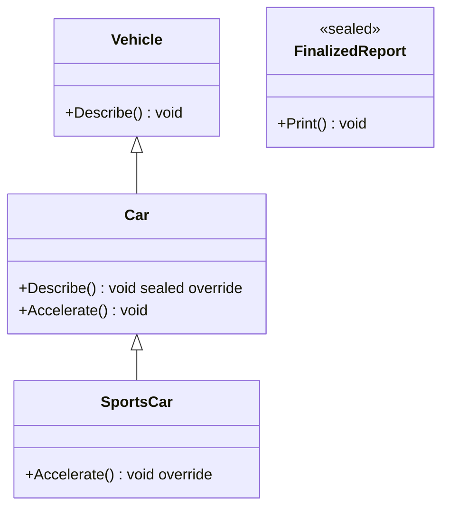
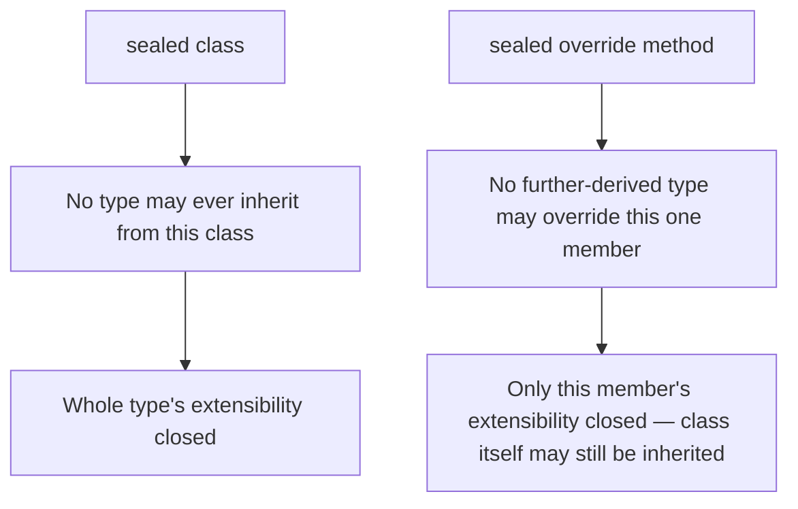

# Sealed Classes and Methods

## Introduction

Before reading this lesson, you should already be comfortable with **[Default Interface Methods and Static Abstract Members](../02-oop/02-16-default-interface-methods-static-abstract.md)**, where an interface's contract grew to include ready-made behavior and type-level requirements. This lesson swings the design pendulum the other way: `sealed` is how a class or an overridden method declares, on purpose, that its extensibility stops right here.

By the end of this lesson, you will be able to:

- Mark an entire class `sealed` so no type may ever derive from it
- Mark a single overridden method or property `sealed override` so no further-derived type may re-override it
- Explain the difference in scope between sealing a class and sealing one member
- Recognize the two real reasons to seal something: design intent and JIT performance
- Decide, for a given type, whether it should remain open for inheritance or be sealed

## Sealed Classes and Methods — A Layman's Perspective

Imagine buying an old house that came with the original architect's full blueprint. Most of the walls in that blueprint are drawn as ordinary partitions — the kind any future owner is free to knock out, move, or build an addition onto during a renovation. That is the normal, expected state of a house: open to change as new owners have new needs. But a handful of walls in the same blueprint carry a small stamp from the original architect: "structural — do not remove or alter." Those are the load-bearing walls, and tampering with them would not just change the room's shape, it would risk the whole house coming down. The architect isn't being difficult by stamping them that way; they are protecting a guarantee the entire design depends on.

Sealing an entire class is exactly like that architect stamping the *whole house* as final: "no extensions, no granny flats, no additions of any kind may ever be built onto this structure — full stop." Nobody gets to inherit from it and specialize it further, because the original designer has decided this particular design is complete and self-contained exactly as it stands, and any attempt to extend it would either be unsafe, unnecessary, or would undermine some guarantee — about immutability, about security, about a fixed calculation — that the type exists to provide.

There's a second, more surgical version of the same idea. Picture a contractor who fully renovates one wing of that same house, adding new rooms and rearranging almost everything — except for one particular wall, the one hiding the water heater and the gas lines. The contractor deliberately marks just that one wall "final — this exact wall stays exactly as installed, no matter who renovates this wing next," while leaving every other wall in the same wing open for the next renovation. The wing itself is still fully extensible; only that one, specific, safety-critical wall is locked down.

That is precisely the difference between the two forms `sealed` takes in C#. Sealing an entire class is the architect closing off the whole house to future extension. Sealing a single overridden method — `sealed override` — is the more surgical version: the class itself can still be inherited and extended in every ordinary way, but this one particular piece of behavior is locked in place for every generation of subclass that follows, because changing it would break a guarantee the rest of the design relies on.

## Sealed Classes and Methods — A Programming Language Perspective

The `sealed` modifier, applied to a class declaration (`sealed class Foo`), prevents any other type from deriving from it — `class Bar : Foo` becomes a compile-time error (CS0509). Applied to a member that is already overriding a virtual or abstract member from a base class (`sealed override`), it prevents any type further down the inheritance chain from overriding that same member again, while leaving the enclosing class itself perfectly able to be inherited and extended in every other respect. Both forms have existed in C# since version 1.0 — sealing is not a version-gated feature, and neither `record` nor `record struct` changes its mechanics, though it is worth noting a `record class` is **not** sealed by default (a common assumption that turns out to be wrong): it can be inherited by another record just like an ordinary class can be, unless you explicitly add `sealed` yourself. Beyond the design-intent reason to seal something, there is a genuine, measurable runtime benefit: because the JIT compiler knows with certainty that no override can exist for a sealed type or a sealed member, it can *devirtualize* the call — skip the virtual dispatch lookup entirely and, in many cases, inline the method body — something it cannot safely do for a member that remains overridable.

## How to Seal a Class or a Method in C#

Sealing a whole class means writing `sealed` directly before the `class` keyword; the class can still inherit from something else, it just cannot be inherited *from*. Sealing a single member means writing `sealed override` on a method or property that is already overriding a base class's virtual or abstract member — `sealed` cannot appear on a member unless `override` appears right alongside it, since there has to be something being overridden in the first place for sealing it to mean anything.


*Figure 1: `Car` seals `Describe()` so `SportsCar` cannot override it again; `FinalizedReport` is sealed entirely, so nothing may derive from it at all.*

```csharp
// Program.cs — .NET 10 / C# 14

Vehicle car = new Car();
car.Describe();

Vehicle sportsCarAsVehicle = new SportsCar();
sportsCarAsVehicle.Describe(); // still runs Car's sealed override — SportsCar never touched it

Car sportsCar = new SportsCar();
sportsCar.Accelerate();

var report = new FinalizedReport { Content = "Q3 Inventory Audit" };
report.Print();

class Vehicle
{
    public virtual void Describe() => Console.WriteLine("A generic vehicle.");
}

class Car : Vehicle
{
    // sealed override: no type derived from Car may override Describe() again.
    public sealed override void Describe() => Console.WriteLine("A car with four wheels.");
    public virtual void Accelerate() => Console.WriteLine("Accelerating steadily.");
}

class SportsCar : Car
{
    // Describe() cannot be re-overridden here — Car sealed it. Accelerate() can still be overridden.
    public override void Accelerate() => Console.WriteLine("Accelerating rapidly!");
}

// sealed on the whole class: no type may ever derive from FinalizedReport.
sealed class FinalizedReport
{
    public string Content { get; init; } = "";
    public void Print() => Console.WriteLine($"Report: {Content}");
}

// The following would fail to compile if uncommented, because FinalizedReport is sealed:
// class ExtendedReport : FinalizedReport { }
```

**Console Output:**

```text
A car with four wheels.
A car with four wheels.
Accelerating rapidly!
Report: Q3 Inventory Audit
```

Notice the second line: even called through a `Vehicle`-typed reference to a `SportsCar` instance, `Describe()` still prints `Car`'s message, because `SportsCar` was never allowed to override it — sealing didn't disable virtual dispatch, it just closed off one more layer of it. `Accelerate()`, left un-sealed on `Car`, was freely overridden by `SportsCar` and behaves normally. `FinalizedReport` demonstrates the whole-class form: it works exactly like any other class from the outside, it simply cannot be a base class for anything else.

## Real-Time Example: Sealed Classes and Methods in Library/Inventory Management

We extend the Library/Inventory Management case study with a small hierarchy of loanable items. `LoanableItem` is an abstract base with an abstract `CalculateLateFee` method. `Book` overrides that method with the library's statutory daily late-fee formula — a legal requirement, not a design preference — and seals it, so that no more specialized subclass can quietly alter how a book's late fee is computed. `RareEditionBook`, a special, high-value tier of book, inherits that sealed formula unchanged and is itself declared `sealed`, since the cataloging team decided this is the most specialized tier the hierarchy will ever need. `DigitalAudiobook`, by contrast, overrides the same method without sealing it, because digital late-fee policy is still actively evolving.

```csharp
// Program.cs — .NET 10 / C# 14 — Real-Time Example
// Library/Inventory Management case study: Book seals its statutory late-fee
// formula so no further subclass can alter it, while DigitalAudiobook leaves
// its own override open for future policy changes.

List<LoanableItem> loans =
[
    new Book("Clean Code", new DateOnly(2026, 8, 1)),
    new RareEditionBook("First Folio Facsimile", new DateOnly(2026, 8, 1), insuredValue: 15000m),
    new DigitalAudiobook("Sapiens (Audiobook)", new DateOnly(2026, 8, 1)),
];

DateOnly today = new(2026, 8, 16);

foreach (LoanableItem item in loans)
{
    decimal fee = item.CalculateLateFee(today);
    Console.WriteLine($"{item.Title}: late fee = {fee:C}");
}

abstract class LoanableItem
{
    public string Title { get; }
    public DateOnly DueDate { get; }

    protected LoanableItem(string title, DateOnly dueDate)
    {
        Title = title;
        DueDate = dueDate;
    }

    public abstract decimal CalculateLateFee(DateOnly returnedOn);
}

class Book : LoanableItem
{
    private const decimal DailyStatutoryRate = 0.25m;

    public Book(string title, DateOnly dueDate) : base(title, dueDate) { }

    // Sealed by policy: the statutory daily late-fee formula for books must
    // never be altered by a further subclass, even a specialized one.
    public sealed override decimal CalculateLateFee(DateOnly returnedOn)
    {
        int daysLate = Math.Max(0, returnedOn.DayNumber - DueDate.DayNumber);
        return daysLate * DailyStatutoryRate;
    }
}

sealed class RareEditionBook : Book
{
    public decimal InsuredValue { get; }

    public RareEditionBook(string title, DateOnly dueDate, decimal insuredValue) : base(title, dueDate)
    {
        InsuredValue = insuredValue;
    }
    // CalculateLateFee cannot be overridden here — Book sealed it. This class
    // is itself sealed too: the catalog team decided nothing specializes it further.
}

class DigitalAudiobook : LoanableItem
{
    public DigitalAudiobook(string title, DateOnly dueDate) : base(title, dueDate) { }

    // Not sealed — digital late-fee policy (grace periods, per-format rules) is still evolving.
    public override decimal CalculateLateFee(DateOnly returnedOn) => 0m;
}
```

**Console Output:**

```text
Clean Code: late fee = $3.75
First Folio Facsimile: late fee = $3.75
Sapiens (Audiobook): late fee = $0.00
```

`RareEditionBook` never writes its own late-fee logic at all — it inherits `Book`'s sealed formula exactly as written, which is precisely the point: a $15,000 insured facsimile and an ordinary paperback are billed by the same statutory rule, and no future developer can accidentally (or deliberately) give the rare-edition tier a quieter, different formula. `DigitalAudiobook`, left un-sealed, currently charges nothing, but a future policy update could freely override it again without touching anything else in the hierarchy.

## Sealing a Class vs Sealing a Method (Override)

Sealing a whole class and sealing a single overridden method both use the same keyword, but they close off extensibility at very different scopes. `sealed class` is a blanket decision about the entire type: nothing may ever inherit from it, full stop — appropriate for types meant to be complete and self-contained, like value-like wrapper types, security-sensitive types, or anything whose invariants would be unsafe to specialize. `sealed override`, by contrast, is a single, targeted decision about one member: the class remains just as inheritable as before, only this one already-overridden behavior is locked in place for every subclass that follows. Both forms also unlock the same JIT benefit — devirtualized, potentially inlined calls — but that benefit only ever applies to the sealed surface itself, not to anything else in the type.


*Figure 2: Sealing a class closes off the whole type; sealing an override closes off one member while the class stays inheritable.*

| Aspect | `sealed class` | `sealed override` (method/property) |
|---|---|---|
| Applies to | The entire type | One specific overridden member |
| Can the type still be inherited? | No — blocked entirely | Yes — other members remain overridable |
| Requires | Nothing else — just `sealed class X` | Must already be an `override` of a virtual/abstract member |
| Typical motivation | Lock down a whole design (value-like types, security-sensitive types) | Lock down one rule (e.g., a statutory calculation) while leaving the rest open |
| Performance angle | JIT can devirtualize/inline any call through this type | JIT can devirtualize calls to this specific member only |

## Types of Restriction Sealed Interacts With

`sealed` sits alongside several other inheritance and extensibility mechanisms covered elsewhere in this module:

1. **[Method Overriding](../02-oop/02-12-method-overriding.md)** — the `virtual`/`override` mechanics that `sealed override` builds directly on top of.
2. **[Abstract Classes and Methods](../02-oop/02-14-abstract-classes-and-methods.md)** — the opposite end of the spectrum: types and members that *require* further implementation rather than forbidding it.
3. **[Inheritance — The Third Pillar of OOP](../02-oop/02-11-inheritance-pillar-of-oop.md)** — the base mechanism `sealed` deliberately shuts off.
4. **[Polymorphism — The Fourth Pillar of OOP](../02-oop/02-13-polymorphism-pillar-of-oop.md)** — why virtual dispatch still applies right up to the point a member is sealed.
5. **[Records in C#](../02-oop/02-19-records-in-csharp.md)** — where a `record` is left open for inheritance by default, and you may want to add `sealed` yourself.
6. **[The `object` Class and Common Overrides](../02-oop/02-18-object-class-and-common-overrides.md)** — the next lesson, where you'll override members every type inherits, sealed or not.

## What You've Learned & What's Next

Sealing a class closes off inheritance for the entire type; sealing a single overridden method closes off just that one member while leaving the rest of the class open — both are deliberate design decisions, not restrictions imposed by the language, and both let the JIT skip virtual dispatch for a small, real performance win. Use `sealed` when a design is genuinely meant to be final, not as a default habit.

Continue your learning journey with **[The `object` Class and Common Overrides](../02-oop/02-18-object-class-and-common-overrides.md)**, where you'll see the members every C# type — sealed or not — inherits from `object` itself, and why overriding three of them together matters.

---
*Applies to: .NET 10 / C# 14. Last reviewed 2026-08-16.*
