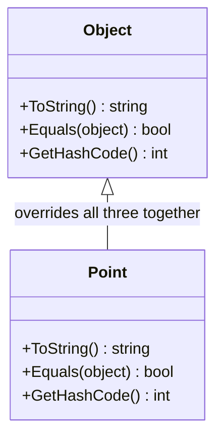
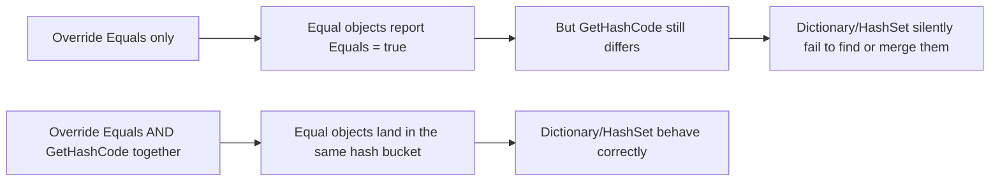

# The object Class and Common Overrides

## Introduction

Before reading this lesson, you should already be comfortable with **[Sealed Classes and Methods](../02-oop/02-17-sealed-classes-and-methods.md)**, where you saw how to close off a type's extensibility on purpose. This lesson looks at the one class every type is already extending whether it says so or not: `System.Object`. Every class, struct, and record in C# ultimately derives from it, inheriting three virtual members whose defaults are rarely what a real type actually needs.

By the end of this lesson, you will be able to:

- Explain why every C# type, without exception, derives from `object`
- Override `ToString()` to produce a meaningful, type-specific description
- Override `Equals(object)` to define logical rather than reference equality
- Override `GetHashCode()` so it stays consistent with a custom `Equals`
- Explain why these last two overrides must always be changed together, never one alone

## The object Class and Common Overrides — A Layman's Perspective

Every citizen born in a country automatically receives a basic government file, whether or not anyone asked for one — a bare-bones record that comes with three default capabilities built in, at no extra effort: a way to describe yourself in one line if someone asks, a way to check whether two file folders belong to the very same physical person, and a filing number that lets a records clerk quickly find your folder in a giant cabinet without searching every drawer by hand.

For most people, the government's default answers to those three questions are barely useful. Asked to "describe yourself in one line," the default answer is just your bureaucratic category — "Citizen" — not your actual name. Asked "is this the same person," the default check only answers "are these literally, physically, the exact same body," which says nothing about whether two separate paper files happen to describe two identical twins who share every recorded detail. And the filing number that's supposed to help a clerk find your folder quickly is just assigned based on wherever your file happens to sit in the cabinet — it has no connection to anything meaningful about you at all.

So people, and especially businesses, customize all three. A company replaces "Citizen" with something actually useful printed on a business card: "Ada Lovelace, Senior Engineer." A customer-loyalty department redefines "same person" to mean "same loyalty account number," not "same physical body," so two lookups pointing at the same account are recognized as identical even when they arrived as two separate paper copies. But here is the part that trips nearly everyone up at least once: the moment you change how "same person" gets decided, you absolutely must also update the filing number to match. If two files are now considered "the same account" under your new rule, but they still carry two different, unrelated filing numbers, the clerk's filing cabinet — which relies entirely on that number to know which drawer to search — will file them in two different drawers and can never again find them together, even though your own rule insists they're identical.

Every C# type is that citizen. It automatically inherits three default capabilities from `object` — a way to describe itself, a way to check sameness, and a filing number used by fast lookup systems — and while the defaults technically work, they rarely say anything meaningful about your specific type. Overriding just one of the last two, without the other, breaks exactly the filing-cabinet guarantee real programs depend on.

## The object Class and Common Overrides — A Programming Language Perspective

`System.Object` sits at the root of the .NET type hierarchy: every `class` derives from it directly or indirectly, and every `struct` derives from it too, by way of `System.ValueType`, even though value types only pay the cost of that inheritance when boxed. Three of `object`'s virtual members are overridden almost universally. `ToString()` returns a display string; its default implementation on a class simply returns the fully qualified type name, which is rarely useful in a log message or debugger watch window. `Equals(object? obj)` determines logical equality; the default for a reference type compares memory addresses (reference equality — are these two variables pointing at the exact same object), while the default for a struct performs a slow, reflection-based, field-by-field comparison. `GetHashCode()` returns an `int` that hash-based collections such as `Dictionary<TKey,TValue>` and `HashSet<T>` use to bucket objects for near-constant-time lookup. The contract binding the last two together is strict and one-directional: two objects that are `Equals` **must** return the same hash code, though two objects with the same hash code are not required to be `Equals` (a hash collision is allowed and expected occasionally). Violating that contract doesn't throw an exception — it silently corrupts the behavior of every hash-based collection the type is used in.

## How to Override ToString, Equals, and GetHashCode in C#

Overriding these three members follows the same pattern every time: mark each with the `override` keyword, since all three are declared `virtual` on `object`. `ToString()` simply returns whatever string best represents the instance. `Equals(object? obj)` should type-check its argument with an `is` pattern before comparing the fields that define equality for this type. `GetHashCode()` should combine exactly the same fields `Equals` compares — the built-in `HashCode.Combine` helper does this correctly and efficiently, without you having to hand-roll a hashing algorithm.


*Figure 1: Every type inherits `ToString`, `Equals`, and `GetHashCode` from `object`; `Point` overrides all three consistently.*

```csharp
// Program.cs — .NET 10 / C# 14

var p1 = new Point(3, 4);
var p2 = new Point(3, 4);
var p3 = new Point(5, 5);

Console.WriteLine(p1);
Console.WriteLine(p1.Equals(p2));
Console.WriteLine(p1.Equals(p3));
Console.WriteLine(p1.GetHashCode() == p2.GetHashCode());

var lookup = new HashSet<Point> { p1 };
Console.WriteLine(lookup.Contains(p2));

class Point
{
    public int X { get; }
    public int Y { get; }

    public Point(int x, int y)
    {
        X = x;
        Y = y;
    }

    public override string ToString() => $"({X}, {Y})";

    public override bool Equals(object? obj) =>
        obj is Point other && X == other.X && Y == other.Y;

    public override int GetHashCode() => HashCode.Combine(X, Y);
}
```

**Console Output:**

```text
(3, 4)
True
False
True
True
```

`Console.WriteLine(p1)` implicitly calls `p1.ToString()`, printing `(3, 4)` instead of the useless default type name. `p1.Equals(p2)` is `true` even though `p1` and `p2` are two separate objects in memory, because `Equals` now compares `X` and `Y` instead of memory addresses. Crucially, `p1.GetHashCode() == p2.GetHashCode()` is also `true` — which is exactly why `lookup.Contains(p2)` correctly finds `p1` in the `HashSet<Point>`: the set hashes `p2` to the same bucket `p1` already lives in, then confirms the match with `Equals`.

## Real-Time Example: The object Class and Common Overrides in E-Commerce Order Processing

We extend the E-Commerce Order Processing case study with a barcode-scanning scenario at checkout. Each scan produces a new `CartItem` instance, even when the same physical product is scanned more than once. Overriding `ToString`, `Equals`, and `GetHashCode` on `CartItem` — keyed by SKU — lets a `Dictionary<CartItem, int>` correctly recognize repeated scans of the same product as the same key and simply increment a quantity, instead of silently tracking three unrelated line items.

```csharp
// Program.cs — .NET 10 / C# 14 — Real-Time Example
// E-Commerce Order Processing case study: overriding ToString, Equals, and
// GetHashCode on CartItem lets repeated barcode scans of the same SKU be
// recognized and merged automatically using a Dictionary keyed by CartItem.

List<CartItem> scans =
[
    new CartItem("SKU-1001", "Wireless Mouse", 24.99m),
    new CartItem("SKU-1002", "Mechanical Keyboard", 89.00m),
    new CartItem("SKU-1001", "Wireless Mouse", 24.99m), // scanned again — same product
    new CartItem("SKU-1001", "Wireless Mouse", 24.99m), // scanned a third time
];

var quantities = new Dictionary<CartItem, int>();

foreach (CartItem scan in scans)
{
    quantities[scan] = quantities.GetValueOrDefault(scan) + 1;
}

foreach (var (item, quantity) in quantities.OrderBy(entry => entry.Key.Sku))
{
    decimal lineTotal = item.UnitPrice * quantity;
    Console.WriteLine($"{item} x{quantity} = {lineTotal:C}");
}

class CartItem
{
    public string Sku { get; }
    public string Name { get; }
    public decimal UnitPrice { get; }

    public CartItem(string sku, string name, decimal unitPrice)
    {
        Sku = sku;
        Name = name;
        UnitPrice = unitPrice;
    }

    public override string ToString() => $"{Name} ({Sku})";

    public override bool Equals(object? obj) =>
        obj is CartItem other && Sku == other.Sku;

    public override int GetHashCode() => Sku.GetHashCode();
}
```

**Console Output:**

```text
Wireless Mouse (SKU-1001) x3 = $74.97
Mechanical Keyboard (SKU-1002) x1 = $89.00
```

Three separate `CartItem` objects were created for `SKU-1001`, but the dictionary only ever holds one entry for it, because `Equals` and `GetHashCode` agree on what "the same product" means. If `GetHashCode` had been left at its default — identity-based, unrelated to `Sku` — the second and third scans would land in different hash buckets than the first, and `quantities.GetValueOrDefault(scan)` would never find the earlier entry: the cart would silently show the same mouse as three separate rows of quantity 1 instead of one row of quantity 3. That is the exact, easy-to-miss bug this lesson's contract exists to prevent.

## Reference Equality vs Value Equality (Why Overriding All Three Together Matters)

Every class starts out using `object`'s default `Equals`, which checks reference equality — whether two variables point at the exact same block of memory — paired with a default `GetHashCode` that has nothing to do with the object's field values but is, at least, internally consistent with that default `Equals`. The moment you override `Equals` alone to compare field values instead of memory addresses, you've broken that internal consistency: two objects your new `Equals` calls identical can still produce two different hash codes, because `GetHashCode` never heard about the change. Hash-based collections trust the contract completely and never re-check it, so the failure is silent — no exception, no warning, just a `Dictionary` or `HashSet` that quietly can't find entries it should be able to find. The fix is not "remember to be careful"; it's to always override `Equals` and `GetHashCode` in the same edit, deriving the hash from precisely the same fields the equality check uses.


*Figure 2: Overriding `Equals` without `GetHashCode` breaks the contract hash-based collections depend on.*

| Aspect | Default (`object`) | Overridden |
|---|---|---|
| `ToString()` | Fully qualified type name | A meaningful, type-specific description |
| `Equals(object)` | Reference equality (classes) — same memory location | Value/logical equality — same meaningful data |
| `GetHashCode()` | Identity-based, unrelated to field values | Derived from the same fields `Equals` compares |
| Contract | N/A | Equal objects **must** return equal hash codes |
| Risk if overridden inconsistently | N/A | Silent, hard-to-diagnose bugs in `Dictionary`/`HashSet` |

## Types of Members and Types That Build on object's Overrides

Overriding `ToString`, `Equals`, and `GetHashCode` is foundational to several features covered later in this curriculum:

1. **[Equality: `Equals`, `==`, and `IEquatable<T>`](../02-oop/02-33-equality-equals-iequatable.md)** — a deeper look at equality, including why implementing `IEquatable<T>` alongside `Equals(object)` avoids unnecessary boxing.
2. **[Records in C# (`record class`)](../02-oop/02-19-records-in-csharp.md)** — the next lesson, where the compiler generates correct, consistent overrides of all three members for you.
3. **[`record struct` and Value-Based Records](../02-oop/02-20-record-struct-value-based-records.md)** — the same generated behavior, applied to a value type.
4. **[Operator Overloading in Depth](../02-oop/02-05-operator-overloading-in-depth.md)** — overloading `==` and `!=` alongside `Equals` so both stay consistent with each other.
5. **[`IComparable<T>` and `IComparer<T>`](../03-collections-generics/03-20-icomparable-and-icomparer.md)** — ordering two instances, a related but distinct question from whether they're equal.
6. **[`Dictionary<TKey,TValue>` in Depth](../03-collections-generics/03-05-dictionary-in-depth.md)** — the collection whose correctness depends most directly on the `Equals`/`GetHashCode` contract you just learned.

## What You've Learned & What's Next

Every C# type inherits `ToString`, `Equals`, and `GetHashCode` from `object`, and the defaults are rarely what a real type needs: a meaningless type name, reference equality instead of logical equality, and a hash code disconnected from your data. Override `ToString` freely on its own, but treat `Equals` and `GetHashCode` as a single, inseparable pair — changing how equality is decided always means updating the hash code the same way, in the same change.

Continue your learning journey with **[Records in C# (`record class`)](../02-oop/02-19-records-in-csharp.md)**, where you'll see the compiler generate all three of these overrides correctly and consistently for you, as part of a modern, immutable-by-default type.

---
*Applies to: .NET 10 / C# 14. Last reviewed 2026-08-16.*
