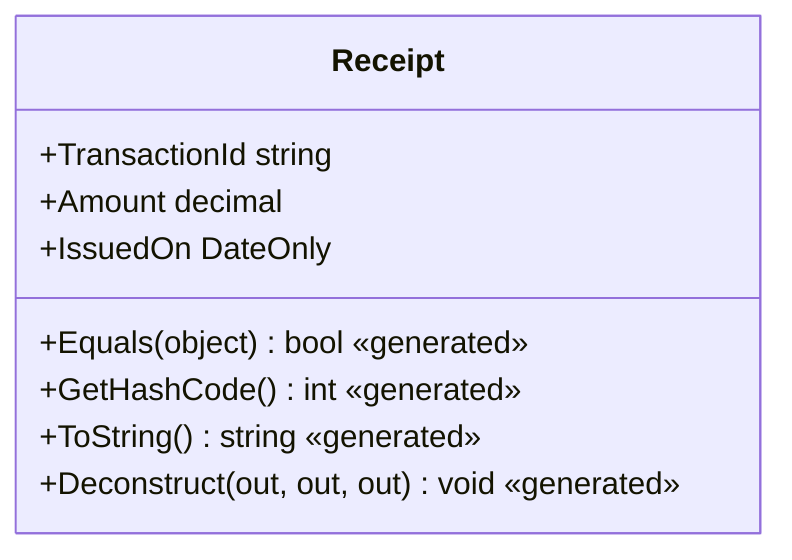
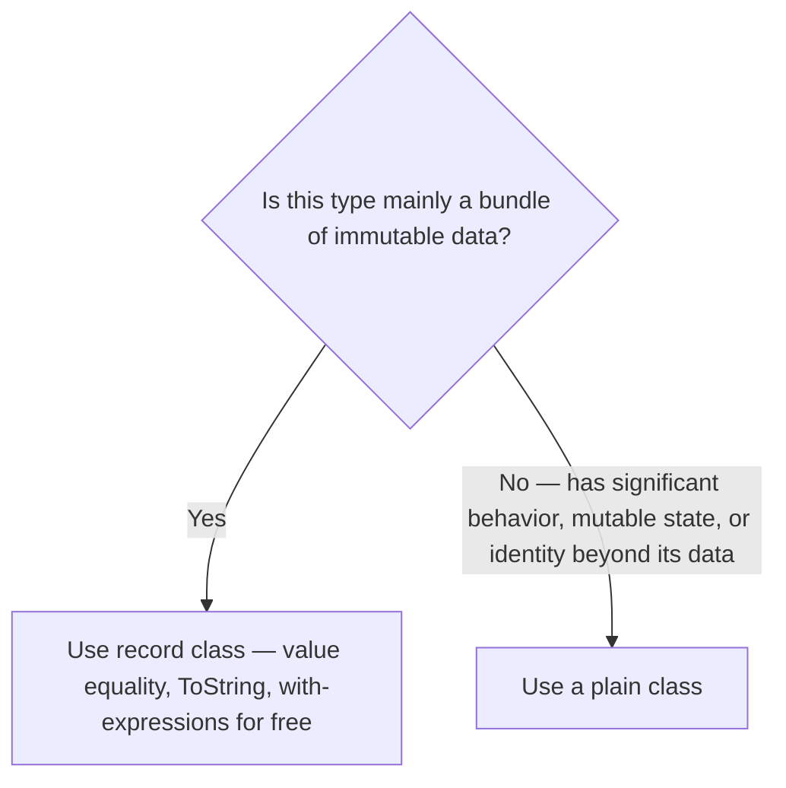

# Records in C# (record class)

## Introduction

Before reading this lesson, you should already be comfortable with **[The object Class and Common Overrides](../02-oop/02-18-object-class-and-common-overrides.md)** — hand-writing `ToString`, `Equals`, and `GetHashCode` overrides, and the contract that binds the last two together. This lesson introduces `record`, a class declaration form that generates correct, consistent versions of all three for you automatically, plus a non-destructive way to "change" one and produce a copy without ever mutating the original.

By the end of this lesson, you will be able to:

- Declare a `record class` using both positional and body syntax
- Explain which members the compiler synthesizes automatically for a record
- Use a `with` expression to produce a modified copy without mutating the original
- Compare two records with `==` and get correct value-based equality by default
- Decide when a record, rather than a plain class, is the right default for a type

## Records in C# — A Layman's Perspective

Imagine a bank issues you a small printed receipt after every transaction — a slip listing the date, the amount, and the account number. That receipt is deliberately never designed to be edited by hand afterward: if you scratch out the printed amount and write in a new number, the receipt stops being authoritative, because a financial receipt's entire value depends on nobody being able to alter it once it's printed. If the bank made an error and needs to correct it, the right process was never to grab a pen — it's to issue a brand-new receipt, a fresh printout that copies every line from the original except the one detail that changed, referencing which earlier receipt it replaces.

Most receipt-printing systems also work from a fill-in template. Instead of a blank sheet where a teller writes out "Date:", "Amount:", "Account:" by hand every single time, the template already has three numbered blanks in a fixed order, and filling one out is as fast as reading off three values in sequence — nobody re-labels each blank every time a new receipt gets printed.

There's also a matching question worth asking: if two customers each hold a receipt, and both slips show the exact same date, amount, and account number, are they "the same receipt"? For all practical purposes, yes — as far as the bank's records are concerned, two receipts with identical printed details represent the same transaction, even though they're two separate pieces of paper sitting in two different pockets. Nobody cares which physical slip you happen to be holding; what matters is what's printed on it.

C# records are built for exactly this shape of data: values that should never be edited in place, that get "corrected" by producing an entirely new copy with one detail changed rather than mutating the original, and that are considered equal whenever their printed contents match — regardless of whether they are, technically, two separate objects sitting in two different corners of memory.

## Records in C# — A Programming Language Perspective

A **`record class`** (or simply `record` — the two keywords are interchangeable for a reference type) is a class declaration form, introduced in C# 9, that instructs the compiler to synthesize a set of members automatically: a value-based `Equals(object?)` and `GetHashCode()` that compare every public property rather than reference identity, an `==`/`!=` operator pair wired to that same equality, an overridden `ToString()` that prints the type name and every property, a `Deconstruct` method, and a hidden copy constructor that a `with` expression calls to produce a modified clone. Writing `record Receipt(string TransactionId, decimal Amount)` — **positional syntax** — declares `init`-only properties for each parameter in one line, in addition to everything above; the properties are `init`, not `get; set;`, meaning they can be set during construction (or via `with`) but never reassigned afterward. Records remain reference types unless declared `record struct`, and, unlike an ordinary class, a record class supports inheritance from another record through a generated `EqualityContract` property that keeps equality correct even across a hierarchy.

## How to Declare and Use record class in C#

Positional syntax — `record Receipt(string TransactionId, decimal Amount, DateOnly IssuedOn);` — is the fastest way to declare a record whose entire purpose is holding a fixed set of values; the parameter list becomes both the constructor signature and the set of `init`-only properties in a single line. Two records compare equal with `==` whenever every property matches, without writing a single line of equality code. A `with` expression — `original with { Amount = 275.00m }` — copies every property from the source record except the ones explicitly listed, producing a brand-new instance and leaving the original completely untouched.


*Figure 1: Declaring `record Receipt(...)` synthesizes value-based `Equals`, `GetHashCode`, `ToString`, and `Deconstruct` automatically.*

```csharp
// Program.cs — .NET 10 / C# 14

var receipt1 = new Receipt("TXN-001", 250.00m, new DateOnly(2026, 8, 16));
var receipt2 = new Receipt("TXN-001", 250.00m, new DateOnly(2026, 8, 16));

Console.WriteLine(receipt1);
Console.WriteLine(receipt1 == receipt2);
Console.WriteLine(receipt1.Equals(receipt2));

Receipt corrected = receipt1 with { Amount = 275.00m };
Console.WriteLine(corrected);
Console.WriteLine(receipt1 == corrected);

record Receipt(string TransactionId, decimal Amount, DateOnly IssuedOn);
```

**Console Output:**

```text
Receipt { TransactionId = TXN-001, Amount = 250.00, IssuedOn = 8/16/2026 }
True
True
Receipt { TransactionId = TXN-001, Amount = 275.00, IssuedOn = 8/16/2026 }
False
```

`Console.WriteLine(receipt1)` prints every property without a single hand-written line of `ToString` code. `receipt1 == receipt2` is `true` even though they are two separate objects, because record equality compares values, not memory addresses. `corrected` is a completely new `Receipt`, produced by the `with` expression — `receipt1` itself is never touched, which is why `receipt1 == corrected` correctly reports `false`: only `Amount` differs, but that's enough for value equality to say they're not the same.

## Real-Time Example: Records in C# in Banking/ATM

We add `TransactionReceipt` to the Banking/ATM case study, alongside the `CheckingAccount` and `PremiumSavingsAccount` classes from earlier lessons. Once an ATM issues a receipt, it is never edited — a reversal is issued as a brand-new receipt via a `with` expression, and value equality lets the terminal recognize a request it has already processed, even if the underlying network call timed out and the terminal automatically retried the same withdrawal.

```csharp
// Program.cs — .NET 10 / C# 14 — Real-Time Example
// Banking/ATM case study: TransactionReceipt is a record — once issued, a
// receipt is never mutated. A reversal produces a brand-new receipt via a
// `with` expression, and value equality lets the ATM detect a duplicate
// withdrawal request retried after a network timeout.

var original = new TransactionReceipt("TXN-8841", "CHK-100", -200.00m, new DateOnly(2026, 8, 16));
Console.WriteLine($"Issued:   {original}");

// The ATM's network call timed out and the terminal retried automatically.
var retry = new TransactionReceipt("TXN-8841", "CHK-100", -200.00m, new DateOnly(2026, 8, 16));

if (original == retry)
{
    Console.WriteLine("Duplicate request detected — original receipt already on file, ignoring retry.");
}

// The teller reverses the withdrawal: a new receipt, not an edit to the original.
TransactionReceipt reversal = original with { Amount = -original.Amount, TransactionId = "TXN-8842" };
Console.WriteLine($"Reversal: {reversal}");

Console.WriteLine($"Same account on both receipts: {original.AccountNumber == reversal.AccountNumber}");

record TransactionReceipt(string TransactionId, string AccountNumber, decimal Amount, DateOnly IssuedOn);
```

**Console Output:**

```text
Issued:   TransactionReceipt { TransactionId = TXN-8841, AccountNumber = CHK-100, Amount = -200.00, IssuedOn = 8/16/2026 }
Duplicate request detected — original receipt already on file, ignoring retry.
Reversal: TransactionReceipt { TransactionId = TXN-8842, AccountNumber = CHK-100, Amount = 200.00, IssuedOn = 8/16/2026 }
Same account on both receipts: True
```

The retried request is caught with a single `==` comparison — no manual field-by-field check was ever written. The reversal keeps `AccountNumber` and `IssuedOn` completely untouched and only changes `TransactionId` and the sign of `Amount`, and it does so by producing a second, independent `TransactionReceipt`, never by mutating `original`. In a real ATM or ledger system, that immutability is not a style preference — it's what makes the audit trail trustworthy: every receipt that was ever issued is still exactly as it was issued, forever.

## record class vs Plain class — Which Should Be Your Default?

A plain `class` gives you reference equality and a useless default `ToString` unless you override them yourself, and it mutates in place through ordinary property setters — appropriate for types with real behavior, mutable internal state, or an identity that matters independently of their data (a `CheckingAccount` object is still "the same account" even after its balance changes). A `record class` flips the default the other way: value equality, a readable `ToString`, and non-destructive `with`-based mutation all come for free, which fits data that exists to represent a fixed value at a point in time — a DTO, an event payload, a receipt, a snapshot — far better than a mutable class ever would. Neither is "correct" universally; the decision is about whether the type's identity lives in its data (use a record) or in something beyond its data (use a class).


*Figure 2: Whether a type's identity lives in its data, or beyond it, decides between a record and a plain class.*

| Aspect | Plain `class` | `record class` |
|---|---|---|
| Equality | Reference (identity), unless overridden | Value-based, generated automatically |
| `ToString()` | Type name, unless overridden | Auto-generated, prints all properties |
| Mutation | In place, via ordinary setters | Non-destructive, via `with` expressions (properties are typically `init`) |
| Declaration | Full body required | Positional syntax available: `record Name(...)` |
| Best suited for | Behavior-heavy types, mutable entities, identity-based objects | Immutable DTOs, value-like domain data, message/event payloads |

## Types of Records and Related Immutability Features

Records connect directly to several other immutability- and equality-focused topics covered in this module:

1. **[`record struct` and Value-Based Records](../02-oop/02-20-record-struct-value-based-records.md)** — the next lesson, applying this same generated behavior to a value type instead of a reference type.
2. **[`required` Members and Object Initializers](../02-oop/02-22-required-members-object-initializers.md)** — an alternative (or complement) to positional records for mandatory properties.
3. **[Immutability in C# (records, `readonly`, `init`)](../02-oop/02-31-immutability-in-csharp.md)** — the broader set of tools records draw on.
4. **[`init`-Only Setters](../02-oop/02-32-init-only-setters.md)** — the exact mechanism behind a positional record's generated properties.
5. **[Equality: `Equals`, `==`, and `IEquatable<T>`](../02-oop/02-33-equality-equals-iequatable.md)** — how the value equality records generate for free is actually implemented under the hood.
6. **[Tuples, Deconstruction, and Pattern Matching](../01-fundamentals/01-25-tuples-deconstruction-pattern-matching.md)** — where a record's auto-generated `Deconstruct` method was already put to use before this lesson formally introduced records.

## What You've Learned & What's Next

`record class` gives you value-based equality, a readable `ToString`, and a generated `Deconstruct` without writing any of it by hand, and its `with` expression lets you produce a modified copy while leaving the original completely untouched — making it the natural default for immutable DTOs, receipts, and event-shaped data, wherever a plain class's reference equality and in-place mutation aren't what the type actually needs.

Continue your learning journey with **[`record struct` and Value-Based Records](../02-oop/02-20-record-struct-value-based-records.md)**, where this same generated behavior gets applied to a value type instead of a reference type.

---
*Applies to: .NET 10 / C# 14. Last reviewed 2026-08-16.*
