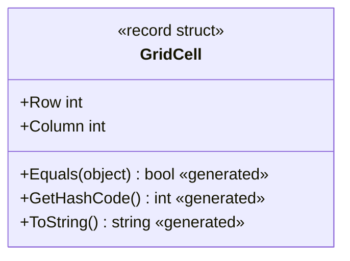
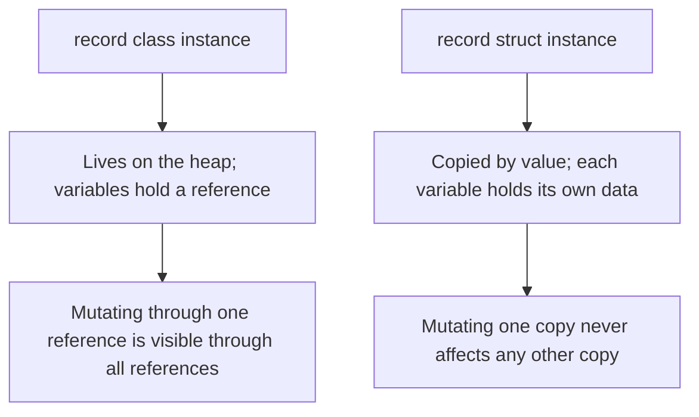

# record struct and Value-Based Records

## Introduction

Before reading this lesson, you should already be comfortable with **[Records in C# (record class)](../02-oop/02-19-records-in-csharp.md)** — value-based equality, an auto-generated `ToString`, and non-destructive mutation through `with` expressions, all synthesized for a reference type. This lesson applies that same generated behavior to a value type: `record struct`, and its fully locked-down sibling, `readonly record struct`.

By the end of this lesson, you will be able to:

- Declare a `record struct` using positional syntax
- Explain why a `record struct`'s properties are mutable by default, unlike a `record class`'s
- Add `readonly` to a `record struct` to make it fully, compiler-enforced immutable
- Use a `with` expression on a `record struct` to produce an independent, modified copy
- Decide when a small value-based type should be a `record struct` rather than a `record class`

## record struct — A Layman's Perspective

Old library card catalogs used small, fixed-size index cards, each holding the same three blanks in the same three spots: a call number, a title, and a shelf location. Because the cards were so small and so standardized, a librarian never treated "the original card back at the front desk" as more special or more authoritative than an identical duplicate printed for a colleague working at a different desk. A duplicate is just as valid as any other copy — there's nothing to "reference back to," because the whole card, all three blanks worth, fits comfortably into a single small object that can simply be reprinted wherever it's needed, rather than shared and looked up.

Catalogers also settled on a simple rule for deciding whether two of these cards describe "the same entry": compare what's printed on them. If two cards show the same call number, title, and shelf location, they're treated as identical for cataloging purposes — nobody checks whether they're literally the same physical scrap of cardstock; what's printed is what matters.

When a book gets reshelved, a careful librarian never scratches out the old shelf location and pencils in the new one on the same card. A fresh card gets printed instead — same call number, same title, just the shelf location updated — and the old card gets pulled and archived. And some of these cards, kept behind the reference desk as the master record everyone else's copies get checked against, are stamped in red ink: "Master copy — do not alter, under any circumstances, not even temporarily." That stamp isn't a polite request; the entire point of a reference-desk master card is that it can be trusted to never have been touched, not even briefly, by anyone.

A `record struct` in C# is that small, standardized index card: a value type, copied wholesale rather than referenced, compared for equality by what it contains rather than by which physical copy you happen to be holding, and correctable by printing a fresh copy via a `with` expression rather than editing in place. A `readonly record struct` is the reference-desk master copy — guaranteed by the compiler itself to never be mutated, not even temporarily, from the moment it's created.

## record struct — A Programming Language Perspective

**`record struct`**, introduced in C# 10, applies the same compiler-synthesized members an ordinary record gets — value-based `Equals`/`GetHashCode` comparing every field, a generated `ToString`, a `Deconstruct` method, and `with`-expression support — to a `struct` instead of a `class`. Because it is a value type, an instance is copied by value on every assignment and every parameter pass, rather than referenced, and it derives from `System.ValueType`; structs cannot be inherited from at all in C#, so unlike `record class`, there is no inheritance story to consider. One default is easy to miss and worth stating plainly: a `record struct`'s positional properties are **mutable** (`{ get; set; }`) by default, the opposite of a positional `record class`'s `init`-only properties. Adding the `readonly` modifier to the declaration — **`readonly record struct`** — makes every generated property read-only and the struct itself fully immutable, matching a `record class`'s default immutability while additionally letting the runtime skip the defensive copying it otherwise performs whenever it can't prove a struct won't be mutated through a `readonly` reference.

## How to Declare a record struct in C#

Positional syntax works identically to a positional `record class`: `record struct GridCell(int Row, int Column);` declares both the constructor and the generated properties in one line. The difference to remember is mutability — without `readonly`, the generated properties can be reassigned after construction, and a `with` expression still works exactly as it does on a `record class`, producing a fresh, independent copy rather than touching the original.


*Figure 1: `record struct GridCell` synthesizes the same value-equality members as a record class, but `Row` and `Column` remain independently mutable on each copy.*

```csharp
// Program.cs — .NET 10 / C# 14

var p1 = new GridCell(3, 4);
var p2 = new GridCell(3, 4);

Console.WriteLine(p1);
Console.WriteLine(p1 == p2);

GridCell moved = p1 with { Row = 5 };
Console.WriteLine(moved);

p1.Row = 10; // allowed — record struct properties are mutable by default
Console.WriteLine(p1);

record struct GridCell(int Row, int Column);
```

**Console Output:**

```text
GridCell { Row = 3, Column = 4 }
True
GridCell { Row = 5, Column = 4 }
GridCell { Row = 10, Column = 4 }
```

`p1 == p2` is `true` even though they're two separate value-type instances, for the same reason a `record class` compares equal by value. `moved` is an entirely independent copy produced by the `with` expression — changing it never touches `p1`. But the last two lines show the difference from a `record class`: `p1.Row = 10` compiles and mutates `p1` directly, because a plain `record struct`'s positional properties are settable, not `init`-only. Adding `readonly` before `record struct` would turn that same line into a compile error.

## Real-Time Example: record struct and Value-Based Records in Library/Inventory Management

We extend the Library/Inventory Management case study with `BookCopyId`, a `readonly record struct` identifying one physical copy of a book by ISBN and copy number. As a small, fully immutable value type, it is safe and cheap to use as a `Dictionary` key — no heap allocation, no risk of it being mutated after being used as a key, and value-based equality so two `BookCopyId` values describing the same copy are always recognized as the same key.

```csharp
// Program.cs — .NET 10 / C# 14 — Real-Time Example
// Library/Inventory Management case study: BookCopyId is a readonly record
// struct — a small, fully immutable value type identifying one physical
// copy of a book, safe to use as a Dictionary key without heap allocation.

var copies = new Dictionary<BookCopyId, string>
{
    [new BookCopyId("978-0132350884", 1)] = "Available",
    [new BookCopyId("978-0132350884", 2)] = "Checked Out",
    [new BookCopyId("978-0596007126", 1)] = "Available",
};

var lookup = new BookCopyId("978-0132350884", 2);
Console.WriteLine($"{lookup}: {copies[lookup]}");

// lookup.CopyNumber = 99; // compile error — BookCopyId is a readonly record struct

// Copy 2 was damaged and is being retired; copy 3 is issued as its replacement.
BookCopyId replacement = lookup with { CopyNumber = 3 };
copies.Remove(lookup);
copies[replacement] = "Available";

Console.WriteLine($"Retired:     {lookup}");
Console.WriteLine($"Replacement: {replacement}");
Console.WriteLine($"Total copies now tracked: {copies.Count}");

readonly record struct BookCopyId(string Isbn, int CopyNumber);
```

**Console Output:**

```text
BookCopyId { Isbn = 978-0132350884, CopyNumber = 2 }: Checked Out
Retired:     BookCopyId { Isbn = 978-0132350884, CopyNumber = 2 }
Replacement: BookCopyId { Isbn = 978-0132350884, CopyNumber = 3 }
Total copies now tracked: 3
```

`lookup`, constructed fresh with the same ISBN and copy number as an existing dictionary key, still finds `"Checked Out"` immediately — value equality, not reference identity, is what `Dictionary<BookCopyId, string>` relies on for both hashing and lookup. `replacement` is produced with a `with` expression rather than by mutating `lookup` in place, which would have been a compile error anyway since `BookCopyId` is `readonly`. In a real catalog system, using a tiny immutable value type like this as an identifier avoids the heap allocation a `class`-based ID would cost on every single lookup, across a catalog that might hold millions of copies.

## record class vs record struct

Both forms generate the same family of members — value-based equality, `ToString`, `Deconstruct`, `with`-expression support — but they differ in exactly the ways a class and a struct always differ. A `record class` lives on the heap, and any variable holding one holds a reference to that single shared instance. A `record struct` is copied by value on every assignment or parameter pass, so once copied, two variables are completely independent, and mutating one never affects the other. The other consequence worth remembering: a `record class`'s positional properties are `init`-only by default, while a `record struct`'s are mutable by default — you have to explicitly add `readonly` to a `record struct` to get the same guaranteed immutability a `record class` already gives you out of the box.


*Figure 2: A `record class` is shared by reference; a `record struct` is duplicated by value on every copy.*

| Aspect | `record class` | `record struct` |
|---|---|---|
| Underlying type | Reference type (heap-allocated) | Value type (stack-allocated or inline) |
| Positional properties, by default | `init`-only (immutable) | Mutable (`get; set;`) unless `readonly` is added |
| Copy semantics | Reference copied; both variables see the same instance | Entire value copied; each variable is fully independent |
| Full immutability | Default, out of the box | Requires `readonly record struct` |
| Best suited for | Larger, identity-adjacent data; DTOs referenced from many places | Small, frequently-copied value objects (IDs, coordinates, money) |

## Types of Value-Based Records and Related Constructs

`record struct` sits alongside several related type-design tools covered elsewhere in this curriculum:

1. **[Structs vs Classes](../02-oop/02-21-structs-vs-classes.md)** — the next lesson, generalizing the value-type-versus-reference-type decision beyond records.
2. **[Records in C# (`record class`)](../02-oop/02-19-records-in-csharp.md)** — the reference-type sibling this lesson directly builds on.
3. **[Boxing and Unboxing](../08-memory-management/08-07-boxing-and-unboxing.md)** — the hidden cost that appears if a `record struct` is used through an interface or `object` reference.
4. **[Immutability in C# (records, `readonly`, `init`)](../02-oop/02-31-immutability-in-csharp.md)** — the broader immutability toolkit `readonly record struct` draws on.
5. **[`IComparable<T>` and `IComparer<T>`](../03-collections-generics/03-20-icomparable-and-icomparer.md)** — commonly implemented on small value types like `BookCopyId` to support sorting.
6. **[`Dictionary<TKey,TValue>` in Depth](../03-collections-generics/03-05-dictionary-in-depth.md)** — the collection this lesson's example relied on for value-equality-based key lookup.

## What You've Learned & What's Next

`record struct` brings the same value-based equality, `ToString`, and `with`-expression support a `record class` offers, but to a value type — copied wholesale on every assignment instead of shared by reference. Remember the one default that catches people off guard: its positional properties are mutable unless you add `readonly`, at which point you get the same full, compiler-enforced immutability a `record class` already has by default, ideal for small, frequently-copied identifiers and value objects.

Continue your learning journey with **[Structs vs Classes](../02-oop/02-21-structs-vs-classes.md)**, where the value-type-versus-reference-type decision this lesson touched on gets a full, general treatment beyond records specifically.

---
*Applies to: .NET 10 / C# 14. Last reviewed 2026-08-16.*
