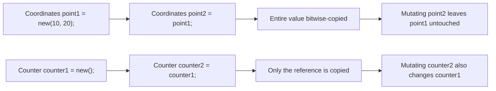
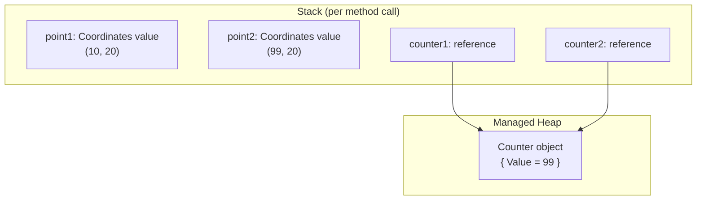

# Structs vs Classes

## Introduction

Before reading this lesson, you should already be comfortable with **[`record struct` and Value-Based Records](../02-oop/02-20-record-struct-value-based-records.md)**, which showed a value-type record that copies instead of shares. This lesson steps back from records specifically to the more fundamental distinction sitting underneath them: **structs vs classes** — C#'s two different answers to a question every type you design has to settle: is a variable of this type the actual data, or just a way of pointing at it?

By the end of this lesson, you will be able to:

- Explain the difference between value-type and reference-type semantics
- Predict what happens to two variables after `b = a;` for a struct versus for a class
- Identify when a struct's small, immutable, short-lived profile is the right fit
- Recognize why large or mutable structs usually cause more problems than they solve
- Read a stack/heap allocation diagram and connect it to assignment and copying behavior

## Structs vs Classes — A Layman's Perspective

Think about the difference between handing someone your business card and giving someone directions to a shared filing cabinet.

A business card is small, self-contained, and disposable. When you hand one across a table, the other person doesn't get "access to your card" — they get their own physical copy, in their pocket, entirely separate from yours. If they later scribble a personal note on the back of their card — "met at the conference, follow up Tuesday" — your card, still in your own wallet, is completely unaffected. Two cards now exist, independently, and changing one never touches the other. That's the whole appeal of a business card: it's cheap to make, cheap to hand out, and nobody needs to worry about stepping on someone else's copy.

A shared filing cabinet works completely differently. There is exactly one cabinet, sitting in one office. Nobody duplicates it — that would be absurd, and impossible in any practical sense. Instead, what gets handed around is directions to the cabinet: "third floor, second room on the left, the gray one by the window." Everyone holding those directions is pointing at the very same cabinet. If one person walks over and reorganizes the folders inside, everyone else who later follows their own copy of the same directions finds the drawer exactly as it was left — reorganized, because there was never more than one cabinet to begin with. The directions themselves are cheap to copy and hand around; it's the destination they point to that's shared and singular.

Both approaches are useful, but for different jobs. Small, disposable pieces of information — a phone number, a coordinate pair, a single measurement — are perfect business-card material: quick to produce, safe to duplicate freely, and nobody minds having their own independent copy. But something with lasting identity that many parts of a system need to see updated consistently — a customer's account record, an inventory shelf, a document everyone is actively editing — has to be the filing cabinet. If you tried to treat the filing cabinet like a business card and hand out full physical duplicates of it every time someone just needed to check a folder, you'd be hauling heavy furniture around the building for no reason, and worse, everyone would end up looking at their own private, instantly stale copy of a "shared" record.

The bridge to programming: in C#, a **struct** behaves like the business card — assigning it, passing it to a method, or returning it hands over an independent copy of the entire value. A **class** behaves like the filing cabinet directions — assigning it just copies a reference, so everyone holding that reference is still looking at, and can still change, the one shared object underneath.

## Structs vs Classes — A Programming Language Perspective

In C#, every type is either a **value type** or a **reference type**, and that choice governs assignment, parameter passing, and storage. A `struct` is a value type: a variable of struct type directly contains its data, and copying it — via assignment, argument passing, or a return statement — bitwise-copies the entire value onto a new location, typically the stack or inline within its containing object. A `class` is a reference type: a variable of class type holds a reference (a managed pointer) to an object allocated on the managed heap, and copying that variable copies only the reference — both variables end up pointing at the same underlying object. Structs implicitly derive from `System.ValueType`; classes derive, directly or indirectly, from `System.Object`. Structs cannot participate in inheritance (beyond implementing interfaces) and have no concept of `null` unless wrapped in `Nullable<T>`, while classes support single inheritance, polymorphism, and reference nullability. Microsoft's own guidance recommends structs only for types smaller than roughly 16 bytes that are logically immutable and behave like a single primitive value — everything else belongs in a class.

## How to Choose Between a Struct and a Class in C#

Declaring either is nearly identical syntactically — swap the keyword `struct` for `class` — but the runtime behavior diverges the moment you assign one variable to another or pass it to a method. The example below defines a small `Coordinates` struct and a `Counter` class side by side, then copies each and mutates the copy, to make the divergence visible directly in the console output.


*Figure 1: Assigning a struct copies the whole value; assigning a class copies only a reference to one shared object.*

```csharp
// Program.cs — .NET 10 / C# 14

Coordinates point1 = new Coordinates(10.0, 20.0);
Coordinates point2 = point1;          // copies the entire value
point2.Latitude = 99.0;

Console.WriteLine($"point1: ({point1.Latitude}, {point1.Longitude})");
Console.WriteLine($"point2: ({point2.Latitude}, {point2.Longitude})");

Counter counter1 = new Counter { Value = 10 };
Counter counter2 = counter1;          // copies the reference, not the object
counter2.Value = 99;

Console.WriteLine($"counter1.Value: {counter1.Value}");
Console.WriteLine($"counter2.Value: {counter2.Value}");

struct Coordinates
{
    public double Latitude;
    public double Longitude;

    public Coordinates(double latitude, double longitude)
    {
        Latitude = latitude;
        Longitude = longitude;
    }
}

class Counter
{
    public int Value;
}
```

**Console Output:**

```text
point1: (10, 20)
point2: (99, 20)
counter1.Value: 99
counter2.Value: 99
```

`point2` starts as an exact copy of `point1`, so changing `point2.Latitude` afterward has no effect on `point1` — two independent values now exist. `counter2`, by contrast, was never a separate object; `counter2 = counter1` copied only the reference, so `counter1` and `counter2` both still point at the one `Counter` instance, and changing `counter2.Value` is really changing that shared object, which is exactly why both lines print `99`. This example intentionally uses public mutable fields to make the copy-versus-share difference visible; in real code, structs should almost always be immutable (fields set only in the constructor, `readonly`) so nobody is surprised by a struct silently allowing a mutable copy at all.

## Real-Time Example: Structs vs Classes in Banking/ATM Processing

Continuing the Banking/ATM case study, this example models a `BankAccount` as a class — it has lasting identity, a mutable balance, and every part of the system that references the same account should see the same balance after a transaction. Alongside it, `TransactionReceipt` is a small, immutable struct: a short-lived snapshot of one completed withdrawal, handed to the ATM's printer, that should never change after the fact even if the account's balance keeps moving.

```csharp
// Program.cs — .NET 10 / C# 14 — Real-Time Example
// Banking/ATM case study: BankAccount is a reference type with identity and mutable
// state; TransactionReceipt is a small, immutable, short-lived struct that copies safely.

var account = new BankAccount("ACC-4471", 500.00m);

TransactionReceipt receipt1 = account.Withdraw(150.00m);
PrintReceipt(receipt1);

TransactionReceipt receipt2 = account.Withdraw(75.50m);
PrintReceipt(receipt2);

// receipt1 is an independent copy — it is untouched even though the account moved on
Console.WriteLine();
Console.WriteLine($"Receipt #1 still shows balance-after: {receipt1.BalanceAfter:C}");
Console.WriteLine($"Current live account balance:         {account.Balance:C}");

try
{
    account.Withdraw(10_000.00m);
}
catch (InvalidOperationException ex)
{
    Console.WriteLine($"Transaction declined: {ex.Message}");
}

static void PrintReceipt(TransactionReceipt r)
{
    Console.WriteLine("--- ATM Receipt ---");
    Console.WriteLine($"Account:        {r.AccountNumber}");
    Console.WriteLine($"Withdrawn:      {r.AmountWithdrawn:C}");
    Console.WriteLine($"Balance After:  {r.BalanceAfter:C}");
}

class BankAccount
{
    public string AccountNumber { get; }
    public decimal Balance { get; private set; }

    public BankAccount(string accountNumber, decimal openingBalance)
    {
        AccountNumber = accountNumber;
        Balance = openingBalance;
    }

    public TransactionReceipt Withdraw(decimal amount)
    {
        if (amount > Balance)
        {
            throw new InvalidOperationException(
                $"Insufficient funds: requested {amount:C}, available {Balance:C}.");
        }

        Balance -= amount;
        return new TransactionReceipt(AccountNumber, amount, Balance);
    }
}

readonly struct TransactionReceipt
{
    public string AccountNumber { get; }
    public decimal AmountWithdrawn { get; }
    public decimal BalanceAfter { get; }

    public TransactionReceipt(string accountNumber, decimal amountWithdrawn, decimal balanceAfter)
    {
        AccountNumber = accountNumber;
        AmountWithdrawn = amountWithdrawn;
        BalanceAfter = balanceAfter;
    }
}
```

**Console Output:**

```text
--- ATM Receipt ---
Account:        ACC-4471
Withdrawn:      $150.00
Balance After:  $350.00
--- ATM Receipt ---
Account:        ACC-4471
Withdrawn:      $75.50
Balance After:  $274.50

Receipt #1 still shows balance-after: $350.00
Current live account balance:         $274.50
Transaction declined: Insufficient funds: requested $10,000.00, available $274.50.
```

`BankAccount` has to be a class: it has one true identity (`ACC-4471`) and its `Balance` must be seen consistently by every part of the ATM software that holds a reference to it. `TransactionReceipt`, on the other hand, is exactly the kind of data a struct is for — small, immutable once created, and meaningful only as a point-in-time snapshot. Because it's a struct, `receipt1` keeps reporting a balance of `$350.00` forever, even after the account's real balance moves to `$274.50` — a printed ATM receipt that changed after the fact would be a serious bug, and using a struct makes that bug structurally impossible.

## Struct vs Class — Memory and Copy Semantics

The difference in behavior traces directly back to where each type's data lives and how the runtime treats an assignment. A struct's data is stored inline wherever the variable itself lives — on the stack for a local variable, or embedded directly inside its containing object for a field — so copying the variable is a fast, direct copy of that memory. A class's data always lives on the managed heap, and a variable of class type only ever holds a reference to it; copying that variable copies the reference (typically a single pointer-sized value), leaving one heap object shared by every reference that points to it.


*Figure 2: Struct values live inline on the stack, each fully independent; class references on the stack both point to the one shared object on the heap.*

| Aspect | Struct | Class |
|---|---|---|
| Category | Value type (`System.ValueType`) | Reference type (`System.Object`) |
| Assignment (`b = a`) | Copies the entire value | Copies only the reference |
| Typical storage | Stack, or inline in containing type | Managed heap |
| Inheritance | None (interfaces only) | Full class inheritance and polymorphism |
| Nullability | Not nullable unless `Nullable<T>` | Nullable by nature |
| Best fit | Small, immutable, short-lived data | Types with identity, behavior, or shared mutable state |

## Types of Value-and-Reference Constructs in C#

Structs and classes aren't the only two points on this spectrum — several related constructs refine or specialize the same value-vs-reference distinction, each covered in its own lesson:

1. **[`record struct` and Value-Based Records](../02-oop/02-20-record-struct-value-based-records.md)** — a struct with compiler-generated value equality, deconstruction, and a `ToString` override layered on top.
2. **[Stack vs Heap](../08-memory-management/08-02-stack-vs-heap.md)** — the runtime memory model this lesson's stack-allocation diagram is built on.
3. **[Boxing and Unboxing](../08-memory-management/08-07-boxing-and-unboxing.md)** — what happens when a struct value needs to be stored as an `object` or passed through an interface reference.
4. **[Immutability in C# (records, `readonly`, `init`)](../02-oop/02-31-immutability-in-csharp.md)** — how to make sure a struct — or a class — can't be mutated after construction.
5. **[Equality: `Equals`, `==`, and `IEquatable<T>`](../02-oop/02-33-equality-equals-iequatable.md)** — why structs typically need a custom equality implementation that classes get differently.
6. **[`init`-Only Setters](../02-oop/02-32-init-only-setters.md)** — a common way to keep a struct's fields settable at construction time only.

## What You've Learned & What's Next

A struct is a value type — assigning, passing, or returning one copies its entire value, which is exactly why small, immutable, short-lived data like a coordinate pair or a transaction receipt is a natural fit. A class is a reference type — assigning one only copies a pointer to a single shared object, which is exactly what lasting identity and mutable shared state, like a bank account, require. Getting this choice right is one of the most consequential design decisions in C#, because it silently determines whether "copying" a value protects your data or accidentally shares it.

Continue your learning journey with **[`required` Members and Object Initializers](../02-oop/02-22-required-members-object-initializers.md)**, where we look at how to force callers to set the properties that matter — on both structs and classes — the moment an object is constructed.

---
*Applies to: .NET 10 / C# 14. Last reviewed 2026-08-16.*
