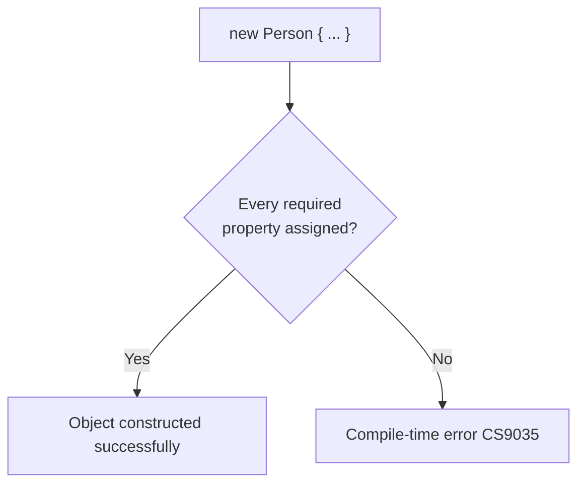
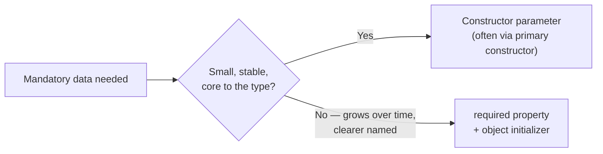

# required Members and Object Initializers

## Introduction

Before reading this lesson, you should already be comfortable with **[Structs vs Classes](../02-oop/02-21-structs-vs-classes.md)**, which showed how assignment behaves differently once an object exists. This lesson goes one step earlier: how an object gets its initial values in the first place, using **object initializer** syntax, and how the **`required`** modifier closes a long-standing gap by making the compiler — not just convention — enforce that certain properties are never left unset.

By the end of this lesson, you will be able to:

- Set properties by name with object initializer syntax, `new Foo { X = 1 }`
- Mark a property `required` so the compiler rejects any construction that skips it
- Read the CS9035 compiler error and know exactly what it's telling you
- Combine `required` properties with a primary constructor's positional parameters
- Decide when mandatory data belongs in a constructor versus in a `required` property

## required Members and Object Initializers — A Layman's Perspective

Picture a job application form that has two kinds of fields on it. Some fields are printed in bold with a red asterisk — "Full Legal Name *", "Date of Birth *" — and the form simply cannot be submitted with those left blank; the front desk clerk checks it right there at the counter and hands it straight back to you if even one is missing. Other fields have no asterisk at all — "Preferred Nickname", "LinkedIn Profile" — and you can leave those blank without anyone stopping you; the form is still perfectly valid without them.

Now picture how you actually fill the form out. You don't have to write your name in the box first and your date of birth second just because that's the order they're printed on the page — you can go down the form in any order that's comfortable, filling in each labeled box by name. The clerk at the counter doesn't check the *order* you filled things in; they check that every box with an asterisk has *something* written in it before they'll accept the form at all. Two completely separate concerns are at play: the freedom to fill in labeled boxes in whatever order suits you, and the strict, non-negotiable rule that certain boxes cannot be left empty.

Before this kind of form existed, offices sometimes handled "mandatory fields" a much clunkier way: a rigid printed script the applicant had to follow line by line — "state your name, now state your birth date, now state your address" — in one fixed, unskippable sequence, whether or not that order made any sense to the person filling it out. It worked, but it was inflexible, and adding one more mandatory question later meant reprinting the whole script.

The asterisked form is the better design: label every box clearly, let people fill them in whatever order makes sense, and simply refuse to accept the form back at the counter unless every asterisked box has something in it. That's precisely what object initializers plus the `required` modifier give you in C#. Object initializer syntax lets you construct an object and then set its properties by name, in any order you like, the same way you'd fill in labeled boxes on a form. The `required` modifier is the asterisk — it marks certain properties as non-negotiable, and the compiler, playing the role of the clerk at the counter, simply won't let your code compile at all if one of those asterisked properties was left unset.

## required Members and Object Initializers — A Programming Language Perspective

An **object initializer** is syntax that sets a newly constructed object's accessible properties or fields by name inside a `{ }` block immediately following a constructor call — `new Foo { X = 1, Y = 2 }` — compiling down to a call to the constructor followed by individual property assignments, in the order written, before the resulting reference is handed back to the caller. Introduced in C# 11, the **`required` modifier** can be applied to any settable property or field; a type with one or more `required` members can only be constructed either through an object initializer that assigns every required member, or through a constructor explicitly annotated with `[SetsRequiredMembers]` to tell the compiler it already guarantees them. Omitting a required member at any construction site is a compile-time error (`CS9035`), not a runtime failure — the same guarantee a non-optional constructor parameter gives you, but expressed as a named property instead of a positional parameter, and freely combinable with primary constructors, records, and ordinary constructors alike.

## How to Declare and Use required Members in C#

Marking a property `required` is a single keyword added before its declaration; the property itself is typically still `{ get; init; }` or `{ get; set; }` so it can actually be assigned. Any object initializer that omits a `required` property fails to compile, with the compiler naming the exact property that's missing.


*Figure 1: The compiler checks every `required` property against the object initializer before allowing the code to build.*

```csharp
// Program.cs — .NET 10 / C# 14

var person = new Person
{
    FirstName = "Ada",
    MiddleName = "Augusta",     // optional — not required
    LastName = "Lovelace"
};

Console.WriteLine($"{person.FirstName} {person.MiddleName} {person.LastName}");

// The following would fail to compile with:
// CS9035: Required member 'Person.LastName' must be set in the object initializer
// or attribute constructor.
// var incomplete = new Person { FirstName = "Alan" };

class Person
{
    public required string FirstName { get; init; }
    public required string LastName { get; init; }
    public string? MiddleName { get; init; }
}
```

**Console Output:**

```text
Ada Augusta Lovelace
```

`FirstName` and `LastName` are marked `required`, so any `new Person { ... }` call that leaves either one out simply won't compile — the commented-out `incomplete` line above is exactly the kind of mistake `required` exists to catch before the program ever runs. `MiddleName` has no such restriction, so it's freely omittable, and the initializer can set all three properties in whatever order is most readable, not the order they're declared in the class.

## Real-Time Example: required Members in Library/Inventory Management

Continuing the Library/Inventory Management case study, `Book` uses a primary constructor for the three facts every book has the moment it's identified — title, author, and ISBN — and a separate `required` property, `ShelfLocation`, for the one fact that isn't known until library staff physically place the item on a shelf. This shows the two mechanisms working together: the constructor enforces the data a `Book` can't exist without, and `required` enforces the data that's mandatory for a *properly cataloged* book but doesn't fit naturally as a constructor argument.

```csharp
// Program.cs — .NET 10 / C# 14 — Real-Time Example
// Library/Inventory Management case study: a primary constructor supplies the data every
// Book has at creation, while a required property enforces shelf placement before a Book
// can be considered fully cataloged.

var catalog = new List<Book>
{
    new Book("Clean Code", "Robert C. Martin", "978-0132350884")
    {
        ShelfLocation = "Non-Fiction - Aisle 4"
    },
    new Book("The Hobbit", "J.R.R. Tolkien", "978-0547928227")
    {
        ShelfLocation = "Fiction - Aisle 1"
    },
};

foreach (Book book in catalog)
{
    Console.WriteLine($"{book.Title} by {book.Author}");
    Console.WriteLine($"  ISBN: {book.Isbn}");
    Console.WriteLine($"  Location: {book.ShelfLocation}");
}

Console.WriteLine();
Console.WriteLine($"Total cataloged items: {catalog.Count}");

class Book(string title, string author, string isbn)
{
    public string Title { get; } = title;
    public string Author { get; } = author;
    public string Isbn { get; } = isbn;

    public required string ShelfLocation { get; init; }
}
```

**Console Output:**

```text
Clean Code by Robert C. Martin
  ISBN: 978-0132350884
  Location: Non-Fiction - Aisle 4
The Hobbit by J.R.R. Tolkien
  ISBN: 978-0547928227
  Location: Fiction - Aisle 1

Total cataloged items: 2
```

Without `required`, a library system could easily end up with `Book` objects whose `ShelfLocation` was silently left as `null` — invisible until a patron went looking for a book the catalog claimed existed but couldn't be found on any shelf. Because `ShelfLocation` is `required`, that bug is caught the moment someone writes a `new Book(...)` call that forgets to set it, at compile time, long before it could ever reach a library's production catalog.

## Constructor Parameters vs required Properties

Both a constructor parameter and a `required` property force a value to be supplied before an object can exist, but they enforce it differently. A constructor parameter is positional (unless called with named arguments) and tightly bound to that one constructor's signature — adding a new mandatory value later means changing every call site, and every overload. A `required` property is enforced independently of any particular constructor, set by name in an object initializer, in whatever order is clearest, and a derived class can add its own `required` properties without having to touch the base class's constructor at all. Constructors still win for a small, stable set of values that essentially define what the type *is* — an ISBN and title, say — while `required` properties shine as a type grows more properties that are each individually mandatory but not natural constructor arguments.


*Figure 2: Choosing between a constructor parameter and a `required` property for mandatory data.*

| Aspect | Constructor Parameter | `required` Property |
|---|---|---|
| Enforcement | Compile-time, positional | Compile-time, by name |
| Call-site clarity | Can blur with many parameters | Self-documenting (`Name = value`) |
| Order sensitivity | Yes, unless named arguments used | No — any order in the initializer |
| Extending in a derived type | Must thread through every constructor | Derived class adds its own `required` members freely |
| Best fit | Small, stable set of defining values | Larger types with many independently mandatory members |

## Types of Initialization Enforcement in C#

`required` and object initializers are one part of a broader set of tools C# gives you for controlling how objects get built and whether they can be trusted once built:

1. **[Object Initialization Patterns](../02-oop/02-30-object-initialization-patterns.md)** — a broader survey of initializer syntax, including nested and collection initializers.
2. **[`init`-Only Setters](../02-oop/02-32-init-only-setters.md)** — the setter modifier that pairs naturally with `required` to keep a property settable only at construction time.
3. **[Constructors in C#](../02-oop/02-02-constructors-in-csharp.md)** — the classic, constructor-based way to enforce mandatory data.
4. **[Records in C# (`record class`)](../02-oop/02-19-records-in-csharp.md)** — positional records generate constructor-enforced mandatory parameters automatically, without `required` at all.
5. **[Immutability in C# (records, `readonly`, `init`)](../02-oop/02-31-immutability-in-csharp.md)** — how `required init` properties combine to build types that are both mandatory-to-set and impossible to change afterward.

## What You've Learned & What's Next

Object initializers let you set a newly constructed object's properties by name, in any order, instead of being locked into a constructor's fixed parameter sequence. The `required` modifier closes the gap that used to leave that flexibility unsafe: it forces the compiler to reject, at build time, any construction that leaves a mandatory property unset — turning what used to be a runtime `null` surprise into a compile error you fix before shipping.

Continue your learning journey with **[Extension Methods in C#](../02-oop/02-23-extension-methods-in-csharp.md)**, where we look at how to add new methods to a type — even one you don't own — without touching its original source.

---
*Applies to: .NET 10 / C# 14. Last reviewed 2026-08-16.*
